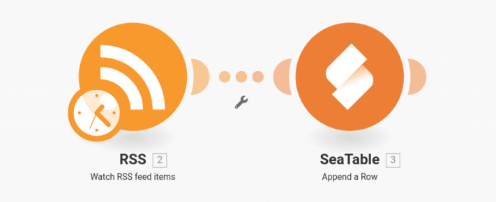
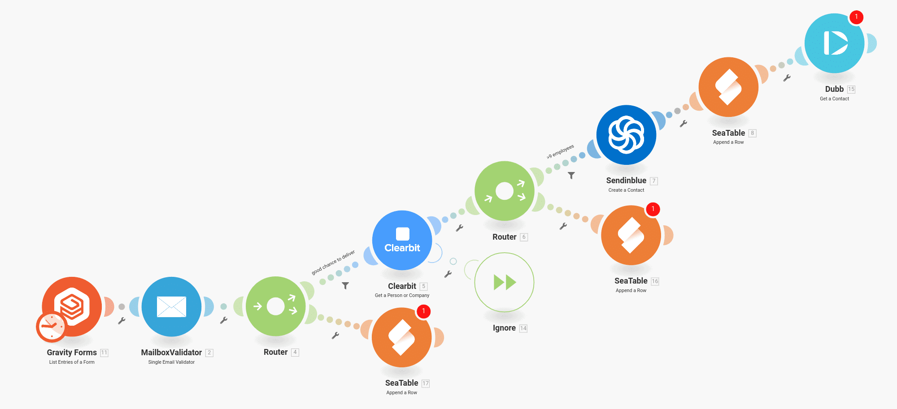
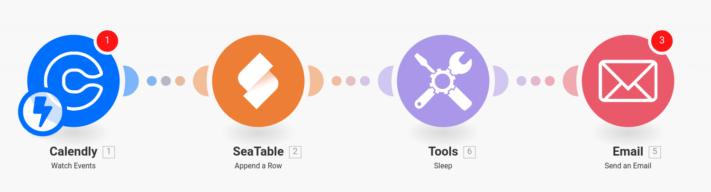

Success in marketing is often the result of consistent and persistent work in dealing with prospective and current customers. The typical marketing department doesn't take care of the one central marketing process, but rather many small interlocking processes aimed at generating interest among potential customers, enhancing the customer experience, or engaging in regular exchanges. It is precisely because of this small-scale nature and repetitive tasks that it makes sense to automate all marketing processes that can be automated. This saves you time in which you can focus on your creative work. Because this is where the real value creation of marketing takes place and this work will be difficult to automate in the future.

The following article gives six examples of the marketing processes that can be easily automated with the [Integromat](https://integromat.io/) automation platform. This will help your team achieve greater clout and reach, and higher customer satisfaction. Take a few minutes to let the automations sink in. Every minute you invest here will save you many times over in the future. Work smarter, not harder.

## 1\. monitor the news from yourself and your competitors

In marketing, too, it helps to know your enemy and to keep yourself regularly informed about the news and updates with which they appear in the media. To do this, set up a [Google Alert](https://www.google.de/alerts) for all relevant search terms. This way you can monitor your own company name, the name of your competitor or even specific products. The news can be narrowed down to individual countries or regions and thus adapted to your needs.

In the settings for the alert, select _Send to \_the option \_RSS feed_. This gives you a URL with which you can save all new entries in a SeaTable table in future with the help of Integromat. There you can then monitor and structure the messages very comfortably and clearly.\_\_

**Important:** For each feed you want to monitor, create a separate scenario, whereby the results can all be saved in the same SeaTable table. If you want to react particularly quickly to news, you can still include an email or Slack notification.

## 2\. automatic categorisation of new customers and follow-up

Don't be put off by the extensive process, it can help you identify relevant new customers for follow-up in the future. The idea behind the process is simple: every time a new user registers on your website, [MailboxValidator](https://www.mailboxvalidator.com/) checks the email provided by the customer. If MailboxValidator concludes that it is a valid email address, you next pass the email address to [Clearbit](https://clearbit.com/). Clearbit tries to assign a name or a company to the email address. For example, you can specify that the workflow only continues if the company behind the email address has more than 9 employees. These values can of course be changed at will, but with the help of MailboxValidator and Clearbit you can identify the customers you are interested in. The rest is then comparatively simple.

Next, save the contact in an email automation tool such as [Sendinblue](https://de.sendinblue.com/) to automatically deliver important emails to the customer. Then we save the contact with all the additional information like number of employees and company name in SeaTable to build up a complete list of customers with potential there. Lastly, you could create the contact in Dubb to send this customer an additional individual video message.

With this simple automation, you can determine exactly when a client is eligible for an individual follow-up and focus specifically on that follow-up.

It does not matter where the first customer contact comes from. Instead of [GravityForms](https://www.gravityforms.com/), a registration form from Typeform, Jotforms or Googleforms would have worked just as well. The only thing you need is an email address, which is used to further check and evaluate the customer.

## 3\. reward participation in a survey

In marketing, one tries to get in touch with customers through customer surveys and to find out their mood or opinion. The problem is that customers usually do not have the time or inclination for such a survey and simply do not participate. Therefore, the customer is often offered a reward or an incentive to participate in the survey. This process can be fully automated.

The automation starts with a survey that you create in [JotForm](https://jotform.com/). As in the previous workflow, you can use other survey tools supported by Integromat instead of JotForm. You save the result of the survey in SeaTable for further analysis. Then wait for 5 minutes and reward the customer with e.g. a renewal of his trial subscription or a credit of 5€ on the next invoice in [Chargebee](https://www.chargebee.com/). If you don't use Chargebee to manage your customer subscriptions, check if your CRM or billing system is already supported by Integromat. If not, be creative and send e.g. a download link to an e-book or a Shopify voucher code. Alternatively, you can create a table of voucher codes in SeaTable and send one of each as a thank you to your customers.

## 4\. designing new articles together as a team

An important part of any marketing work is creating relevant content. Often the ideas for good articles come from the team, and this automation supports the creation of such articles by brainstorming. Create a new table in SeaTable and invite all your employees to it. Each row represents a possible article and should have a suggested title and a column for the roughly outlined content. Further columns are not necessary for the understanding of this automation, but of course you can add further columns for pictures, links, other notes or responsible staff members. The only important thing is a single-selection column for the status of the article.

In this table, you and your team can now develop new ideas for articles as you please. As soon as you are finished with an article, change the status to e.g. _ready-for-writing_. This is the trigger that Integromat pays attention to. As soon as an article gets this status, a new draft is created in WordPress. The title column, the article draft and all other information are automatically transferred to WordPress, so that the responsible editor can now start working.

> This automation may not save you much time, but why waste time on a simple copy-and-paste job when you can automate it.

## 5\. SEO checklist for every new blog post

This automation is a perfect complement to the previous workflow. Because once a new blog post has been published, the work of the marketing department usually only begins. Should the new article be mentioned on LinkedIn, Medium.com or Twitter? Where will the article end up in the Google ranking after a few days? Typically, every marketing department has a checklist that is worked through in the case of new articles. This workflow is intended to simplify precisely this checklist.

As soon as an article is published on WordPress, a new entry is created in the SEO checklist in SeaTable. In addition, a new task can be created in [Todoist](https://todoist.com/) or a message can be posted in a Slack channel so that the team is informed about the new work order. This simple automation reliably prevents any new item from being overlooked.

## 6\. preparation for the perfect meeting

With this last automation, you get more out of your meetings with prospects and clients. Whenever someone books an appointment with you via [Calendly](https://calendly.com/), Integromat helps you prepare this meeting. Calendly automatically sends appointment invitations to you and your meeting partner. What Calendly does not take care of is the appointment notes and the sending of important information in advance. Therefore you copy each new appointment into a SeaTable table using Integromat. There you will find an overview of when and with whom you will talk about which topic. At the same time, SeaTable offers you any number of additional columns for recording meeting notes, todos and results. In addition, Integromat can send an e-mail with further information to the conversation partner in advance. Integromat can even distinguish what kind of appointment was booked and send different emails. Alternatively, a personal thank-you email could be sent automatically after the conversation. By being able to address your conversation partner personally in the email and, for example, refer to the date of the appointment, no one will get the idea that this email is sent automatically.

## Work smarter, not harder

These are just six examples of marketing processes that can be easily automated using Integromat. Even though it takes some time to set up these workflows, you will have saved the time after just a few processes. At the same time, you will benefit from your processes being more stable and reliable, leaving less to chance. Try it out and automate your marketing processes.
