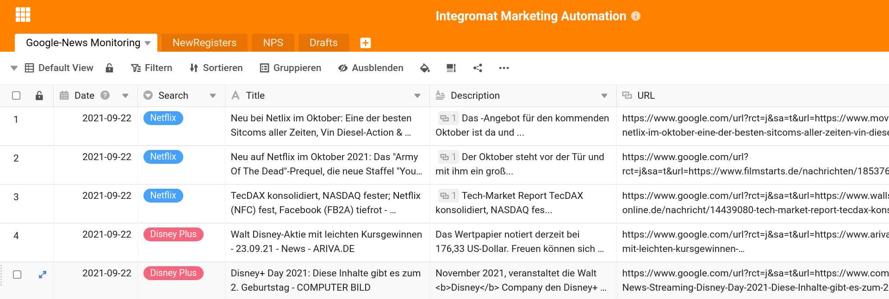
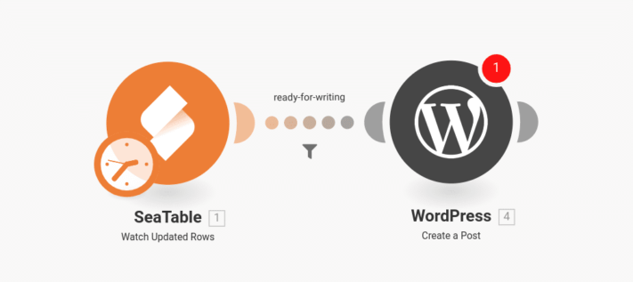
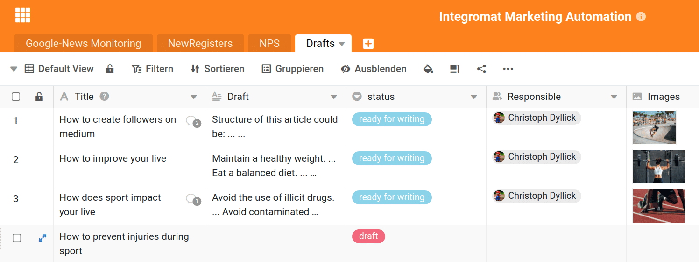
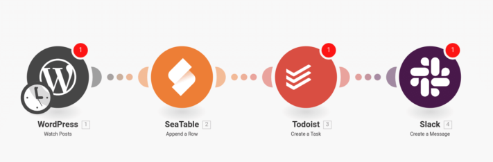

Le succès du marketing est souvent le résultat d'un travail cohérent et constant avec les clients futurs et actuels. Le département marketing typique ne s'occupe pas d'un processus marketing central, mais de nombreux petits processus interdépendants qui visent à susciter l'intérêt des clients potentiels, à améliorer l'expérience client ou à établir un échange régulier. C'est précisément en raison de cette fragmentation et de ces tâches répétitives qu'il est judicieux d'automatiser tous les processus marketing qui peuvent l'être. Vous gagnez ainsi du temps, que vous pouvez consacrer à votre travail créatif. Car c'est là qu'a lieu la véritable création de valeur du marketing et ce travail ne pourra que difficilement être automatisé à l'avenir.

L'article suivant donne six exemples de processus marketing qui peuvent être facilement automatisés avec la plate-forme d'automatisation [Integromat](https://integromat.io/). Votre équipe peut ainsi obtenir une plus grande force de frappe, une plus grande portée et une plus grande satisfaction des clients. Prenez quelques minutes pour vous imprégner de ces automatisations. Chaque minute que vous investissez ici vous fera économiser plusieurs fois à l'avenir. Ne travaillez pas plus, mais plus intelligemment.

## 1\. suivre l'actualité de vous-même et de vos concurrents

En marketing aussi, il est utile de connaître son ennemi et de se tenir régulièrement informé des nouvelles et des mises à jour avec lesquelles il apparaît dans les médias. Pour ce faire, créez une [alerte Google](https://www.google.de/alerts) pour tous les termes de recherche pertinents. Vous pouvez ainsi surveiller le nom de votre propre entreprise, celui de votre concurrent ou même des produits spécifiques. Les informations peuvent être limitées à certains pays ou régions et ainsi être adaptées à vos besoins.

Dans les paramètres de l'alerte, sélectionnez _Envoyer à \_l'option \_Flux RSS_. Ceci vous donne une URL avec laquelle vous pouvez sauvegarder toutes les nouvelles entrées dans une table SeaTable dans le futur avec l'aide d'Integromat. Vous pouvez alors contrôler et structurer les messages de manière très confortable et claire.\_\_

**Important :** pour chaque flux que vous souhaitez surveiller, vous créez un scénario séparé, les résultats pouvant tous être enregistrés dans le même tableau SeaTable. Si vous souhaitez réagir particulièrement vite aux messages, vous pouvez encore ajouter une notification par e-mail ou Slack.

## 2\. Catégorisation automatique des nouveaux clients et suivi.

Ne soyez pas découragé par l'ampleur du processus, il peut vous aider à identifier de nouveaux clients pertinents pour un suivi ultérieur. Le principe du processus est simple : chaque fois qu'un nouvel utilisateur s'inscrit sur votre site Web, [MailboxValidator](https://www.mailboxvalidator.com/) vérifie l'adresse électronique fournie par le client. Si MailboxValidator conclut qu'il s'agit d'une adresse électronique valide, vous transmettez ensuite l'adresse électronique à [Clearbit](https://clearbit.com/). Clearbit essaie d'attribuer un nom ou une entreprise à l'adresse électronique. Par exemple, vous pouvez spécifier que le flux de travail ne se poursuit que si l'entreprise derrière l'adresse électronique compte plus de 9 employés. Ces valeurs peuvent bien sûr être modifiées à volonté, mais avec l'aide de MailboxValidator et de Clearbit, vous pouvez identifier les clients qui vous intéressent. Le reste est ensuite relativement simple.

Ensuite, enregistrez le contact dans un outil d'automatisation des courriels tel que [Sendinblue](https://de.sendinblue.com/) pour envoyer automatiquement les courriels importants au client. Ensuite, nous enregistrons le contact avec toutes les informations supplémentaires, comme le nombre d'employés et le nom de l'entreprise, dans SeaTable afin de constituer une liste complète de clients potentiels. Enfin, vous pouvez créer le contact dans Dubb pour envoyer à ce client un message vidéo individuel supplémentaire.

Cette automatisation simple vous permet de déterminer exactement quand un client entre en ligne de compte pour un suivi individuel et de vous concentrer de manière très ciblée sur ce suivi.

L'origine du premier contact avec le client n'est pas importante. Au lieu de [GravityForms](https://www.gravityforms.com/), un formulaire d'inscription de Typeform, Jotforms ou Googleforms aurait tout aussi bien pu être utilisé. La seule chose dont vous avez besoin, c'est d'une adresse e-mail qui permettra de vérifier et d'évaluer le client.

## 3\. récompenser la participation à une enquête

En marketing, on essaie d'entrer en contact avec les clients par le biais d'enquêtes et de connaître leur humeur ou leur opinion. Le problème est que les clients n'ont généralement ni le temps ni l'envie de répondre à une telle enquête et ne participent tout simplement pas. Par conséquent, le client se voit souvent offrir une récompense ou une incitation à participer à l'enquête. Ce processus peut être entièrement automatisé.

L'automatisation commence par une enquête que vous créez dans [JotForm](https://jotform.com/). Comme dans le flux de travail précédent, vous pouvez utiliser d'autres outils d'enquête pris en charge par Integromat au lieu de JotForm. Vous enregistrez le résultat de l'enquête dans SeaTable pour une analyse ultérieure. Attendez ensuite 5 minutes et récompensez le client en lui offrant, par exemple, le renouvellement de son abonnement d'essai ou un crédit de 5 € sur sa prochaine facture dans [Chargebee](https://www.chargebee.com/). Si vous n'utilisez pas Chargebee pour gérer les abonnements de vos clients, vérifiez si votre système de CRM ou de facturation est déjà pris en charge par Integromat. Sinon, soyez créatif et envoyez par exemple un lien de téléchargement vers un livre électronique ou un code de bon d'achat Shopify. Vous pouvez également créer un tableau de codes de bons d'achat dans SeaTable et envoyer un de chaque en guise de remerciement à vos clients.

## 4\. concevoir de nouveaux articles en équipe

Une partie importante de tout travail de marketing consiste à créer un contenu pertinent. Souvent, les idées de bons articles viennent de l'équipe, et cette automatisation favorise la création de tels articles par brainstorming. Créez une nouvelle table dans SeaTable et invitez-y tous vos employés. Chaque ligne représente un article possible et devrait avoir un titre suggéré et une colonne pour le contenu approximatif. D'autres colonnes ne sont pas nécessaires à la compréhension de cette automatisation, mais vous pouvez bien sûr en ajouter d'autres pour les images, les liens, d'autres notes ou les membres du personnel responsables. La seule chose importante est une colonne à sélection unique pour le statut de l'article.

Dans ce tableau, vous et votre équipe pouvez désormais développer de nouvelles idées d'articles à votre guise. Dès que vous avez terminé un article, changez son statut en " _prêt à rédiger"_, par exemple. C'est le déclencheur auquel Integromat prête attention. Dès qu'un article obtient ce statut, un nouveau projet est créé dans WordPress. La colonne de titre, le projet d'article et toutes les autres informations sont automatiquement transférés vers WordPress, de sorte que le rédacteur responsable peut maintenant commencer à travailler.

> Cette automatisation ne vous fera peut-être pas gagner beaucoup de temps, mais pourquoi perdre du temps sur un simple travail de copier-coller quand vous pouvez l'automatiser.

## 5\. liste de contrôle du référencement pour chaque nouvel article de blog

Cette automatisation complète parfaitement le flux de travail précédent. Car une fois qu'un nouvel article de blog a été publié, le travail du département marketing ne fait généralement que commencer. Le nouvel article doit-il être mentionné sur LinkedIn, Medium.com ou Twitter ? Où se situera l'article dans le classement Google après quelques jours ? En règle générale, chaque département marketing dispose d'une liste de contrôle qu'il utilise dans le cas de nouveaux articles. Ce flux de travail est destiné à simplifier précisément cette liste de contrôle.

Dès qu'un article est publié sur WordPress, une nouvelle entrée est créée dans la check-list SEO de SeaTable. En outre, une nouvelle tâche peut être créée dans [Todoist](https://todoist.com/) ou un message peut être posté sur un canal Slack afin que l'équipe soit informée du nouvel ordre de travail. Cette automatisation simple permet d'éviter de manière fiable qu'un nouvel article ne soit oublié.

## 6\. Préparation d'une réunion parfaite

Grâce à cette dernière automatisation, vous tirez un meilleur parti de vos réunions avec les prospects et les clients. Chaque fois que quelqu'un prend un rendez-vous avec vous via [Calendly](https://calendly.com/), Integromat vous aide à préparer cette rencontre. Calendly envoie automatiquement des invitations à des rendez-vous à vous et à votre partenaire de réunion. Ce que Calendly ne prend pas en charge, ce sont les notes de rendez-vous et l'envoi d'informations importantes à l'avance. Vous copiez donc chaque nouveau rendez-vous dans une table SeaTable en utilisant Integromat. Vous y trouverez un aperçu de quand et avec qui vous parlerez de tel ou tel sujet. En même temps, SeaTable vous offre un nombre illimité de colonnes supplémentaires pour enregistrer les notes de réunion, les tâches à accomplir et les résultats. En outre, Integromat peut envoyer à l'avance un e-mail contenant des informations supplémentaires à l'interlocuteur. Integromat peut même distinguer quel type de rendez-vous a été pris et envoyer des emails différents. Il est également possible d'envoyer automatiquement un courriel de remerciement personnel après la conversation. En pouvant s'adresser personnellement à votre interlocuteur dans l'e-mail et, par exemple, faire référence à la date du rendez-vous, personne ne pourra avoir l'idée que cet e-mail est envoyé automatiquement.

## Work smarter, not harder

Ce ne sont là que six exemples de processus marketing qui peuvent être facilement automatisés à l'aide d'Integromat. Même si la mise en place de ces flux de travail prend un peu de temps, vous l'économiserez en quelques opérations seulement. En même temps, vous bénéficierez d'une stabilité et d'une fiabilité accrues de vos processus, qui seront moins laissés au hasard. Essayez-le et automatisez vos processus marketing.
