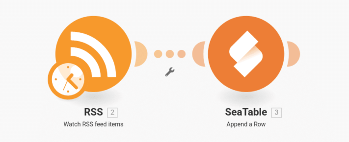
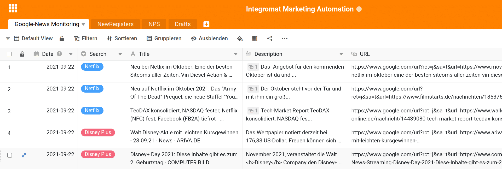
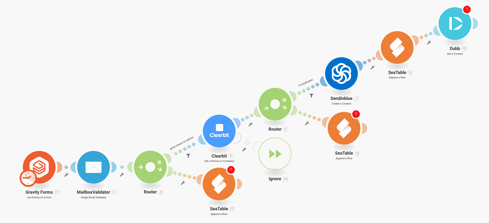
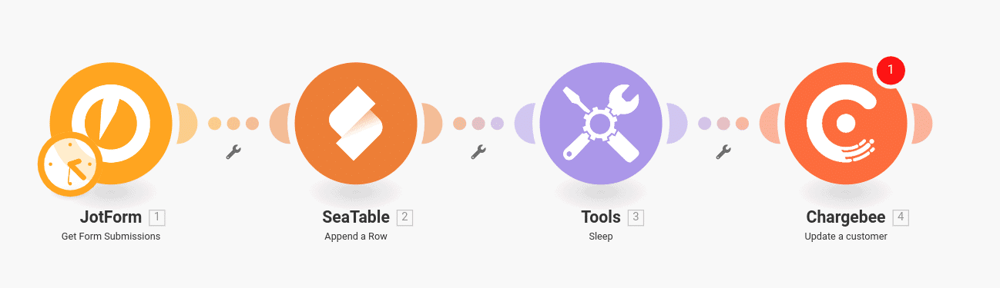
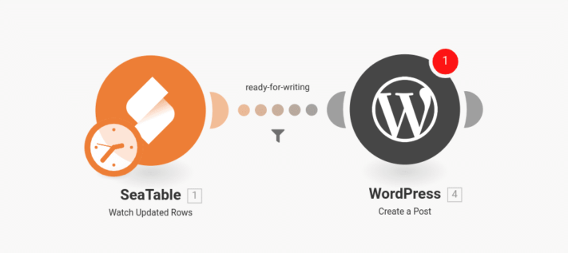
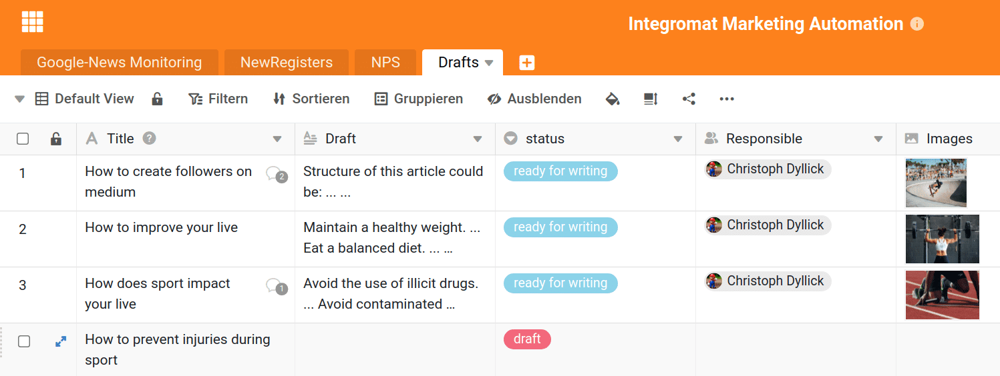
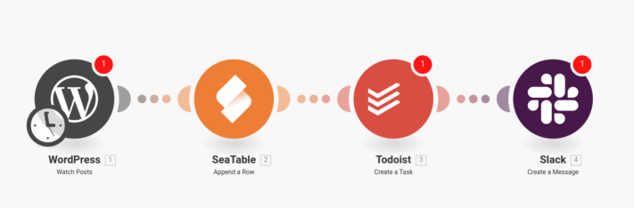
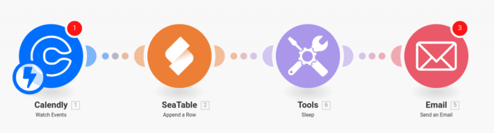

O sucesso no [marketing]() é muitas vezes o resultado de um trabalho consistente e persistente na relação com os clientes atuais e futuros. O departamento de marketing típico não se ocupa de um processo de marketing central, mas de muitos pequenos processos interligados que têm como objetivo criar interesse em potenciais clientes, melhorar a experiência do cliente ou participar em trocas regulares. É precisamente devido a esta pequenez e à constante repetição de tarefas que faz sentido [automatizar]() todos os processos de marketing que podem ser automatizados. Desta forma, poupa tempo e pode concentrar-se no seu trabalho criativo. Porque é aqui que a verdadeira criação de valor do marketing tem lugar e este trabalho será difícil de automatizar no futuro.

O artigo seguinte apresenta seis exemplos de processos de marketing que podem ser facilmente automatizados com uma plataforma de automatização. Desta forma, a sua equipa pode obter uma maior influência e alcance e uma maior satisfação do cliente. Dedique alguns minutos para se aperceber das automatizações. Cada minuto que investir aqui poupar-lhe-á muito tempo no futuro. Trabalhe de forma mais inteligente, não mais difícil.

## 1\. Acompanhe as notícias sobre si e sobre os seus concorrentes

Também no marketing, ajuda conhecer a sua [concorrência]() e manter-se regularmente informado sobre as notícias e atualizações com que esta aparece nos meios de comunicação social. Para o fazer, crie um [Alerta Google](https://www.google.de/alerts) para todos os termos de pesquisa relevantes. Desta forma, pode controlar o nome da sua própria empresa, o nome do seu concorrente ou mesmo produtos específicos. As notícias podem ser reduzidas a países ou regiões individuais e assim adaptadas às suas necessidades.

Nas definições do alerta, selecione a opção _Feed RSS_ em _Enviar para_. Isto dá-lhe um URL com o qual pode guardar todas as novas entradas numa tabela SeaTable no futuro com a ajuda de uma plataforma de automatização. Aí poderá então monitorizar e estruturar as mensagens de forma muito confortável e clara.

**Importante:** Crie um cenário separado para cada feed que deseja monitorizar, sendo que os resultados podem ser todos guardados na mesma tabela SeaTable. Se quiser reagir com particular rapidez às notícias, pode ainda incluir uma notificação por e-mail ou no Slack.

## 2\. Categorização automática de novos clientes e acompanhamento

Não se deixe intimidar pelo processo extenso, pois pode ajudá-lo a identificar novos clientes relevantes para acompanhamento no futuro. A ideia por detrás do processo é simples: cada vez que um novo utilizador se regista no seu website, o [MailboxValidator](https://www.mailboxvalidator.com/) verifica o e-mail fornecido pelo cliente. Se o MailboxValidator concluir que se trata de um endereço de correio eletrónico válido, o próximo passo é passar o endereço de correio eletrónico para o [Clearbit](https://clearbit.com/). O Clearbit tenta atribuir um nome ou uma empresa ao endereço de correio eletrónico. Por exemplo, pode especificar que o fluxo de trabalho só continua se a empresa por detrás do endereço eletrónico tiver mais de 9 empregados. Estes valores podem obviamente ser alterados à vontade, mas com a ajuda do MailboxValidator e do Clearbit poderá identificar os clientes em que está interessado. O resto é então comparativamente simples.

A seguir, guarde o contacto numa ferramenta de automatização de e-mails como o [Brevo](https://www.brevo.com/) para entregar automaticamente e-mails importantes ao cliente. Depois guardamos o contacto com toda a informação adicional como o número de empregados e o nome da empresa no SeaTable para construir aí uma lista completa de clientes com potencial. Finalmente, poderia criar o contacto no Dubb para enviar a este cliente uma mensagem de vídeo individual adicional.

Com esta automatização simples, pode determinar exatamente quando um cliente é elegível para um acompanhamento individual e concentrar-se especificamente nesse acompanhamento.

Não importa de onde vem o primeiro contacto do cliente. Em vez de [GravityForms](https://www.gravityforms.com/), um formulário de registo de Typeform, Jotforms ou Googleforms poderia também ter sido utilizado. A única coisa de que precisa é de um endereço de correio eletrónico, que é utilizado para verificar e avaliar melhor o cliente.

## 3\. Recompense a participação num inquérito

No marketing, tenta-se entrar em contacto com os clientes através de inquéritos aos clientes e descobrir o seu estado de espírito ou opinião. O problema é que os clientes normalmente não têm tempo ou disposição para um [inquérito]() deste tipo e simplesmente não participam. Por conseguinte, é frequentemente oferecida ao cliente uma recompensa ou um incentivo para participar no inquérito. Este processo pode ser totalmente automatizado.

A automatização começa com um inquérito que cria no [JotForm](https://www.jotform.com/). Tal como no fluxo de trabalho anterior, pode utilizar outras ferramentas de inquérito suportadas pela respetiva plataforma de automatização em vez do JotForm. Guarda o resultado do inquérito no SeaTable para uma análise mais aprofundada. Depois espere 5 minutos e recompense o cliente com, por exemplo, uma renovação da sua assinatura experimental ou um crédito de 5 euros na fatura seguinte no [Chargebee](https://www.chargebee.com/). Se não utilizar o Chargebee para gerir as subscrições dos seus clientes, verifique se o seu [CRM]() ou sistema de faturação já é suportado pela plataforma de automatização. Caso contrário, seja criativo e envie, por exemplo, um link para um e-book ou um código de voucher Shopify. Em alternativa, pode criar uma tabela de códigos de vouchers no SeaTable e enviar um deles como agradecimento aos seus clientes.

## 4\. Conceber novos artigos em conjunto, como uma equipa

Uma parte importante de qualquer trabalho de marketing é a criação de [conteúdos]() relevantes. Muitas vezes as ideias para bons artigos vêm da equipa, e esta automatização apoia a criação de tais artigos através de brainstorming. Crie uma nova tabela no SeaTable e convide todos os seus empregados para a mesma. Cada linha representa um possível artigo e deve ter um título sugerido e uma coluna para o conteúdo esboçado em linhas gerais. Não são necessárias mais colunas para a compreensão desta automatização, mas é claro que pode adicionar mais colunas para imagens, links, outras notas ou membros responsáveis do pessoal. A única coisa importante é uma coluna de seleção única para o estado do artigo.

Nesta tabela, pode agora desenvolver com a sua equipa novas ideias para os artigos como quiser. Assim que terminar um artigo, altere o estado para, por exemplo, _pronto a escrever_. Este é o gatilho a que a plataforma de automatização presta atenção. Assim que um artigo recebe este estado, é criado um novo rascunho no WordPress. A coluna de título, o rascunho do artigo e todas as outras informações são automaticamente transferidos para o WordPress, para que o editor responsável possa agora começar a trabalhar.

> Esta automatização pode não lhe poupar muito tempo, mas porquê perder tempo com um simples trabalho de copiar e colar quando também se pode automatizá-lo?

## 5\. Lista de verificação SEO para cada novo post no blog

Esta automatização é um complemento perfeito do fluxo de trabalho anterior. Porque uma vez publicado um novo post no blogue, o trabalho do departamento de marketing normalmente só começa. O novo artigo deve ser mencionado no LinkedIn, Medium.com ou Twitter? Onde é que o artigo vai parar no ranking do Google após alguns dias? Tipicamente, cada departamento de marketing tem uma lista de verificação que é trabalhada no caso de novos artigos. Este fluxo de trabalho destina-se a simplificar precisamente esta lista de verificação.

Assim que um artigo é publicado no WordPress, é criada uma nova entrada na lista de verificação SEO no SeaTable. Além disso, uma nova tarefa pode ser criada no [Todoist](https://www.todoist.com/) ou uma mensagem pode ser afixada num canal Slack para que a equipa seja informada sobre a nova ordem de trabalho. Esta automatização simples evita de forma fiável que qualquer artigo novo seja ignorado.

## 6\. Preparação para a reunião perfeita

Com esta última automatização, obtém mais das suas reuniões com potenciais clientes e clientes. Sempre que alguém marca uma reunião consigo através do [Calendly](https://calendly.com/), uma automatização ajuda-o a preparar esta reunião. O Calendly envia automaticamente convites de reunião para si e para o seu interlocutor. Aquilo de que o Calendly não se ocupa são as notas da reunião e o envio prévio de informações importantes. Por conseguinte, copie cada nova marcação para uma tabela do SeaTable utilizando uma plataforma de automatização. Aí encontrará uma visão geral de quando e com quem falará sobre que tópico. Ao mesmo tempo, o SeaTable oferece-lhe qualquer número de colunas adicionais para registar notas de reunião, tarefas e resultados. Além disso, a plataforma de automatização pode enviar antecipadamente um e-mail com mais informações ao interlocutor. Pode até distinguir que tipo de marcação foi feita e enviar e-mails diferentes. Em alternativa, um e-mail pessoal de agradecimento poderia ser enviado automaticamente após a conversa. Ao poder dirigir-se pessoalmente ao seu interlocutor no e-mail e, por exemplo, referir-se à data da marcação, ninguém terá a ideia de que este e-mail é enviado automaticamente.

## Conclusão: Work smarter, not harder

Estes são apenas seis exemplos de processos de marketing que podem ser facilmente automatizados utilizando uma plataforma de automatização. Mesmo que leve algum tempo a configurar estes fluxos de trabalho, terá poupado tempo após apenas alguns processos. Ao mesmo tempo, beneficiará do facto de os seus processos serem mais estáveis e fiáveis, deixando menos ao acaso. Experimente e automatize os seus processos de marketing!
