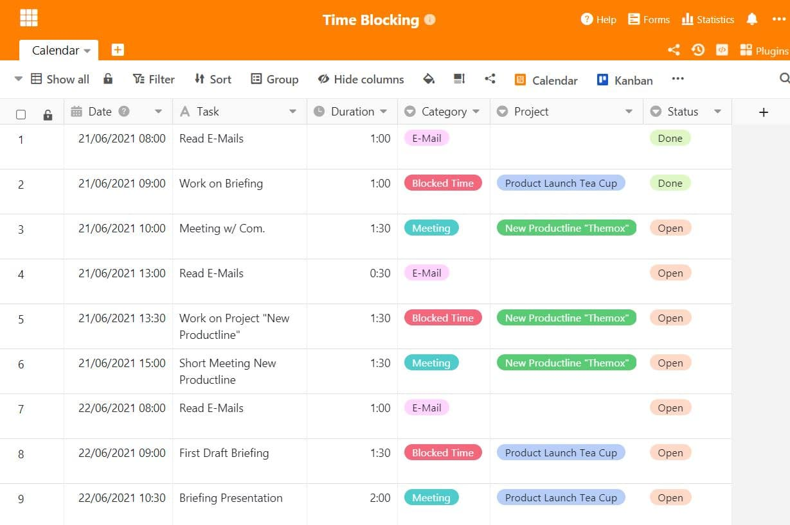
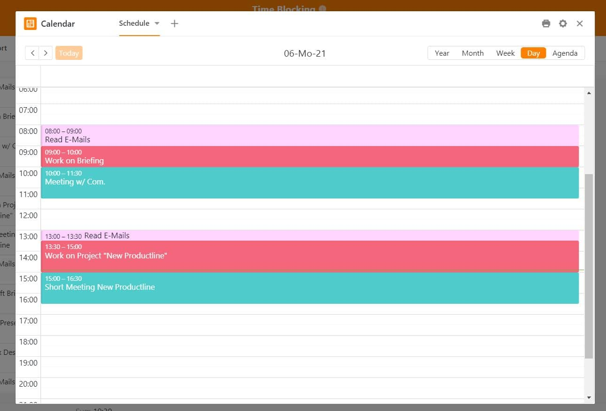
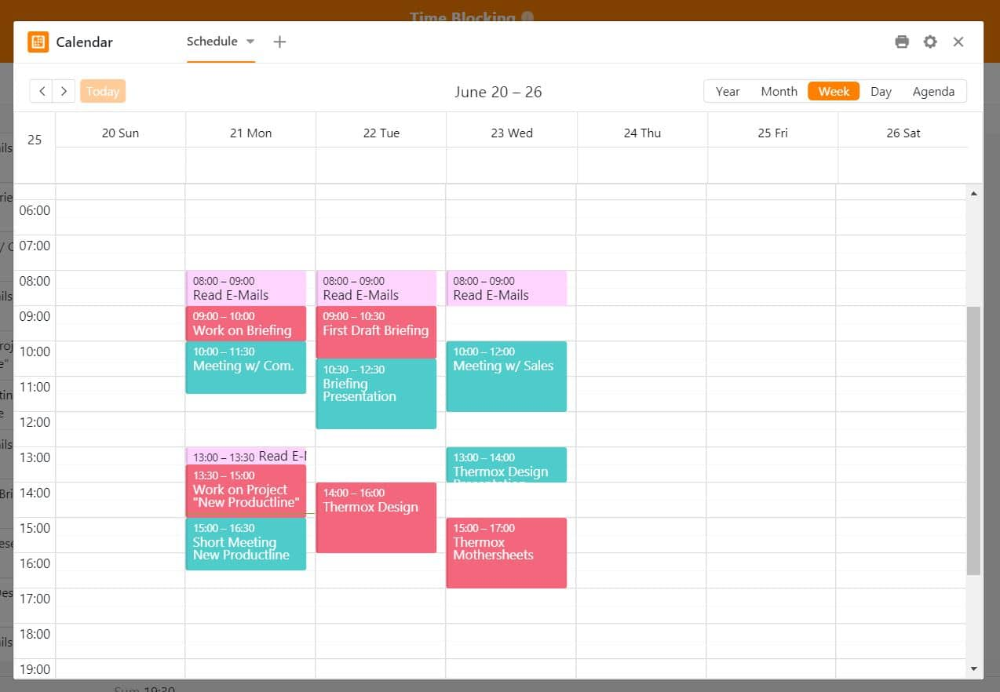
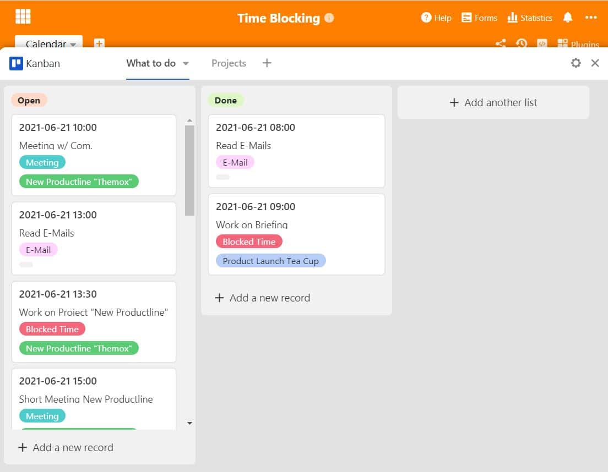

Everyday work is often stressful and sometimes it just doesn't go as you had imagined in the morning. Your plans for the day have been completely disrupted by phone calls, meetings and emails and at the end of the day you ask yourself: what did I actually manage to do? To prevent such situations from arising again, you should familiarise yourself with Time Blocking.

## What is Time Blocking?

The Time Blocking method is a productivity technique that can be very effective for self-organisation and one's own time management. With this method, the entire working day is divided into time blocks, each of which is dedicated to a specific topic. In this way, you structure your entire day according to a strict schedule that must not be interrupted by anything.

You should prioritise your tasks so that important things get done first. By planning fixed blocks of time, you can cover all current projects and no longer forget any to-dos. You can also use time blocking to specifically time the answering of emails, which usually takes up a lot of time unconsciously.

## Why time blocking?

Work interruptions are part of everyday working life - because not everyone has their own office space where they can work undisturbed. Especially when working with many interfaces, such as in [project management](https://seatable.io/en/projektmanagement/), work interruptions are almost unavoidable. Calls, noisy surroundings and ad-hoc shouted tasks are not uncommon in open-plan offices.

However, being constantly interrupted during the work flow clearly inhibits productivity. Multitasking is also a productivity killer that can even put a strain on health, as [a study by the BAuA found out](https://www.baua.de/DE/Angebote/Publikationen/Praxis/A78.pdf?__blob=publicationFile&v). The quality of work deteriorates because you almost never get into a state of high concentration and productivity hardly has a chance to emerge in the first place.

Thus, concentration must be painstakingly rebuilt after an interruption. This can take some time. If there is another interruption by then, high concentration will not build up in the long run and unproductivity will be the result. All this speaks in favour of Time Blocking, because the method blocks all external interruptions and ensures working time that is really used productively.

### Time blocking variants

There are different ways to integrate time blocking into the daily work routine. The classic way is to set up time blocks for very specific tasks as described above. However, there may be other suitable methods that belong to Time Blocking for you and your way of working. Depending on which method suits you better, your daily work routine will find a completely new productive structure.

**Time Blocking**: "Today I will do trend research from 1 to 2 p.m. and continue working on the briefing from 2 to 3 p.m."

This is classic time blocking, which you can integrate into your personal calendar in the best case. This way, you not only have fixed meetings and appointments in it, but you also have your entire daily schedule planned visually. Writing down and setting time blocks not only gives you a better overview of current projects, but also ensures that you are more careful and conscious with your time. Setting fixed times prevents you from being constantly interrupted in your activities and reduces your concentration.

**Tasks Batching**: "From 10 to 11.30 I will go through all my emails and answer them".

Task batching focuses on completing smaller and similar tasks in a block of time. This includes, for example, answering emails, editing pictures or running errands. The important thing here is to keep the context change as low as possible, which can include switching to another programme, for example. If everything remains in one environment, you can devote yourself entirely to the task and the small units are ticked off bit by bit.

**Tagesthemen**: "On Mondays I will always take care of the market and competitor research, on Tuesdays I will concentrate on reporting on our products."

It can also help to plan whole days of the week according to certain topics. This can work if you are responsible for and supervise several areas of responsibility, such as [marketing](https://seatable.io/en/marketing/), [sales](https://seatable.io/en/vertrieb/) or human resources. In order to be informed in each area and to be able to react to important topics, it is advisable not to schedule meetings of these areas on the same day, but to assign them separate days. In this way, new insights, questions, problems or news can be dealt with beforehand and the results of the meeting can be worked on afterwards. Dividing the topics into different days reduces the change of context and gives clearer mental structures.

**Time Boxing**: "Today I will finish the briefing from 12 to 13 o'clock".

Time boxing and time blocking are often used as synonyms, but time boxing concentrates on time allocation with the help of a deadline. As with time blocking, time blocks are set in which certain tasks are to be completed, but with time boxing the premise is set that the tasks must be completed. The time pressure sometimes works wonders and challenges you to work efficiently and productively on tasks.

### Why is Time Blocking so effective?

Time blocking is only possible from good task planning. You have to deal specifically with the coming day's planning and can thus focus all your attention on the upcoming block the next day. Focusing and not letting yourself get distracted must be trained, because getting directly into a high level of concentration is difficult in an untrained form. Dividing up your working time can help you with this. It also has other advantages:

- Time Blocking makes you aware of how you spend your daily working time
- No room for unnecessary perfectionism
- You define and achieve goals more efficiently and better

Just start structuring your daily routine. It may be difficult at first, but the advantages will soon outweigh the disadvantages. You can use time blocking not only with a digital calendar in your email account or on your smartphone, but also in the traditional way by writing a schedule on paper. This can help with visualisation.

## Time Blocking with SeaTable

If you prefer digital time planning, you can implement this with SeaTable in just a few steps. Not only do the different column types play a major role, but the extremely powerful plug-ins also open up completely new possibilities when used with SeaTable. With SeaTable day planning, you create the best conditions for successful time blocking, which could look something like this:

As a powerful software, SeaTable brings the advantages of a spreadsheet and a database in one product. You can collect, organise and prepare a variety of data for yourself. But you can also share data with your team and other stakeholders and synchronise it in real time. You can not only prepare your own SeaTable daily planning for yourself, but also release views for colleagues - who thus know exactly when you have blocked times for yourself and when you are not available.

### Time Blocking with Calendar Plugin

With the date column function, you can easily create calendar [overviews](https://seatable.io/en/docs/handbuch/seatable-nutzen/ansichten/) that are completely adapted to your needs. This makes it possible to organise appointments and daily planning in tabular form, so that separate use of calendars is no longer necessary. With the **Calendar Plugin**, you can display appointments and dates in calendar form and thus see at a glance which appointments and tasks are due for today, the week, the whole month or the year.

With the Calendar Plugin any kind of events and appointments can be displayed visually and can also be assigned to color schemes. This gives you a direct overview of your entire schedule and allows you to integrate time blocking into your day in a very targeted way. With red colored time slots, blocked times are directly visible for you and other employees - during this time you are quasi "not available".

### Time Blocking with Kanban Plugin: How to keep an eye on your tasks

With the new Kanban plugin, it is possible to map tasks and projects in Trello style. This function is extremely valuable especially for the visual representation of topics and To Do's and helps you to design your workflow efficiently. The Kanban board uses data in the SeaTable table. The categories are created from the various columns, such as the single selection column. Thus, the board can be used in a highly flexible manner in a wide variety of areas and external solutions such as Trello can be completely dispensed with.

As you are used to from Kanban tools, you can move the individual tasks by dragging and dropping and thus update the status. This gives your daily routine a clearly predefined structure. Conveniently, the next scheduled task is displayed at the top, so you are always up to date with your schedule. You can also create additional boards here based on different views and focus only on project-related tasks, for example. New entries can be created directly in the Kanban board.

Thus, you have not only effectively integrated Time Blocking into your daily routine with the Calendar Plugin, but also sensibly incorporated the Kanban Plugin into your task management. This results in a twofold increase in efficiency: you adhere strictly to your productivity phases and can monitor your tasks and document your progress at the same time.

Get started with SeaTable today for your productivity boost!
