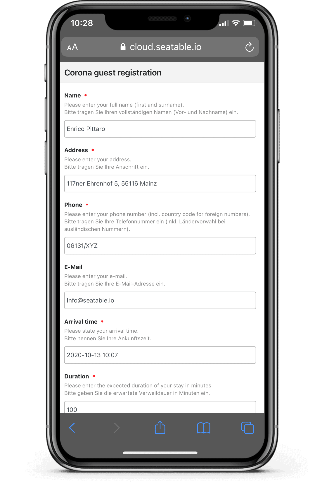
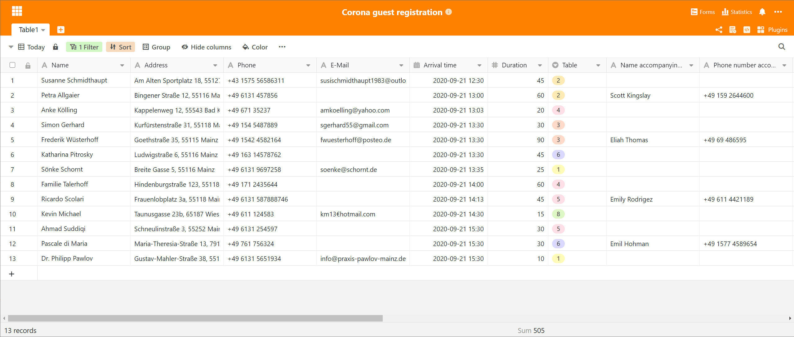

Contact data collection in the hospitality industry for tracking Covid19 infection chains is a key component of the package of measures to contain the spread of the novel Corona virus. Our Guest Registration Template provides a simple, digital solution to end the tedious paperwork involved in Corona contact data collection: Instead of paper, guests enter their contact information into a web form on their smartphone. To open the web form, all your guest has to do is scan a QR code with their phone camera. The contact information is stored in a German data center and you can track the entry of contact information in real time via your SeaTable customer account. Start [now](https://seatable.io/en/registrierung/) for free with the all-in-one solution for contact data entry in restaurants, bars and cafes!

## Digital contact data capture: hygienic, flexible, uncomplicated

With SeaTable, you no longer need pens, slips of paper or a receipt archive for guest registration. Guests simply and conveniently enter their contact details on the displays of their own mobile phones. Your guests scan a QR code and enter their name, address and other contact details in the web form that opens. They are also asked for their arrival time, length of stay and seat. Guests with accompanying persons can also enter their names. There is no need to fill out several forms. Sounds good? The effort for you is minimal!

Your primary task is to ensure that guests can scan the QR code. Our suggestion: Print it on place cards or copy it onto an insert on your menu. The QR code itself is generated in SeaTable. You only need to download it and insert it into the document. Otherwise, you only need to make minor adjustments to the web form in preparation, e.g. adjust the table numbers in the associated selection field and add the company name in the data protection information.

All customer data entered is stored in an online SeaTable table. You have full access to the stored contact data via computer or tablet and can check all entries. If a guest has entered no information or obviously incorrect information, you have the possibility to intervene. If the table number or other information is incorrect, you can correct the data.

## Simple evaluation of contact data

The online table in SeaTable not only contains the web form, but also three predefined views to make evaluations of contact data child's play. You switch between the views with a click on the view name in the top left corner.

In the standard view _All registrations_, you will find at a glance all contact details that your guests have left and that are stored in your customer account. In the _Today_ view, you can only see the contact details of today's guests. This view makes it easy to monitor ongoing guest registrations. The _To_ delete view is used to quickly and easily delete old entries after the prescribed storage period has expired. Select this view to display all contact data that is older than four weeks. In this way, you fulfil the data protection requirements that you must of course comply with despite the pandemic situation.

If you want to adapt the existing views or carry out other evaluations, SeaTables provides you with convenient [grouping, sorting and filtering functions](https://seatable.io/en/docs/handbuch/datenmanagement/gruppierung-sortierung-filter/). For example, if you want to change the retention period of the contact data in the _To delete_ view due to different regulations in your state, then simply adjust the filter in the view. You will be amazed at how easy it is to adapt SeaTable to your individual needs. You can also add more fields to the web form to collect additional information from your guests.

## Digitisation of the collection of Corona contact data

Your data will be stored in your SeaTable user account. The first thing you need to do is create one. The good news is that the account is free for 2,500 contact records. Even larger establishments should be able to manage with this. Don't forget: After the storage period, old data records must be deleted!

Follow the 5 steps and you'll be ready to go in minutes!

[5 steps to contact data capture with SeaTable](/en/corona-gaesteregistrierung/#tab-id-1-active)

## Many other practical functions

SeaTable can support you not only for collecting guest contact data in pandemic times! Learn more about the satisfaction of your customers with a survey via web form (like here with the collection of Corona contact data). Plan your staff's working and duty times and make the plans available to your staff online. Create shopping lists that can be accessed from the company as well as on the road via mobile phone. Coordinate your table reservations and organise events. Enter the contact details of your regular guests to keep them up to date with the latest news. What guest is not happy about a small gift on their birthday or at Christmas?

For these and many other tasks, there are ready-made [templates](https://seatable.io/en/docs/templates/) with which you can get started immediately and without effort. With SeaTable you have an ocean of possibilities.
