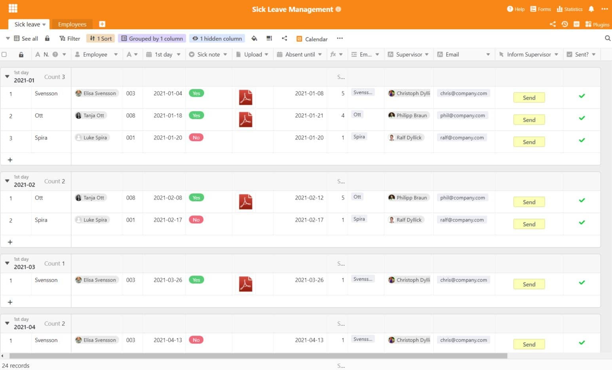
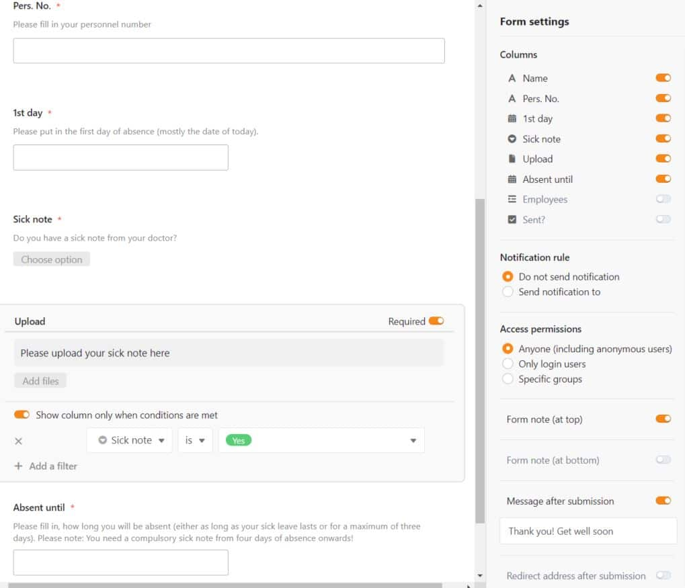
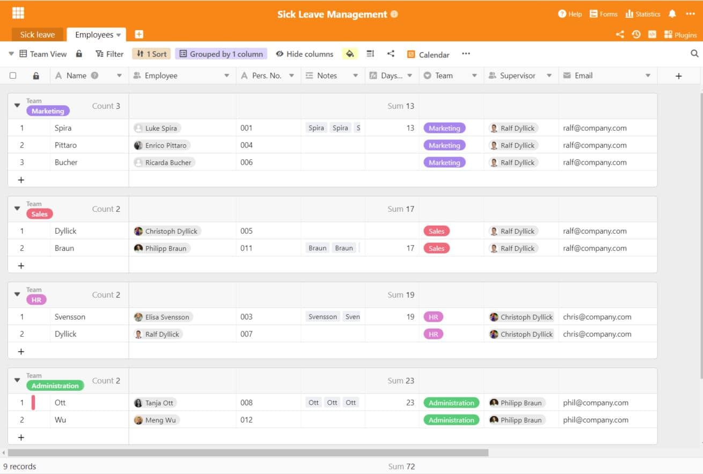
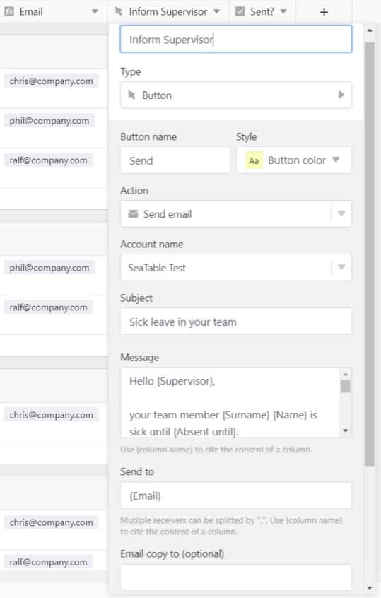

It happens time and again that employees in companies have to call in sick - it just doesn't go away. Especially in the times of the flu epidemic, staff shortages quickly occur when particularly many fall ill at the same time. Fortunately, this situation has greatly improved due to strict hygiene measures, as employees with symptoms of illness are now much more likely to stay at home and thus protect their colleagues.

Despite everything, a sensible system is needed to record sickness reports and thus keep an eye on the sickness levels of your employees. SeaTable can be excellently applied as software in this use case due to its flexibility and ease of use.

### Rules for smooth sick leave

Employee sick calls are subject to rules that employees should follow. Notification of illness is always necessary when employees are ill, as they must prove that they are unable to perform their daily work. The notification must be made as soon as possible from the moment the employee knows that he or she will not be able to work due to the illness.

Exactly how employees must call in sick is usually a matter for direct discussion with their supervisors and is not regulated by law. Whether by phone, e-mail or in person - all three methods are sufficient for calling in sick. It is even permissible to commission third parties to report sickness, such as colleagues.

Notifications of illness are different from sick leaves. A sick note is simply a notification to the employer that the employee is unable to attend work due to illness. The sick note must always be confirmed by a doctor, i.e. it is in paper form, and it records the sick person as being ill for a certain period of time. There is a legal regulation in this respect: a sick note from the doctor must be submitted at the latest from the fourth day of illness. Up to and including three days, a sick note is not yet required, unless otherwise stipulated by contract.

## A good working atmosphere makes you healthy

A [study by the Scientific Institute of the AOK found](https://www.wido.de/publikationen-produkte/buchreihen/fehlzeiten-report/2018/) that job satisfaction is also related to the number of days absent from work. According to the study, employees who were satisfied with their job were absent for about 9.4 days a year, while dissatisfied employees were absent for about 19.6 days a year - this is a considerable figure and shows that dissatisfaction at work has a negative impact on health.

A positive working atmosphere and good mood at the workplace are therefore very important for your employees, and thus also important for your success. Because the more often your employees are absent, the more productivity suffers and fewer projects and goals can be achieved. This harms the company in the long run. If there are conspicuities with some employees, one solution would be to seek a conversation and find out the reasons for the frequent absences. If an employee is very dissatisfied, this can be solved by changing jobs or other tasks.

In order for your employees to submit their sick notes in an uncomplicated and fast way, a powerful, yet simple software is necessary. SeaTable is great for collecting your employees' sick notes and sick leave, keeping track of current sick leave levels and checking your employees' sick days for anomalies. We have made a template and explain below how to provide your employees with a digital solution for sick leave.

[Click here to go directly to the template](https://seatable.io/en/vorlage/hmmgn1kdq1ilwwt_jk69-g/)

## Submit sick leave with web form

Our SeaTable template utilizes a powerful feature that will make submitting sick notes and sick leave forms much easier: The web form. It forms the core of this template and ensures that your employees can let you know that they will not be at work due to illness with just a few clicks. It allows staff and supervisors to manage sick notes internally and respond quickly to an absence.

With the management of sickness notifications at a central collection point, you save yourself several steps: Submitting sickness notifications and certificates via the web form saves e-mails and the manual saving and storing of sickness notifications in the system. Instead of having to manually store sickness notifications in SAP, the weekly schedule and other places, everything can be collected, stored and managed in one place.

This table is the basis of your web form. Almost every column can be mapped in the web form to request information. Here, essential information such as name, personnel number, and the duration of absence, if any, as well as a sick note, if any, are requested. Your employees fill in these questions with the data and can submit them with one click. All data immediately appears in Base and can now be further processed by you.

 With the creator column, your employees are automatically stored in the table as creators with their user ID. There is no need to enter the identity separately. This is helpful for further analyses and provides a better overview. The web form can be designed freely, you decide which columns should be displayed to your employees. You also decide which information is mandatory and must be entered.

We have added a condition column to the form. This means that this column is linked to a condition and only appears if this condition is met. In our case, the column where a certificate can be uploaded by the employee opens only if he answers "Yes" in the previous field to the question whether there is a certificate from the doctor.

The web form is flexible to use. You can either share the link to the form directly with your staff or embed it in your staff portal. You can also use the QR code already created and offer it as a mobile access alternative for your employees. The form can be filled out via computers as well as smartphones and tablets without any problems.

If you want to keep absolute control over all your data, you can also host your SeaTable Cloud on your own server. This way, your data has the highest security standard and belongs only to you. But even without your own hosting, all your data is kept safe and compliant with the European Data Protection Regulation - at [the Swiss company Exoscale](https://seatable.io/en/die-seatable-cloud-wird-europaeischer/).

## Employee profile including sick leave and days absent

The table is linked to a second table, namely an employee directory. Each employee is created there to collect the days of absence and record important basic information, such as the associated team and supervisor. With a simple assignment of incoming sick notes to employees, all sick days are calculated correctly and an informative employee profile is created.

By linking the two tables, the assignment is easily done via a search field with the selection options. Once assigned, the first table directly shows the supervisor of the employee who reported sick and also his or her e-mail address, which is needed to send the e-mail. By linking the two tables, several work steps can be saved, as data no longer has to be transferred manually.

## Inform team directly by e-mail

Sickness notifications from team colleagues can sometimes turn the daily work routine completely upside down. One absence can hold up an entire project if no other employees are working on it. We have integrated the button column in our template so that a sick note can be quickly forwarded to the supervisor and thus to the team.  

With this column type, several actions can be built into the base, which are triggered with a click on the button. For example, scripts can be started, rows modified or copied, a URL opened or an email sent. Sending e-mails is a very powerful feature that can save many manual steps if set up correctly.

Für das Versenden von E-Mails müssen Sie Ihr E-Mail Konto in Ihre Base integrieren, diese wird dann als Absender der Mails genutzt. Wie Sie E-Mail Konten einbinden, erfahren Sie meistens bei Ihrem E-Mail Anbieter. Sie können dann in der Spalte den Betreff und den Inhalt der E-Mail formulieren. Mit Nasenklammern und dem Namen einer Spalte können Sie die Inhalte aus Spalten direkt zitieren: Statt {Supervisor} erscheint dann zum Beispiel Max Mustermann, der in der Zeile als Vorgesetzter hinterlegt ist.

Mit den Nasenklammern tragen Sie essentielle Informationen ein, die Ihre Mitarbeiter bei Krankmeldung eingereicht haben, wie etwa den 1. Tag der Abwesenheit sowie das voraussichtliche Enddatum. Die Klammern benutzen Sie ebenfalls für die Festlegung der E-Mail Adressen im Empfänger-Feld: Mit {Email} wird immer jeweils die Mail-Adresse aus der jeweiligen Zeile als Empfänger eingesetzt.

Now, whenever a new sick note appears in the system, you can send an e-mail to its supervisor with one click, who is automatically determined after the sick note has been assigned to the correct employee profile. This way, the information about the absence reaches the team directly and a substitute can be found or work can be redistributed.

### Automatic notifications for faster processing of sick notes

SeaTable's [notification rules](https://seatable.io/en/docs/handbuch/zusammenarbeit/benachrichtigungen/) allow you to set up automatic notifications when a new sick note is received in the system. You can set any employee to receive these notifications and be responsible for managing them. The automatic triggering of the notification rule makes administration much easier and speeds up processing. No sickness notification is lost any more.

If employees are absent conspicuously often, you can set a rule that informs you when a certain amount X is reached. For example, if an employee has reached the 50-absent-day mark, you can set an automatic notification for this case and check the case personally. It is possible that the employee has a serious illness or is very dissatisfied.

### Calendar plugin for a better overview of sick notes

With the calendar plug-in, you create a clear view of your employees' days of absence. You can flexibly create a daily, weekly, monthly or yearly view in which all sickness notifications are displayed. In the current week, for example, you can immediately see how many employees are absent this week. Are there any? Very good! Are there several? Then you need to take action.

[Our template](https://seatable.io/en/vorlage/hmmgn1kdq1ilwwt_jk69-g/) is suitable for businesses of any size - you can also create multiple views that take care of your employees' sick leave in alphabetical sections if you have a particularly large number of employees. SeaTable offers almost infinite possibilities in the design and implementation of your processes - how tailor-made can our software be the solution for your business. Just give it a try and [register for free]()!
