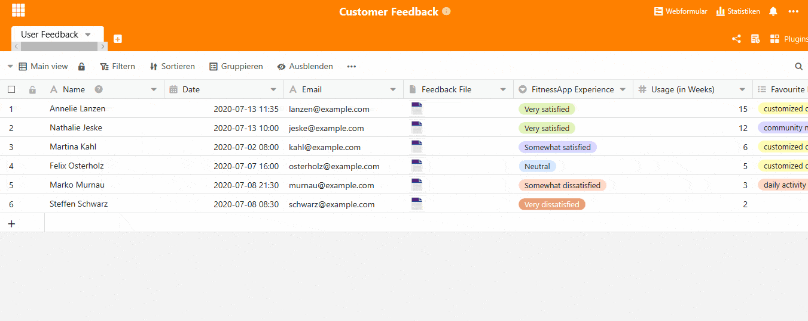
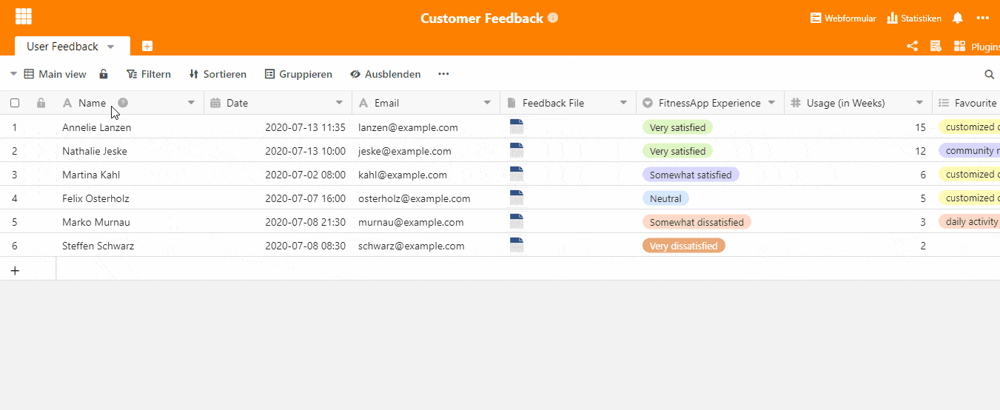

Was begeistert Ihre Kunden und womit sind Sie gar nicht zufrieden? Suchen Sie den günstigsten Preis oder ist Ihnen vielmehr ein spannendes Shopping Erlebnis wichtig? Kundenfeedback bietet Ihnen nicht nur Einblicke in die Charakteristika Ihrer Zielgruppe, sie erhalten auch einen ganz neuen Blick auf Ihre eigenes Produkt. Ist das Feedback erst mal eingeholt, gilt es dieses richtig auszuwerten.

Kundenfeedback kann auf die [unterschiedlichsten Arten](https://blog.hubspot.de/service/kundenfeedback) eingeholt werden, möchten Sie eine klassische online Umfrage durchführen, haben Sie mit unserer [SeaTable Vorlage](https://seatable.io/vorlage/ku9n1tyosmmho-8trn7rdg/) ein einfaches und effizientes Tool, welches Ihren Kundensupport auf das nächste Level hebt. Mithilfe eines Webformulars können Ihre Kunden direktes Feedback geben. Die Antworten werden sofort in ihrer Tabelle gespeichert und stehen Ihrem Team zur Auswertung zu Verfügung. Mithilfe von Statistiken lassen sich besonders positive Aspekte, aber auch Schwachstellen sofort erkennen. Der zentrale Vorteil von SeaTable ist somit, dass sowohl die Datenerfassung als auch die Datenauswertung im gleichen Tool erfolgt. Ein umständliches Aufbereiten von Daten entfällt.

Schauen wir uns das Kundenfeedback Template doch einmal genauer an:

## Aufbau unseres Kundenfeedback-Templates

In diesem Template wurde das Kundenfeedback einer Fitnessapp eingeholt und ausgewertet. Wichtige Informationen über den Kunden wie Name, E-Mail Adresse, Datum des Feedbacks und das ausgefüllte Feedback File finden in den ersten vier Spalten Platz. Das Feedback File ist hier für jeden User der Tabelle zentral gespeichert und somit sofort abrufbar. Sie ersparen sich so das lästige Raussuchen der Dokumente aus Ordnern auf Ihrem PC.

Die nächsten Spalten sind die Grundlage Ihres Webformulars, schauen wir uns einmal an, wie man ein solches Formular erstellt.

### Erstellen des Feedbackfragebogens mithilfe des Webformulars

Die Grundlage des Webformulars sind Ihre Tabellenspalten. Tragen Sie alle Fragen, die im Fragebogen für Ihre Kunden erscheinen sollen, in die Tabellenspalten ein. Nehmen wir die Spalte “FitnessApp Experience” als Beispiel. Sie möchten abfragen, wie die generelle Zufriedenheit mit Ihrer App für den Kunden ist. Sie haben eine Spalte “FitnessApp Experience” mit einer Einfachauswahl von “Very satisfied” bis “Very dissatisfied” erstellt. Nun erstellen Sie das Formular:

1. Klicken Sie rechts oben auf Webformular
2. Klicken Sie auf Webformular erstellen
3. Geben Sie dem Formular einen Namen, dieser ist auch für Ihre Kunden ersichtlich
4. Das Formular mit allen von Ihnen erstellten Spalten erscheint nun
5. Sie können die einzelnen Fragen nun für den Kunden aufbereiten
6. Geben Sie dem Kunden Hilfestellungen zur Beantwortung der Fragen
7. Wählen Sie den Button “Erforderlich”, um aus dem Feld ein “Pflichtfeld” zu machen
8. Wählen sie aus, wie die Antwortmöglichkeiten angezeigt werden sollen, im Beispiel hier werden Sie übersichtlich in einer Liste gezeigt
9. Für Ihre Kunden irrelevante Felder, also solche Felder, die nur von Ihren Mitarbeitern gebraucht werden, können Sie auf der rechten Seite ganz einfach ausblenden
10. Fertig? Dann klicken Sie oben auf Freigeben. Sie erhalten einen Link und einen QR-Code, den Sie auf Ihrer Webseite, in Kundenmails oder sogar auf Printmedien verwenden können

### Statistiken zur Auswertung des erhaltenen Kundenfeedbacks

Alle Antworten ihrer Kunden erscheinen sofort in Ihrer Tabelle und sind für alle zuständigen Mitarbeiter ersichtlich. [Die SeaTable Statistik Funktion](https://seatable.io/docs/handbuch/seatable-nutzen/statistiken/) ist ein nützliches Tool, um einen Überblick über ihre Antworten zu erhalten und diese allgemein auszuwerten. Klicken Sie oben rechts auf Statistik, um unsere für dieses Template erstellten Statistiken zu sehen. Hier haben wir  zwei Tabellen erstellt, die übersichtlich zeigen, welche Features von wie vielen Kunden als “Favorite”, bzw. “Least Favorite” Features benannt wurden. Zusätzlich zeigt ein Kreisdiagramm die allgemeine Zufriedenheit mit der App. Mit einem Klick auf Statistik erstellen, können Sie weitere Statistiken hinzufügen.

### Unterschiedliche Ansichten zur Auswertung des erhaltenen Kundenfeedbacks

SeaTable ermöglicht Ihnen durch unterschiedliche Ansichten eine genau auf Ihre Bedürfnisse zugeschnittene Ansicht, die Ihnen sofort die gewünschten im Fokus stehenden Informationen liefert. Die Ansicht kann ganz einfach oben links im Dropdown-Menü geändert werden. Hier können Sie auch selbst neue Ansichten erstellen.

Die Ansicht “Ratings” zeigt Ihnen Ihr Kundenfeedback, sortiert nach der allgemeinen Zufriedenheit Ihrer Kunden. Hierzu wurde in der Ansicht ganz einfach nach der Spalte “FitnessApp Experience” gruppiert. Durch die erhaltenen Kontaktdaten können Sie beispielsweise sehr unzufriedenen Kunden direkt kontaktieren, um tiefergehende Befragungen durchzuführen, und Ihr Produkt mit den gewonnen Erkenntnissen noch weiter zu optimieren.

### Kundenfeedback einfach gemacht – mit SeaTable

Ersparen Sie sich die zeitaufwendige Dateneingabe oder die Überführung ihres Kundenfeedbacks in ein separates Auswertungstool. Mit SeaTable haben Sie ein [Tool](https://seatable.io/vorlage/ku9n1tyosmmho-8trn7rdg/) für alles und bringen Ihren Kundensupport auf die nächste Stufe. Ihr gesamtes Kundenfeedback an einem Ort. Für jeden immer und überall ersichtlich.
