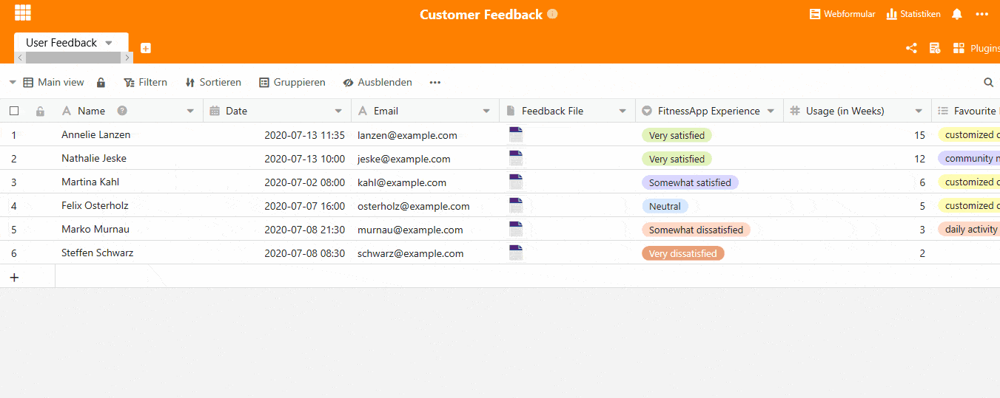
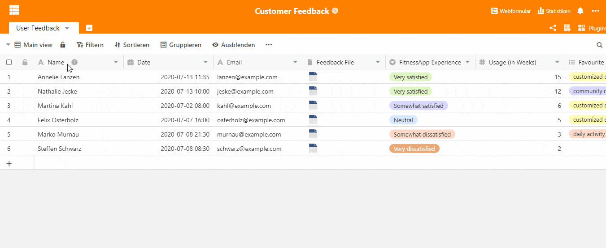

What excites your customers and what are you not at all satisfied with? Are you looking for the lowest price or is an exciting shopping experience more important to you? Customer feedback not only offers you insights into the characteristics of your target group, it also gives you a completely new perspective on your own product. Once the feedback has been collected, it needs to be properly evaluated.

Customer feedback can be collected in [many different ways](https://blog.hubspot.de/service/kundenfeedback), but if you want to conduct a classic online survey, our [SeaTable template](https://seatable.io/en/vorlage/ku9n1tyosmmho-8trn7rdg/) is a simple and efficient tool that will take your customer support to the next level. Using a web form, your customers can give direct feedback. The answers are immediately saved in their table and are available to your team for evaluation. With the help of statistics, particularly positive aspects, but also weak points can be recognised immediately. The central advantage of SeaTable is therefore that both data collection and data evaluation take place in the same tool. There is no need for cumbersome data preparation.

Let's take a closer look at the customer feedback template:

## Structure of our customer feedback template

In this template, the customer feedback of a fitness app was collected and evaluated. Important information about the customer such as name, email address, date of feedback and the completed feedback file can be found in the first four columns. The feedback file is stored here centrally for each user of the table and can therefore be retrieved immediately. This saves you the trouble of searching for documents from folders on your PC.

The next columns are the basis of your web form, let's take a look at how to create such a form.

### Creating the feedback questionnaire using the web form

The basis of the web form is your table columns. Enter all the questions that you want to appear in the questionnaire for your customers in the table columns. Let's take the FitnessApp Experience column as an example. You want to query what the overall satisfaction with your app is for the customer. You've created a "FitnessApp Experience" column with a single choice from "Very satisfied" to "Very dissatisfied". Now you create the form:

1. Click on web form in the upper right corner
2. Click on Create Web Form
3. Give the form a name, this is also visible to your customers
4. The form with all the columns you have created now appears
5. You can now prepare the individual questions for the client
6. Provide assistance to the client to answer the questions
7. Select the "Required" button to make the field a "Required" field
8. Select how the answer options are to be displayed, in the example here they are clearly shown in a list.
9. Fields that are irrelevant for your customers, i.e. fields that are only used by your employees, can easily be hidden on the right-hand side.
10. Ready? Then click on Share at the top. You will receive a link and a QR code that you can use on your website, in customer emails or even on print media.

### Statistics to evaluate the customer feedback received

All answers of your customers appear immediately in your table and are visible for all responsible employees. [The SeaTable statistics function](https://seatable.io/en/docs/handbuch/seatable-nutzen/statistiken/) is a useful tool to get an overview of their responses and evaluate them in general. Click on Statistics in the upper right corner to see our statistics created for this template. Here we have created two tables that clearly show which features were named as "Favorite", or "Least Favorite" features by how many customers. Additionally, a pie chart shows the overall satisfaction with the app. With a click on Create statistics, you can add more statistics.

### Different views on the evaluation of the customer feedback received

SeaTable allows you to tailor a view exactly to your needs through different views that immediately provide you with the information you want to focus on. The view can be easily changed in the top left drop-down menu. Here you can also create new views yourself.

The "Ratings" view shows you your customer feedback, sorted by the overall satisfaction of your customers. For this purpose, the view was simply grouped by the "FitnessApp Experience" column. The contact data obtained allows you to contact very dissatisfied customers directly, for example, in order to conduct more in-depth surveys and to optimize your product even further with the insights gained.

### Customer feedback made easy - with SeaTable

Save yourself the time-consuming task of entering data or transferring your customer feedback to a separate evaluation tool. With SeaTable you have one [tool](https://seatable.io/en/vorlage/ku9n1tyosmmho-8trn7rdg/) for everything and take your customer support to the next level. All your customer feedback in one place. Visible to everyone, always and everywhere.
