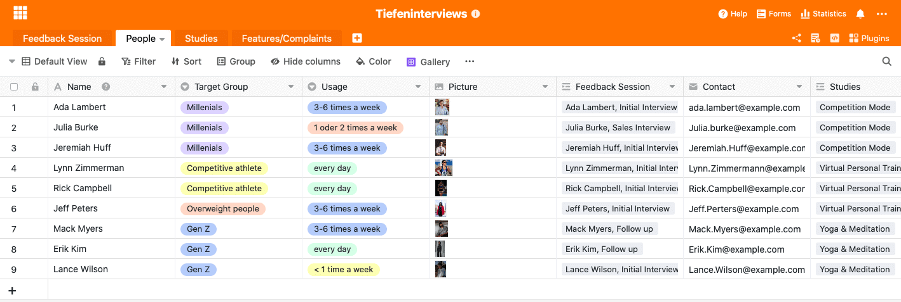
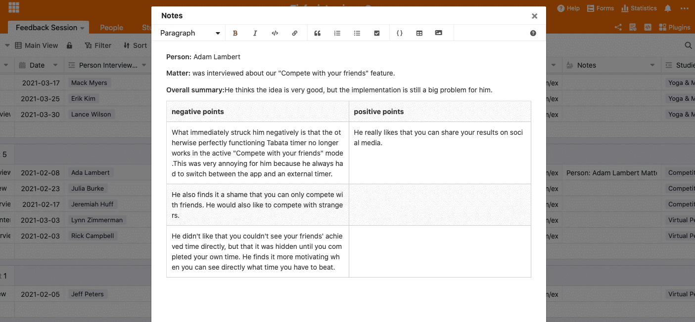
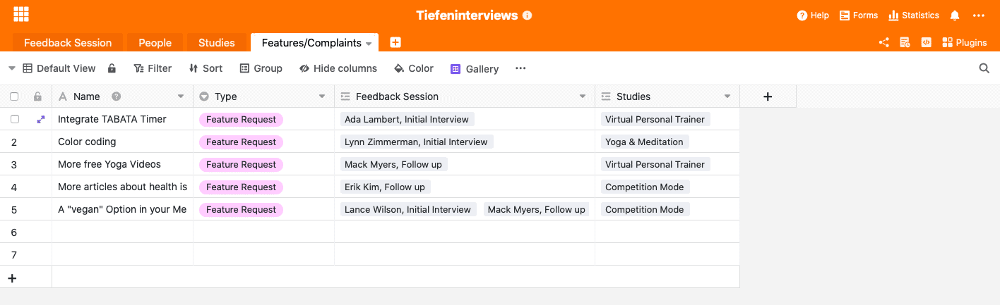

Von qualitativen Rohdaten zum brandneuen Produktfeature. Bis aus der Anmerkung eines Kunden ein neues Feature entsteht, kann einige Zeit verstreichen. Trotzdem lohnt sich der Prozess und geht mit einem geeigneten Online-Tool auch viel leichter von der Hand, als Sie vielleicht gerade denken.

Als Unternehmen ist es wichtig, regelmäßig Kundenfeedback einzuholen, auszuwerten und die entstandenen Kenntnisse in die Praxis zu überführen. Wie man die Kundenzufriedenheit misst und auswertet, haben wir bereits in [diesem Artikel](https://seatable.io/kundenzufriedenheit-messen-auswerten-und-steigern/) genauer elaboriert. Dort finden Sie Informationen zu den verschiedenen Methoden, die Ihnen dabei helfen, Kundenfeedback einzuholen. Speziell sind wir dort auf eine anonymisierten online Umfrage eingegangen.

Der folgende Artikel bezieht sich nun auf die spezielle Methode des [Tiefeninterviews.](https://de.wikipedia.org/wiki/Tiefeninterview) Zudem gehen wir genauer darauf ein, wie die erhaltenen Rohdaten auch tatsächlich in Aktionen überführt werden können und wie verschiedene Teams die gleichen Daten auf unterschiedliche Weise für sich nutzen können. Das Ganze funktioniert in nur 3 Schritten.

## Vorteile eines Tiefeninterviews

- Durch die offene Fragestruktur kann spontan auf die **Bedürfnisse und das Antwortverhalten** des Befragten eingegangen werden
- In einer vertrauensvollen Gesprächsatmosphäre sprechen die Befragten auch **eigene Emotionen oder unangenehme Aspekte** an, die beispielsweise innerhalb einer Gruppe nicht angesprochen werden würden
- Eine direkte Beobachtung der Ergebnisse wird ermöglicht
- unbewusste Einstellungen und Meinungen der Probanden können zum Vorschein kommen

Für die Aufzeichnung der Daten, die in einem Tiefeninterview entstehen, kann SeaTable Sie unterstützen: Dokumentieren Sie die Kontaktaufnahme, die Aufzeichnung und tracken Sie die Überführung des Kundenfeedbacks in eigentliche Aktionen. Nachfolgend leiten wir Sie durch alle relevanten Schritte und werden Ihnen SeaTable und seine Funktionen anhand einer fiktiven Fitnessapp näher bringen.

## 1\. Schritt: Sammeln Sie Daten in Form von Kundenfeedback

Um Kundenfeedback zu erhalten, muss man mit den Kunden in Kontakt treten. Am besten Clustern Sie Ihre Kunden in verschiedene Zielgruppen und versuchen dann, einzelne Personen aus diesen Zielgruppen für ein Tiefeninterview zu gewinnen. Es ist wichtig, dass die Personen aus unterschiedlichen Zielgruppen stammen, so bekommen Sie wertvolle Insights in die ggf. unterschiedliche Nutzung ihres Produktes von den verschiedenen Kundengruppen. Bei einem Tiefeninterview bedienen Sie sich am Kundenfeedback von bereits bestehenden Kunden. Das heißt konkret, dass Sie die Initiative ergreifen müssen und geeignete Kunden aus ihrem CRM-Daten herausfiltern müssen, um diese anschließend zu kontaktieren.

### Motivieren Sie den Kunden Feedback zu geben

Der Kunde wird motivierter sein, an einer Kundenfeedback-Session in Form eines Tiefeninterviews teilzunehmen, wenn er einen besonderen Anreiz sieht. Das kann entweder ein monetärer Anreiz sein oder Sie bieten ihm einen Gutschein für Ihr eigenes oder ein fremdes Produkt an.

### Kundenkartei für ein besseres Verständnis Ihrer Zielgruppen

Haben Sie Personen für Ihr Interview gefunden, so zeigt Ihnen der folgende Screenshot, wie sie diese in Ihrer SeaTable Base eintragen können. Einzelne Personen aus den verschiedenen Zielgruppen zu erfassen, kann Ihnen dabei helfen, ein besseres Bild über Ihre Zielgruppe zu erhalten. [Personas](https://buffer.com/library/marketing-personas-beginners-guide/) können in Zukunft dann immer einfacher und genauer erstellt werden. Zur Erfassung der zu interviewenden Personen haben wir ein neues Tabellenblatt erstellt, welches folgende Informationen enthält:

- Name der zu interviewenden Person
- die Zielgruppe, welcher die Person zugeordnet ist
- die Häufigkeit der Nutzung Ihres Produktes
- ein Bild
- die Interviews, an denen die Person teilnahm (z. B. Initialinterview, Follow ups, Usability Tests)
- die dem Interview zugrunde liegende Studie (eingetragen im Tabellenblatt “Studies”)

Tragen Sie jede zu Interviewende Person in die Tabelle “Personen” ein

## 2\. Schritt: Interviews führen

Wenn Sie geeignete Personen für Ihr Kundenfeedback gefunden haben, geht es ans Interviewen dieser. Die Ergebnisse der Tiefeninterviews werden anhand von Zitaten veranschaulicht und in einem gut strukturierten Report zusammengefasst. Je mehr Notizen gemacht werden, desto mehr Informationen lassen sich im Anschluss an das Gespräch verarbeiten. Es ist durchaus sinnvoll, das Gespräch aufzuzeichnen, um den Report im Nachhinein zu erstellen. So wird der natürliche Redefluss nicht gestört und der Kunde fühlt sich im Gespräch wohler und kann ein Vertrauensverhältnis zum Interviewer aufbauen. Der Report dokumentiert dann anschließend alle Anforderungen, Wünsche und Kritiken des Kunden. Welche Fragen genau Sie in Ihrem Tiefeninterview stellen, hängt natürlich sehr stark von Ihrem Produkt und der zugrunde liegenden Forschungsstudie zusammen. Den Fragenkatalog wird in Zusammenarbeiter mehrerer Abteilungen erstellt und dient als Orientierung für den Interviewer. Natürlich ist es erwünscht, neben den vorher festgelegten Fragen auch spontane Zwischenfragen zu stellen, die sich aus dem Gespräch ergeben. Generell gibt es zahlreiche Fragetypen die in einem Tiefeninterview angewandt werden, lesen Sie ergänzend hierzu gerne [hier.](https://wpgs.de/fachtexte/qualitative-interviews/9-mit-qualitativen-fragen-in-die-tiefe-gehen/)

### Sammeln Sie alle Interview-Notizen an einem einzigen Ort

In unserem Notizenfeld haben sie genügend Platz und Gestaltungsmöglichkeit, um einen gut strukturierten Report zu erstellen. Das gut an unsere Base ist, dass sie von jedem eingesehen werden kann. Das heißt, dass jede Abteilung zu jeder Zeit Zugriff auf relevante Informationen hat. Idealerweise erstellt sich jede Abteilung innerhalb der Base noch eine eigene Base, in der sie die Information für sich aufbereitet. Dazu aber später noch einmal mehr.

Nutzen Sie die verschiedenen Formatierungsoptionen in unserem Long-Text-Feld, um es dem Lesenden so einfach wie möglich zu machen, die Quintessenz aus dem Interview zu ziehen.

## 3\. Schritt: Strukturieren Sie Ihre Daten und Überführen Sie Erkenntnisse in die Praxis

Kundenfeedback alleine bringt Ihnen wenig. Sie müssen die erhaltenen Rohdaten so aufbereiten, dass die verschiedenen Abteilungen Informationen zum weiteren Vorgehen bekommen. Dafür erstellen Sie für jede  Abteilung ein eigenes Tabellenblatt innerhalb dieser Base und filtert relevante Informationen für die entsprechende Abteilung heraus. In unserem Beispiel haben wir einmal angenommen, dass das Produktteam daran interessiert ist, welches Feature verbessert werden muss bzw. welches neue Feature als Nächstes gebaut werden soll. Hierfür wurde das Tabellenblatt **Features/Complaints** erstellt. Aus den Tiefeninterviews wurden nun alle für diese Abteilung relevanten Informationen herausgefiltert und als Feature in die Tabelle eingetragen. Haben viele Kunden kritisiert, dass der Fitnessapp ein integrierter Timer fehlt, so kann man daraus schließen, dass dieses Feature eine hohe Priorität hat und ihr Produktteam den Timer als Nächstes angehen sollte.

## Mit SeaTable ganz einfach Rohdaten in neue Produktfeatures überführen

Im ersten Schritt haben wir den Grundstein für die Sammlung Ihrer Rohdaten gesetzt, indem wir geeignete Personen für das Tiefeninterview ausgewählt haben und in das Tabellenblatt “Personen” übertragen haben. Im nächsten Schritt haben wir die Tiefeninterviews mit den Kunden geführt und einen ausführlichen Report im Tabellenblatt “Feedback Session” unter der Spalte “Notizen” verfasst. Aus dem ausführlich erstellten Report haben sich dann im 3. Schritt Ihre einzelnen Abteilungen bestimmte, für Sie relevante Informationen herausgepickt und für sich so strukturiert, dass sich tatsächliche Aktionen ableiten lassen.

Regelmäßiges Sammeln von Kundenfeedback wird zunehmend wichtiger. Die Unmengen an gesammelten Daten bringen Ihnen jedoch wenig, wenn Sie nicht richtig strukturiert und in Aktionen übersetzt werden. Mit unserem Template können Sie Ihre Daten so strukturieren, dass sie über die Zeit Bestand haben und Ihnen immer bessere und spezifischere Einblicke in die Welt Ihrer Kunden geben können.
