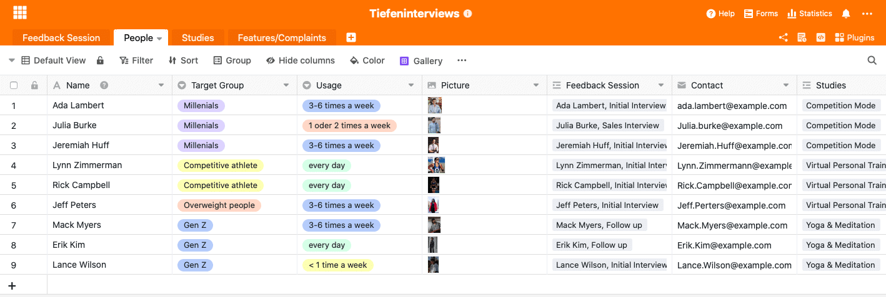

De los datos cualitativos en bruto a una nueva característica del producto. Puede pasar algún tiempo antes de que una nueva función surja de un comentario de un cliente. Sin embargo, el proceso merece la pena y, con una herramienta online adecuada, es mucho más fácil de lo que se piensa.

Como empresa, es importante recoger y evaluar regularmente las opiniones de los clientes y poner en práctica los conocimientos resultantes. En [este artículo](https://seatable.io/es/kundenzufriedenheit-messen-auswerten-und-steigern/) ya hemos explicado cómo medir y evaluar la satisfacción del cliente. Allí encontrará información sobre los distintos métodos que pueden ayudarle a recoger las opiniones de los clientes. En particular, hemos tratado una encuesta anónima en línea.

El siguiente artículo se refiere al método específico de la [entrevista en profundidad](https://de.wikipedia.org/wiki/Tiefeninterview). Además, profundizamos en cómo los datos brutos obtenidos pueden convertirse en acciones y cómo los diferentes equipos pueden utilizar los mismos datos para sí mismos de diferentes maneras. Todo funciona en sólo 3 pasos.

## Ventajas de una entrevista en profundidad

- Debido a la estructura de la pregunta abierta, las **necesidades y el comportamiento de respuesta** del encuestado pueden ser abordados espontáneamente
- En un ambiente de debate de confianza, los encuestados también abordan **sus propias emociones o aspectos desagradables** que no se tratarían dentro de un grupo, por ejemplo
- La observación directa de los resultados es posible
- Pueden salir a la luz actitudes y opiniones inconscientes de los sujetos

SeaTable puede ayudarle a registrar los datos que se generan en una entrevista en profundidad: Documente el contacto, el registro y haga un seguimiento de la transferencia de los comentarios de los clientes a acciones reales. A continuación, le guiaremos a través de todos los pasos relevantes y le presentaremos SeaTable y sus funciones utilizando una aplicación de fitness ficticia.

## Paso 1: Recoger datos en forma de opiniones de los clientes

Para obtener la opinión de los clientes, hay que ponerse en contacto con ellos. Lo mejor es agrupar a sus clientes en diferentes grupos objetivo y luego tratar de conseguir individuos de estos grupos objetivo para una entrevista en profundidad. Es importante que las personas pertenezcan a diferentes grupos de destinatarios, de modo que se obtenga una valiosa información sobre el posible uso diferente de su producto por parte de los distintos grupos de clientes. En una entrevista en profundidad, se utilizan los comentarios de los clientes existentes. En concreto, esto significa que tiene que tomar la iniciativa y filtrar los clientes adecuados de sus datos de CRM para ponerse en contacto con ellos después.

### Motivar al cliente para que dé su opinión

El cliente estará más motivado para participar en una sesión de comentarios del cliente en forma de entrevista en profundidad si ve un incentivo especial. Puede ser un incentivo monetario o bien ofrecerle un vale para un producto propio o ajeno.

### Fichero de clientes para conocer mejor a sus grupos objetivo

Una vez que haya encontrado personas para su entrevista, la siguiente captura de pantalla le muestra cómo introducirlas en su Base SeaTable. Registrar a los individuos de los diferentes grupos objetivo puede ayudarle a obtener una mejor imagen de su grupo objetivo. De este modo, se podrán crear [personas](https://buffer.com/library/marketing-personas-beginners-guide/) con mayor facilidad y precisión en el futuro. Para registrar las personas que serán entrevistadas, hemos creado una nueva hoja de cálculo que contiene la siguiente información:

- Nombre de la persona a entrevistar
- el grupo destinatario al que se asigna la persona
- la frecuencia de uso de su producto
- una imagen
- Las entrevistas en las que ha participado la persona (por ejemplo, entrevista inicial, seguimientos, pruebas de usabilidad).
- el estudio en el que se basa la entrevista (introducido en la hoja de cálculo "Estudios")

Introduzca cada persona a entrevistar en la tabla "Personas".

## Paso 2: Realización de entrevistas

Una vez que haya encontrado a las personas adecuadas para sus comentarios de clientes, es el momento de entrevistarlas. Los resultados de las entrevistas en profundidad se ilustran con citas y se resumen en un informe bien estructurado. Cuantas más notas se tomen, más información se podrá procesar después de la entrevista. Tiene sentido grabar la entrevista para crear el informe después. De este modo, el flujo natural del discurso no se ve perturbado y el cliente se siente más cómodo en la entrevista y puede establecer una relación de confianza con el entrevistador. A continuación, el informe documenta todos los requisitos, deseos y críticas del cliente. Las preguntas exactas que se formulan en la entrevista en profundidad dependen, naturalmente, en gran medida de su producto y del estudio de investigación subyacente. El cuestionario se elabora en colaboración con varios departamentos y sirve de orientación para el entrevistador. Por supuesto, además de las preguntas predeterminadas, también es conveniente hacer preguntas intermedias espontáneas que surjan de la conversación. En general, hay numerosos tipos de preguntas que pueden utilizarse en una entrevista en profundidad; puede leer más sobre ellas [aquí](https://wpgs.de/fachtexte/qualitative-interviews/9-mit-qualitativen-fragen-in-die-tiefe-gehen/).

### Reúne todas las notas de las entrevistas en un solo lugar

En nuestro campo de notas, tiene suficiente espacio y opciones de diseño para crear un informe bien estructurado. Lo bueno de nuestra base es que puede ser vista por todos. Esto significa que todos los departamentos tienen acceso a la información pertinente en cualquier momento. Lo ideal es que cada departamento cree su propia base dentro de la base en la que prepara la información para sí mismo. Pero más adelante se hablará de esto.

Utiliza las distintas opciones de formato de nuestro campo de texto largo para facilitar al máximo la comprensión de la entrevista por parte del lector.

## Paso 3: Estructurar los datos y poner en práctica los conocimientos

Las opiniones de los clientes por sí solas no le sirven de mucho. Hay que preparar los datos brutos recibidos de manera que los distintos departamentos reciban información sobre cómo proceder. Para ello, se crea una hoja de cálculo separada dentro de esta base para cada departamento y se filtra la información relevante para ese departamento. En nuestro ejemplo, hemos asumido que el equipo de producto está interesado en qué característica debe ser mejorada o qué nueva característica debe ser construida a continuación. Para ello, se creó la hoja de cálculo **Características/Quejas** . Toda la información relevante para este departamento se filtró a partir de las entrevistas en profundidad y se introdujo en la hoja de cálculo como característica. Si muchos clientes han criticado que la aplicación de fitness carece de un temporizador integrado, se puede concluir que esta característica tiene una alta prioridad y su equipo de producto debería abordar el temporizador a continuación.

## Transforme fácilmente los datos brutos en nuevas características de los productos con SeaTable

En el primer paso, sentamos las bases para la recogida de sus datos brutos seleccionando a las personas adecuadas para la entrevista en profundidad y transfiriéndolas a la hoja de cálculo "Personas". En el siguiente paso, realizamos las entrevistas en profundidad con los clientes y redactamos un informe detallado en la hoja de cálculo "Sesión de feedback", en la columna "Notas". En el tercer paso, los distintos departamentos seleccionaron determinada información relevante para ellos del informe detallado y la estructuraron de forma que pudieran derivarse acciones reales.

Recoger regularmente las opiniones de los clientes es cada vez más importante. Sin embargo, la gran cantidad de datos recogidos no le sirven de mucho si no están bien estructurados y traducidos en acciones. Con nuestra plantilla, puede estructurar sus datos para que perduren en el tiempo y puedan ofrecerle una visión cada vez mejor y más específica del mundo de sus clientes.
