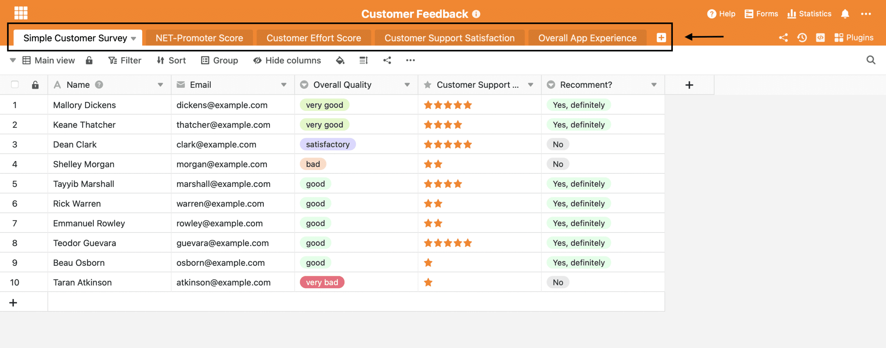
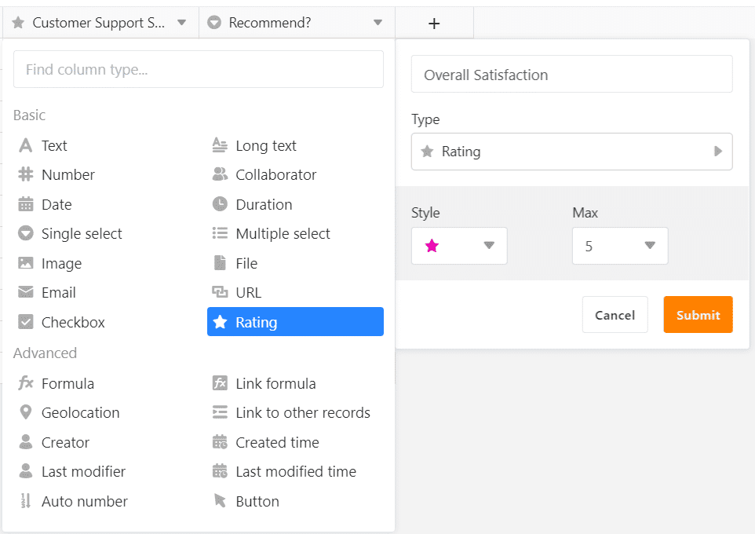
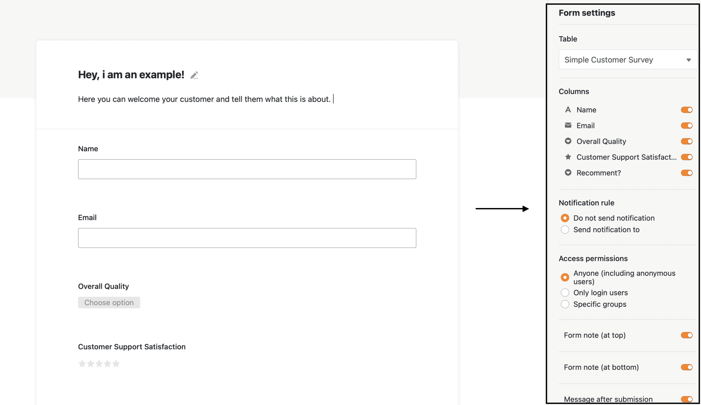

Customer feedback is the basis for important decisions for many companies. No matter whether you are a start-up, an established company or work independently, feedback from your customers helps you to [constantly improve](https://blog.ekomi.com/2019/10/24/6-schritte-zum-business-wachstum-durch-kundenfeedback/) your [product](https://blog.ekomi.com/2019/10/24/6-schritte-zum-business-wachstum-durch-kundenfeedback/). With our [online tool](https://seatable.io/en/vorlage/ku9n1tyosmmho-8trn7rdg/), you get a comprehensive solution that enables you to:

1. Create questionnaires
2. Include questionnaires on your channels via link or QR code
3. Save received feedback in your Base
4. Evaluate feedback immediately with our integrated statistics functions
5. Use our filtering and grouping rules to specifically filter out negative feedback

## Why customer feedback is so important

Customer feedback helps you to understand yourself better. It is a mirror of what you have done well and where there is still room for improvement. In addition, the needs of your customers change much faster nowadays than they did a few years ago, and recognising this early on is enormously important in order to be able to react appropriately.

All feedback is valuable here. Negative feedback helps you enormously to improve your product and may well be turned into a positive experience if [you respond correctly](https://seatable.io/en/negatives-kundenfeedback/).

Positive feedback motivates your employees and encourages them in their work. It also makes you aware of your strengths and knowing them helps you to position yourself correctly in the market.

## Permanent feedback from your customers

For this to succeed, it is very important and advisable to integrate customer feedback into your processes. Because if you wait for your customers to give you feedback of their own accord, a skewed picture will quickly emerge: It is mainly customers who have had particularly negative experiences who will give feedback of their own accord. It is rarer for customers to praise you on their own initiative. So make sure from the beginning that customer feedback is collected regularly and also define responsibilities.

In order for customers to give feedback, you have to make it as easy as possible for them. No one will fill out a four-page questionnaire that contains complicated and long questions about the product. Of course, such in-depth interviews are also important, but a quicker, not so extensive query is better suited for simple feedback.

[Click here to go directly to our customer feedback template](https://seatable.io/en/vorlage/ku9n1tyosmmho-8trn7rdg/)

## Collect customer feedback with SeaTable

We have already built a ready-made template for you, which already contains some common customer queries, but can also be extended and individualised quite easily by you. We will now explain to you step by step how our base is constructed and how you can use it:

### The different queries

Above you can see five different spreadsheets. These represent the different customer queries. We have selected the most common customer queries and prepared them. These are briefly explained in the following paragraph:

1. **Simple Customer Survey:** This simply asks about the overall quality of your products, the quality of your customer support and the likelihood of recommending your product to others: three simple questions that can be answered quickly and easily.
2. **NET-Promoter Score**: Here, the probability of recommendation is asked again, this time on a scale of 1-10. In addition, customers can justify their rating in a short sentence. You can also find your own NET-Promoter template [here](https://seatable.io/en/vorlage/wcmmq-i4qp-euwa7zh52sg/).
3. **Customer Effort Score:** This is a survey of the quality of your customer service and also allows suggestions from your customers for improvement.
4. **Customer Support Satisfaction:** This customer query is similar to the previous one, but more detailed.
5. **Overall App Experience:** Here, customer feedback refers to the experience with an app. The most popular and least popular features are asked about in detail. In addition, it is discussed in more detail why the customer uses the app.

You can create and add as many new queries as you like here. We will explain how this works in the next section.

### Create a new query

If you want to create a new customer feedback form, this is always done via a web form. The basis for creating such a web form is your base with the different columns. Each column later represents a question in your web form. Here are a few examples:

1\. you want to query the overall satisfaction by means of a star rating: create a column in your table with the column type "Rating" and name it "Overall satisfaction".

Create a rating scale

2\. you want to query the accessibility of your customer hotline using a scale from very good to very poor: create a column in your table with the column type "Single Select" and insert the values from very good to very poor for the individual single select options. Then name the column "Customer support accessibility".

3\. you want to query special concerns of your customers by means of a free text field, which can be filled in individually: Create a column with the column type "Long Text" and name it "Individual request".

Proceed in this way until you have stored all the questions you want to ask your customer later in the web form in your base. Your customer feedback will later appear automatically in the individual rows of the table.

## Creating the web form

A web form already exists for the queries that we have entered in the base. For the others, create a new one as follows:

1. Open the Forms tab in the upper right corner
2. Click on "Create new form
3. Select "Traditional Form" and name your survey
4. Now the Webformbuilder opens automatically, where you can make further individualisations
5. Alternatively, you can click the small pencil next to the form name in the Forms tab, this way you can also customize or modify already existing web form

Basically, your form is almost ready for use now, we just want to make it a bit more understandable for your customers in the next steps. For example, by giving them help on various questions, thanking them or briefly explaining what the query is about.

### Add the finishing touch to your web form

Every web form has the so-called "Form settings" on the right side. This is where you add the finishing touches to your web form.

Form settings of the web form

1. First you select the base on which the web form is based. Then all [columns](https://seatable.io/en/docs/handbuch/seatable-nutzen/feld-typen/) or questions appear automatically in your web form. Depending on the column type, there are different format options. It is best to click through and see what suits you best.
2. In the "Columns" area you can decide which columns should appear as a question and which should remain invisible to the customer
3. Next, you can set your notification options
4. You can decide who can have access to the survey
5. You can leave a message at the beginning and at the end of your web form, for example to briefly explain why the customer should fill out the form and at the very end to say thank you
6. In addition, you can set that the customer should also receive a message after submitting the form.
7. A redirection back to the homepage is sometimes useful and also optional.
8. Last but not least, a deadline for completing the form can be set.

## Make your customer feedback live

Now your web form just needs to be integrated in the right place. You can integrate our web forms practically anywhere. Here are a few suggestions:

- On your website as a button
- After shopping in your webshop
- As a CTA in your mail signature
- As QR code on small cards or other print media

### And this is how it works

1. Open the Forms tab in your Base
2. Click on the small sharing button next to the web form
3. You will now receive:

- A link you can embed anywhere
- A QR code for print media or for your website

Done! The web form is now live and ready for immediate use. All customer votes appear automatically in your base and can be easily evaluated and analysed using our statistics function.

## Grow with your customer feedback

With the knowledge you have gained, you can now create any customer query you can think of and also easily integrate it anywhere! [You can find our corresponding template from this article here.](https://seatable.io/en/vorlage/ku9n1tyosmmho-8trn7rdg/)

By the way, our web forms are not only suitable for customer enquiries; [holiday applications](https://seatable.io/en/vorlage/uc5kqmjeri6plk5xozayxw/), [working hour records](https://seatable.io/en/vorlage/dkcp4_k3rnsb4d9sskb6qw/) or [contact forms](https://seatable.io/en/vorlage/hgfag3__tz2ws_bnkaedwq/) can also be mapped wonderfully with our web form.

Take a look at our [template section](https://seatable.io/en/docs/templates/) and let yourself be inspired!
