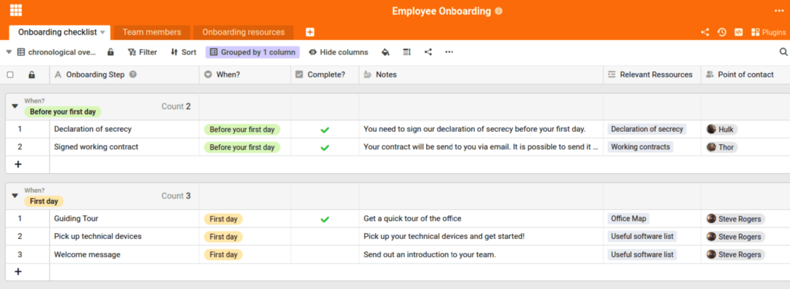

Who is the expert for which department? What is the colleague's e-mail address again? And who fits best into the team of the new [marketing project](https://seatable.io/en/vorlagen-projektplanung/)? The search for answers to these or similar questions can quickly become a time-consuming challenge. Unless your company has a well-maintained **employee directory**.

Why this is a must for any company that wants to have the best overview of its employees, what types of employee directories there are and how you can easily create a clear employee list, you will learn in this article.

## Meaningful and expedient - this is where an employee directory helps

Keeping track of all employees is not always easy. Especially when a company is very large or is growing steadily and new team members are joining all the time. If there are also interns, working students and guest students, the chaos is quickly perfect. Responsibilities become blurred, the wrong person is assigned to the wrong topic, affiliations are not correctly defined. The situation is similar for smaller companies that simply do not have their own [software for personnel management](https://seatable.io/en/projekt-management-tool/).

As a central database for [personnel planning](https://seatable.io/en/personalplanung-excel-vorlage-kostenlos/), the employee directory helps you maximize the efficiency of your personnel management and optimally organize all tasks related to recruiting and employee organization.

### 1\. better personnel management:

For companies without a central employee database, it is particularly important to create an employee directory. This helps enormously with personnel management, because a detailed employee list enables [HR](https://seatable.io/en/personalwesen/) to see at any time which employees work where. What their contractual relationship is. Or what their address data is.

Employee directory © SeaTable

### 2\. faster coordination channels:

An employee list increases the clarity. This way, you always have all relevant contact data quickly and easily at hand.

### 3\. more team spirit:

The individual teams and departments can also benefit from an employee directory because it gives them the chance to get to know each other better. This reduces inhibitions when making contact and promotes flat hierarchies.

### 4\. relaxed working atmosphere:

An employee directory also helps important instances such as managing directors or department heads. For example, they can more quickly match the face of new employees to their name or learn more about their teams. This is a big plus for the company culture.

### 5\. better service:

Using an employee directory for externals helps customers find the right contact person faster. This increases customer satisfaction.

## These are the types of employee directories

A structured employee directory basically works like a digital personnel file and can replace a company organization chart. At the same time, it helps teams structure themselves well internally and distribute responsibilities perfectly. In addition, it can be a very helpful support for external users when it comes to quickly finding the right contact person. The following overview shows you which types of employee directories are the right choice and when:

### Internal employee directory

An employee list for internal use is the perfect way to give everyone who works in a company a comprehensive overview of all personnel within the company. Here they can find all supervisors and colleagues, including their responsibilities and contact details. Very detailed lists can also include further information such as additional competencies or personal interests.

### Internal overview for managers and HR department

For CEOs and department or team managers, too, an employee directory bundles a lot of valuable information in just one place. This is because not only general information such as responsibilities or contact details can be entered here, but also more sensitive data such as information on salary, promotions, appraisals or similar.

Employee directory © Deemerwha studio / adobe stock

### Employee directory for externals

Companies that have a lot of customer contact or government agencies that generally have a lot of "people traffic" can benefit greatly from an external employee list. Here, with just a few clicks, they can find the right contact person for their respective concern.

## How to create the perfect employee list with SeaTable

You don't use an employee directory yet and are concerned that it will cost you too much time to create such a digital personnel file for each employee? Then you're right - but that's not an argument against an employee list. Because there is a solution.

With a little research, it quickly becomes apparent that you don't necessarily have to build your employee directory from scratch. There are already a number of [online tools](https://seatable.io/en/projekt-management-tool/) that offer you a [template for](https://seatable.io/en/vorlage/ijapmslssfu7r-6q6x9boq/) your [employee list](https://seatable.io/en/vorlage/ijapmslssfu7r-6q6x9boq/). Practical templates help you to easily insert all employees, interns, CEOs, etc. into the template. The template also tells you where you can enter affiliation, positions, information about the persons and many other data.

The user-friendly interface and a clear design guide you through the process of entering all data in a relaxed manner - until your employee directory is perfectly filled. In addition to names, contact data, department, position and work status (i.e. employed, on probation, terminated, etc.), you can also store more personal data here, such as birthdays or photos of the relevant employees.

## Everything at a glance, everything in one employee directory

Every company should always have an [overview of its employees](https://seatable.io/en/urlaubs-planer/) - regardless of its size. After all, the people who work in a company are its most important resource. This makes it all the more crucial not only to offer them a pleasant working atmosphere, but also to make all HR processes as uncomplicated as possible.

An employee directory makes exactly that possible by helping you to store all personnel data clearly in just one place. This way, everyone can always find exactly the data they need at any given time - and it's always up to date.

Image source Cover image: © Who is Danny/Adobe Stock
