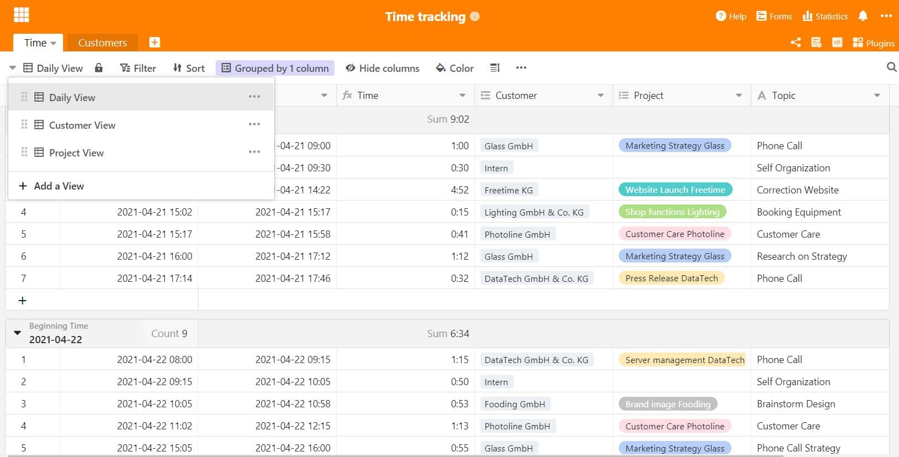

Many service providers know and dread it: project time tracking. Time tracking is unpopular and, in most cases, is not carried out as meticulously as it perhaps should be. Yet the motto here is "time is money"! Designers, architects and agencies know this problem and sometimes find it difficult to find a remedy.

## Problems with project time recording

You might know it, the working day is over and you haven't recorded a single project time. Then you estimate again - pi by thumb, per project and client. Often, however, this only happens days later, which greatly distorts the time actually needed. As a result, valuable time is lost, and with it money that the company would actually earn.

There are certain activities that are very often not included in project time recording at all. This is what a [study from the USA](https://www.accelo.com/assets/Uploads/Time-is-Money-White-Paper-Accelo.pdf) found out. According to this, the following points are very time-intensive, but are usually not even calculated at the customer:

**1) Emails**  
The study found that emails are tracked little to not at all. Yet an employee spends about 2.5 hours a day reading and responding to customer-related emails. This means that at an hourly rate of €100, about €35,000 is lost annually.

**2) Meetings**  
Project time recording is much more consistent for meetings than for e-mails. Here it is advantageous that meetings are often noted in one's own diary and thus one can estimate the time afterwards. However, there are still about 20% who do not record this time and a sum of about 21,000€ could be lost here.

**3) Idea generation**  
Just thinking about it and making mental efforts actually count as time spent actively working for a client. However, this is often disregarded, even though brainstorming and idea generation can also account for a proportion of time in creative projects. Therefore, it is important to track such time as well; even if it sometimes takes a little longer to come up with the sparkling idea.

Estimating time after the fact is not accurate and highly inaccurate. Try to remember which projects you worked on and for how long 6 days ago. You will notice that it is extremely difficult to roughly reflect the times alone.

### But why exactly is project time recording so unpopular?

Most people find time tracking very annoying, because it often interrupts the workflow. Switching back and forth between different tasks also makes time tracking difficult, because here the time would have to be stopped and then resumed for every email that is answered in between or for every enquiry from a colleague. This is cumbersome - and costs additional time.

That is why many do not record their time at all, but only estimate it at the end of the day. Times that can no longer be clearly allocated are then also often booked as "internal", although they could actually be assigned to a client. Time recording is an important source of money for service providers and should always be done despite low motivation.

## Why project time recording is so important - even if it is annoying

Because it's about money. Of course, project time recording is sometimes a hindrance, inhibits the creative work process and is far too rarely done as it should be. But every minute worked for a client can and should be accounted for, because that is the time that each employee utilises for the project and the client. As a service provider, the dependency on the client is enormous - and would you give someone a service cheaper even though you worked hard for it? You do if the time recording is incomplete and not complete. Cash can be lost due to inadequate time recording (as mentioned above: up to 35,000€, and that per employee!). Therefore, you should once again urge your employees to track their times conscientiously and continuously.

## What are the options for time tracking?

**Option 1: Manually**  
The classic way is, of course, to record time by hand. A notebook or organiser is best suited for this, in which everything is recorded in a very structured way - time, client, project. This can seem a bit cumbersome due to the change from screen to paper, but see it as a welcome change to use pen and paper again. One drawback: the time has to be calculated manually.

**Option 2: Special tracking software**  
For agencies, there are comprehensive agency software solutions in which time can also be tracked. Often, a kind of stopwatch runs in the background, which is stopped and restarted with every change of activity.

**Option 3: Time recording with Excel and Co.**  
Probably the most widespread method could be time recording with spreadsheet software. With a good spreadsheet software, calculating the project working time is no longer a big effort. The project, client, working time and field of activity are entered in various columns.

This is also where SeaTable comes in and, as a very functional software, offers valuable functions in addition to the recording of working hours, which enable the evaluation beyond that. How to record the total daily working time of your employees with a SeaTable form is explained in [this article](https://seatable.io/en/stundenerfassung-mit-seatable/).

## Project time recording with SeaTable

With SeaTable, recording your project times becomes the easiest task of the day. Because with our template for time recording, you not only always have the correct working time at a glance, but you can also assign it directly to customers, note down activities and display the times per customer or project. This provides clarity about your work and projects.

### Become more efficient in project time tracking

Project time tracking is not only useful for creating a correct invoice at the end of the month. Continuous project time recording also provides information about how long you work on which projects and what particularly takes up a lot of time. Is it, for example, a customer that always requires long phone calls? Or do projects pass through too many hands, consuming a lot of time in terms of coordination? Use the project view to identify what comes easily to you and which tasks take a lot of time. This way you can work on specific points and make your everyday work more efficient.

### Simply bill project times at the end of the month

The different views in SeaTable have the advantage of directly creating several views within one table and always having them at hand. With the customer view, you can see directly at a glance how much time was needed for a customer in the month. This time can then be easily accounted for with the corresponding project details. No more cumbersome collecting and adding up of times - SeaTable does it all fully automatically and thus makes your everyday work easier.

Project time recording does not only provide information about the daily work routine for your own employees. Time recording can also help to estimate the time needed for certain tasks when preparing offers for customers. For example, you observe over several months that planning and implementing [marketing]() strategies takes significantly longer than you had previously assumed. You can include this in your offer planning for the future and make customers a transparent offer based on experience that can be realistically planned for both sides.

Start with our SeaTable [template for project time recording](https://seatable.io/en/vorlage/ek3ry6ywsjoz-imsenb49g/) and structure your project times in just a few steps. This way you won't miss anything anymore and your workflows can constantly improve!
