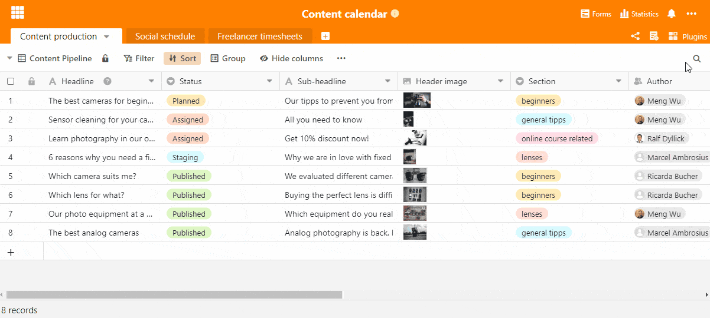
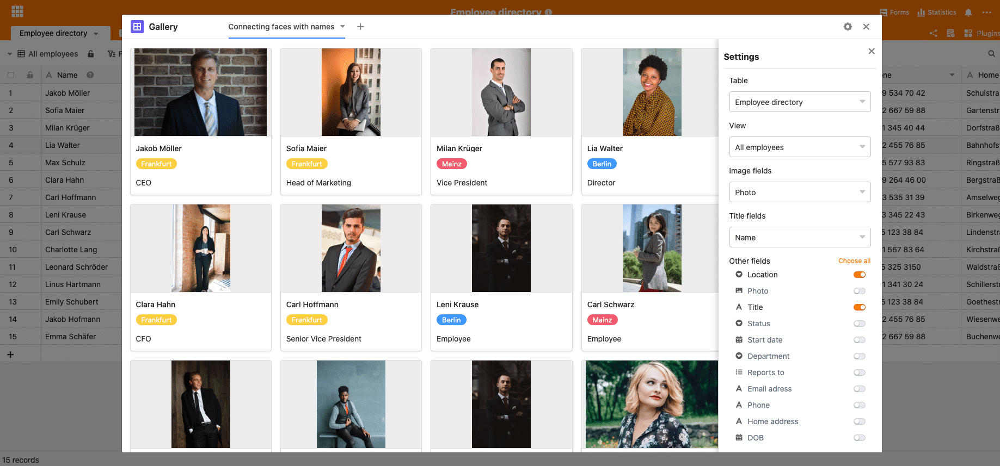
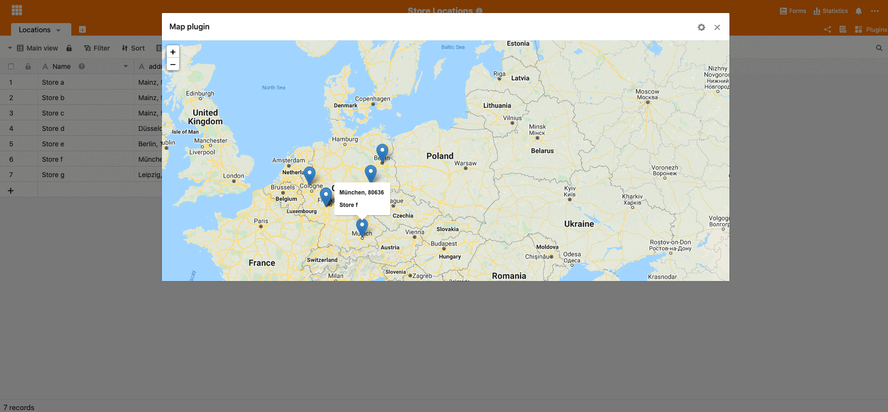

## Get to know the plugins of SeaTable

SeaTable is constantly working on new plugins that will bring even more functionality to your tables. You can combine different plugins to create the perfect workflow for you and your team. All of SeaTable's plugins are included in the free standard version and are installed and ready to use within seconds. In this post, let's take a closer look at SeaTable's different plugins so you can [get started right away](https://seatable.io/en/registrierung/).

### How do I install a plugin in SeaTable?

The installation of the plugins is very simple. Click on "Plugins" in the upper right corner and then on "Add plugins". A window opens with all available plugins. Simply select the desired plugin and click on "add". The plugin will be installed in a few seconds and ready to use. If you want to add the plugin to the top of your toolbar, click again under Plugins on the three small dots and then on "add to toolbar". Your new plugin will appear at the top of the toolbar.

Install plugins

### What plugins does SeaTable offer?

**Calendar**  
Do you have a date column in your table? Then the calendar plugin can give you a good overview of upcoming dates. In our example, you can see a [table for the hiring process](https://seatable.io/en/vorlage/bdwyaoius76f-0vsreupaa/) in a company. Thanks to the calendar plugin, your HR employees can clearly see when the job interviews will take place. You can also set a start and end date for appointments lasting several days to display the time span as a bar in your calendar. Clicking on the appointment will open additional information noted in your spreadsheet. Your team and you have the possibility to add comments to an appointment and then mark it as "solved" or delete it again. Just try it out!

**Gallery**  
The gallery plugin is designed to show you file attachments like images clearly. In our example you see an employee directory, in which each employee is deposited with a photo. The gallery allows you to clearly display all employees with associated picture. Especially for new employees such a view is helpful. This way, you can immediately link names with faces and feel that you belong to the company and your team more quickly. Would you like to have additional information about the corresponding picture displayed immediately? The settings page opens under the small settings wheel at the top right. Here you can easily show and hide fields. In our example, the location and position of the employee was selected and now appears directly below the corresponding image.

  
**Timeline**  
Our timeline plugin allows you to visualize your records on a timeline. You can easily navigate through your record using the mouse and zoom. To create a timeline, install the plugin as shown above and set the appropriate table in the settings that contains the data you want to visualize. Then select the field that contains the data for the start date. If there is an end date, you can also set it in the settings. Different colors allow you to create an even more structured visualization. Also in this plugin you have the possibility to create different views tailored to different needs. To do this, simply click on the small plus next to the current view.

**Map**  
Our map plugin facilitates the location visualization of your data. In our example you can see the locations of several branches visualized on a map. With instant geocoding, the address data you entered were displayed as points on an interactive map. If you move the mouse over the different points, additional information will be displayed.

### More than a table

SeaTable is more than a simple table. With additional plugins you can design your workflow and prepare your data in a useful way. We are constantly working on new plugins so you can work even more efficiently in the future. You can install as many plugins as you like. All plugins are included in our free subscription. [Sign up now and get started!](https://seatable.io/en/registrierung/)
