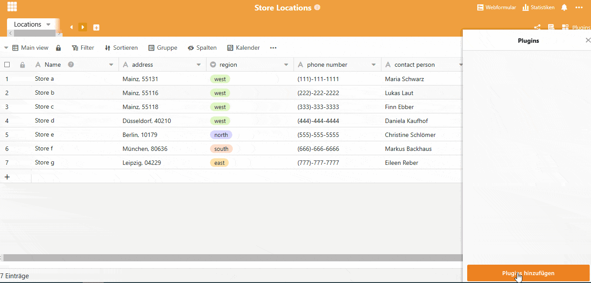
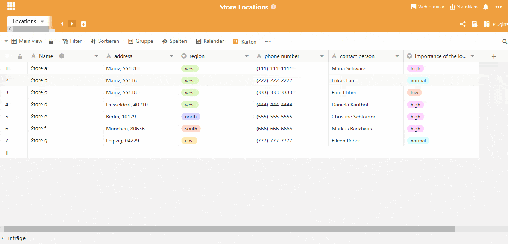
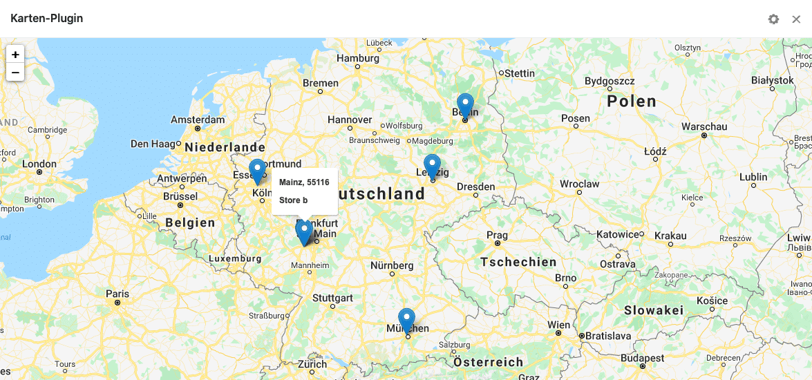

## The map plugin from SeaTable

With SeaTable's map plugin, location visualization is easy. Be it the [locations of your stores](https://seatable.io/en/vorlage/d6nlvef8ram9wwbkjhziwa/), the address data of your customers or the residences of your employees. With instant geocoding, our map plugin processes existing location data into points on an interactive map. Let's take a look at the installation and setup of the map plugin using the [Store Location Template](https://seatable.io/en/vorlage/d6nlvef8ram9wwbkjhziwa/). In this template you have the possibility to clearly summarize your different stores with address data, region, phone number and contact person. The map plugin could now help you make strategic location decisions, for example.

## How do I install the SeaTable map plugin?

Plugins extend the functionality of your tables or your data. If you have a column with address data in your table, like here the column with the addresses of your stores, you can display the data records on a map. The entered address is automatically recognized here and does not require any special format. The map plugin is very easy to install. As shown below, click on the Plugins field on the right and then on Add Plugins. Click Add under the map plugin. The plugin will be installed in a few seconds and will be fully available to you immediately. Click on the three small dots to add the map plugin to your toolbar for even faster access.

Install maps plugin

## The map plugin is set up in a few steps

With a click on "Maps" in your toolbar, the plugin can be set up. You can select the appropriate table from which the geodata should be pulled. Also the column where your location data is entered is to be selected here under address field.

SeaTable uses your position data for the map plugin. If they are not yet activated, a prompt to activate them will normally appear.

Set maps plugin

## Using the map plug-in

After setting up the map plugin, you can now use it as you wish. You can zoom and hover over each location to see even more information.

## More plugins from SeaTable

Besides the map plugin for your location visualization, there are also other plugins from SeaTable available. The Timeline plugin shows you temporal data to help visualize projects. The Gallery plugin shows you images or other documents in a large map form to highlight them. With the calendar plugin you have all your appointments in view. With the [SeaTable plugins](https://seatable.io/en/seatable-plugins/) you can make your workflow even more efficient. [Get started now!](https://seatable.io/en/registrierung/)
