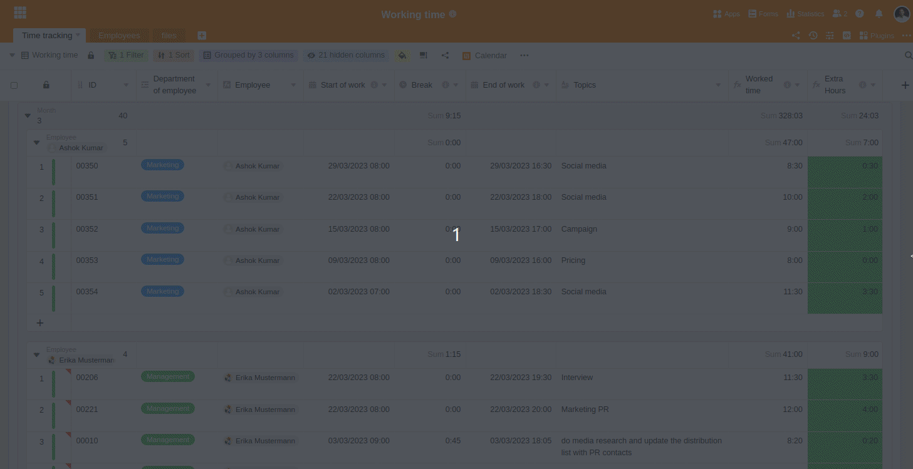

The electronic recording of working hours is not yet mandatory, but [if the Federal Ministry of Labor has its way](https://www.tagesschau.de/wirtschaft/unternehmen/arbeitszeit-erfassung-heil-101.html), it should come soon. A simple [template for recording working hours](https://seatable.io/en/arbeitszeiterfassung/) provides you with a remedy here. With SeaTable you have a form for recording hours for your employees and at the same time a clear table at hand in which you can see all hours worked.

## Is recording of hours compulsory in Germany?

Yes, employers in Germany are already required to record overtime and Sunday work under the current Working Hours Act. In addition, the European Court of Justice ruled in May 2019 that companies in the EU must record all of their employees' working hours. The Federal Labor Court confirmed this in its ruling of September 13, 2022. The question of **whether** employers must record working hours has therefore been decided.

The Federal Ministry of Labor wants to answer the question of **how** hours must be recorded in the future in a draft law before the end of 2023. Currently, the recording of hours is **not** bound to a specific form and can take place both electronically and in writing on paper. This is set to change in the future if the Federal Ministry of Labor has its way: the start, end and duration of daily working hours must then be recorded **electronically** and, as a rule, on the **same day**.

For you as an employer, however, it is not advisable to wait until electronic hours recording is required by law. Rather, start recording your employees' working hours digitally right away, if you don't do it already. SeaTable's [free timesheet template](https://seatable.io/en/vorlage/fyp0x2y-s-ut3m-wcbpzbq/) provides a suitable system for tracking hours in your company and is ready to use right away after [free registration](https://seatable.io/en/registrierung/).

## Structure of the SeaTable template

### Overview for you and your managers

The main view of your working time table is grouped by individual employees. This way you can quickly see how many hours your individual employees have worked in each case.

Admin view of the working time table in SeaTable

### For your employees: Web form for recording hours

Each employee enters the hours themselves via a web form. For each day, the start and end of the working time, the length of the break and, optionally, which topics were worked on must be entered here. Help texts with concrete instructions guide your employees safely through the completion process.

The entered hours are then displayed in your overview. A submitted web form corresponds to a row in your table or the daily working time of an employee.

## Prepare today already

With our template for hours recording you are prepared for everything - be it legal changes or future controls by the authorities. In any case, it makes sense to start recording your employees' working hours accurately today. With our template, you have all hours in view at all times and can prove compliance with legal working time regulations.

You are missing something? No problem! You can easily tailor SeaTable to your individual needs. Just try it out! Our [templates](https://seatable.io/en/vorlagen/) are free and usable immediately after [registration](https://seatable.io/en/registrierung/).
