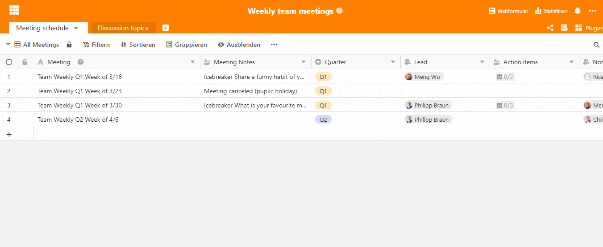

## Organise your weekly team meetings with SeaTable

In times of home office, there is more demand than ever to be digitally well-positioned. Even without Covid-19, many teams are increasingly adapting to working outside the office. So now you face the challenge of effectively supporting your teams' remote collaboration and adapting to rapidly changing market conditions. SeaTable offers you a good basis for organising your weekly team meetings with this template.

### A central place for the notes from your team meeting

Weekly team meetings existed before Covid-19, but the transition to working from home raises [some advantages](https://www.gruender.de/homeoffice-vorteile-nachteile/) as well as some new challenges that you as a team leader need to be aware of. Having a central place to take notes of their meetings that is easily accessible to everyone becomes essential. [Our weekly team meeting template](https://seatable.io/en/vorlage/gumqbevcroszpprj6j4xyg/) provides you with a flexible solution where your team can write, store and view all their meeting notes and agendas.

### Structure of our team meeting template

The Meeting schedule table holds all your meeting notes. There are staff fields for the meeting leader and the minute taker. Long text fields allow you to make detailed notes about each meeting. The linked record field, which is linked to the Discussion Topics table, refers to a form where employees can easily submit discussion topics from home.

### Submit discussion topics for upcoming team meetings

The second table is the basis for a web form with which discussion topics can be submitted by the individual employees. This way you can structure your meeting in advance and prepare for your team's concerns.  
**Creating the web form**  
To create the webform, simply click on "Webform" and "Create Webform" in the upper right corner. Select the "Discussion Topics" table as the base and hide all columns irrelevant to the form on the right. You can add help texts to fill in the form and use the "Required" slider to make the field to be filled in a mandatory field.  
**Accessing the web form**  
To access the form, your employees can either click Web Form in the top right corner and "Submit Topics for Discussion", or share the link or QR code that will be given to you after creating the form by clicking "Share".

### Remote working? SeaTable helps you and your team!

New situations require new approaches and ways of thinking. SeaTable enables you to rethink and adapt to the new situation. [Each of our templates](https://seatable.io/en/vorlagen/) is adaptable and customisable. Does your team work differently than shown in our example? Simply add new columns and tables and find the most effective solution for your team.
