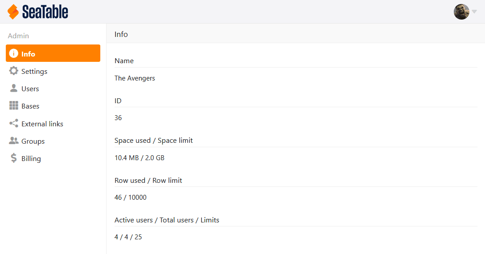
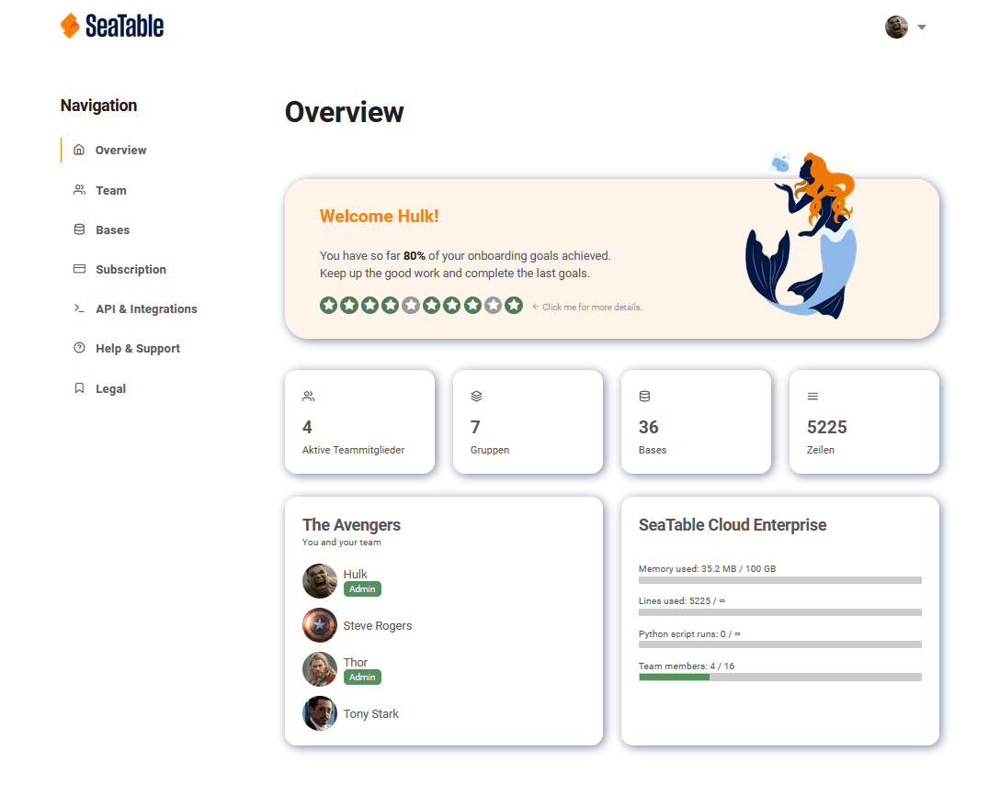
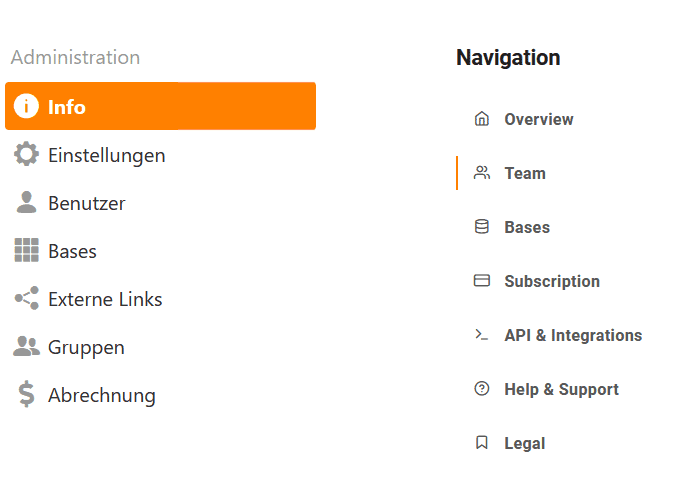
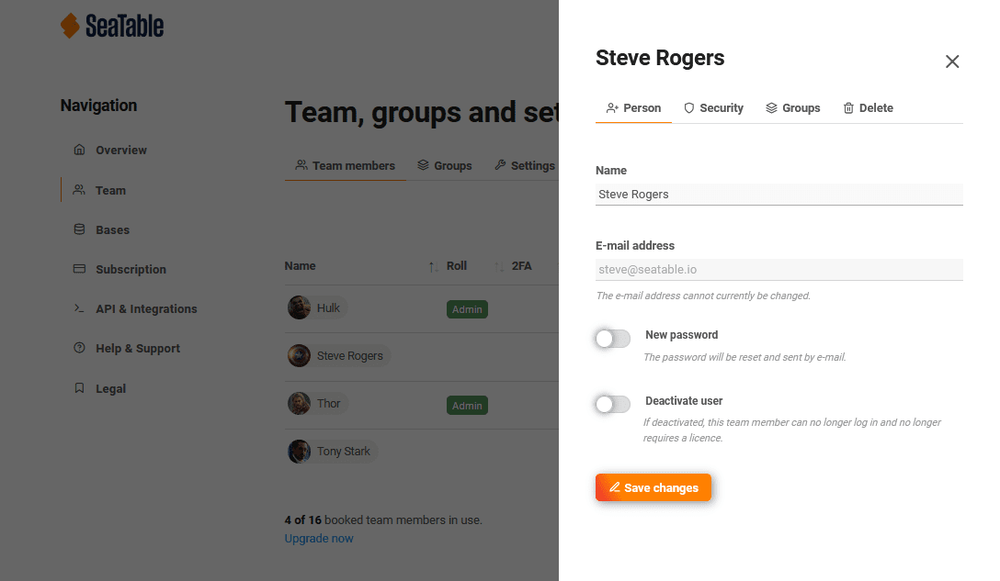
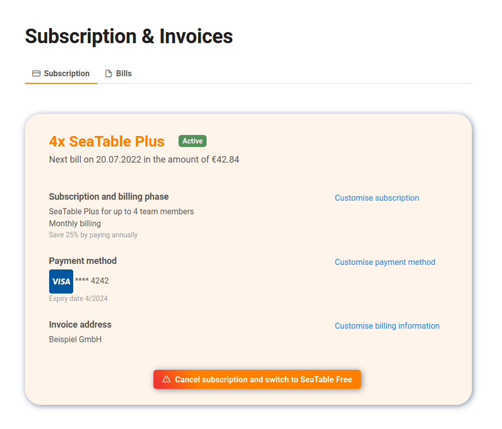
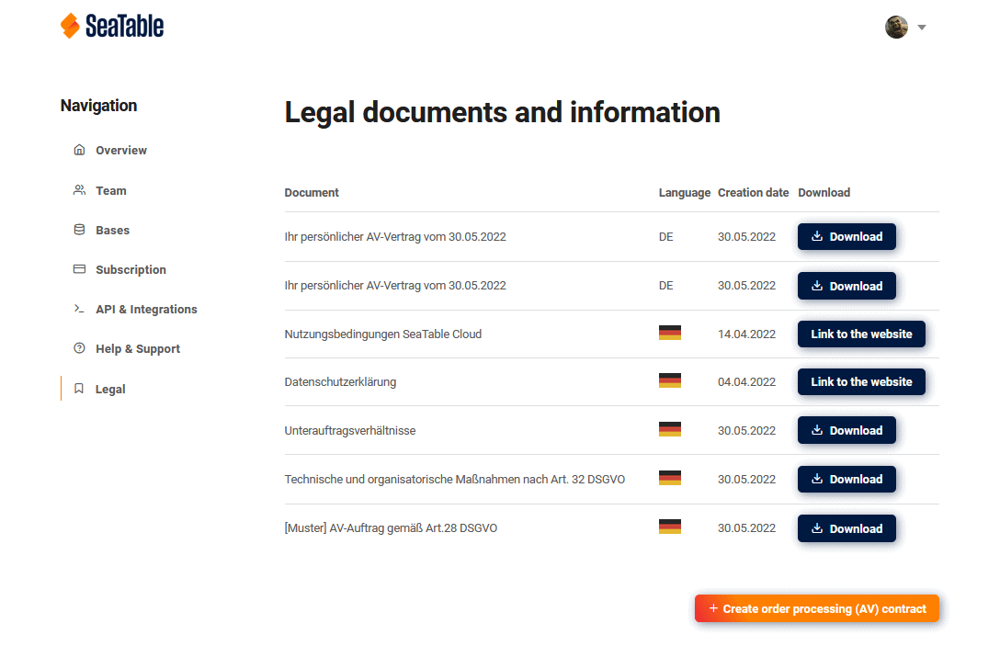

With the upgrade of SeaTable Cloud to version 3.0, Cloud subscribers benefit not only from the many new and improved functions of the [major release](, but also from a new team management that simplifies the management of small and especially larger teams. New functions have been added, existing functions have been expanded and a new design creates more clarity and user-friendliness. We are pleased to present the new team management and the most important changes in this article.

## Initial situation and challenges

The "old" team management of SeaTable Cloud is a module of [SeaTable Server](. (SeaTable Server is the software behind SeaTable Cloud, which is also available for installation on your own server). As such, it provides all the necessary management functions for teams to use within an organization (private cloud). However, it does not offer subscription management features or integration with a payment service provider.

These functions, which are necessary for the operation of a solution with a general user group (public cloud), were individually supplemented for SeaTable Cloud. In terms of user experience, team management fell short of usual standards despite the comparatively high technical complexity. Expanding a team, for example, first required adding one or more users to the subscription before additional users could then be registered in another menu. Numerous support requests including the associated frustration due to this unusual procedure were the result.

Due to the separation of user and subscription administration as well as billing, there were also high hurdles for the implementation of extended administrative functions. For example, numerous team admins asked to merge two existing teams. The same applies to extended payment methods. Payment by invoice could only be implemented on the basis of an individual request and with a disproportionate amount of manual effort on the customer and provider side.

These issues were addressed in the redevelopment of the team management. With friends we can say: they have been solved! And this is what it looks like, the new team administration:

## Use and functions

Open the team administration as before: Use the menu item _Team administration_ behind the user avatar to open the new tab.

But that's where the similarities end. This is most obvious in the design: while the design of the old team management was based on the design of the SeaTable app, the new team management follows the design of the website. The comparison of the menu structure of the old and new team management also shows that the user guidance has been rethought and functions have been added.

### Overview

The _overview_ is the start page of the team administration. It offers important status information about the team and the use of limits at a glance. Important extraordinary status information such as an upcoming change of subscription or an invalid credit card is also displayed.

### Team

The new _Team_ menu allows the administration of team members and groups. Team-wide user settings can also be made. These include, for example, mandatory authentication with a 2nd factor or the use of invitation links. The _Team_ menu thus consolidates functions that were distributed across the menu items _Users_, _Groups_ and _Settings_ in the old team administration.

For each team member and group, extended information can be displayed and changes can be made. For team members, the name and group membership can be changed. The password can also be reset and the use of 2-factor authentication can be made mandatory. Of course, a user can also be deleted or deactivated. In the extended information of groups, the bases of a group can be displayed and the group members and their roles can be managed.

### Bases

The _Bases_ menu summarizes all information about the bases managed by the team and the existing access options. The latter include team-internal shares, external links as well as invitation links. As in the Team section, extended information and settings can be displayed by clicking on them. For example, for individual bases, the extended information can display all users who have access to the base, as well as their permission levels and the origin of the access permission (e.g. ownership of the base, group membership, sharing).

### Subscription

The administration of your subscription - and this includes the cancellation of your subscription - is done in the menu of the same name. By clicking on the menu item you can see your current subscription incl. type of subscription, number of subscribed users, payment frequency and payment method as well as billing address and recipient. You can adjust all this information yourself.

In the new account area we can now also offer payment on account for upgrades from Free to Enterprise. Simply select invoice as the payment method when upgrading. (Prerequisites for invoice payment are annual payment and at least 10 users).

In the tab \_Bills \_all your team's invoices and their payment status are listed. You can also download an invoice. To do so, click on the invoice number in the last column.\_\_

### API & Integration

As a team administrator, the API & Integration menu item is important to control the integration of SeaTable with third-party applications. Existing base tokens to which you have access as a team administrator are displayed here. The base tokens can be edited with one click.

### Help & Support

Teams with a Plus or Enterprise subscription that receive individual email support from our support team can submit support requests in the _Help & Support_ area and track the status of all requests from the entire team here. This function was not available in the old team administration.

In order to submit a support request, it is necessary to log in to the ticket system of SeaTable. The access data for this is displayed here. The password for the login is generated dynamically each time the page is called up. You can create a new ticket after logging into the ticket system by clicking on the plus sign at the bottom left.

Under the access data for the ticket system, all support requests are listed chronologically in a table. A click on the title of an existing ticket opens the ticket in the ticket system. If you are not yet logged in, you must first log in with the access data.

### Legal

The menu item _Legal_ is the central point of contact for essential documents that regulate the use of SeaTable Cloud and the contractual relationship between you as a customer and SeaTable GmbH as the operator of SeaTable Cloud.

Here you can also create your personal AV contract based on our AV model contract. Click on _Create Data Processing Contract_ and then specify the type of data stored in SeaTable and the group of data subjects. If you agree to the contract, then your personal AV contract will be created in PDF form and saved as a new document here. (AV contracts can currently only be created in German).

## Faster to the destination

We are confident that SeaTable's new team management will bring a big productivity boost: New functions allow for extended self-administration, better overviews answer questions faster and the payment processing is also more flexible and versatile. Of course, the team administration is available in the languages of our website.

We welcome feedback on the new team management - also via the ticket function integrated in the _Help & Support_ area.
