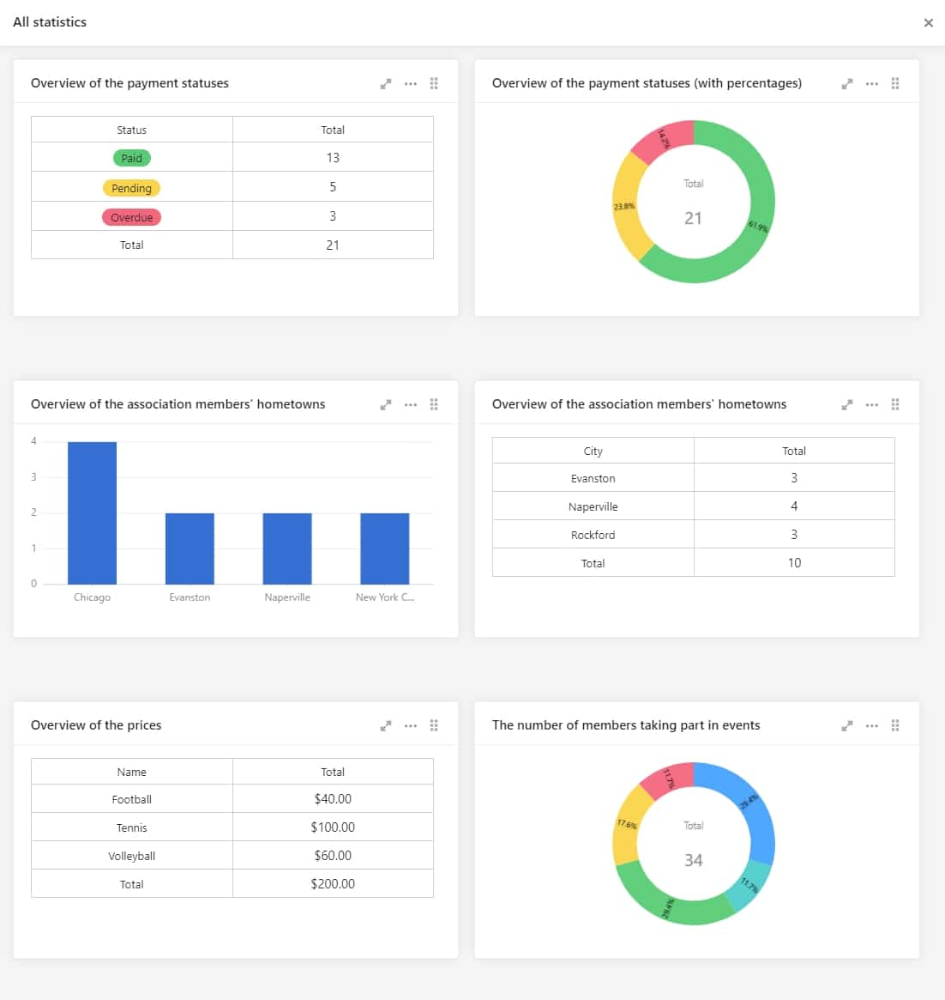

Association management solutions are a dime a dozen. All the software solutions we tested promise to be fast, simple and intuitive. But we believe that all these solutions lack a key feature. The flexibility to adapt to the challenges and individual situation of each club. Association management software such as [ClubDesk](https://www.clubdesk.de/), [easyVerein](https://easyverein.com/), [SEWOBE](https://www.sewobe.de/) or [MTH](https://www.mth-software.de/), for example, specify exactly how processes and procedures must look. Input masks and texts are inflexible and can only be adapted in the rarest of cases.

So it's high time you took a look at SeaTable and the possibilities of our template for association management. Although many processes and procedures are already predefined in this template, they can be individually adapted to your needs. Manage your association comfortably via browser and define exactly which person from your team has access to which content. You will be amazed at how easy it is.

In this article we will show you what makes an efficient association administration and how you can optimise the processes in your association with the help of SeaTable. You will learn ways to reduce the workload for recurring routine tasks so that you get all tasks done quickly and efficiently. SeaTable offers you and your team many ways to do this.

## The whole club administration in one place

A software for association management fulfills multiple tasks. It should ...

- ... bundle all your association's data in one place.
- ... provide quick access to all data.
- ... provide efficient data entry and collection.
- ... support or even automate internal workflows and processes.
- ... available everywhere and at any time.
- ... react flexibly to new requirements.
- ... and meet the requirements of German data protection guidelines.

The first point in particular is often underestimated. Normally, small and large associations do not differ in the need for data collection. For large associations, it is additionally a matter of the complexity of the quantity, but the information to be recorded is mostly the same: Members have to be recorded and managed, your association offer has to be maintained as well as invoices have to be issued and incoming payments have to be recorded.

A good software can hold all this information and thus becomes the central tool for all information about your association. Data entry and processing should be as time-saving and efficient as possible. To this end, all work processes must run as smoothly as possible, from the entry of new members into the system to invoice management. Ideally, the software should always provide you with an exact overview of all your data and be available to you and your team anytime and anywhere. Maybe you are a dog sports club and want to record the dog breeds of your members? No solution we tested offered the Possibility to member mask to add a dog breed. With SeaTable, this flexibility is included out ofthe box. With SeaTable you can really manage all information centrally and conveniently.

## Complete processes and routine tasks more quickly

In addition to data entry, regular routine work is another major challenge. Members have to receive their bills on time. Incoming payments have to be checked. Tax certificates have to be created and sent as a form letter. Where possible, administration software should support or even automate these work steps. Be reminded by email of upcoming contract renewals or create your website with content from SeaTable. SeaTable offers a variety of possibilities to map such automations. Not all of them are included in the following template, but there are no limits to creativity.

[Click here to go directly to the template for your association administration](https://seatable.io/en/vorlage/shatbqkjsny6tmytw-wefa/)

## Optimise club management with SeaTable

To help you manage your association administration in the best possible way, our template is available to you. The template contains six tables that support you in the essential administrative tasks of an association. Of course, you can adapt the prefabricated tables according to your wishes or add further ones.

Our template for your association administration

The "Members" and "Staff" tables are used to manage the club members and everyone involved in the organization of your club. Here you can keep track of their personal data, activities in the club and invoices. With the help of our [web form](https://seatable.io/en/docs/handbuch/datenmanagement/webformulare/?lang=auto) "New member" you can register new members in your club. The data entered in the form is automatically added to the appropriate place in your SeaTable table, so there is no need to enter it manually.

How to register new members easily via web form

The map plug-in visualises the places of residence of your association members on a world map. With a "mouseover effect" on the pin, you receive further information on the respective member. You could also use the plug-in, for example, to graphically display the locations of your club's sponsors.

Map display of your members in SeaTable

An overview of all activities of the members and employees of your association are divided into three different tables. The "Courses" table helps you organize the courses your association offers, the "Organization" table is used to coordinate all organizational projects in the team and the "Events" table helps plan all other events, such as the upcoming Christmas party or day trips.

Organization" representation in SeaTable

The calendar plug-in offers you the possibility of always having your events, courses or other important events in view. With explicit colour assignments, you can make full use of an optimal calendar display. This way, you are sure not to miss a single club event.

With the SeaTable calendar you always have your courses at a glance

The "Payments" table contains all your issued invoices. There you can always see to which club member a certain invoice belongs, which invoices are still open, as well as other details relevant for you. By the way, if an invoice should have the status "Overdue", the admin is directly informed about the status via notification rule. So that you can always keep an eye on everything.

Always keep an overview of the invoice status

For optimal invoicing, the Page Design plug-in is at your disposal. With a single click, you can automatically generate an invoice for each club member and their bookings from the already created invoice template. This saves you a lot of time and, above all, nerves in club administration. Of course, you can customize this invoice template according to your ideas and wishes. Afterwards you have the possibility to send your invoices directly to your members in the form of a PDF file or to save them in SeaTable, so that you can reduce your paper and printing costs to a minimum.

Automatically generate invoices to your members in SeaTable

The Kanban plug-in displays any data - in our example, the events, organisational projects and invoices - in compact, grouped tiles that you can easily share with your colleagues like a small notepad. Each of your employees always has the status of the invoices, organisations and events at a glance through the Kanban view and can thus react more flexibly and quickly to any problems.

Your Kanban view in SeaTable

Under the [statistics](https://seatable.io/en/docs/handbuch/schnelleinstieg/datenanalyse/?lang=auto) you will find six different displays, which should always help you to get an optimal overview of all your data, so that you can also come to a quick decision and do not lose any time. Among other things, you will find the invoice status, the distribution of your members by locality or city and the percentage of participation in the courses you offer.

Important statistics in SeaTable for optimal club management

Further statistics can easily be added to map your very individual evaluations.

## Simply register and try out club management

As you can see, SeaTable offers you the possibility to optimally manage your association in a very intuitive way. It doesn't always have to end up with complex association software that can quickly make you lose track of things or almost overwhelm you with additional functions. With the predefined template of SeaTable, you have more time to take care of the entire life of your association, you can efficiently map your association processes and always have all relevant information at a glance.

With our free cloud offer, you can get started right away in just a few minutes. Simply [register](https://seatable.io/en/registrierung/?lang=auto) and then import the "Association Management" template from the "Everyday Life" area into SeaTable. You can get started right away.

[To the template for your association administration](https://seatable.io/en/vorlage/shatbqkjsny6tmytw-wefa/)
