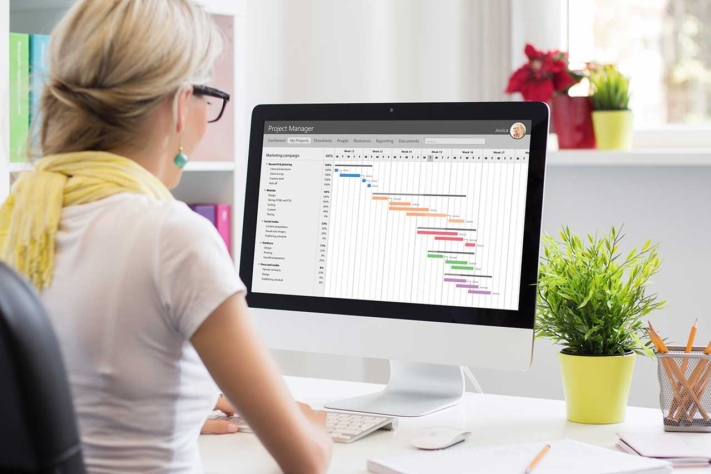
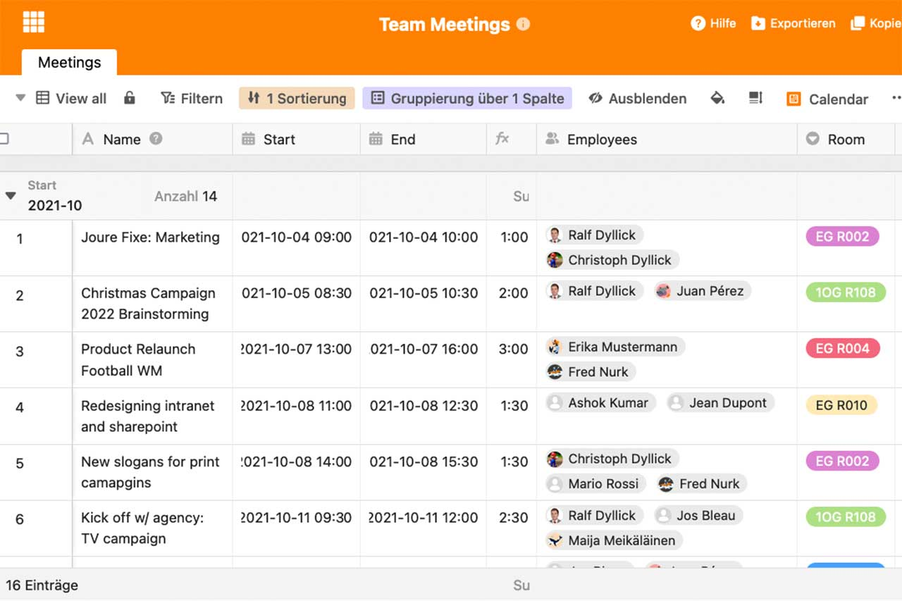

**Project planning****templates** make it possible to start planning and implementing a project immediately. Gantt charts, Kanban boards or smart lists are used to manage project activities, deadlines, budgets and more. Below you will find various templates including sample data for creating your project plan.

## What is a project plan?

A project plan contains all the overviews and documents you need to start your project. These can be, for example, the [project structure plan](https://seatable.io/en/projektstrukturplan-vorlage/), a schedule, a cost plan and a resource plan. Documents on the [quality and risk management of](https://seatable.io/en/swot-analyse-template/) the project are also conceivable.

The project plan is a central place where you can track every step of the project. It enables easier communication between stakeholders and sets out the timing, scope and [costs of the project](https://seatable.io/en/budgetplanung-vorlage/).

The representation can take place in lists. In addition, the Gantt chart or a Kanban board are often used. A Gantt chart is a method from [project management](https://seatable.io/en/projektmanagement/) to depict tasks and events in horizontal bars with start and end dates. The Kanban board, on the other hand, is about working through tasks as to-do cards in interactive lists. The following are examples of templates for a project plan for both.

Templates Project planning © Kaspars Grinvalds / adobe stock

## When does it make sense to use it in project planning?

The use of a project plan is useful for every project, as it simplifies communication, ensures transparency and keeps all project participants on the same level. At the same time, [time management](https://seatable.io/en/arbeitszeiterfassung-in-excel/) and better organisation of project activities become possible.

During the initiation and planning of the project, the project plan should already be created. It remains flexible with the implementation of the project and can be adapted at any time. The project plan initially forms the basis for decisions in the planning phase. For example, it is necessary to identify the scope of certain tasks or overlapping activities, costs and risks. Later, the project plan becomes an irreplaceable tool in the implementation of a project. Here it is primarily a matter of organisation, distribution of tasks and transparency.

Read below how to successfully use templates for a project plan with Excel or a digital tool like SeaTable.

## Create project plan in Excel

For [project management](https://seatable.io/en/projekt-management-tool/), you will find various programme-specific templates under Excel. You can also search for templates offered by third parties.

### This is how you proceed

In Excel, click on "File" > "New" to browse the online templates. Once you have found the right one, select the template by clicking on it. Alternatively, start with an Excel document and export it as a template via "File" > "Export" > "Change workbook file type" to "Template" > "Save". The template you have just created can be found under your private templates and can be used in the same way as the online templates.

### 3 Templates for project planning in Excel

There is a wide range of templates available. We have linked you to three project plan examples for use in Excel.

**Gantt Chart Excel Template**  
[You can find a template for a GANTT chart here](https://vorla.ch/projektplan-vorlage/). It provides an overview of several months of the project and is suitable for supporting smaller as well as medium-sized projects.

**Project plan including time schedule**  
On the My Templates page you will find an [Excel template for the project plan including time and schedule](https://www.meinevorlagen.com/projektmanagement/projektplan-terminplan/). The tasks are displayed in filterable lists.

**Template for a project plan under Excel with example**  
The [project magazine provides a project plan with sample data](https://www.projektmagazin.de/tool/beispiel-projektplan) that can be imported immediately into Excel. Here, emphasis was placed on particularly simple project planning that enables cost and deadline monitoring.

## Create project plan with SeaTable

Using SeaTable is worthwhile if you want to work with several parties on a project plan. Access is via the browser, the data is available in real time.

### This is how you proceed

To create your project plan, [register for free on SeaTable](https://seatable.io/en/registrierung/) and log in to the digital tool via your browser. Then click on "Add Base" and select a template. The template is immediately ready for use.

### 5 Templates for project planning in SeaTable

Below you can see five project plan examples from the template library.

**Project plan template for [marketing](https://seatable.io/en/marketing/)**  
With the help of this template, you have the opportunity to [plan](https://seatable.io/en/vorlage/hntk-vocrksmyj-9746vka/) your [actions for a project in advance](https://seatable.io/en/vorlage/hntk-vocrksmyj-9746vka/). You enter responsible departments and persons, a priority, the due date, to-dos and more.

The example template is about [planning the marketing and communication activities of](https://seatable.io/en/marketingplan-vorlage/) a fictitious, large company. The project planning takes place one year in advance.

**Project plan example for a business plan**  
[This project plan template](https://seatable.io/en/vorlage/tstajcvyqfw9rcwobdte4q/) is suitable for revising the business plan, initial strategic planning or defining new strategic goals. All participants can see the project planning at a glance here. Click on "Timeline" in the menu bar to display the business plan as a Gantt chart. Alternatively, select "Kanban" to view planned, in-progress or completed tasks.

**Project planning in event management**  
Here you get an example of a [project plan from event management](https://seatable.io/en/vorlage/fewxqfzbsxocskxl7hikqq/). To register for the event, you have the option to provide participants with a link using a web form. The data of the participants will be automatically transferred to your SeaTable event plan. You can integrate documents such as a certificate of participation via the "Page design" plug-in.

**Time recording for projects**  
In a project, it can also be helpful to [record working hours](https://seatable.io/en/arbeitszeiterfassung-in-excel/). For example, for evaluations or to invoice clients. The [time tracking template](https://seatable.io/en/vorlage/ek3ry6ywsjoz-imsenb49g/) offers you exactly this possibility as part of the project plan.

**Project planner template**  
Finally, [the project planner](https://seatable.io/en/vorlage/ajlptlawq6-nyxqwyjfujq/) allows you to have a central, clear place where you can follow every step of the project. Via the plug-ins, you can access different views such as the Gantt chart, the calendar or the Kanban board. In addition, documents and images can be added to entries so that no additional data storage is necessary.

Other important templates for project planning include, for example, [to-do lists](https://seatable.io/en/vorlage/brsc53rrtqwduseehp2ntq/), [successful team meetings](https://seatable.io/en/vorlage/gumqbevcroszpprj6j4xyg/)and [Kanban boards](https://seatable.io/en/vorlage/od2g0vkhqxi5pdwsyrfwra/).

Project Planning Template © SeaTable

[Start here with the templates for your project planning](https://seatable.io/en/vorlagen/projekte/) and adapt them to your needs.

## Conclusion

The project plan is a fundamental part of a project manager's toolkit. Careful planning of tasks, deadlines, budget, etc. are prerequisites for the good quality implementation of a project.

With the right template, you can jump right in and benefit from tried and tested [project management](https://seatable.io/en/projekt-management-tool/) methods. Choose between a well-known tool like Excel or try an intelligent list solution like SeaTable. Both provide free templates for your project planning.

Image source Cover image: © MIND AND I/Adobe Stock
