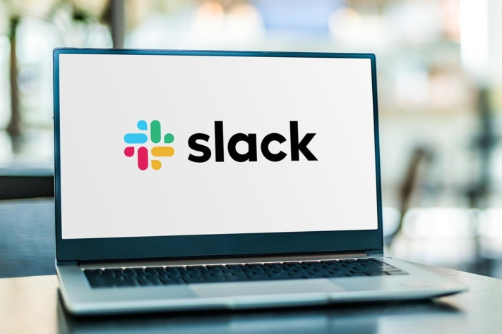

Anyone who wants to manage projects successfully needs organisation and structure. To meet deadlines, work efficiently and achieve goals, the use of digital [project management tools](https://seatable.io/en/projekt-management-tool/) is a great advantage. Many teams fall back on Asana for this, although there are far more and equally good tools available. But what is the best **Asana alternative**?

In this article you will learn what exactly is behind Asana, why you should look for alternatives and which Asana alternative offers the best services.

## What is Asana?

As a software-as-a-service, Asana is designed for the organisation, management and documentation of projects. The goal is to support teams in their collaboration and [project management](https://seatable.io/en/projektmanagement-methoden-im-ueberblick/), to increase the efficiency of their work and to ensure project success. The web-based application combines all important features in one tool so that all project participants are always up to date. But even though the organisational platform has some advantages, there are Asana alternatives that companies should definitely be aware of.

## Why look for alternatives?

If you take a closer look at the market, you will quickly realise that there is more than just Asana as a [project management tool](https://seatable.io/en/projekt-management-tool/). Numerous Asana alternatives offer the same advantages as the well-known tool - even if they are still rather under the radar. But it is worth taking a closer look. Because many of the alternatives not only offer the same features, but also additional ones from which teams can benefit significantly more in [project management](https://seatable.io/en/projektmanagement/).

Untypical, lesser-known tools in particular can certainly keep up with Asana project management and convince with useful functions. The following overview shows which alternatives are really promising.

## The 6 best Asana alternatives at a glance

### 1\. awork

Kanban boards, timelines, lists - [awork](https://www.awork.io/) is ideally suited for the work of agile teams. The Asana alternative relies on a clear user interface with which projects can be individually configured, planned and carried out. Tasks can be easily moved using the drag-and-drop option and a special live function ensures that the browser window is automatically updated. In this way, every change is displayed transparently and all team members always have the same, up-to-date information.

Platform-independent, awork works on Android and iOS devices and can be used as a mobile app in an uncomplicated and flexible way for all project requirements. The project management tool is only available as software-as-a-service and not on-premise. awork is also not open source software. Thanks to its open Rest API, the tool can be connected to almost all apps. awork supports the languages German and English. For small teams with up to three projects and up to ten users, this Asana alternative can be used free of charge.

### 2\. masterTask

The project management tool [MeisterTask](https://www.meistertask.com/de) focuses on the basics and relies on an intuitive user interface in the style of the agile Kanban method. The structure in columns makes it possible to move tasks easily and according to the current processing status. Recurring tasks and workflows can be saved as templates and automated. Scheduling, [time recording](https://seatable.io/en/arbeitszeiterfassung-in-excel/), assigning observers and task prioritisation are also among the features of this Asana alternative.

MeisterTask is compliant with the GDPR and can be used free of charge in the basic version. As open source, it can be used with all common operating systems (web, iOS, Android, Windows). Full API use is only possible with the paid versions (from €8.25/month for the Pro version). The Asana alternative is currently only available as a cloud app. In addition to German, English and Spanish, eleven other languages are included in this cloud-based project management tool.

### 3\. SeaTable

Whether in the cloud, as a self-hosted on-premises solution or with a dedicated server, [SeaTable](https://seatable.io/en/) is the perfect project management tool for anyone who wants to organise information, tasks, processes and ideas clearly and easily. For both companies and private individuals, this Asana alternative offers all the features required for [project management](https://seatable.io/en/projektmanagement-methoden-im-ueberblick/) that is independent of industry and task. With SeaTable, all private and professional information converges so that all project participants have an overview of the current status of individual tasks at all times and can [organise](https://seatable.io/en/vorlagen-projektplanung/) their [processes as efficiently as possible](https://seatable.io/en/vorlagen-projektplanung/).

For optimal work results, SeaTable enables individual and customised organising, analysing, producing, planning and designing of any project. The project management tool is available in English, German, French, Russian and Chinese and enables full API use. SeaTable can be used with all common operating systems (web, iOS, Android, Windows) and is available as freeware in the simplest version.

In general, the functional scope of SeaTable goes far beyond that of a pure project management tool. In addition to the functions for the efficient management of projects, the Asana alternative offers a wide range of options for designing and shaping other business processes. While other tools also prescribe concrete working methods, SeaTable relies on a lot of flexibility. Thus, each project gets exactly the features it needs for successful implementation.

### 4\. slack

Collecting all communication on a project in one central place, making it accessible to all project participants and always keeping information up to date - this is made possible by the Asana alternative [Slack](https://slack.com/intl/de-de/). Thanks to chat, video and voice messaging functions, all team members can communicate in a short way and reach decisions more quickly. An intuitive user interface ensures accessibility and promotes inclusion in the workplace. In addition to German and English, Slack can be used in eight other languages, including Korean, Chinese and Russian.

Asana alternative © monticellllo / adobe stock

As a massaging app, Slack is applicable for Windows, iOS and Linux and can be used in both a mobile and desktop version. The basic version of the Asana alternative is available free of charge, the Pro package is available from €6.25/month.

### 5 Trello

As a project management and collaboration app, the Asana alternative [Trello](https://trello.com/de) serves to organise projects and tasks in cards for teams and individuals. Practical filters, search functions and structured visualisation in Kanban style enable efficient and productive work for an unlimited number of users per card. Open API allows customisation to individual user needs. Available in English and German, Trello supports the Android, web app and iOS platforms and can be used as a mobile app as well as in the desktop version. High security standards are also among the app's advantages.

Trello is a SaaS solution that is not available as open source. In the basic version, the Asana alternative is available free of charge, the standard version is available from $6.00/month.

### 6\. wrike

[Wrike](https://www.wrike.com/de/) is also one of the most important Asana alternatives, available in the simplest version as freeware. Whether fully linked calendars, personalised Kanban boards or flexibly customisable task prioritisations - as a comprehensive project management tool, Wrike relies on real-time collaborations in the team, cross-project reporting and up-to-the-minute news feeds. Here, all team members are active on a central platform and are always up to date on a project without long email communication or chat processes.

As a mobile app, the Asana alternative Wrike works on both Android and iOS devices and allows full API use, but is not an open source solution. The project management tool is available free of charge in eighteen languages and in the simplest version.

## SeaTable as a promising Asana alternative

A direct comparison shows that all six Asana alternatives have their similarities. But a look at the details makes it clear that SeaTable is more convincing than the others. The tool stands for a high degree of flexibility, for customised features that make it possible to [plan every project precisely](https://seatable.io/en/vorlagen/), as well as for extremely versatile options for designing a wide range of business processes.

Although this alternative is (still) unknown and perhaps atypical, it is highly relevant. This is because this project management tool not only offers the most features in comparison, but also fulfils all requirements for projects of all kinds. This enables every user to work in an absolutely customised, individual and truly goal-oriented way. Project success is thus guaranteed in the long term.

Image source Cover image: © Andrey Popov/Adobe Stock
