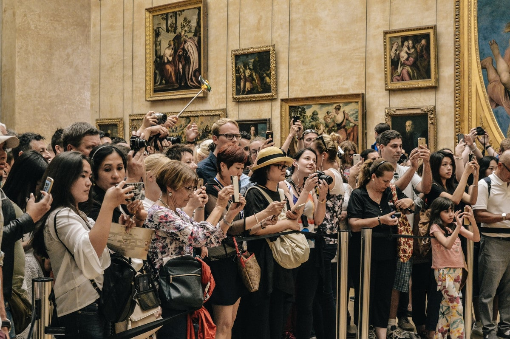
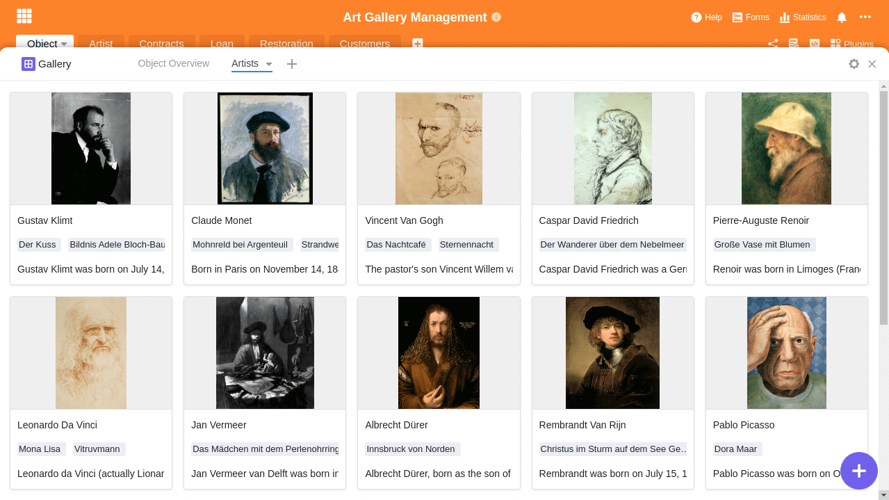
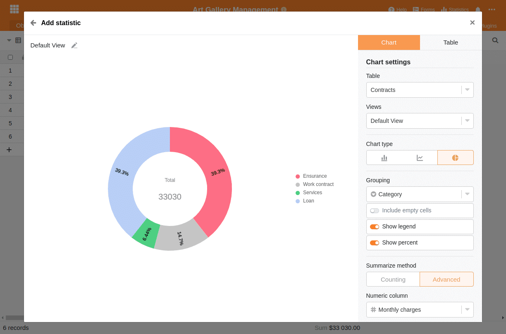

Weltweit existieren rund [55.000 Museen](https://www.zukunftsinstitut.de/artikel/die-zukunft-des-museums-ist-integrativ/) und unzählige weitere Galerien, Ausstellungen, Theater und Kunstbühnen. Jeder wird zustimmen, dass Kunst in ihren verschiedenen Formen eine wichtige Rolle in unserem Leben spielt. Ohne digitale Tools wäre die Verwaltung und das Betreiben einer solchen Kunsteinrichtung heutzutage kaum noch vorstellbar. Das Beantragen von öffentlichen Geldern, die Inventarisierung der Exponate und (insbesondere während der Corona-Pandemie) die Registrierung der Besucher – es gibt bestimmt einfachere Aufgaben als im Kunstmanagement.

Dieser Artikel beschreibt die Herausforderungen im Kunstmanagement, geht auf die Unterschiede in der Verwaltung einer öffentlichen Kunsteinrichtung im Gegensatz zu einem Unternehmen ein, skizziert die Probleme von unflexiblen Branchenlösungen im Kunstmanagement und zeigt effiziente Wege auf, wie Sie diese Herausforderungen meistern können.

## Was ist Kunstmanagement und was sind die Aufgaben eines Museums?

Um Kunstmanagement beschreiben zu können, muss man zuerst die Aufgaben eines Museums verstehen. Doch so einfach dies im ersten Moment auch scheint, selbst das [International Council of Museums](https://icom-deutschland.de) tut sich seit Jahrzehnten schwer, eine passende und umfassende Definition zu finden. Zu komplex ist die Wirkung von Kunst auf unsere Gesellschaft. So einigte man sich 2019 in Kyoto auf folgende Beschreibung:

> Museums are democratising, inclusive and polyphonic spaces for critical dialogue about the pasts and the futures. Acknowledging and addressing the conflicts and challenges of the present, they hold artefacts and specimens in trust for society, safeguard diverse memories for future generations and guarantee equal rights and equal access to heritage for all people.

Es ist somit die Aufgabe öffentlicher Museen, Ausstellungen und Galerien, ein Hort der Geschichte zu sein. Sie sollen Kunstobjekte erhalten und für heutige und zukünftige Generationen bewahren. Zu den Kernaufgaben gehören somit das “Sammeln, Forschen, Bewahren, Ausstellen und Vermitteln”.

Beim Kunstmanagement geht es also darum, genau diese schwierige Herausforderung anzunehmen und Mittel und Wege zu finden, die genannten Kernaufgaben im öffentlichen Raum zu erfüllen.

## Die Unterschiede zwischen Kunstmanagement und dem Management eines Unternehmens

Auf den ersten Blick scheint die Führung eines Unternehmens und einer Kunsteinrichtung ähnlich zu sein. Der große Unterschied besteht jedoch darin, dass Kunstausstellungen und Museen öffentlich sind und in den meisten Fällen weniger selbstständig agieren können. Während Unternehmen profitorientiert sind und selbst entscheiden können, welche Strategie sie verfolgen wollen, werden Kunsteinrichtungen größtenteils vom Staat finanziert, können nur einen kleinen Teil ihrer Kosten selbst durch ihre Besucher erwirtschaften und es ist ihnen oft untersagt, mit ihrer Kunst zu handeln. Dadurch ist ihnen eine potenzielle Einnahmequelle verbaut und sind sie abhängig von ihrem Geldgeber – dem Staat.

Darüber hinaus müssen Museen, Galerien und Ausstellungen nicht nur inhaltlich und organisatorisch konstant gute Arbeit leisten, sondern sie müssen auch permanent ihre eigene Existenz und Weiterfinanzierung begründen und rechtfertigen. Museumsleiter leben im konstanten Spagat. Sie sollen die hohen Anforderungen der Allgemeinheit an die Kunst erfüllen, gleichzeitig unterliegen sie der ständigen öffentlichen Kritik und sind in ihrer Tätigkeit häufig durch Entscheidungen der öffentlichen Hand und Träger eingeschränkt.

Einen kleinen Einblick in die Problematik bekam man durch die [Kündigung von Udo Kittelmann im Jahre 2019](https://www.tagesspiegel.de/kultur/staatliche-museen-in-der-krise-udo-kittelmanns-ruecktritt-wirft-ein-schlaglicht-auf-gravierende-probleme/24944096.html). Kittelmann verzichtete auf den Chefposten der deutschen Nationalgalerie, der wohl renommiertesten Ausstellung in Deutschland. Zu wenig Budget und zu wenige Freiheiten in Kombination mit dem permanenten Repräsentationsbedürfnis der Politik hatten ihn das Handtuch werfen lassen.

Nur wenige Museen haben eine Anziehungskraft wie der Louvre in Paris. Das Bild zeigt Besucher vor der Mona Lisa.

Finanziell haben es viele Museen, Galerien und Ausstellungen schwer. Auch wenn sie von staatlicher Seite finanziert werden, steigt der Rechtfertigungsdruck für jede dieser Einrichtungen. Für weltbekannte Museen wie den [Louvre](https://www.louvre.fr/en) ist es ein Leichtes, die Kosten zu decken und Besucher in Scharen anzulocken. Doch wie sollen kleine Museen, Ausstellungen oder Künstlerprojekte diese Strahlkraft entwickeln?

Deshalb ist es, gerade wenn die Einnahmen nicht die Kosten decken können, höchste Zeit, sich Gedanken über ein effizientes Kunstmanagement zu machen. Geld, das auf der Kostenseite nicht ausgegeben wird, muss auf der Einnahmenseite nicht erwirtschaftet werden. Dies reduziert den Rechtfertigungsdruck und erleichtert den Fortbestand solcher Einrichtungen.

## Die Herausforderungen im Kunstmanagement

Neben den schwierigen Rahmenbedingungen des Kunstmanagements gibt es jedoch auch inhaltliche Herausforderungen. Die schwierigste ist mit Sicherheit, dass Kunst in den unterschiedlichsten Formen existiert und immer andere Anforderungen hat. Kunstwerke verursachen durch fachgerechte Lagerung und Restaurierung hohe und meistens dauerhafte Folgekosten.

Zudem gehören Kunstobjekte häufig nicht den Museen, sondern werden in Form einer Leihgabe für eine gewisse Zeit ausgeliehen. Aufgrund des meist hohen Wertes müssen entsprechende Versicherungen abgeschlossen werden. Häufig ist schon das Gebäude, in dem sich ein Museum befindet, ein kunsthistorisches Gut und muss gepflegt werden. Je nach Art der Ausstellung sind die notwendigen Informationen, die man erfassen muss, vielfältig und können sich sogar von Ausstellung zu Ausstellung fundamental verändern.

Es ist die Aufgabe des Kunstmanagements, dieser Komplexität mit digitalen Lösungen Herr zu werden. Diese Lösungen müssen mit jeder dieser Herausforderungen klarkommen und dürfen nicht zu viel kosten.

Kunstmanagement-Software muss flexibel und gleichzeitig einfach sein. Eine unlösbare Herausforderung für übliche Branchenlösungen

## Warum Branchenlösungen häufig nicht geeignet sind

Als Branchenfremder mag man überrascht sein, wie viele solcher Branchenlösungen es im Ausstellungs-, Museums- und Kunstmanagement gibt. Selbst eine kurze Recherche liefert eine Vielzahl von möglichen Lösungen. Zu den bekanntesten gehören: MuseumPlus, Axiell Collections Management, Artwork Archive, CatalogIt, PastPerfect, Argos Art Management, Versai Museum Management Software, Veevart und viele weitere. Jede dieser Lösungen hat ihre individuellen Schwerpunkte, wobei man häufig in zwei Kategorien unterscheiden kann: Die eine Kategorie fokussiert sich auf die Erstellung von Katalogen, visuellen Elementen und Ausstellungsinformationen, während die andere Kategorie sich um die Verwaltungsarbeit im Hintergrund kümmert.

Das Problem all dieser Speziallösungen ist ihre feste Struktur. Sie zwingt ihre Nutzer in einen Prozess und eine Arbeitsweise, die die Software als sinnvoll erachtet. Dabei ist die einzige Möglichkeit, um mit den vielfältigen Herausforderungen im Kunstumfeld fertigzuwerden, Flexibilität. Nur wenn die Managementsoftware sich den Anforderungen und der Realität anpassen kann, wird sie die Arbeit der Nutzer wirklich erleichtern.

### SeaTable als flexible Kunstmanagement-Software

Aus diesem Grund sollten Sie einen Blick auf SeaTable werfen. Denn SeaTable bietet Ihnen genau diese Flexibilität, die Sie zur Entwicklung Ihrer eigenen Prozesse und Workflows brauchen. In SeaTable können Sie alle Ihre Informationen, egal welcher Art, in Ihrer ganz persönlichen Datenbank zusammenführen und so Ihr tägliches Arbeiten effizienter organisieren. Dabei ist SeaTable so einfach und intuitiv zu bedienen wie eine Excel Tabelle.

Verwalten und organisieren Sie Ausstellungen, Sammlungen, Verträge, Leihgaben, Restaurationsaufgaben, Kundenstämme und Informationen jeglicher Art in einer einzigen intuitiven Software. Gestalten Sie auf Basis Ihrer Informationen Ihre individuellen Anwendungen. Leistungsfähige Filter, Sortierungen und Gruppierungen geben Ihnen die Freiheit, Ihre Arbeit genau so zu gestalten, wie Sie es benötigen. Verknüpfen Sie SeaTable mit Ihren anderen [Business-Applikationen](https://seatable.io/integrationen/) und automatisieren Sie Ihre Arbeitsabläufe.

SeaTable ist nicht starr, sondern passt sich flexibel an die Bedürfnisse und Anforderungen des Kunstmanagements an. Die folgenden Abschnitte beschreiben typische Aufgaben im Kunstmanagement und wie Sie diese mit SeaTable lösen können. Sie sollen Ihnen ein Gefühl von der Flexibilität vermitteln, die Ihnen SeaTable bieten kann.

## 1\. Sammlungsmanagement

Das Sammlungsmanagement stellt die zuverlässige Erfassung, Katalogisierung, Verschlagwortung und Verwaltung sämtlicher Objekte inklusive aller relevanten Informationen sicher. Je nach Objekt kann eine andere Art der Informationserfassung relevant sein, doch mit SeaTable können Sie flexibel darauf reagieren. Für ein Bild könnte neben den Kerndaten wie Titel, Künstler, Datierung und Abmessungen noch das Material und die Herkunft relevant sein. Gleichzeitig müssen aber auch Informationen über geplante Restaurierungen oder Leihgaben erfasst werden.

Die Stärke von SeaTable liegt darin, dass Sie selbst festlegen, welche Informationen Sie erfassen wollen, und diese beliebig erweitern können. Gleichzeitig können Sie beliebige Verknüpfungen zwischen den unterschiedlichen Informationen herstellen und mithilfe von Rollup-Spalten auch Informationen aus einer anderen Tabelle übernehmen.

Unser Template [Art Gallery Management](https://seatable.io/vorlage/wgdomegftn67lag0z_zjkg/) verfügt über einige Beispieleinträge, um Ihnen die Möglichkeiten darzustellen. Die einzelnen Kunstobjekte stehen im Zentrum des Sammlungsmanagements und sind mit den Künstlern verknüpft. Gleichzeitig wird erfasst, wo sich das Kunstwerk gerade befindet, und es gibt Verlinkungen zu den geplanten Restaurationen und Leihgaben. Eine Erweiterung um öffentliche Referenzen, Schaffensperioden oder Kunstkategorien können jederzeit hinzugefügt werden.

Objektübersicht des Art Gallery Templates

### Visuelle Darstellung der Objekte mit dem Galerie-Plugin

Die Tabellenansicht von SeaTable lässt sich mit individuellen Ansichten flexibel an die Bedürfnisse Ihrer einzelnen Mitarbeiter anpassen. Zusätzlich verfügt SeaTable neben der tabellarischen Darstellung über weitere Anzeigemöglichkeiten. So kann es bei Einträgen mit Bildern Sinn ergeben, das [Galerie-Plugin](https://seatable.io/docs/handbuch/seatable-nutzen/ansichten/) zu verwenden, um einen anschaulichen Überblick zu erhalten und schnell den gewünschten Eintrag zu finden. Ein Klick auf den Eintrag genügt, um in die Detailansicht zu wechseln und Anpassungen an den Daten vorzunehmen.

Die Künstler, dargestellt in einer Galerie

## 2\. Ausstellungsmanagement

Die Organisation einer Ausstellung ist komplex und erfordert eine sorgfältige Planung, Steuerung und Kontrolle vielfältiger Tätigkeiten. SeaTable unterstützt Sie durch seine flexible Struktur, die beteiligten Personen, Institutionen, Veranstaltungsorte und Leihgeber zu koordinieren. Verwalten Sie Leihgaben oder überwachen Sie den Transport, um jederzeit die lückenlose Rückverfolgung sämtlicher Objekte sicherzustellen. Jede Bewegung innerhalb und außerhalb des Museumsgeländes kann beispielsweise über ein Bewegungsprotokoll erfasst und dokumentiert werden. Sie behalten die Kontrolle, ob ein Exponat sich gerade in der Ausstellung, in der Restaurierungswerkstatt oder auf dem Transport befindet. Durch die leistungsstarken Filter, Gruppierungen und Sortierungen verlieren Sie kein Objekt aus den Augen.

Jedes Museum muss eine Vielzahl an Verträgen, Vereinbarungen und Versicherungen in Bezug auf die Ausstellungen, Leihgaben und Objekte verwalten. In SeaTable können Sie jede Art von Information strukturiert erfassen und so eine vollständige Dokumentation ablegen. Verwalten Sie Ihre Schriftstücke in spezifischen Datei-Spalten, lassen Sie sich automatisch vor Ablauf einer Frist per E-Mail erinnern oder überwachen Sie die monatlichen Kosten mithilfe der statistischen Auswertungen.

Auswertung der monatlichen Kosten nach Ausgabenkategorie

## 3\. Kontakte und Vertragspartner im Kunstmanagement

Im Kontakt- und Vertragsmanagement geht es um die Verwaltung aller Personen und Firmen, mit denen Sie in Verbindung stehen. Das können sowohl Mitarbeiter, aber auch Künstler, Restauratoren, Förderer und Sponsoren, Redakteure, Pressevertreter sowie Speditionsfirmen und Versicherungen sein. Sie legen fest, welche Informationen Sie erfassen wollen und wie Sie diese Informationen mit den ausgestellten Kunstobjekten verknüpfen.

Wollen Sie neben der Anschrift zusätzlich noch das Geburtsdatum von Ihren Sponsoren speichern? Mit wenigen Klicks erweitern Sie Ihre Datenerfassung um eine weitere Datum-Spalte und können ab sofort auch diese Information speichern. Die Möglichkeiten sind fast grenzenlos; zum Beispiel könnten Sie neben den Stammdaten wie Anrede, Name, Adresse, Telefonnummer und E-Mail auch Adressgruppen und Verteiler sowie eine vollständige Kontakthistorie pflegen.

Gruppieren und Filtern Sie Ihre Kontakte

## 4\. Restauration und Pflege von Kunstwerken

Die Pflege von historischen Kunstwerken stellt eine große Herausforderung für das Kunstmanagement dar. Neben der fachlichen Expertise macht die Protokollierung einen großen Teil der Arbeit aus. Mit SeaTable können Sie sowohl die eingehende Dokumentation als auch die Zustandsprotokolle vor und nach der Restaurierung in Bildern, Videos und Beschreibungen festhalten. Über eine Verknüpfungsspalte sind sämtliche Maßnahmen für jedes Objekt abrufbar. So können Sie Daten zur Lagerung, zum Transport oder zum allgemeinen Zustand direkt mit dem Objekt verbinden und haben diese immer griffbereit.

## 5\. Leihgaben, Transport und Logistik im Kunstmanagement

Bei einer Ausstellung mit Leihobjekten ist die Koordination der Transporte, der beteiligten Personen und Institutionen eine wichtige Aufgabe. Dabei müssen Sie die Veranstaltungsorte, Leihgeber und die Ein- und Ausgangsprotokolle erfassen. Zu jedem Zeitpunkt muss die Nachverfolgbarkeit eines jeden geliehenen Exponats gewährleistet sein. Mit SeaTable können Sie diese Herausforderung im Kunstmanagement mit Leichtigkeit bewältigen und eine lückenlose Rückverfolgbarkeit aller Objekte – ob Leihgaben oder Eigentum der Sammlung – garantieren. Sie wissen jederzeit, ob sich ein Exponat gerade im Archiv, in der Restaurierungswerkstatt, in der Ausstellung oder auf dem Transportweg befindet.

## 6\. Literaturarchiv für das Kunstmanagement

Was wäre ein Kunstobjekt ohne die notwendigen Hintergrundinformationen? Egal welche Informationen Sie zusätzlich zu den Objekten erfassen wollen, mit SeaTable haben Sie die Möglichkeit dazu. Sie können bibliografische Einträge jeglicher Art erfassen oder Literaturverweise zu Objekten erstellen. Alternativ können Sie natürlich auch Verzeichnisse, Bücher, Kataloge, Periodika und Artikel mit den jeweiligen Objekten verknüpfen und so die Grundlage für eine Ausstellungsdokumentation erstellen. Dadurch taugt unser Template auch als Literaturarchiv für das Kunstmanagement.

## 7\. Internetauftritt

Jede Ausstellung, Galerie und Sammlung benötigt eine Webseite, um den Kunstinteressierten vor, bei und nach ihrem Besuch weitere Informationen zu den Kunstwerken, Künstlern und Epochen liefern. Vermeiden Sie die doppelte Pflege von Daten und nutzen Sie einfach die in SeaTable gespeicherten Informationen, um eine ansprechende Webseite zu erstellen. Dank der gut dokumentierten REST-API können Sie mit jeder beliebigen Programmiersprache die Inhalte aus SeaTable abrufen und auf einer Webseite anzeigen lassen.

So können Sie Ihre Exponate auf Ihrer Webseite in Ihrem Corporate Design darstellen und eine passende Online-Präsenz erschaffen. Einmal eingerichtet aktualisiert sich die Webseite automatisch, wenn Sie Ihre Objekte in SeaTable anpassen oder weitere Objekte hinzufügen.

Ein einziger Code-Abschnitt genügt, um Ihre Exponate auf eine Webseite zu bringen. Nutzen Sie den Code einfach als Inspirationsquelle und experimentieren Sie damit. Die vollständige API-Dokumentation finden Sie unter [https://api.seatable.io](https://api.seatable.io).

## Eine Plattform für die individuellen Workflows und Prozesse von Museen, Galerien und Ausstellungen

Die Verwaltung und das Managen von Museen, Galerien und Kunstausstellungen bzw. jede Form des Kunstmanagements ist mit Sicherheit eine große Herausforderung. Sie erfordert Fingerspitzengefühl und dass man sich konstant neu erfindet. Nutzen Sie eine Softwarelösung, die sich Ihren jeweiligen Anforderungen anpassen kann und die genauso flexibel auf neue Herausforderungen reagieren kann, wie Sie es tun. Probieren Sie SeaTable aus – und Sie werden begeistert sein, wie vielseitig und flexibel Sie damit Ihre ganz individuellen Prozesse und Workflows entwickeln können.
