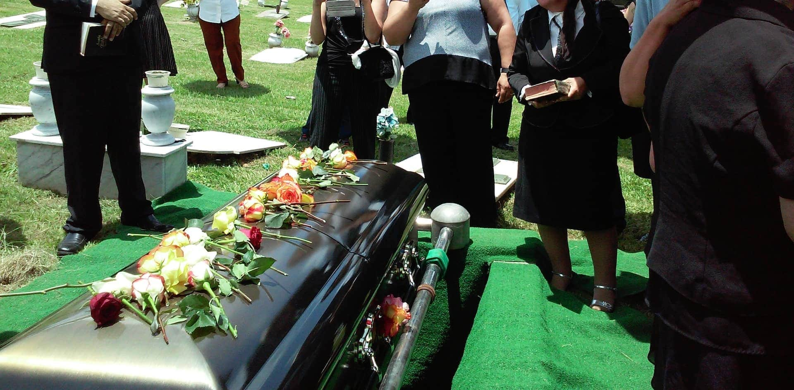
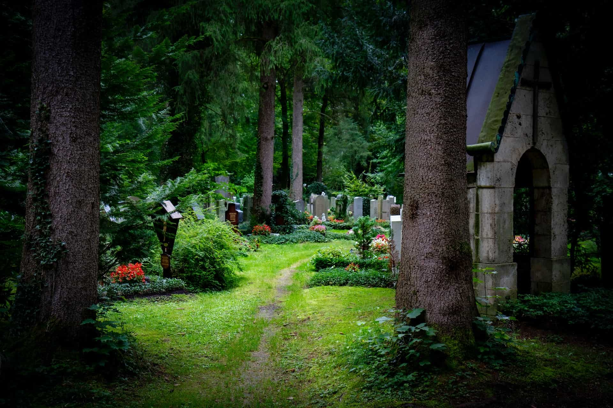
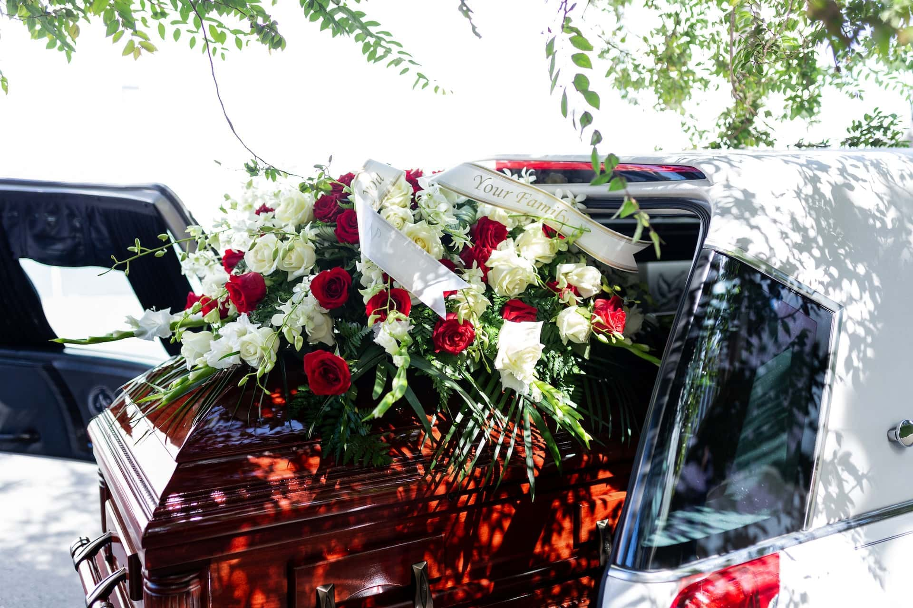
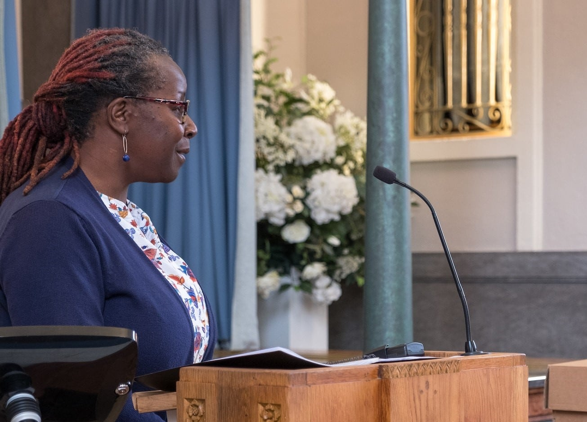
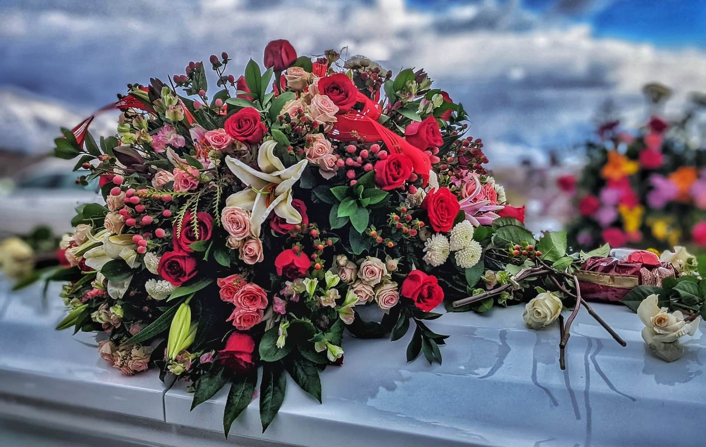
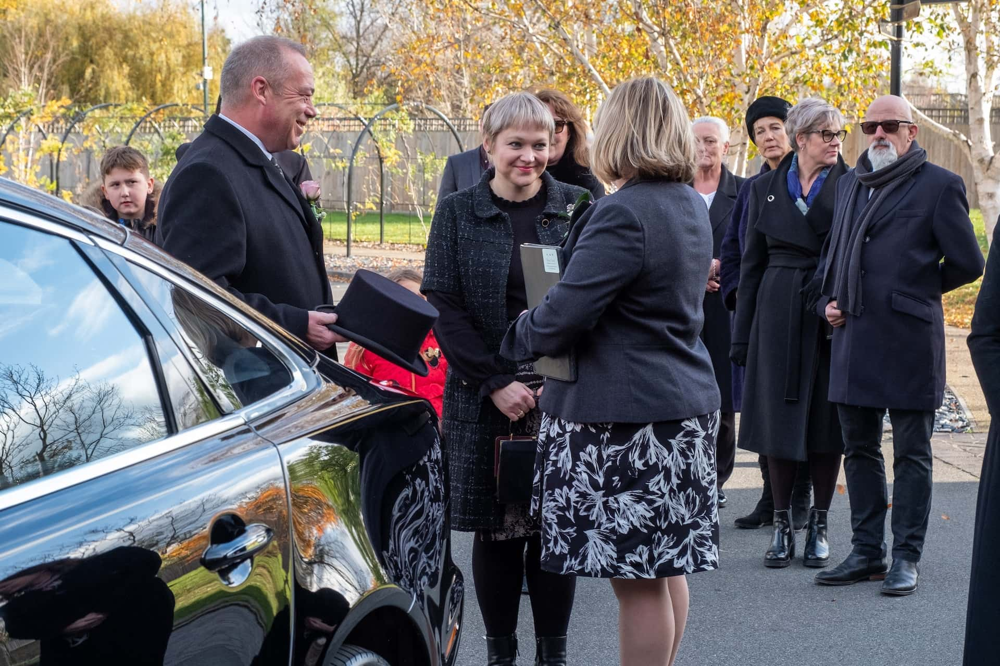

Sie haben einen geliebten Menschen verloren und möchten die anstehende Beerdigung reibungslos hinter sich bringen? Oder Sie möchten Ihre eigene Beerdigung planen, um Ihre Angehörigen nach Ihrem Tod zu entlasten? Dieser Artikel liefert Ihnen alle wichtigen Informationen, was Sie rund um die Organisation einer Bestattung beachten sollten.



Was kostet eine Beerdigung?|||

Die Kosten für eine Beerdigung können zwischen wenigen Tausend und mehreren Zehntausend Euro schwanken. Eine durchschnittliche Beerdigung in Deutschland kostet rund 13.000 Euro. Wo Sie bei den Kosten gegebenenfalls sparen können, erfahren Sie im Artikel.

\--- 

Wo kann man sich bestatten lassen?|||

In Deutschland sind im Grunde nur zwei Bestattungsarten erlaubt: Erd- und Feuerbestattung. Allerdings stehen einige Orte zur Auswahl, an denen der Leichnam oder die Asche beigesetzt werden kann. Dazu zählen Friedhöfe, Kolumbarien oder ausgewählte Gebiete in der Natur. Mehr dazu erfahren Sie im entsprechenden Kapitel.

\--- 

Welche Dokumente braucht man für eine Beerdigung?|||

Unter anderem benötigen Sie den Personalausweis des Verstorbenen, die Geburts- und Heiratsurkunde sowie den Totenschein und die Sterbeurkunde. Wie Sie diese Dokumente beschaffen, erfahren Sie ebenfalls im Artikel.

\--- 

Muss man einen Bestatter beauftragen?|||

Ja. In Deutschland ist gesetzlich vorgeschrieben, dass bestimmte Tätigkeiten wie die Überführung des Leichnams nur von einem Bestatter ausgeführt werden dürfen.

\--- 

Wen sollte man zur Beerdigung einladen?|||

Über den Tod eines geliebten Menschen sollten Sie so schnell wie möglich alle Bezugspersonen informieren. Dazu gehören Verwandte, Freunde, Bekannte, Nachbarn und Arbeitskollegen. Ob Sie die Trauerfeier lieber im kleinen Kreis abhalten möchten oder über eine Todesanzeige die gesamte Trauergemeinde zur Bestattung einladen, bleibt Ihnen überlassen.



## Gute Gründe, bereits vor dem Tod eine Beerdigung zu planen

Der Tod einer nahestehenden Person ist für Angehörige mit viel **Trauer** verbunden. In dieser emotional belastenden Zeit fällt es vielen Menschen nicht leicht, sich um die Beerdigung zu kümmern. Bei plötzlichen Todesfällen wissen die Angehörigen oft nicht einmal, wie sich der oder die Verstorbene die eigene Bestattung vorgestellt hätte.

Eine klassische Beerdigung auf einem Friedhof ist für viele immer noch die erste Wahl.

Aus diesem Grund sollten Sie bereits zu Lebzeiten offen mit Familie und Freunden über die Themen Tod und Beerdigung sprechen. So können Sie nicht nur Ihre eigenen Wünsche äußern, sondern auch die Ideen Ihrer Angehörigen zur Kenntnis nehmen und verhindern, dass Sie mit der Gestaltung einer Beerdigung nicht den Wünschen der verstorbenen Person gerecht werden.

## Verantwortliche für die Beerdigung bestimmen

Damit im Todesfall kein Chaos ausbricht, sollten Sie zuvor klären, wer sich um die Bestattung und die Abwicklung Ihrer Rechtsgeschäfte kümmern soll. Entscheiden Sie sich für eine oder mehrere **Personen Ihres Vertrauens**. Dies können nahe Verwandte wie Ehepartner, Kinder oder Geschwister, aber auch enge Freunde sein.



Eine Beerdigung planen – in Ernstfall wissen Betroffene oft nicht, womit sie anfangen sollen.

Damit Ihre Bestattung genauso abläuft, wie Sie es sich vorstellen, sollten Sie das offene Gespräch mit Ihren Vertrauenspersonen suchen und sie in all Ihre Wünsche einweihen. Eine **frühzeitige Planung** und **finanzielle Vorsorge** Ihrerseits kann Ihre Angehörigen stark entlasten. Nicht zuletzt, weil diese in Deutschland gemäß der gesetzlichen Totenfürsorge dazu verpflichtet sind, eine angemessene Bestattung zu veranlassen.

## Bestattungsart und -ort wählen

Die Wahl einer Bestattungsart hängt direkt mit dem Ort zusammen, an dem Sie oder die verstorbene Person beerdigt werden möchten. Dies ist die zentrale Entscheidung, die Sie treffen müssen. Aus ihr ergibt sich im Anschluss die gesamte weitere Planung.

**In Deutschland erlaubte Bestattungsarten sind:**

- Eine klassische Beerdigung auf einem Friedhof
- Eine Feuerbestattung mit anschließender Urnenbeisetzung im Kolumbarium
- Eine Einäscherung mit anschließender Naturbestattung (z. B. im Ruheforst oder in ausgewiesenen Gebieten auf See)

Vielleicht gibt es Verwandte oder Freunde, neben denen Sie gerne Ihre letzte Ruhe finden würden? Dann könnte sich auch ein Gemeinschaftsgrab anbieten. Abgesehen von Friedhöfen erfreuen sich alternative Ruhestätten in der Natur mittlerweile wachsender Beliebtheit.

Eine friedliche letzte Ruhe in der Natur wird immer beliebter.

Bestattungen sind in Deutschland aber keineswegs überall erlaubt, sondern nur auf genehmigten Flächen!  



Sprechen Sie mit Ihren Angehörigen, wie diese Sie gerne in Erinnerung behalten würden. Bei der Frage, wie man sich an einen geliebten Menschen erinnern möchte, gehen die Meinungen nämlich weit auseinander: Manche bevorzugen ein Grab als Ort des Gedenkens, manche einen persönlichen Gegenstand oder Fotos als Andenken an die verstorbene Person; und wieder andere tun jedes Jahr am Todestag etwas, das sie an die gemeinsame Zeit erinnert.

## Kosten für die Beerdigung planen

Die Kosten für eine Bestattung können sehr unterschiedlich ausfallen. Denn sie hängen unter anderem von der Bestattungsart, der Gestaltung der Trauerfeier und den individuellen Preisen des Bestatters ab. Eine **durchschnittliche Beerdigung** kostet in Deutschland circa 13.000 Euro. Wie teuer eine Beerdigung tatsächlich ist, haben Sie aber selbst in der Hand. Von wenigen Tausend Euro für eine anonyme Feuerbestattung bis hin zu mehreren Zehntausend Euro für eine Erdbestattung mit Grabmal und großer Trauerfeier ist alles dabei.

Am teuersten ist die klassische Beerdigung auf einem Friedhof. Ein großer Teil der Bestattungskosten entfällt dabei auf den **Sarg**, den **Grabstein** und die Nutzungsgebühren für eine **Grabstelle**. Jeder dieser drei Kostenpunkte kann sich auf mehrere Tausend Euro belaufen. Diese Kosten – wie auch die anschließende Grabpflege – können Sie sich bei einer Einäscherung mit Naturbestattung sparen.

Urne oder Sarg? Die Art der Beerdigung spielt für die Kosten des Grabs eine große Rolle.

Die Gebühren für ein Grab unterscheiden sich zudem je nach Friedhof, Lage und Größe eines Grabs. Auch wenn Sie an einigen Stellschrauben drehen können, bedeutet eine Beerdigung oft hohe Kosten für die Angehörigen. Deshalb sollten Sie vor Ihrem Tod idealerweise Geld ansparen, das die absehbaren Kosten für Ihre Wünsche abdeckt.

## Die Dokumente für die Beerdigung beschaffen

Damit eine verstorbene Person beerdigt werden kann, benötigen Sie unter anderem folgende Dokumente:

- **Personalausweis**
- **Geburts- und Heiratsurkunde**
- **Totenschein und Sterbeurkunde**

Während man Personalausweis, Geburts- und Heiratsurkunde bereits zu Lebzeiten besitzt, erhalten die Angehörigen die Sterbeurkunde und den Totenschein erst nach dem Tod. Üblicherweise läuft die Beschaffung der Dokumente in drei Schritten ab:

1. Den Totenschein stellt der Arzt aus, der die Leichenschau vornimmt.
2. Die Sterbeurkunde müssen die Angehörigen beim zuständigen Standesamt beantragen, sobald sie den Totenschein haben.
3. Erst wenn alle genannten Dokumente vorliegen, kann man einen Bestatter beauftragen, der die Beerdigung anmeldet und durchführt.

Diese Prozedur können Sie Ihren Angehörigen nicht ersparen, Sie können aber alle anderen Dokumente an einem sicheren Ort hinterlegen. Ebenso können Sie Ihren letzten Willen in einem **Testament** regeln, das Sie bei den Dokumenten deponieren. Wie oben erwähnt, sollten Sie auch an eine **Vollmacht** für Ihre Vertrauenspersonen denken. Zudem kann es Sinn ergeben, dass Sie Ihre Wünsche für Beerdigung und Trauerfeier in einer **Bestattungsverfügung** festhalten. Teilen Sie den Personen Ihres Vertrauens auf jeden Fall mit, wo sich diese Dokumente befinden.

## Ein Bestattungsunternehmen beauftragen

Ohne einen Bestatter kann man in Deutschland keine Verstorbenen beerdigen lassen. Beispielsweise ist in den meisten Bundesländern gesetzlich vorgeschrieben, dass der Leichnam vom Sterbeort zu einem Bestatter – und von dort zur letzten Ruhestätte – überführt werden muss.

**Weitere Bestattungsleistungen sind:**

- die Versorgung und/oder Einäscherung des Leichnams
- die Organisation der Bestattung inklusive aller Formalitäten
- die Beschaffung von Sarg oder Urne
- individuelle Leistungen und Beratung

Allein für die Basis-Leistungen eines Bestatters sollten Sie mindestens 3.000 Euro einplanen. Bevor Sie ein Bestattungsunternehmen beauftragen, lohnt es sich sicherlich, mehrere Angebote einzuholen und diese miteinander zu vergleichen. Wählen Sie letztlich aber den Bestatter aus, bei dem Sie das beste Bauchgefühl haben. Nichts ist schmerzlicher als ein pietätloser Bestatter oder eine misslungene Beerdigung für einen geliebten Menschen. Ein würdevoller Abschied sollte im Zweifel wichtiger sein als ein paar Hundert Euro mehr oder weniger.

## Die Trauerfeier für die Beerdigung planen

Wenn die verstorbene Person ihre Wünsche geäußert oder schriftlich festgehalten hat, müssen Sie die Planung der Trauerfeier nur noch umsetzen. Falls nicht, planen Sie die Trauerfeier so, wie es aus Ihrer Sicht den Vorstellungen der Person am nächsten kommt. Sollte die Person in einer Kirche oder Religionsgemeinschaft gewesen sein, kann diese eine gewisse **Zeremonie** für die Beerdigung vorgeben.

### Trauerredner engagieren

Trauerfeiern werden in der Regel von einem unabhängigen Redner oder einem Geistlichen der zuständigen Kirchengemeinde begleitet. Kontaktieren Sie frühzeitig einen passenden Trauerredner und sprechen Sie mit ihm über den Ablauf der Trauerfeier. Üblicherweise wird er in seiner **Rede** auf das Leben der verstorbenen Person eingehen und benötigt dazu ausführliche Informationen und genug Vorbereitungszeit.

Priester, Pastorin oder freier Redner: Was passt zu Ihrer geplanten Beerdigung?

Ein Geistlicher hält die Trauerfeier normalerweise kostenlos ab, wohingegen ein freier Redner ein Honorar auf Stundenbasis erhält. Einen **professionellen Redner**, der die Trauerfeier individuell mit Ihnen gestaltet, können Sie schon für einige Hundert Euro engagieren.

### Ort und Ablauf einer Trauerfeier

In den meisten Fällen findet vor der Beerdigung eine Trauerfeier nahe der letzten Ruhestätte (z. B. auf einem Friedhof) in einer Kapelle oder Trauerhalle statt. Sie können die Trauerfeier aber auch unabhängig von der eigentlichen Beisetzung, etwa im Bestattungsinstitut oder an einem völlig anderen Ort abhalten. Ein Bestatter verfügt üblicherweise über die entsprechenden Kontakte in seiner Region, um die **Nutzung der Räumlichkeiten** zu koordinieren.

Fragen Sie rechtzeitig bei den Angehörigen nach, ob sie **aktiv** zur Trauerfeier beitragen möchten. Beispielsweise könnten sie einige Worte an die verstorbene Person richten oder ein Gedicht vorlesen. Bei religiösen Trauerfeiern können zudem **Gebete** gesprochen werden. Spielen Sie auf der Trauerfeier **Musik**, welche die verstorbene Person mochte. Viele Trauerhallen verfügen über gute Stereoanlagen oder sogar ein Klavier. Falls einige Angehörige musikalisch und emotional dazu in der Lage sind, können Sie auch gemeinsam Instrumente spielen und singen.

Musik und Gesang können auf einer Trauerfeier Trost spenden.

Oft kommt die Trauergemeinde auch nach der Beerdigung noch einmal zum sogenannten **Leichenschmaus in einem Restaurant oder Café** zusammen. Dies ist vor allem sinnvoll, wenn viele Trauergäste von weither angereist sind. Wenn Sie dies anbieten möchten, sollten Sie frühzeitig Tische in einer Gaststätte reservieren und die gewünschten Speisen und Getränke mit dem Wirt absprechen.

### Trauerkränze, Blumen und Dekoration

Bei einer Trauerfeier mit anschließender Beisetzung steht die Urne oder der Sarg des Verstorbenen meist gut sichtbar im Raum. Daneben können Sie ein schönes **gerahmtes Foto** der verstorbenen Person aufstellen. Damit der restliche Raum nicht karg und leer wirkt, bieten sich **Trauerkränze und Blumenschmuck** an. Für die Dekoration können Sie einen Floristen beauftragen, was je nach Ihren Vorstellungen allerdings teuer werden kann.

Oftmals beteiligen sich die anderen Angehörigen sehr gerne an der Beschaffung von Trauerkränzen oder Gestecken und es kommt eine ansehnliche Blumenpracht zusammen. Falls Sie später ein Grab bepflanzen möchten, sind **Blumenschalen** mit Setzlingen eine gute Idee. In der Regel kümmert sich der Bestatter darum, dass Trauerkränze und Blumenschmuck nach der Trauerfeier ans Grab gelegt werden.

### Trauerkleidung und Atmosphäre

Die traditionelle Trauerkleidung unterscheidet sich von Kultur zu Kultur: In Europa und der westlichen Welt ist **Schwarz**, in Asien vor allem **Weiß** die Farbe der Trauer – und anderswo darf es sogar farbenfroh zugehen. In Deutschland muss die Kleidung bei einer Beerdigung heute nicht mehr schwarz sein, oft wird aber **dezente Kleidung** in gedeckten Farben und weiten Schnitten erwartet – zum Beispiel ein dunkelblauer Anzug mit weißem Hemd, ein einfarbiger Pullover mit schwarzer Hose oder ein Kleid, das nicht zu eng anliegt und nicht zu viel Haut zeigt.

Trauerkleidung ist aber kein Muss. Auch unkonventionelle oder heitere Trauerfeiern sind erlaubt, wenn sich der Verstorbene statt **Trauerstimmung** gewünscht hat, dass man ihn und sein Leben feiert. Planen Sie die Trauerfeier also losgelöst von Traditionen und ganz nach den Wünschen des Verstorbenen.

## Todesanzeige und Einladung der Trauergäste

Über den Tod eines geliebten Menschen sollten Sie so schnell wie möglich **alle Bezugspersonen informieren**. Dazu gehören Verwandte, Freunde, Bekannte, Nachbarn und Arbeitskollegen. Machen Sie sich am besten eine Liste mit allen relevanten Personen und kontaktieren Sie diese schon, bevor Sie die Details der Trauerfeier geklärt haben. So haben alle Angehörigen die Möglichkeit, den Todesfall zu verarbeiten und ggf. Sonderurlaub zu beantragen.



Für die **Benachrichtigung der Trauergäste** haben Sie im Optimalfall Zugriff auf eine Kontaktliste im Mobiltelefon oder E-Mail-Account des Verstorbenen. Wenn Sie das Umfeld des Verstorbenen sehr gut kennen, können Sie die Personen aber auch aus dem Gedächtnis notieren und die Kontaktdaten herausfinden. Sofern die verstorbene Person auf Social Media aktiv war, können Sie dort Kontakte anschreiben.

Sobald Sie den Termin und Ort der Trauerfeier geplant haben, können Sie auch eine **Todesanzeige** in einer lokalen Tageszeitung schalten und zur Trauerfeier einladen. Wenn diese an einem öffentlichen Ort wie einem Friedhof stattfindet, kann jeder an der Trauerfeier teilnehmen, der die Information erhalten hat. Sie können die Trauergäste allerdings darum bitten, von Beileidsbekundungen vor Ort abzusehen.

Vor allem ältere Menschen lesen oft noch Traueranzeigen in lokalen Zeitungen.

Falls die Trauerfeier nur im engsten Kreis stattfinden soll, schreiben Sie keinen Termin in die Todesanzeige, damit wirklich nur die eingeladenen Personen teilnehmen. Die wichtigsten Bezugspersonen des Verstorbenen sollten Sie ohnehin **persönlich** – und idealerweise eine Woche vor der Trauerfeier – einladen. So gehen Sie sicher, dass jeder die Nachricht rechtzeitig erhält und die Chance hat, sich vom Verstorbenen zu verabschieden.

## Checkliste und Online-Planer für die Beerdigung

Bei allem, was man für eine Beerdigung planen muss, kann man leicht den Überblick verlieren. SeaTable hat Ihnen daher die wichtigsten To-dos in einer Checkliste zusammengestellt. Sie können den Online-Planer ebenso nutzen, um die Einladung der Trauergäste zu koordinieren oder die Kosten für die Beerdigung zu berechnen.

SeaTable Vorlage mit Kostenübersicht für die Beerdigung

Wenn Sie SeaTable für die Organisation einer Beerdigung nutzen möchten, [registrieren Sie sich einfach kostenlos](https://seatable.io/registrierung/) und erstellen Sie eine Übersicht mit Ihren eigenen Daten. Die entsprechende Vorlage finden Sie [hier](https://seatable.io/vorlage/kraqwv46rhgoay-y9okshq/).
