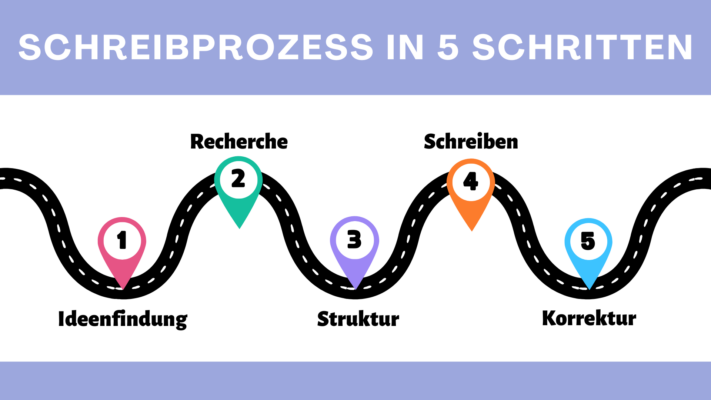

Das Schreiben eines Buches ist für viele ein faszinierender, aber auch herausfordernder Prozess. Von der ersten Idee bis zum fertigen **Manuskript** gibt es zahlreiche Hürden zu überwinden und Weichen zu stellen. In einer Zeit, in der digitale Werkzeuge und Softwarelösungen eine immer größere Rolle im **kreativen Schaffensprozess** spielen, ist es für Autoren entscheidend, die richtige Software zu finden, um ihre Visionen zum Leben zu erwecken. Dieser Artikel wirft einen genaueren Blick auf **7 Tools**, mit denen Sie Ihr Buch schreiben können.

Das Schreiben eines Buches erfordert Zeit und Hingabe.

## Der Schreibprozess: Wie Sie ein Buch schreiben

Ein [Schreibprozess](https://de.wikipedia.org/wiki/Schreibprozess#Das_Schreibprozessmodell_von_Hayes) lässt sich in fünf entscheidende Phasen unterteilen:

- Alles beginnt mit der **Ideenfindung**, einem kreativen Akt, bei dem Sie Gedanken sammeln und Inspirationen entdecken.
- Nach der Ideenfindung folgt die Phase der **Recherche**. Hier suchen Sie relevante Informationen und Quellen, um Ihr Buch mit fundierten Fakten und Argumenten zu stützen.
- Sobald Sie genügend Material zusammengetragen haben, tritt die Phase der **Strukturierung** in den Vordergrund. Jetzt geht es darum, die gesammelten Ideen zu ordnen und einen klaren roten Faden für Ihr Buch zu entwickeln.
- Mit der Struktur als Leitfaden beginnt das eigentliche **Schreiben**. In dieser Phase setzen Sie Ihre Ideen in Worte um und entwickeln das Buch weiter.
- Der letzte Schritt ist das **Überarbeiten**. Hier wird das Buch sorgfältig überprüft, um Fehler zu korrigieren, den Schreibstil zu verbessern und sicherzustellen, dass der Text den gewünschten Standard erreicht.

Schreibprozess in 5 Schritten

## Warum Planung beim Buch schreiben Sinn ergibt

Die Bedeutung einer gründlichen Planung sollte beim Buch schreiben mit einem Programm nicht unterschätzt werden. Indem Sie sich zu Beginn mit grundlegenden Fragen wie **Genre**, **Erzählperspektive**, **erzählerischen Mitteln**, **Aufbau** und **Zielen** auseinandersetzen, legen Sie einen soliden Rahmen fest, der Ihr Schreibprojekt lenkt und strukturiert.

Nicht nur inhaltlich, sondern auch organisatorisch ist eine Planung von Vorteil. Ein Buch zu schreiben ist ein gewaltiges Projekt, das sich leichter bewältigen lässt, wenn man es in **überschaubare Häppchen** unterteilt. Diese Untergliederung erleichtert Ihnen nicht nur den Schreibprozess selbst, sondern hilft auch dabei, den **Überblick** über das Gesamtprojekt zu behalten und den **Fortschritt** besser zu verfolgen.

Selbst fiktive Geschichten erfordern oft gründliche Recherche, um realistische Details zu liefern.

## Wichtige Faktoren beim Buch schreiben

Selbst für erfahrene Autoren kann das Schreiben eines Buches eine komplexe und anspruchsvolle Aufgabe sein. Zahlreiche Faktoren spielen eine entscheidende Rolle, um ein Werk zu gestalten, das beim Leser einen bleibenden Eindruck hinterlässt. In diesem Zusammenhang ist es wichtig, folgende Aspekte zu berücksichtigen, die den Schreibprozess maßgeblich beeinflussen können:

- **Plot:** Ein gut durchdachter Plot ist das Rückgrat jeder Geschichte. Er braucht einen Konflikt, der die Handlung vorantreibt, um eine spannende Leseerfahrung zu bieten.
- **Figuren:** Charaktere müssen sich im Laufe der Handlung weiterentwickeln, um den Lesern eine emotionale Bindung zu ermöglichen.
- **Schreibstil:** Der Schreibstil eines Autors ist entscheidend für die Atmosphäre und Wirkung des Buches. Erzählerische Mittel sollten die gewünschten Effekte erzielen.
- **Routine:** Dran zu bleiben und kontinuierlich am Projekt zu arbeiten, ist maßgeblich, um den Fluss der Geschichte aufrechtzuerhalten und die Qualität des Textes zu sichern.
- **Feedback:** Rückmeldungen von professionellen Lektoren oder Beta-Lesern helfen dabei, Schwachstellen zu identifizieren und das Werk weiter zu verbessern.

## Autorensoftware im Test

Für die folgende Bewertung von sieben ausgewählten Tools zum Buch schreiben werden wir für jedes Programm die Schlüsselkriterien **Benutzerfreundlichkeit**, **Funktionsumfang**, **Anpassungsmöglichkeiten** und **Kosten** gegenüberstellen.

### Papyrus Autor

Die Einarbeitung in Papyrus erfordert Zeit, um den vollen Funktionsumfang zu erfassen, da das Programm eine Vielzahl von Features zum Buch schreiben bietet, die normalerweise auf mehrere Anwendungen verteilt sind. Es ermöglicht nicht nur die Verwaltung von **Figuren**, **Orten** und **Gegenständen**, sondern auch die Strukturierung von **Handlungssträngen** und **Rechercheergebnissen**. Durch ein **Denkbrett** mit Vorlagen kann man Zusammenhänge visuell darstellen. Trotz seines veralteten Designs punktet dieses Tool mit zahlreichen Bonusfunktionen wie einem **Synonym-Finder**, **Textanalysen** und der Möglichkeit, **wörtliche Rede** hervorzuheben.

**Benutzerfreundlichkeit:** mittelmäßig  
**Funktionsumfang:** sehr hoch  
**Anpassungsmöglichkeit:** hoch  
**Kosten:** 199 Euro

In Papyrus kann man ausführliche Datenbanken anlegen.

### Scrivener

Möchte man mit Scrivener ein Buch schreiben, kann man in dem Programm direkt zu Beginn zwischen Sachbuch, Roman und Skript wählen. Durch das übersichtliche **Verzeichnis** können Autoren mühelos zwischen verschiedenen Aspekten ihres Buchprojekts wie **Manuskript**, **Charakteren** und **Orten** navigieren. Insbesondere für sachliche Autoren, die eine fokussierte Arbeitsumgebung bevorzugen und keine visuelle Inspiration benötigen, bietet Scrivener eine passende Lösung. Darüber hinaus ermöglicht die Software die Auswahl verschiedener **Manuskript-Formate** und die direkte Integration von **Buchcovern**.

**Benutzerfreundlichkeit:** gut  
**Funktionsumfang:** hoch  
**Anpassungsmöglichkeit:** sehr hoch  
**Kosten:** 69,99 Euro

Scrivener ermöglicht übersichtliche Charakterbögen.

### Plottr

Die Kernfunktion von Plottr ist ein **Zeitplan**, der es Autoren ermöglicht, den zeitlichen Verlauf ihrer Handlung übersichtlich und intuitiv zu planen. Dieser Zeitplan kann in mehrere Plots und Kapitel unterteilt und mit verschiedenen Farben gekennzeichnet werden. Zusätzlich zur Zeitplanung bietet Plottr auch die Möglichkeit, **Charaktere**, **Orte** und andere wichtige Notizen festzuhalten. Besonders hilfreich sind die **Vorlagen für Charaktere**, die Autoren dabei unterstützen, ihre Persönlichkeiten besser zu erfassen. Jeder Kategorie können außerdem **Schlagwörter** zugeordnet werden, um eine effiziente Suche nach relevanten Informationen zu ermöglichen.

**Benutzerfreundlichkeit:** sehr hoch  
**Funktionsumfang:** sehr hoch  
**Anpassungsmöglichkeit:** sehr hoch  
**Kosten:** 149 – 299 Dollar

Mit Plottr lassen sich Handlungsstränge einfach visualisieren.

### DramaQueen

Die Software DramaQueen ist zwar primär für **Drehbücher** und **Buchreihen** konzipiert, aber sie eignet sich auch für verschiedene andere Geschichten. Obwohl das Programm anfangs nicht besonders intuitiv ist, können Autoren mit etwas Einarbeitung und den ausgezeichneten **Hilfestellungen** gute Ergebnisse erzielen. Eine herausragende Funktion von DramaQueen ist die Möglichkeit, **Plotlines** zu visualisieren. Dadurch können Autoren, noch bevor sie ihr Buch schreiben, in dem Programm sehen, an welchen Stellen die **Dramaturgie** ihrer Geschichte eventuell Schwächen aufweist.

**Benutzerfreundlichkeit:** mittelmäßig  
**Funktionsumfang:** sehr hoch  
**Anpassungsmöglichkeit:** gut  
**Kosten:** kostenlose Basisfunktion

Mit DramaQueen können Sie die Schwächen Ihrer Dramaturgie herausfinden.

### Patchwork

Patchwork bietet umfangreiche Unterstützung für Autoren durch zahlreiche **Beispiele** und **Vorschläge**. Die Software ermöglicht das Festhalten von **Charakteren**, **Orten**, **Objekten**, einer **Timeline** und vielem mehr. Der **Storybuilding-Assistent** erleichtert zudem die Erstellung der Handlung. Für Autoren, die gemeinsam ein Buch schreiben möchten, besteht in dem Programm die Möglichkeit, einen **Team-Account** zu nutzen. Eine sinnvolle Ergänzung ist die direkte Integration der **Duden-Rechtschreibhilfe**, die separat erworben werden kann.

**Benutzerfreundlichkeit:** hoch  
**Funktionsumfang:** sehr hoch  
**Anpassungsmöglichkeit:** hoch  
**Kosten:** 154 – 189 Euro

### Campfire Pro

Campfire Pro zeichnet sich durch einen einfachen Aufbau mit **Panels** aus, die zu einer übersichtlichen und benutzerfreundlichen Ansicht führen. Die Panels sind individuell anpassbar und frei verschiebbar. Neben den üblichen Notizen können hier auch Informationen zu **Magie**, **Kultur**, **Religion** und sogar **Sprachen** oder **Philosophien** festgehalten werden. Ein praktisches Feature ist die direkte Verknüpfung mit **Unsplash**, über die man mühelos Bilder zur Inspiration einfügen kann. Insgesamt bietet Campfire eine umfangreiche und übersichtliche Plattform, die jedoch hauptsächlich für die direkte Veröffentlichung von Werken auf dieser Website gedacht ist.

**Benutzerfreundlichkeit:** sehr hoch  
**Funktionsumfang:** sehr hoch  
**Anpassungsmöglichkeit:** sehr hoch  
**Kosten:** teilweise kostenlos

### SeaTable

Der [Schreibplan](https://seatable.io/vorlage/lkngogoxqfaoj1kppa2awa/) von SeaTable ist äußerst praktisch für Autoren, die noch, bevor sie ein Buch schreiben, einen Plot entwickeln möchten. Da das Programm **kostenlos** ist, eignet es sich hervorragend für die Planung von Buchprojekten. Neben der Haupttabelle, in der Sie die Handlung festhalten können, bietet SeaTable mit weiteren Tabellen die Möglichkeit, **Charaktere**, **Orte**, **symbolische Elemente** oder **Beziehungen** weiter auszuführen. Diese Tabellen lassen sich frei verwalten und ergänzen, während Sie die Inhalte nach Belieben gruppieren und sortieren können. Mit dem Timeline-Plugin können Sie außerdem die Handlung auf einem **Zeitstrahl** visualisieren. Ein zusätzlicher Bonus ist das Seitendesign-Plugin, mit dem Sie individuell gestaltete **Steckbriefe** für jeden Charakter erstellen können.

**Benutzerfreundlichkeit:** sehr hoch  
**Funktionsumfang:** hoch  
**Anpassungsmöglichkeit:** sehr hoch  
**Kosten:** kostenlos

## Fazit: So können Sie Ihr Buch schreiben

Die hier vorgestellten Autorensoftware-Tools bieten eine Vielzahl von Funktionen und Möglichkeiten, um Sie in jeder Phase des Schreibprozesses zu unterstützen. Letztendlich ist die Auswahl der passenden Software von Ihren individuellen Bedürfnissen und Vorlieben beim Buch schreiben abhängig. Mit dem richtigen Programm können Sie Ihren Schreibprozess optimieren und Ihre kreativen Visionen erfolgreich realisieren.

Wenn Sie die Vorlage von SeaTable für Ihr Buchprojekt nutzen möchten, [registrieren Sie sich](https://seatable.io/registrierung/) einfach kostenlos mit Ihrer E-Mail-Adresse. So können Sie in wenigen Minuten bereits mit Ihrem persönlichen [Schreibplan](https://seatable.io/vorlage/lkngogoxqfaoj1kppa2awa/) starten.
