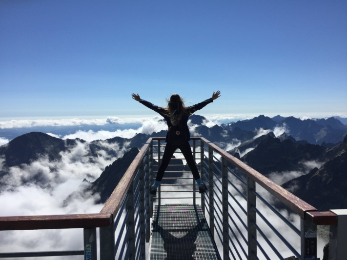

Have you always wanted to try a parachute jump from an airplane? Have you dreamed of diving on the Great Barrier Reef in Australia since you were a child? Or would you like to spend a night in an igloo in Norway? Then put these destinations on your bucket list!

Our dreams and aspirations are what drive us and inspire us to embark on unforgettable adventures. But all too often they are postponed or neglected as we get caught up in the daily grind. A bucket list can help you capture your dreams and remind you to make them a reality. After all, it is experiences that enrich our lives and fill us with memories that will last a lifetime.

Whether adventurous thrills or breathtaking nature: our dreams are different.

## Where the bucket list comes from

The term **bucket list** originally comes from the English expression "kick the bucket", which means "kick the bucket". The bucket list - also known as the spoon list - is therefore **a list of things a person wants to do before they die**.

It was made particularly popular by the 2007 movie "[The Bucket List](https://de.wikipedia.org/wiki/Das_Beste_kommt_zum_Schluss)". The movie tells the story of two men who together create a list of things they want to experience before they die. This inspiring story helped to popularize the bucket list as a concept worldwide and encouraged many people to record and pursue their own life dreams.

## Advantages of a bucket list

If you have not yet thought about what you want from life, a bucket list could be a good start to gain **clarity about your life goals**. By reflecting on yourself and writing down your goals, you will get to **know yourself better** and possibly even find your **personal purpose in life**.

Not only will you become more satisfied the more you tick off your list - with each completed goal, you will also get a **motivational boost** that will make it easier for you to achieve your next goal. Reading through your list regularly and reminiscing will also make you **feel good**.

Keep a record of your experiences so that you can remember them again and again.

## What is (not) important for a bucket list

A bucket list is more than just a list of goals - it embodies the personal life dreams of each individual. Each list is **unique** and tailored to individual wishes and aspirations. The following applies: every goal on it stems from a deep desire of the heart - copying or imitating is not desired here.

If you make the effort to create a bucket list, you should also take a look at it from time to time. By reviewing your list **regularly**, you can not only see which goals you have already achieved, but also how your priorities have changed over time. In addition, it can be motivating to see what progress you have already made.

For some, the thought of unfinished items can cause stress and pressure - but that is not the aim of the list. A bucket list should be **fun** and **motivate** you, not weigh you down. It's important to remember that a bucket list is not a race to be won. Life is a long journey and the list should accompany you for many years. Even if you end up with a few items left to complete, the point is to celebrate all the wonderful experiences you've had along the way.

The most important thing in life is to fully enjoy the beautiful moments.

## How to find inspiration for your bucket list

It is often a challenge to imagine what unforgettable experiences you would like to have. But with the right questions and approaches, inspiration can flow. Which **travel destinations** are on your wish list? Is there a **long-cherished dream from your childhood** that you would still like to realize? Or what would you do if you knew that today was your **last day**?

In addition, **talking** to important people, browsing **social media** or reading inspirational **books** can provide further ideas. However, it is important that you do not allow yourself to be too influenced by the dreams of others. Focus on your own dreams and goals to create an authentic bucket list.

## Ideas for your bucket list

If you are short of ideas, you can also find inspiration here: from **places** you would like to travel to, **adventures** and **cultural experiences** to **health destinations** and **social engagement**. The possibilities are endless.

### Places

- See the pyramids of Giza with your own eyes
- Walking through the ruins of Machu Picchu in Peru
- Visit the Taj Mahal in India
- Standing in front of the Grand Canyon in Arizona
- Listening to the Iguazú Falls in Brazil and Argentina
- Walking over the Great Wall of China near Beijing
- Sunbathe on the Copacabana beach in Rio
- Take a selfie with the Leaning Tower of Pisa
- Admire the northern lights in Iceland

Northern lights are an impressive play of colors in the sky.

### Adventure

- Bungee jumping from the Europabrücke bridge in Innsbruck
- Skydiving from an airplane
- Diving with sharks
- Climbing Mont Blanc
- Ride in a hot air balloon
- Go on safari in Africa
- Surviving a whitewater rafting tour
- Working abroad

Some people are looking for adrenaline and thrills.

### Health

- Integrating meditation techniques into everyday life
- Spending a weekend without a smartphone
- Change your diet
- Take part in a yoga retreat
- Learn judo
- Book a relaxing vacation
- Complete a marathon

If you are looking for a sporting challenge, you can choose a marathon as your goal.

### Education

- Learn a new language
- Attend a rhetoric course
- Going on a language trip
- Spending a semester abroad
- Learn to play a musical instrument
- Writing a book
- Take part in a photography course
- Learn to program

Python is a programming language.

### Culture

- Celebrate St. Patrick's Day in Ireland
- See a musical on Broadway
- Take a dance course
- Attend a science slam
- Experience the Day of the Dead in Mexico
- Watch all "The Lord of the Rings" films in one go
- Celebrate Carnival in Rio de Janeiro

Whether art, music, literature or traditions - culture is diverse.

### Culinary delights

- Eating sushi in Japan
- Take part in a cooking course in Italy
- Eat in a Michelin-starred restaurant
- Try the hottest chili in the world
- Planting a vegetable garden
- Eating macarons in Paris
- Picking mushrooms in the forest
- Drink champagne

Eating can also be an experience.

### Social commitment

- Buying a piece of rainforest
- Helping out in a soup kitchen
- Eating out with a homeless person
- Donate blood
- Planting trees
- Take on a sponsorship
- Adopt a dog from an animal shelter
- Collecting garbage in nature

Doing good is a goal that not only enriches the lives of those around you.

### Relationships

- Enjoy a candlelight dinner
- Writing a love letter
- Kissing under a sprig of mistletoe
- Traveling around the world together in a van
- Taking a dance class together
- Moving into a shared apartment
- Get married on the beach
- Get children

Your goals can also focus on interpersonal relationships.

## Online template in SeaTable

To ensure that you don't lose sight of the goals on your bucket list, it is advisable to write them down and keep them in an easily accessible place. SeaTable offers you a free [online template](https://seatable.io/en/vorlage/jbn_a4wysewcfd9eegkgha/) that allows you to always have your bucket list to hand and organize your goals into different categories in a structured way.

In addition, you can record which friends and family members share certain interests and would accompany you on your adventures. You can also save additional information such as pictures, links or addresses directly in your bucket list to collect all relevant details in one place.

Check off goal after goal from your bucket list, flexibly add new ideas or delete wishes that are no longer important to you. You can [register for free](https://seatable.io/en/registrierung/) with SeaTable and customize the [online template](https://seatable.io/en/vorlage/jbn_a4wysewcfd9eegkgha/) to suit your needs.
