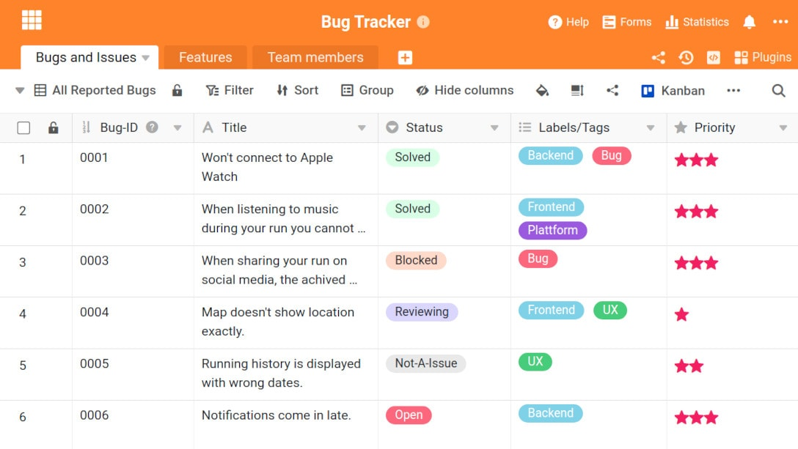
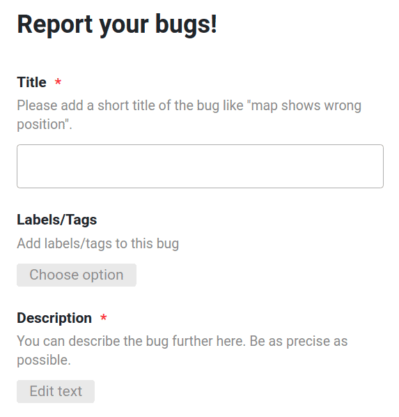
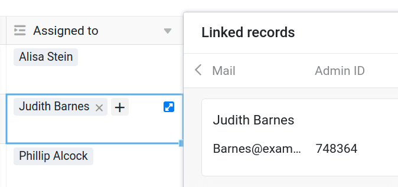

When developing complex software, there is no getting around errors. So-called [bugs](https://www.arksolutions.de/gs/project/blog/bug-programmfehler) always occur during the development phase and must be documented and resolved accordingly in a bug tracker. Without well-structured software, searching for, tracking and monitoring bugs can quickly become confusing and cost a lot of valuable time.

In this article we will explain what bug tracking software is, why it is important and what features it typically comes with. We will also show the possibilities of SeaTable to show you that you are making the right choice with SeaTable.

## What is a bug tracker?

A bug tracker is a system in software development for documenting and monitoring bugs. Bug tracking involves the structured process from the capture, tracking and monitoring to the elimination of bugs, defects and other problems. Finding bugs is often a team task, which is why it is very important that bugs are clearly numbered, neatly documented and properly prioritised.

> **Differentiation between issues and bugs:**  
> even though issues and bugs are often used interchangeably, we at SeaTable try to make a clear distinction between issue and bug. For us, a bug is an error in a piece of software. Thus, a bug tracker is an internal tool used by developers to find and fix such bugs during development.  
> For us, an issue is a bug that is reported by a customer. This does not necessarily have to be a software error, but can also be an incorrectly delivered e-mail or an incorrect debit. An issue tracker is therefore a customer satisfaction tool that brings together the customer and the internal support team.

[Here you can go directly to our bug tracker template](https://seatable.io/en/vorlage/hlbtvqrtscqmhx3adh5asg/)

## What are the advantages of well-structured bug tracking software?

The use of bug tracking software offers numerous advantages:

- **Centralised troubleshooting:** When all existing and resolved bugs are stored in a central database, it is easier for developers, project managers and other team members to find relevant solutions quickly.
- **History of bugs:** A comprehensive bug history enables teams to solve re-occurring bugs faster and easier.
- **Delegation of tasks:** A central bug tracker improves the possibilities of work sharing. For example, if there is a problem with the user interface of your app, you can immediately assign the problem to the design team.
- **Monitor actions related to each issue:** The responsible teams can receive real-time updates on each step taken to resolve an issue. This keeps everyone informed about ongoing and resolved errors.
- **Improved information sharing:** When every issue can be tracked at a glance, teams have less to coordinate and can focus on the really important issues.
- **Automatic reminders:** You can't take forever to fix problems. Clients and customers have limited patience. Bug tracking software with automatic reminders ensures that you never miss a deadline.
- **Better collaboration:** Software developers are not the only ones involved in fixing bugs. Customer service representatives, the QA team and other relevant teams also need to collaborate. With dynamic bug tracking software, you can improve this collaboration.

SeaTable is not a special solution for developers or programmers. Nevertheless, we are convinced that SeaTable can be of great use to anyone who develops software. In the following we would like to show you the possibilities of one of our templates. Besides the bug tracker, SeaTable offers other helpful templates for [software development](https://seatable.io/en/vorlagen/softwareentwicklung/).

## This is how our bug tracker solution is structured

Our bug tracker template consists of three spreadsheets. The first table is used for documentation and reporting of detected software bugs. The second table assigns the bugs to the different software features. The last table is used to assign tasks to IT staff. In the following, all features of the individual tables are explained in more detail.

## First base: Documentation and reporting of bugs

### Web form for easy reporting

In order to make sure that every software bug you find will eventually be fixed by your IT team, you need to make the process of reporting software bugs as easy as possible. With SeaTable, this is no problem. Using a web form, your employees or customers can easily report software bugs. The reported bugs then immediately appear in your Base and can be processed by responsible staff for further action.

SeaTable takes care of the creation of the web form for you. You only need to specify which columns of your table you want to use in the form and whether these fields are mandatory. Your team members and employees can access the web form either by sending you the URL of the web form or a QR code generated by SeaTable.

### Other useful columns of the first base

Bugs reported via the web form are added directly to your bug tracker base. In addition to this information, you can rank the priority of the bug, change the status, see when the bug became a reporter and assign the bug to a specific feature. This allows your specialised team to better assess who might be responsible for fixing the bug.

Responsibilities can be assigned in the "Assigned to" column. These links are also one of the greatest strengths of SeaTable, as they make SeaTable a real database and set it apart from normal spreadsheet solutions.

### Use different views in the bug tracker

In your first base you will also find 5 other views in addition to the view for all reported bugs.

1. Bugs by Priority (sorts the table by priority)
2. Open Bugs (shows all open bugs)
3. Active Bugs (shows all bugs in progress)
4. Blocked Bugs (shows all blocked bugs)
5. Bugs by Assignee (groups the table by responsible employee)

You can create new views or edit existing ones at any time.

## The second base: Assigning bugs to one or more functions

The second table is used to get a bit more structure into your reported bugs. Here you can assign each bug the corresponding feature to which it belongs. This way you can see which features are particularly prone to bugs and which features have the fewest problems. You will also find this information visually presented in our statistics function. A pie chart shows you here which features have how many errors.

This means that the statistical possibilities of SeaTable are far from exhausted. You can build up any imaginable reporting with SeaTable. Here are just a few ideas:

- Number of bugs for each employee
- Average processing time across all bugs
- Percentage of bugs solved to open bugs
- Bugs per milestone or theme

## Third base: Keep an eye on your team

The last base shows you all the members of your team. Here you will find space for names, email addresses, admin ID and team affiliation. In addition, the bugs assigned to the corresponding employee can also be found here. In the _Total Assigned_ column, you can see how many bugs the corresponding employee is currently working on.

### Notification Rules - so you don't miss anything

Would you like to be informed when a new bug is received or when a bug is assigned to you for processing? Then our [Notification Rules](https://seatable.io/en/docs/handbuch/zusammenarbeit/benachrichtigungen/) are a good option. You can set various rules for notifications under the three dots in the top right corner.

## Improve your software with the SeaTable Bugtracker

Get started with an efficient bug fixing process today. You can find the Bugtracker [template](https://seatable.io/en/vorlage/hlbtvqrtscqmhx3adh5asg/) directly in SeaTable at the templates in the Software Development section. Most features of this template are already usable in the free SeaTable Free subscription. Automations and advanced permissions are reserved for the paid subscriptions of SeaTable.

**More templates in the area Software development**:  
Take a look at our other templates in the area of software development. SeaTable offers a wide range of possibilities to make work easier for you and your team. [Register](/en/registrierung/) now and try it out.
