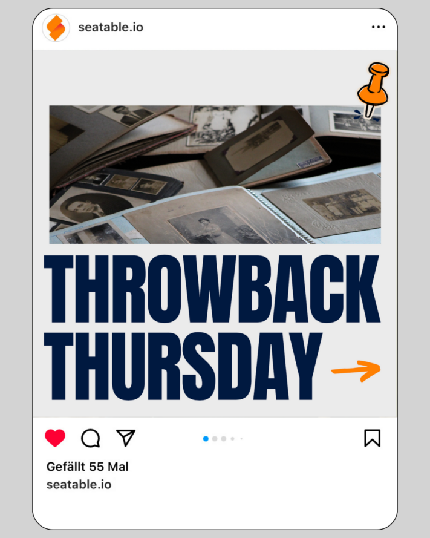

Pour une présence réussie dans les médias sociaux, une chose est particulièrement importante : **publier régulièrement** des contenus. Les algorithmes d'[Instagram](http://www.instagram.com) et autres pénalisent immédiatement l'inactivité et limitent la visibilité des comptes, ce qui peut être tout à fait fatal pour votre **portée**. Il est donc important d'alimenter régulièrement l'algorithme et de collecter des idées de contenu pour Instagram, TikTok, etc.

Pour cela, il n'est parfois pas nécessaire d'aborder des thèmes profonds ou des textes élaborés. Il suffit parfois de tenir vos followers à jour avec une petite information ou quelque chose de similaire. Avec des posts réguliers, vous pouvez renforcer la **conscience de marque** de vos followers vis-à-vis de votre entreprise et augmenter le **trafic** des médias sociaux vers votre propre site web.

Pour ne pas manquer de matière pour les posts malgré un [plan social media](https://seatable.io/fr/content-ideen/#Nutzen_Sie_SeaTable_um_Ihre_Content-Ideen_zu_planen) bien pensé, nous avons quelques idées de contenu que vous pouvez mettre en œuvre rapidement et sans grand effort sur les médias sociaux. Ainsi, vous réussirez à entretenir vos canaux de médias sociaux même les jours de stress.

## 1\. derrière les scènes

Emmenez vos followers dans votre quotidien et montrez-leur davantage de votre entreprise et de vos **tâches quotidiennes**. Il vous suffit de sortir votre smartphone et d'enregistrer quelques histoires - et vous irez chercher vos followers sur Instagram avec un contenu intéressant sur votre quotidien ! Cela s'avère particulièrement utile lors d'événements, de congrès ou autres, lorsque des choses passionnantes se passent en dehors du quotidien classique du bureau.

Une vidéo des coulisses peut parfaitement être publiée sous forme d'histoire ou de TikTok.

## 2\. présentation de l'équipe

La présentation de certains collaborateurs rend la relation entre les suiveurs et l'entreprise plus proche. Bien entendu, seuls ceux qui le souhaitent peuvent participer ! En **ayant un aperçu personnel de l'équipe**, vos clients et ceux qui le deviendront auront une idée de votre esprit d'équipe et garderont de votre entreprise un souvenir positif et surtout humain. Souvent, il est tout simplement utile de voir les personnes qui se trouvent derrière les coulisses.

En présentant votre équipe, vous paraissez plus authentique.

## 3\. les sondages

Devenez interactif et faites participer vos followers. Peu importe que ce soit par pur plaisir, à des fins de recherche ou pour **impliquer** vos followers **dans une décision**. Avec cette idée de contenu, découvrez l'opinion de vos followers de manière divertissante et encouragez le dialogue.

Pourquoi ne pas demander directement à vos followers ce qu'ils aimeraient voir ?

## 4\. les FAQ

Une FAQ (= Frequently Asked Questions) vous donne la possibilité de répondre aux **questions fréquemment posées** par vos followers ou de leur donner un aperçu général de votre produit. Ainsi, vous pouvez également emballer de manière judicieuse des faits "nice-to-know".

Les FAQ vous permettent non seulement de répondre aux questions en suspens, mais aussi d'augmenter l'interaction avec vos followers.

## 5\. présentation du produit

Vos idées de contenu pour Instagram, TikTok et les médias sociaux en général doivent résulter d'un bon mélange de différents thèmes. Outre les sujets qui n'ont rien à voir avec votre activité quotidienne, vous devriez - si possible - **présenter** de temps en temps un **produit de votre entreprise** et montrer à vos followers ce qu'il a de si particulier. Vos followers doivent aussi savoir ce que vous proposez.

Outre un contenu divertissant, il est également important de présenter vos produits.

## 6\. vidéos amusantes

Comme nous l'avons déjà mentionné, c'est le mélange qui fait la différence. Vous ne devez pas seulement publier des contenus liés à l'entreprise, mais aussi **des contenus amusants**. Les vidéos offrent une alternative bienvenue aux histoires et aux posts. Laissez-vous inspirer par [TikTok](http://www.tiktok.com) ou les tendances Instagram et parcourez les reels. Vous trouverez certainement quelque chose d'approprié à mettre en œuvre avec vos collaborateurs et qui fera sourire vos followers !

Grâce à des vidéos amusantes, vous augmentez plus facilement votre portée.

## 7\. événements (d'équipe)

Les événements sont une super occasion de faire monter vos followers à bord. Ils ne se prêtent pas seulement à un follow-me-around, mais peuvent également être publiés comme appel pour vos followers s'il s'agit d'événements publics. Avec cette idée de contenu **, vous vous montrez actif** et vous vous adressez directement à vos followers.

## 8\. hacks et astuces de tous les jours

Les sujets qui intéressent particulièrement les utilisateurs sont ceux qui ont un **lien avec leur vie et leur quotidien**. Donnez par exemple des conseils pour être plus productif au bureau à domicile ou orientez vos Life-Hacks vers des thèmes actuels ou saisonniers (comme par exemple : les meilleurs lacs de baignade que notre équipe connaît). Laissez libre cours à votre créativité et pensez à ce que vous aimeriez lire !

Partagez également des aperçus plus privés - par exemple les films préférés de vos collègues.

## 9\. les mèmes

Les mèmes sont des contenus créatifs, généralement sous forme d'images ou de vidéos. Ils se propagent à une vitesse fulgurante sur Internet et sont régulièrement modifiés par les utilisateurs. Qu'ils soient **drôles**, **sarcastiques** ou **critiques à l'égard de la société**, ces idées de contenu contribuent à une plus grande viralité sur les médias sociaux. Il suffit d'utiliser des mèmes actuels et de les personnaliser.

Utilisez des mèmes connus, comme BWL-Justus, pour vos posts.

## 10\. présenter des outils

Pour l'un ou l'autre, il peut être très intéressant de savoir avec quels outils les entreprises travaillent dans leur quotidien. En **présentant des outils et des programmes**, vous pouvez même commencer une série de posts et présenter chaque semaine un nouvel outil qui facilite votre quotidien (de travail).

Présentez des applications qui facilitent votre quotidien.

## 11\. les offres d'emploi

Parmi vos followers, il n'y a pas que des clients - les travailleurs de votre secteur consultent souvent le contenu d'autres entreprises. Pourquoi ne pas publier des offres d'emploi et attirer ainsi **l'attention** **des professionnels** à la recherche d'un nouveau poste ? Vous faites ainsi d'une pierre deux coups : de bonnes idées de contenu et du nouveau personnel.

Qu'il s'agisse d'un post, d'une histoire ou d'une vidéo, recherchez également de nouveaux collaborateurs sur les médias sociaux.

## 12\. jeux-concours

De nombreux influenceurs utilisent des jeux-concours sur les médias sociaux pour augmenter l'**engagement** de leurs followers et ainsi accroître leur **portée**. En tant qu'entreprise, vous pouvez également utiliser cette idée de contenu. Si vous mettez vos propres produits en jeu, vous avez même la possibilité de convaincre des clients potentiels. Lors de la mise en œuvre de cette idée de contenu, veillez impérativement à respecter les directives des plates-formes concernées.

Les jeux-concours ne profitent pas seulement aux gagnants, mais aussi à vous.

## 13\. infopostes

Avez-vous des informations intéressantes sur votre secteur ? Une nouvelle loi vient-elle d'être adoptée ? Ou y a-t-il des changements à venir pour vos clients ? Tenez vos followers au courant des **dernières nouvelles**. N'hésitez pas à utiliser des graphiques pour rendre l'information visuellement attrayante.

Partagez les actualités intéressantes avec vos followers.

## 14\. lancer la série

Grâce à des séries de contenus, vous créez un **fil rouge** qui traverse votre chaîne. Cela attire de nouveaux followers et incite les followers déjà existants à visiter régulièrement votre profil. Ce contenu est posté à intervalles réguliers, au mieux à des jours précis comme le **#throwbackthursday** ou le **#FollowFriday**.

Postez par exemple sous le hashtag #throwbackthursday les succès passés de votre entreprise.

## Utilisez SeaTable pour planifier vos idées de contenu

Avec SeaTable, vous avez la possibilité de planifier parfaitement vos idées de contenu. Notre [plan pour les médias sociaux](https://seatable.io/fr/modele/lmmjwghgtye322iwdxvj7a/) peut vous servir d'inspiration pour la planification de votre contenu. Remplissez le pipeline de votre présence sur les médias sociaux afin de ne jamais être à court de posts pour Instagram, TikTok et autres.

Dans ce modèle, vous pouvez par exemple créer les 14 idées de contenu de cet article de blog sous forme de formats récurrents avec différents thèmes principaux. Adaptez le plan à vos besoins individuels pour rassembler vos idées de contenu pour les médias sociaux et les mettre ensuite en œuvre.

Avec SeaTable, vous pouvez créer intuitivement des aperçus, des tableaux, des plans et bien plus encore, et gagner ainsi un temps précieux. Essayez-le !
