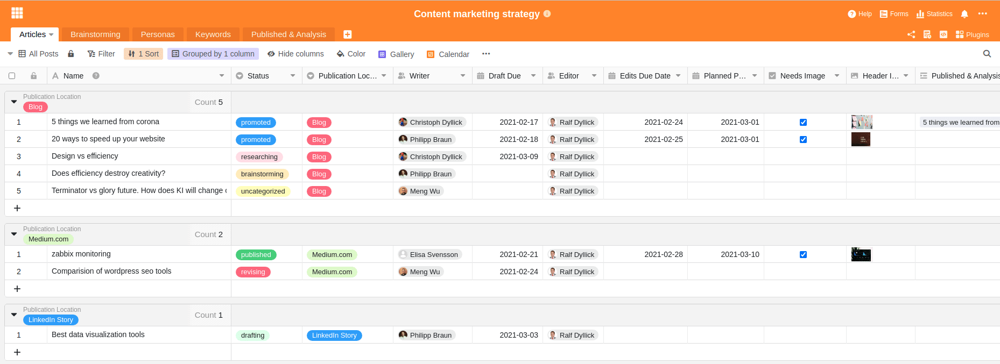

El marketing de contenidos es un popular enfoque de marketing para colocar los propios productos entre los clientes y posibles interesados. La idea básica del marketing de contenidos es muy sencilla: creas contenidos para tu grupo objetivo, los publicas e inspiras a tus clientes.

Por sencillo que pueda parecer a primera vista, el marketing de contenidos sólo funciona si se ofrecen contenidos de alta calidad que interesen al cliente, y si se dispone de una estructura adecuada y de las herramientas adecuadas para la planificación, la ejecución y el aprendizaje. Porque una estrategia de marketing de contenidos no persigue efectos a corto plazo, como ocurriría con la publicidad de pago, por ejemplo, sino que representa un enfoque de comunicación y ventas orgánico y a largo plazo de las empresas actuales.

Para crear su propia estrategia de marketing de contenidos y seleccionar una herramienta adecuada, primero es importante entender qué es exactamente el marketing de contenidos y cómo se interrelacionan cada una de sus partes.

## ¿Cuáles son las ventajas del marketing de contenidos?

Todo tipo de marketing pretende atraer la atención de las personas o los clientes. Pero mientras que la publicidad suele tratar de atraer a la gente para que realice una acción inmediata, el marketing de contenidos pretende captar la atención de las personas mucho antes de que se interesen realmente por el producto. A través de historias y contenidos emocionantes, se quiere captar la atención de la gente en cada etapa del [Customer Journey](https://de.wikipedia.org/wiki/Customer_Journey) y dar a conocer su propia empresa y sus productos.

Por supuesto, también se puede alinear una estrategia de marketing de contenidos de forma que el objetivo sea vender productos. Sin embargo, normalmente la intención es generar interés, dar a conocer una marca o lograr una asociación positiva con una marca o un producto.

Especialmente si desarrolla productos que requieren una explicación o no hay _un_ momento de compra, el marketing de contenidos promete ser más exitoso y eficaz a largo plazo que la publicidad de pago, que puede suponer un gran despilfarro. Si su empresa adapta el contenido con sensatez a un futuro grupo objetivo, el cliente potencial recordará su marca en el momento oportuno y se decidirá por el producto correspondiente.

### Resumen de las ventajas del marketing de contenidos

- se dirige a un grupo objetivo y quiere proporcionar un beneficio
- Trabaja en todas las fases del recorrido del cliente
- Es menos intrusiva y tiende a percibirse menos como publicidad
- Puede autorreforzarse mediante efectos virales
- armoniza con SEO, PR y marketing en redes sociales

**Al mismo tiempo, el marketing de contenidos también tiene puntos débiles**

- No garantiza ventas inmediatas
- es una estrategia a largo plazo
- consiste en gran medida en la diligencia, la perseverancia y el aprendizaje constante

Estas debilidades también las confirma un [estudio de 2016](https://www.forbes.com/sites/sujanpatel/2016/01/03/what-your-2016-content-marketing-strategy-should-look-like/#69c6a60a342e), que muestra claramente el problema central del marketing de contenidos: aunque el 76% de los empresarios encuestados trabaja con una estrategia de marketing de contenidos y está convencido de que el marketing de contenidos funciona, solo el 37% afirma tener éxito con su estrategia.

Los autores del estudio concluyen que el marketing de contenidos es una herramienta de marketing de éxito, pero sólo si no se crean contenidos y posts al azar. La diferencia crucial es planificar el propio enfoque, establecer un proceso y una estructura y utilizar una herramienta que se adapte a las propias necesidades y ayude al equipo a hacer un seguimiento de toda la información.

Entonces, ¿qué es importante en una estrategia de marketing de contenidos? ¿Qué debe ser capaz de hacer una solución de software para apoyar de forma óptima el proceso de creación de contenidos?

## Las tres P del marketing de contenidos

Existen varias definiciones de marketing de contenidos, pero la descripción con las tres P es la que mejor lo resume. Son los tres términos en inglés: _Preparation_, _Production_ y _Publication_. A veces también se lee sobre _Produce_, _Publish_ y _Promote_. Al final, sin embargo, siempre se trata del desarrollo específico de contenidos relevantes para el cliente.

**Preparation** incluye la planificación estratégica y la preparación de su propia estrategia de contenidos. Aquí debe definir el grupo objetivo o ficticio [Personas](<https://en.wikipedia.org/wiki/Persona_(user_experience)>) seleccionar, identificar los canales adecuados y los términos SEO y, a partir de ahí, desarrollar un plan para el contenido adecuado.

**Production** consiste en todos los pasos necesarios para dar vida al contenido y supervisar su creación. Para ello, se determina quién crea el contenido y en qué momento, cuáles deben ser las palabras clave y los titulares exactos, quién suministra la información y edita posteriormente el contenido, etc.

**Publication** es el tercer y último paso del marketing de contenidos e incluye la publicación, la promoción del contenido, la evaluación de los éxitos y la retroalimentación constante para mejorar el proceso.

## Por qué las herramientas Kanban puras y de gestión de procesos no son adecuadas para el marketing de contenidos

Es importante comprender que el marketing de contenidos suele constar de muchas pequeñas piezas del puzzle y que no basta con un buen artículo para lograr el éxito deseado. Por ejemplo, la agencia SEO crea [Content Marketing Star](/content-marketing-star/) incluso para proyectos pequeños, una canalización de contenidos con docenas, si no cientos, de términos de búsqueda, y luego crea el contenido apropiado.

El marketing de contenidos requiere una herramienta que ofrezca una visión general de esta masa de información y permita la publicación selectiva de los contenidos planificados.

Las típicas herramientas Kanban y de gestión de proyectos, como Trello o Asana, se ven rápidamente desbordadas por esta gran cantidad de información. Si, por ejemplo, importas una búsqueda de palabras clave de Google con cientos de términos SEO a un software de este tipo, prácticamente ya has perdido la visión de conjunto necesaria.

Así que vamos a repasar los pasos necesarios para construir una estrategia de marketing de contenidos y cómo es una herramienta de marketing de contenidos adecuada.

## 1\. definición de la persona / grupo destinatario

En marketing, se supone que hay que conocer a los clientes para poder hacerles una oferta adecuada. Normalmente, existen dos conceptos sobre cómo proceder: o bien se define un grupo objetivo o bien se utiliza el denominado personaje.

Un grupo objetivo se refiere a todas las personas a las que desea dirigirse con una campaña de marketing. Un grupo objetivo es, por tanto, un subconjunto de su mercado total y suele formarse a partir de una segmentación del mercado. Esta segmentación puede hacerse, por ejemplo, en función de la edad, el sexo, el lugar de residencia, las preferencias personales, etc.

Un grupo destinatario no es homogéneo en sí mismo, pero los individuos que lo componen son diferentes salvo por los criterios definidos.

Por este motivo, se desarrolló el concepto de persona. A diferencia del grupo objetivo, éste describe a una persona ficticia que representa a un cliente típico. Se intenta describir a esta persona ficticia con la mayor precisión posible en todas sus facetas para comprender mejor las necesidades, los retos y las acciones de este cliente potencial. De este modo, puede adaptar el contenido aún mejor y de forma más individualizada a sus clientes.

### ¿Quiénes son sus clientes potenciales?

Por lo tanto, si desea crear un flujo de contenidos de calidad, es importante saber con claridad quiénes son realmente sus clientes y qué contenidos desean leer. Por este motivo, en el marketing de contenidos es más común el uso de personas.

Cuanto más precisa sea la descripción de su persona, más fácil le resultará predecir sus expectativas y su comportamiento en relación con el contenido. Y eso es exactamente lo que quiere conseguir con el marketing de contenidos. Quiere diseñar y producir contenidos que se perciban como útiles y que sus futuros clientes disfruten leyendo.

Intente describir a sus personajes con la mayor precisión posible:

- ¿Cuál es su profesión?
- ¿En qué puesto trabajan?
- ¿Qué retos tienen?
- ¿Qué contenido esperan y qué les ayuda?
- …

Suponga que su empresa tiene los siguientes tres segmentos de clientes:

- Diseñadores independientes
- Equipos creativos
- Agencias creativas

A continuación, su primera tarea sería averiguar todo lo que pueda sobre estos segmentos de clientes y, por tanto, sobre sus personas. No te limites a pensar en ello, documenta tus hallazgos.

Ejemplo de descripción de las personas en SeaTable

### Cree contenidos específicos para sus clientes

A los diseñadores autónomos, por ejemplo, les encanta leer artículos en [medium.com](https://medium.com/@seatable). Utilizan sobre todo dispositivos Apple y prefieren ir en bicicleta a conducir un Porsche. Les encanta que les presenten imágenes como fuente de inspiración. También disfrutan con tutoriales concretos, how-tos y contenidos que les ayuden directamente en su trabajo. Para entusiasmar a esta persona con un producto, normalmente sólo se necesita un poco de ayuda motivacional. En cualquier caso, el interés básico está dado. Por lo tanto, proporcione consejos concretos y ayuda práctica. El formato adecuado podrían ser vídeos cortos de YouTube y artículos de blog adecuados en medium.com o en el blog de la empresa.

Los equipos creativos piden recomendaciones sobre nuevas herramientas y mejoras de procesos que aumenten la eficacia. Es posible que un equipo de este tipo ya conozca tu producto y necesite algunas [historias de éxito](/es/success-stories/) de otros clientes para apuntarse a una prueba o pedir un producto de prueba.

Las agencias creativas, por su parte, ya trabajan de una manera mucho más formalizada. Es probable que algunos empleados se entusiasmen rápidamente con una nueva herramienta, pero al mismo tiempo tienen que convencer a sus jefes de las ventajas concretas. Ayude a estas personas con pistas sobre cómo aumentar la eficacia o las ventajas concretas de su solución. La mejor forma de hacerlo es con historias de éxito, informes de prensa y libros blancos.

Equipado con estos conocimientos sobre sus clientes y sus necesidades, ya puede pasar a la fase de producción.

## 2\. la producción de contenidos para su marketing de contenidos

Los retos clave en la creación de contenidos son el seguimiento del progreso y la asignación de responsabilidades. Olvídate de Kanban o de herramientas exhaustivas de gestión de proyectos que pueden hacerte perder de vista solo un puñado de entradas.

Para cada entrada de blog, cada vídeo, cada mención en línea, determina quién del equipo es responsable de ello y para cuándo debe estar listo este contenido. Incluso si hay que suministrar contenido externo o hay dependencias temporales, no deje que esto le desanime. Sólo si se definen claramente las responsabilidades, la creación de contenidos se convertirá en un proceso eficaz.

### Ponga orden en su canal de contenidos

La siguiente tabla muestra una estructura básica que puede adaptar a sus necesidades como desee. Se debe registrar la siguiente información para cada contenido:

- Título de la publicación
- Estado (de la lluvia de ideas a la publicación)
- Autor responsable
- Fecha de publicación
- Canal de publicación
- Persona (para quien el artículo es relevante)
- Idea del contenido (de dónde surgió la idea)

Esta tabla de nuestra [Plantilla de estrategia de marketing de contenidos](https://seatable.io/es/vorlage/akpem7oksykcemvai5eblq/) parece bastante extensa a primera vista, pero es lo mínimo para que un canal de contenidos medio mantenga la visión de conjunto necesaria. Acostúmbrate a registrar estos datos desde el primer día y no tendrás problemas para llevar la cuenta en cualquier momento.

### Permitir una visión individual de los datos

Otro aspecto destacado de esta plantilla son las diferentes vistas con filtros y agrupaciones predefinidos. De este modo, puede estar seguro de que los distintos empleados obtienen siempre la visión de conjunto perfecta. Al mismo tiempo, estas vistas son ideales para garantizar la responsabilidad personal.

Los diseñadores gráficos sólo se interesarán por los artículos que requieran gráficos y que ya estén escritos, mientras que los autores sólo buscarán los trabajos que aún estén abiertos. Para cada uno de estos colaboradores hay una vista separada para mostrar sólo los datos que uno necesita en ese momento.

Vistas individuales para cada empleado

Cada empleado sabe exactamente quién tiene la tarea entre manos y quién tiene que trabajar en ella a continuación. Así se evitan tiempos de espera y confusiones. En cuanto un autor ha escrito su borrador, cambia el estado del artículo y lo pasa al siguiente miembro del personal para que realice el control de calidad. Si es necesaria la coordinación entre los miembros del personal, puede hacerse fácilmente mediante la [función de comentarios](https://seatable.io/es/docs/handbuch/zusammenarbeit/kommentare/) de SeaTable.

De este modo, nadie tiene que pedir una actualización por correo electrónico o Slack. Basta con añadir al colega correspondiente en los comentarios o cambiar el estado del artículo. Si se desea, SeaTable también envía una notificación por correo electrónico.

Como autor o editor, es posible que desee ver las fechas de publicación programadas en una vista de calendario. Allí podrá arrastrar y soltar fácilmente los artículos para reordenar los plazos y asegurarse de que se publican buenos contenidos de forma coherente.

Planificación editorial mediante arrastrar y soltar en SeaTable

Cada una de estas vistas destaca determinados aspectos de la cadena de contenidos y oculta o enmascara otros. De este modo, todos los miembros del equipo obtienen exactamente la información que necesitan para su trabajo.

### Garantizar nuevas ideas constantes

Asegúrate también de no quedarte sin ideas antes de tiempo. Pida ideas a sus empleados y a sus clientes, o pídales temas que le interesen. Con SeaTable puede crear un cuestionario en minutos y distribuirlo.

Su objetivo debe ser estar en constante intercambio con sus clientes y mantener lo más bajas posible las barreras para informar de esas ideas. Ya lo verá: La mejor forma de publicar buenos contenidos a intervalos regulares es mantener un flujo constante de ideas de alta calidad.

## 3\. publicación y análisis

Pero una buena estrategia y un buen contenido no bastan por sí solos para aprovechar todo el potencial del marketing de contenidos. Las empresas que realmente tienen éxito con el marketing de contenidos trabajan constantemente para aprender de sus errores y establecer un bucle de retroalimentación constante.

Escuchan lo que la gente dice sobre los artículos y piensan en lo que pueden utilizar en próximos artículos. Al mismo tiempo, revisan sus personajes y observan a qué artículos ha reaccionado especialmente bien su comunidad y qué palabra clave ha tenido más interacción.

Cree una sección de comentarios en su sitio web y permita que sus clientes le den su opinión directamente a través de un formulario. Puede utilizar estas opiniones directamente para adaptar mejor sus próximos artículos a los deseos de sus clientes.

Este tipo de análisis para mejorar la propia estrategia de marketing de contenidos no es realmente ciencia de cohetes, sino principalmente el resultado de acciones sencillas, similares a una lista de comprobación, que en la mayoría de los casos simplemente se olvidan o no se les da prioridad.

No cometa el mismo error y establezca esos procesos de retroalimentación y análisis desde el principio. SeaTable le proporciona todas las capacidades necesarias que necesita.

### Hazte una lista de control de los comentarios

Asegúrese de que sus artículos se asignan siempre a uno de sus personajes. Sólo así tendrá la oportunidad de revisar su contenido después de publicarlo y mejorarlo continuamente con el tiempo. Redacte contenidos de acuerdo con las suposiciones sobre lo que quieren sus clientes y perfeccione estas percepciones de forma continua.

Oblíguese a pensar en los contenidos de esta forma estructurada para controlar realmente sus decisiones estratégicas.

### Controlar las cifras reales de acceso

Notará rápidamente que con buenos artículos puede observar un aumento del tráfico orgánico en su sitio web al cabo de pocas semanas. Haga el esfuerzo y guarde regularmente las cifras de acceso de sus artículos. Al principio, aún deberías tomar las cifras manualmente de [Google Analytics](https://analytics.google.com/analytics/web/), más adelante puedes configurar la recopilación automática de datos, por ejemplo, con [Zapier](https://zapier.com/apps/google-analytics/integrations/seatable) o la [API SeaTable](https://api.seatable.io).

Verá que merece la pena registrar estas evaluaciones en SeaTable para que luego las cifras se muestren como estadísticas en un gráfico de barras, de líneas o de tarta.

Evaluaciones estadísticas de las cifras de acceso y las contabilizaciones programadas con SeaTable

Analizar sus contenidos y cifras de acceso puede perderse fácilmente en las prisas de los próximos lanzamientos. Por supuesto, es importante que publique nuevos contenidos con regularidad. No obstante, debería dedicar tiempo a publicar una breve mención en Facebook, Twitter o LinkedIn por cada artículo que publique. También puede utilizar SeaTable para programar este paso, o Zapier directamente la publicación. Te sorprenderá todo lo que se puede optimizar en tu proceso de marketing de contenidos si dedicas algo de tiempo a pensar en las mejoras.

## Un plan editorial para organizar su estrategia de marketing de contenidos

La pregunta es por qué tantos empresarios sienten que su marketing de contenidos no funciona. Probablemente sea porque las empresas o no tienen una estrategia o tienen la herramienta equivocada.

Convénzase de que el marketing de contenidos es una herramienta eficaz y puede contribuir decisivamente al éxito de su empresa. Si quiere tener éxito, prescinda de contenidos intercambiables y herramientas de gestión de proyectos confusas.

Utilice SeaTable para establecer sus personas, objetivos y contenidos y supervise de cerca su desarrollo. Establezca un proceso de auto-mejora y verá cómo llega el éxito. Empieza ahora con nuestras [plantillas de marketing](https://seatable.io/es/vorlage/akpem7oksykcemvai5eblq/) y personalízalas según tus necesidades.
