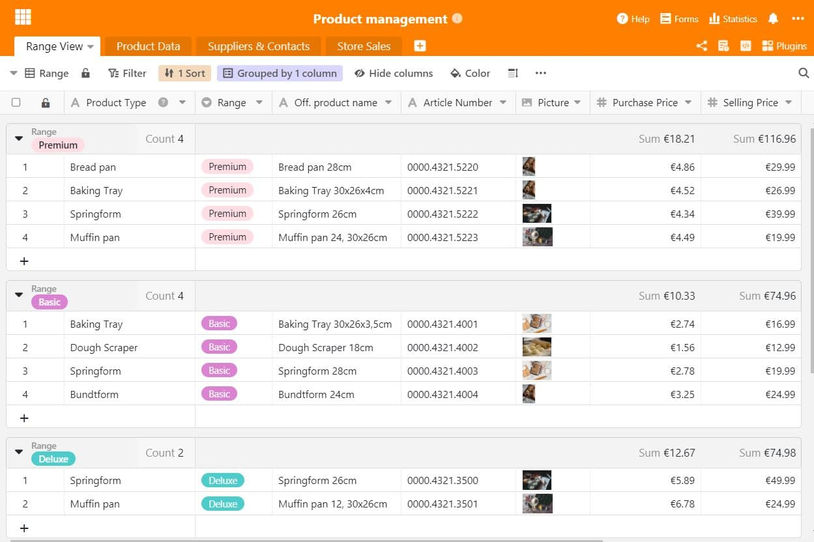
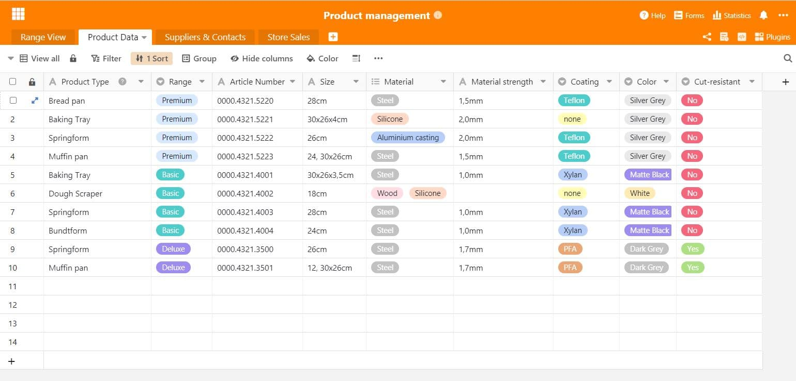
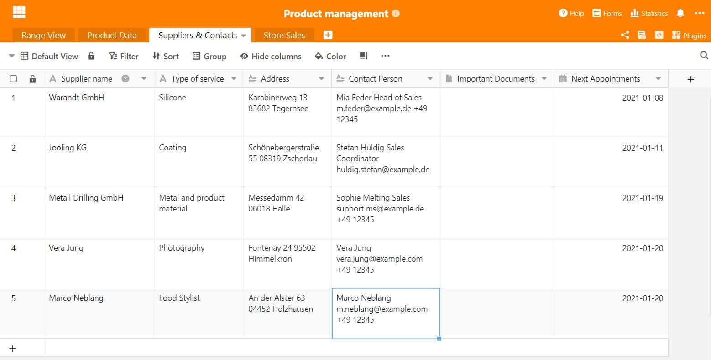
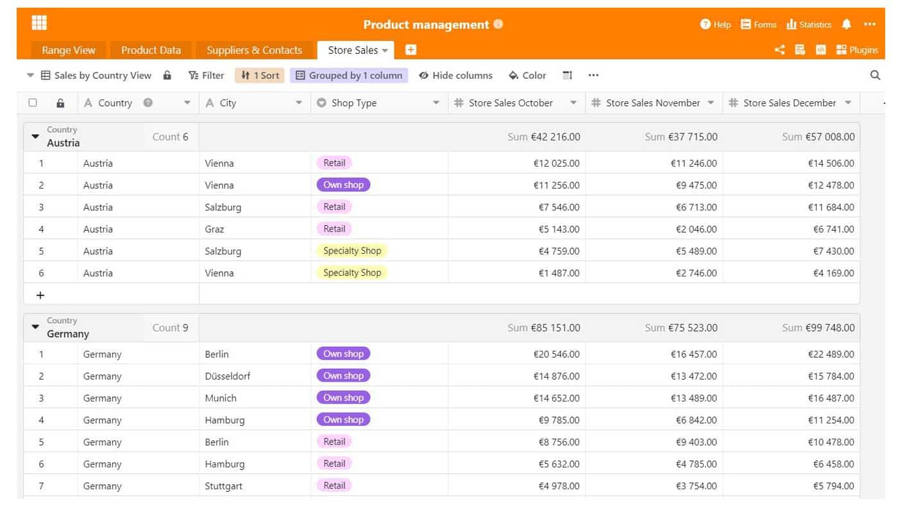
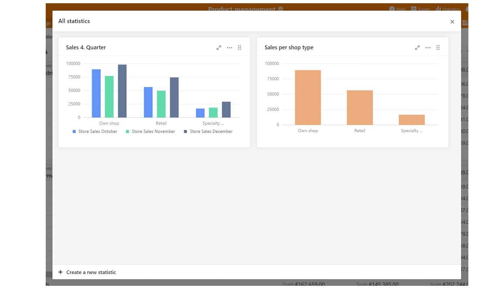

Cuando las empresas comercializan un producto o servicio, una buena gestión del producto es muy importante para el éxito a largo plazo en el mercado. Después de todo, ¿de qué sirve un gran producto que simplemente no funciona? Mostramos qué hay que tener en cuenta en la gestión de productos y qué funciones útiles aporta el trabajo con SeaTable.

## ¿Qué es la gestión de productos?

En las empresas, la gestión de productos es la unidad central que se encarga de todas las tareas relacionadas con el producto. Se trata de la planificación, gestión y control del producto durante todo el proceso de desarrollo del mismo hasta su lanzamiento al mercado o hasta su retirada del mismo. La gestión de productos debe conocer muy bien a sus clientes, a los que se dirige con el producto.

La gestión de productos proporciona información importante sobre la situación del mercado y la utiliza para desarrollar estrategias de producto eficaces. Estos se presentan a los organismos responsables como base para las decisiones a favor o en contra del producto. Las estrategias también incluyen los requisitos del mercado para el producto, así como el aspecto de la comunicación del mercado.

## ¿Por qué es necesaria la gestión de productos?

Un buen producto no es suficiente para sobrevivir en el mercado. Ante todo, es importante examinar los requisitos del mercado y preguntarse: ¿En qué entorno de mercado se encuentra mi producto y cuáles son las necesidades de los clientes que hay que satisfacer allí? Es importante conocer el mercado, los competidores que operan en él y, sobre todo, sus clientes potenciales. Sin este conocimiento, un producto lo tendrá difícil y probablemente se perderá en la masa de competidores.

Por ello, es importante establecer una gestión profesional del producto en la empresa y definir responsables que se encarguen de determinados temas. Es la única manera de mantener una visión general de los [requisitos del mercado](https://www.reckliesmp.de/veraenderungen-im-markt/) y las necesidades de los clientes, [que cambian constantemente](https://www.reckliesmp.de/veraenderungen-im-markt/).

## Tareas de un gestor de productos

Las tareas de gestión de productos incluyen todas las etapas por las que pasa un producto. Se trata de la planificación, la concepción y la ejecución, en las que se pueden clasificar a grandes rasgos los siguientes puntos:

- **Planificación**: idea, análisis del mercado, análisis de la competencia, análisis de los clientes
- **Concepto**: desarrollo de la estrategia de mercado, precio, distribución, comunicación; prototipo, resumen de costes
- **Implementación**: implementación técnica, implementación de estrategias, lanzamiento de productos

Además, hay algunas tareas organizativas que asume un gestor de productos. Actúa como **interfaz** entre el [marketing](https://seatable.io/es/marketing/), las [ventas](https://seatable.io/es/vertrieb/) y el desarrollo de productos, así como la producción. Para las distintas etapas del proceso de desarrollo del producto, el jefe de producto también coordina la **[Gestión de proyectos](https://seatable.io/es/projektmanagement/)**. Por ello, la gestión de productos también está muy ocupada con la formación y los análisis de la estrategia, que se producen además de la concepción y el desarrollo del propio producto.

### Desafíos en la gestión de productos

La gestión de productos contribuye de forma decisiva al éxito de un producto y, por tanto, a menudo al de la empresa. Esto debe ser reconocido a todos los niveles. Si órganos importantes como la dirección no apoyan la gestión de productos y sus propuestas, toda la empresa puede verse afectada. Por lo tanto, es importante aspirar siempre a una coordinación equilibrada entre los distintos departamentos y establecer así la mayor confianza posible. Esto puede lograrse con información y datos preparados profesionalmente, que además facilitan enormemente los procesos de trabajo.

## El trabajo en la gestión de productos: ¿cómo estructurar correctamente mis datos?

Ahora, para estructurar suficientemente el proceso de desarrollo de productos, es importante una buena organización de los datos y la información existentes. Algunos lo saben: hay una innumerable cantidad de tablas, documentos y presentaciones en los que se recoge información importante, lo que puede crear caos y confusión a la hora de buscar datos concretos. Tiene más sentido almacenar todos los datos importantes en un documento que sirva de maestro. Este punto de información recoge todos los datos importantes sobre el producto, como la ficha técnica del mismo, los datos de proveedores y clientes o las cifras de ventas.

Una visión general bien organizada no sólo facilita el proceso de trabajo, sino que también da la oportunidad de evaluar los datos y extraer las cifras clave importantes de la información sin mucho esfuerzo. Con los trucos adecuados, se pueden crear estadísticas expresivas e informativas que ofrezcan a todos los implicados una visión de las cifras y tendencias actuales.

## Gestión de productos con SeaTable

Recoge fácilmente todos tus datos en un solo lugar: con SeaTable. [Nuestra plantilla para la gestión de productos](https://seatable.io/es/vorlage/mo8j3bg_qqkig0v-xx2fmq/) se compone de varias hojas de cálculo. En primer lugar, hay una descripción general del producto, seguida de una ficha técnica específica del mismo. Igual de importante que la información sobre los productos son los datos de contacto de los proveedores y empleados externos. No hay que olvidarlo: Cifras como las ventas del producto pueden ser excelentemente recogidas y evaluadas con SeaTable. Por supuesto, nuestra plantilla se adapta con flexibilidad a sus necesidades y a las de su producto.

### 1\. descripción general del producto

Para que cada empleado tenga una visión global del producto, es útil una hoja de resumen estándar. En él se recoge la información más importante del producto, como la serie, el tipo de producto, el nombre oficial del producto para el comercio, el número de artículo, los precios y las imágenes del producto asociadas. Un breve resumen es especialmente valioso para las personas que no están familiarizadas con el tema. Con las distintas vistas de SeaTable, los datos pueden [filtrarse y guardarse con](https://seatable.io/es/docs/handbuch/seatable-nutzen/gruppierung-sortierung-filter/) unos pocos clics, por ejemplo, por serie o tipo de producto, y ya no es necesaria la tediosa clasificación manual.

La visión general de los productos estructura la gestión de los mismos

### 2\. ficha técnica específica del producto

A veces no basta con una visión general del producto y es necesario ser un poco más específico. Información muy específica sobre el producto, como un revestimiento especial, el material y el grosor del mismo, u otros datos que harían confusa la descripción del producto. SeaTable es ideal para recopilar datos específicos de los productos para los empleados y así optimizar el proceso de desarrollo de productos. La descripción exacta del color en el proveedor es tan importante como las propiedades del material y ayuda, por ejemplo, a los nuevos empleados a iniciarse inmediatamente en el día a día. Las diferentes opiniones también aportan un apoyo adicional en este sentido.

En la ficha técnica del producto encontrará toda la información importante sobre el mismo

### 3\. todos los contactos de un vistazo

En el proceso de desarrollo del producto, éste pasa por varios departamentos. El [marketing](https://seatable.io/es/marketing/), las ventas, la planta de producción, la fotografía y también el comercio minorista son importantes puntos de contacto diarios en el trabajo de un gestor de productos. Resulta entonces práctico que todos los datos de contacto se recojan en un solo lugar y, por tanto, sean accesibles para todos. Esto es tan útil para el sustituto de vacaciones como para el nuevo aprendiz. Además, también se puede añadir información, como actas de reuniones, documentos importantes o próximas citas telefónicas. Con SeaTable, crear una libreta de direcciones dentro de una tabla no supone ningún problema.

Anote todos los datos de contacto importantes de sus proveedores y clientes

### 4\. evaluar inteligentemente las cifras de ventas

En la gestión de productos, las ventas son un importante instrumento de control para evaluar el éxito de las medidas y estrategias. ¿Hay tal vez alguna tienda que no va bien del todo? ¿Hay que presentar los productos de nuevo o estructurar el surtido de forma diferente? Las cifras de ventas son ratios muy importantes para las empresas, de las que pueden extraer información valiosa. Si las ventas son buenas, es una prueba de la buena gestión del producto y de que se han alcanzado los objetivos fijados. Si hay que mejorar, las cifras de ventas también pueden aportar información al respecto. Si las cifras de ventas incluyen incluso datos demográficos, que pueden recopilarse, por ejemplo, a través del comercio en línea, el análisis del grupo objetivo puede optimizarse considerablemente, por ejemplo, creando [personas](https://www.reachx.de/6-punkte-anleitung-zur-erstellung-individueller-personas/) o adaptando la estrategia de marketing a segmentos específicos del grupo objetivo.

Ordenar las cifras de ventas por regiones

Las estadísticas proporcionan información valiosa sobre las cifras de ventas de su producto

No hay que subestimar el proceso de desarrollo de productos en la gestión de productos. Hay que tener en cuenta muchos elementos. Para no perder la visión de conjunto, ofrecemos con nuestra plantilla de gestión de productos SeaTable una excelente posibilidad de empezar directamente a organizar y estructurar un nuevo tipo de gestión de productos. Experimente procesos sencillos y una recopilación de datos eficiente: simplemente [descargue la plantilla aquí](https://seatable.io/es/vorlage/mo8j3bg_qqkig0v-xx2fmq/) y comience.
