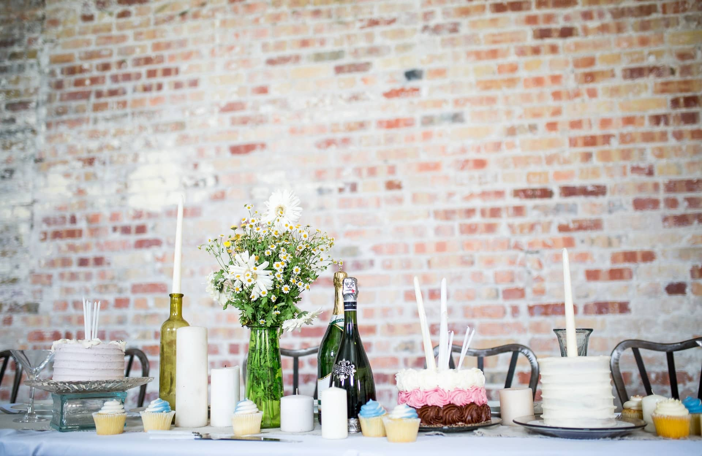

Вы скоро празднуете свой день рождения или хотите организовать вечеринку для своих близких? Детальное планирование - залог того, что ваш праздник будет уникальным и надолго запомнится вашим гостям. Заблаговременная организация всех важных аспектов праздника - от выбора места проведения до организации питания и музыкального сопровождения - создает идеальные условия для успешного проведения торжества. Будь то круглый день рождения, тематическая вечеринка или детский день рождения: с нашей помощью вы сможете организовать и провести любой праздник.

## Шаг 1: Структура празднования дня рождения

Первые шаги по организации дня рождения лучше всего планировать примерно за **восемь недель** до его начала. В первую очередь необходимо определить основные принципы.

## Планирование даты празднования дня рождения

Прежде чем приступить к планированию деталей вечеринки, необходимо определить дату празднования дня рождения. Не ограничивайтесь точной датой рождения, но учитывайте возможность присутствия гостей. Если вы празднуете день рождения в кругу работающих взрослых, лучше всего выбрать **выходной** день (пятницу или субботу). Так ваши гости смогут в полной мере насладиться праздником, а на следующий день останется достаточно времени для восстановления сил и уборки. Проведение вечеринки в выходные дни также позволит гостям, живущим на небольшом расстоянии, удобно приехать и уехать.

Если вы планируете праздновать **день рождения ребенка**, то для этого вполне подойдет будний день. Если же именинник и большинство гостей - взрослые люди, то праздник может проходить вечером и продолжаться до ночи. При выборе подходящей даты учитывайте также праздничные дни и заблаговременно уточняйте наличие ближайших друзей и родственников.

## Составьте список гостей для празднования дня рождения

После того как дата празднования дня рождения определена, следует заранее составить список гостей. Прежде всего, решите, как Вы предпочитаете отмечать свой день рождения - в узком кругу самых близких друзей и родственников или более масштабно. При составлении списка гостей часто бывает полезно, чтобы в него входили **родственники, друзья, коллеги по работе и другие товарищи**. При этом необходимо убедиться, что между приглашенными гостями существует правильная атмосфера и нет возможности возникновения конфликтов. Независимо от того, на каких гостях вы в итоге остановите свой выбор: Составленный на ранней стадии список гостей создает четкие условия и облегчает дальнейшие шаги по планированию, такие как выбор места проведения мероприятия или расчет блюд и напитков.

## Девиз и дресс-код

**Девиз** и **дресс-код** не являются обязательными, но могут придать вашему празднику уникальный характер. Захватывающая и фантазийная тема создает основу для дальнейшего планирования, например, для выбора места проведения и меню. Сопровождающий дресс-код может задать гостям направление стиля. Таким образом, вы можете быть уверены, что никто из гостей не окажется слишком или недостаточно одетым на вашем празднике и не будет чувствовать себя неловко из-за своего наряда. Таким образом, дресс-код позволяет создать непринужденную атмосферу, которая положительно влияет на ход вечеринки.

Если вы ищете подходящий девиз, включая дресс-код, для вашей вечеринки, мы предлагаем вам несколько вдохновляющих вариантов:

- **Бал в масках** - таинственная атмосфера, как в старой Венеции
- **Голливудские звезды** - раскатайте красную ковровую дорожку для своих гостей
- **Вечеринка в стиле 90-х** - странные наряды и убойные ритмы
- **Девиз фильма или сериала** - от Disney до "Дома денег".
- **Цирк** - артисты, тигры и укротители в качестве гостей
- **Карнавал** - рейнские весельчаки или бразильская самба
- **Супергерои** - пригласите героев Marvel и DC

## Выбор и бронирование места для проведения дня рождения

Одним из важнейших моментов вашего праздника является место, где вы будете отрываться вместе со своими близкими. Ведь подходящее место - это то, что сделает ваш праздник незабываемым!

Выбор подходящего места проведения праздника часто оказывается непростой задачей, поскольку вариантов, казалось бы, бесконечное множество. Однако следует учитывать, что место должно соответствовать не только гостям, но и погодным условиям **сезона**, а также, если это применимо, тематике вечеринки. Поэтому сначала составьте список критериев, которым должно соответствовать потенциальное место проведения праздника. Подумайте также о том, чтобы провести вечеринку в собственных стенах, на открытом воздухе или в общественном месте. Это позволит сэкономить на **аренде** помещения и направить бюджет в другое место. Если вы все же остановите свой выбор на внешней площадке, то сможете значительно сузить круг возможных вариантов, исходя из установленных вами критериев.

Исключительное место для празднования дня рождения: аренда дома для проведения вечеринки у бассейна.

Для празднования дня рождения подходят не только **рестораны, бары или клубы**, но и более дешевые клубные помещения, **шашлычные и функциональные залы**. Для круглого дня рождения стоит рассмотреть и такие необычные места, как **винодельня**, **замок** или **дом отдыха**. Однако в этом случае придется также подумать о проезде и размещении гостей. Принимая окончательное решение о месте проведения праздника, всегда следует учитывать такие факторы, как количество гостей и прогноз погоды. Кроме того, в месте проведения торжества должно быть достаточно места для гостей и, при необходимости, танцевальная площадка для создания оживленной атмосферы. Как правило, **бронирование** места проведения торжества следует начинать как можно раньше, поскольку популярные места часто бывают заняты за несколько недель, а то и месяцев вперед.

## Рассылка приглашений

После того, как вы определились с датой, списком гостей и местом проведения дня рождения, основные составляющие вашего праздника уже решены. Значит, пора приступать к оформлению приглашений на Ваш незабываемый праздник! Благодаря составленному заранее списку гостей, вы сразу увидите всех приглашенных.

**Совет: Сохранить дату**  
При проведении крупных вечеринок по случаю дня рождения имеет смысл разослать приглашение с указанием даты гостям за несколько месяцев до праздника. Это повышает вероятность того, что как можно больше гостей примут ваше приглашение, спланируют вечеринку и вовремя возьмут отгулы.

Красивые пригласительные открытки - отличный способ заранее сообщить не только о дате и месте проведения дня рождения, но и о его теме, если таковая имеется. Если хотите, оформите приглашения индивидуально для каждого гостя. Это производит личное впечатление, усиливает предвкушение праздника и может увеличить количество принятых приглашений. Не забудьте сообщить гостям всю важную и уже зафиксированную информацию в приглашении и установить крайний срок для обратной связи. Это обеспечивает безопасность планирования и позволяет своевременно реагировать на отмены. Кроме того, в приглашении имеет смысл поинтересоваться аллергическими реакциями и пищевыми привычками гостей, а также уточнить, будут ли они присутствовать вместе со своим партнером и детьми.

## Шаг 2: Детали вашего праздника

После того как основные моменты празднования дня рождения выяснены, наступает время позаботиться о конкретных деталях праздника. На этом этапе особенно полезно своевременное планирование. Поэтому об основных вещах, таких как кейтеринг и музыкальное сопровождение, следует позаботиться как минимум за месяц до праздника.

## Планирование кейтеринга для празднования дня рождения

Пожалуй, самая важная часть любого праздника - это питание гостей. Ведь каким бы хорошим ни был праздник, никто не будет вспоминать о дне рождения, если он пройдет с пустыми руками и жаждой. Если вы празднуете день рождения, например, в **ресторане**, то все это можно легко спланировать. Все, что вам нужно сделать, - это согласовать с рестораном меню и напитки.

Однако если день рождения проходит у вас дома или в другом месте, то ответственность за организацию питания лежит на вас. Чтобы обеспечить достаточное количество еды и напитков, в первую очередь необходимо учитывать количество гостей. В зависимости от количества гостей вы можете готовить сами, нанять кейтеринговую службу или попросить гостей принести свои блюда и напитки.

### Возьмите организацию питания своих гостей в свои руки

Решение о самостоятельном обслуживании гостей требует больших усилий и зачастую нелегкого расчета количества продуктов и напитков. Поэтому для больших торжеств следует заблаговременно, за один-два дня, сделать покупки, испечь торты и приготовить блюда длительного хранения. Кроме того, при выборе блюд необходимо учитывать пищевые привычки, непереносимость и пожелания гостей.

Если вы не наймете помощников, вам придется самостоятельно подавать блюда и разливать напитки на дне рождения. Однако именно Вы должны быть в центре внимания на своем дне рождения. Поэтому для вечеринок с участием более 10 человек рекомендуется не проводить время на кухне, а наслаждаться праздником и проводить незабываемые часы в присутствии своих близких в этот особенный день.

### Нанять кейтеринговую службу

Особенно при проведении больших торжеств можно сэкономить время и стресс, наняв кейтеринг для своих гостей. Достаточно сообщить поставщику услуг общественного питания количество гостей, и он подготовит подходящее предложение в соответствии с вашими пожеланиями. Если наем кейтеринговой службы не вписывается в ваш бюджет, есть и более дешевый вариант - организация фудтрака. Это позволит обеспечить гостей вкусной едой прямо на месте. Принимая решение, не забудьте учесть обстановку и, если возможно, тематику дня рождения, а также позаботиться о том, чтобы всем гостям было чем полакомиться. Ниже вы найдете несколько вкусных предложений:

- Прием с шампанским и закусками
- Пальчиковые блюда и салаты
- Барбекю-буфет
- Бургеры и картофель фри
- Пицца и паста
- Торты и десерты

### Попросите гостей о помощи

Не менее удобное, но более дешевое решение - попросить гостей принести с собой еду и напитки. Таким образом, можно быстро создать щедрый "шведский стол" из салатов, закусок, тортов и других вкусностей. Кроме того, вы избавите своих гостей от отчаянного поиска подарков.

Тем не менее, вы, конечно, должны сами планировать ту часть кейтеринга, которая окажется слишком большой для отдельных гостей. К ним относятся коробки с напитками и горячая свежеприготовленная еда. Прежде чем приступить к закупкам, полезно поинтересоваться предпочтениями и пожеланиями гостей. Если вы определились с тематикой дня рождения, то и блюда и напитки должны быть подобраны в соответствии с ней.

## Атмосферная музыка и разнообразная вспомогательная программа

После того как вы позаботились о кейтеринге, необходимо также оперативно решить вопрос с развлечениями на вашем празднике. Атмосферная музыка и разнообразная программа сопровождения - залог хорошего настроения на любом празднике. В конце концов, кому нужен день рождения, на котором царит гнетущая тишина и скучные разговоры?

Если в вашем заведении есть колонки с отличным звучанием, вы можете сами задать настроение праздника, подобрав подходящий плейлист. Чтобы получить незабываемые впечатления, можно также нанять живую группу или диджея, которые разогреют атмосферу и заставят гостей танцевать. Возможно, у вас есть музыкант или диджей в кругу друзей, и вы можете не тратиться на привлечение стороннего исполнителя.

Живой оркестр - изюминка любого большого дня рождения.

Помимо хорошей музыки, набрать очки на вечеринке можно с помощью разнообразной вспомогательной программы. Популярными пунктами программы являются, например, такие:

- Вечерние игры или викторина
- Краткие выступления и обращения
- слайд-шоу с забавными фотографиями именинника
- Совместное пение или конкурс караоке
- Фотобудка или фотостена для сохранения воспоминаний о вечеринке

В зависимости от вашего бюджета предлагается множество вариантов. Будьте креативны и создайте незабываемые моменты для своих близких с помощью яркой музыки и развлечений.

## Оформление и оборудование места проведения праздника

Для того чтобы место проведения праздника выглядело достойно, важно продумать его оформление и обстановку. Независимо от того, где вы планируете отмечать день рождения - дома или на улице, - стильно оформленные помещения всегда будут смотреться выигрышно и позволят гостям чувствовать себя как дома. Особое внимание уделите украшению стола, праздничному освещению, цветам, цветочным композициям или гирляндам, которые, конечно же, можно подобрать в соответствии с тематикой вечеринки.

Помимо декораций, следует подумать и о достаточном количестве оборудования для вечеринки, проводимой не в ресторане. Например, для вечеринки в саду можно арендовать пивные шатры, столы или другие сидячие и стоячие места в компании, занимающейся прокатом оборудования для вечеринок. При самостоятельной организации дня рождения следует также подсчитать количество посуды, т.е. достаточно ли у вас бокалов, столовых приборов и тарелок. Кроме того, в месте проведения праздника должно быть достаточное количество туалетов для гостей.

## Шаг 3: Последние приготовления к празднованию дня рождения

Ваш день рождения все ближе и ближе, и вы уже уладили все детали? Тогда примерно за неделю до праздника самое время начать последние приготовления к незабываемому дню.

### Последние приготовления и поручения

По мере приближения знаменательного дня необходимо использовать оставшееся время для последних приготовлений и дел. Если вы проводите праздник в арендованном помещении, свяжитесь с организатором и обсудите подготовку на месте. Если вы организуете день рождения самостоятельно, начните готовить место проведения праздника, заберите арендованное оборудование и займитесь последними делами. Всегда поддерживайте тесный контакт с гостями, особенно если вы привлекали их к планированию. При необходимости обращайтесь к ним за помощью и своевременно сообщайте о любых неожиданных изменениях.

### Заключительный контроль

Когда до торжества остаются считанные дни, наступает время последней проверки. Все ли вы продумали? Заказан или куплен кейтеринг? Подготовлено ли место проведения? Проработайте шаг за шагом каждый пункт вашего [контрольного списка](https://de.wikihow.com/Eine-Geburtstagsparty-planen) и убедитесь, что ваш праздник полностью спланирован.

Вам еще нужно наверстать упущенное в некоторых областях? Нет проблем! Многие вещи можно сделать даже за несколько дней до вечеринки. Вы проверили все пункты и не нашли больше нерешенных задач? Значит, все готово к празднику, и нам остается только пожелать Вам незабываемого празднования дня рождения!

## Заключение

Планирование и организация дня рождения - то, что для многих кажется детской забавой, на личном опыте часто оказывается длительным и трудоемким процессом. Ведь если вы хотите устроить уникальный и незабываемый праздник, необходимо позаботиться обо всех важных приготовлениях как можно раньше. В условиях стресса можно забыть о важном человеке, заказать слишком мало еды и напитков или не уложиться в отведенный бюджет.

Чтобы уберечь вас от всех этих казусов и чтобы вы могли с нетерпением ждать предстоящей вечеринки, мы в SeaTable разработали [планировщик вечеринок](https://seatable.io/ru/vorlage/cedsmqybrkwqohspoicw-a/), с помощью которого вы сможете четко и структурированно подготовить свою вечеринку, не забывая при этом следить за своими гостями. Не стесняйтесь опробовать его, [зарегистрировавшись](https://seatable.io/ru/registrierung/) бесплатно.
