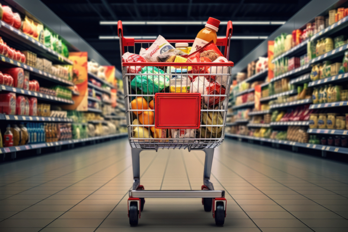

В суматошной повседневной жизни поход в супермаркет может превратиться в настоящее испытание между всеми профессиональными и личными обязательствами. В напряженные дни нередко можно забыть список покупок, который вы кропотливо составляли дома. Но не волнуйтесь - **цифровой список покупок/приложение** может стать эффективным средством в таких ситуациях.

Тем не менее, остается вопрос: какой цифровой список покупок/приложение лучше всего подойдет для удовлетворения ваших индивидуальных потребностей? В этой статье мы рассмотрим семь перспективных приложений, призванных облегчить процесс шопинга.

При правильной организации покупки не вызывают стресса.

## Почему списки покупок имеют смысл

В любой сфере жизни есть веские причины вести списки - и шопинг не является исключением. Тщательно составленный список покупок не только обеспечивает организационную структуру, но и имеет множество преимуществ для вашей повседневной жизни:

- **Экономьте деньги**: Если перед походом в магазин вы точно спланируете, что вам нужно, и, возможно, даже составите [недельный план](https://seatable.io/ru/meal-prep-gesund-und-guenstig-essen-vorkochen/), вы сможете сэкономить немало денег. Это значит, что вы больше не будете покупать случайные вещи, которые попадаются вам на глаза, а только то, что вам действительно нужно.
- **Экономьте время**: Если вы заранее спланируете покупки, составив список, у вас всегда будут под рукой все продукты, необходимые для ваших любимых рецептов, и вы ничего не забудете. Это сэкономит вам массу времени, потому что двойные походы в супермаркет останутся в прошлом.
- **Сведите к минимуму пищевые отходы**: По данным [Федерального министерства продовольствия и сельского хозяйства](https://www.bmel.de/DE/themen/ernaehrung/lebensmittelverschwendung/studie-lebensmittelabfaelle-deutschland.html), каждый потребитель выбрасывает около 78 килограммов продуктов в год. Возможно, вы также регулярно выбрасываете продукты, потому что они испортились или просрочены. Если вы будете покупать только то, что вам действительно необходимо в будущем, то и выбрасывать придется меньше. Планируя покупки с умом и делая [запасы](https://seatable.io/ru/notvorrat-anlegen/), вы помогаете не только себе, но и окружающей среде.

Чаще всего немцы выбрасывают фрукты и овощи.

## Приложения для составления списка покупок с первого взгляда

Вопрос о том, какой цифровой список покупок / приложение подходит именно вам, зависит от ваших потребностей. Мы определили критерии, по которым мы оцениваем следующие приложения. Помимо **четкости** и **дизайна**, мы также оцениваем **встроенные рецепты**, **актуальные предложения** и **интеллектуальные функции**.

Все протестированные приложения позволяют создавать несколько списков покупок. Затем вы можете легко поделиться этими списками с членами семьи, друзьями или соседями по квартире.

### 1\. список покупок

Приложение "Список покупок" идеально подходит для тех, кто не любит набирать текст на своем смартфоне. Благодаря функции **голосового ввода** вы можете просто набрать нужные продукты и избежать досадных ошибок при наборе текста.

Будь то управление и сортировка **категорий продуктов питания** или ваши **любимые рецепты**, которыми вы можете легко поделиться с друзьями и коллегами, - это приложение объединяет множество важных функций в одной.

**Преимущества**

- Хорошая четкость
- Аккуратный и эстетичный дизайн
- Интегрированные рецепты
- Текущие предложения
- Интеллектуальный поиск

**Недостатки**

- Отсутствие соответствующих недостатков

Вот так выглядит "Список покупок".

### 2\. принести!

Приложение Bring не только организует ваши еженедельные покупки, но и вносит щепотку разнообразия в ваше кулинарное разнообразие. Оно также напоминает вам о необходимости попробовать что-то новое, подсказывая и вдохновляя. Например, оно отображает продукты, соответствующие **текущему сезону** или **акциям**, таким как Veganuary.

В приложении вы также можете отправлять **заранее определенные сообщения** соседям, с которыми вы поделились списком покупок/приложением. Например, "Я иду за покупками! Последний шанс для корректировки" или "Срочные новости. Пожалуйста, принесите молоко!". Однако для работы этой функции необходимо, чтобы все участники процесса активировали авторизацию уведомлений в настройках своего смартфона.

**Преимущества**

- Понятный пользовательский интерфейс
- Аутентичный дизайн
- Интегрированные рецепты
- Текущие предложения
- Интеллектуальная сортировка

**Недостатки**

- Отсутствие соответствующих недостатков

Приложение для списка покупок "Принеси!".

### 3\. пон

Это приложение понравится любителям технологий, ведь оно сочетает в себе множество **умных функций**. Помимо таких сведений, как место покупки, обычная цена и цена по специальному предложению, вы можете установить напоминания о лучших сроках после входа в систему.

Кроме того, **анализируются** не только предпочтения и привычки пользователя, но и время, когда товары понадобятся снова. Вы также можете активировать уведомления, чтобы приложение распознавало ваше местоположение и уведомляло вас, когда в вашем списке покупок есть нужный товар и вы находитесь рядом с подходящим супермаркетом.

**Преимущества**

- Сортировка по магазинам
- Интегрированные рецепты
- Текущие предложения
- Множество интеллектуальных функций

**Недостатки**

- Отсутствие иконок продуктов

Список покупок в "пон"

### 4\. toBuy

Это приложение идеально подходит для всех пользователей Apple Watch и темных любителей моды. Используйте **шаблоны**, чтобы сэкономить время, особенно если вы часто покупаете одни и те же вещи, или добавляйте **фотографии** к своим товарам.

Если вы сохраните **рецепты** в приложении, то в следующий раз сможете добавить недостающие ингредиенты в список покупок практически без усилий.

**Преимущества**

- Очень хорошая четкость
- Темный режим
- Интегрированные рецепты
- Виджет

**Недостатки**

- Нет предложений
- За неограниченное количество списков и шаблонов взимается плата

Приложение "ToBuy" в темном режиме

### 5\. weNeed

По сравнению с другими, это приложение немного более компактное. Так что если вам не нужно много колокольчиков и свистков, а хочется сосредоточиться на основной функции, это приложение для составления списка покупок - правильный выбор.

Хотя здесь можно создавать **различные группы** и **настраивать сортировку**, умные функции, предложения и рецепты полностью отсутствуют.

**Преимущества**

- Наглядная презентация
- Изображения продуктов

**Недостатки**

- Без рецептов
- Нет предложений
- Отсутствие интеллектуальных функций

Приложение "WeNeed"

### 6\. приложения для заметок в зависимости от смартфона

Проверенный вариант - встроенные в смартфон приложения, такие как **Reminders**, **Samsung Notes** или **Google Notes**. Благодаря **интуитивному использованию** и тому факту, что они часто используются для других заметок, они являются хорошим вариантом для тех, кто любит записывать свои списки покупок **в простой форме**.

Функции здесь могут различаться в зависимости от бренда. Однако обычно они состоят из списка, который можно **отметить галочкой** - как правило, без группировки и категорий.

**Преимущества**

- Минималистичный дизайн

**Недостатки**

- Отсутствие встроенных рецептов
- Нет предложений
- Отсутствие интеллектуальных функций

Приложение "Заметки" как список покупок

### 7 SeaTable

SeaTable предлагает [шаблон](https://seatable.io/ru/vorlage/rw6cogmdrjyl-j0w3sjraw/), который дополняет обычный список покупок множеством других функций. Здесь вы можете не только **отмечать** товары, но и вводить **рецепты** и загружать **фотографии**.

Цифровой список покупок / приложение также поможет вам лучше следить за финансовыми аспектами ваших покупок. Например, вы можете распределять товары по определенным категориям или магазинам и **записывать цены**, которые суммируются для каждого супермаркета и покупки. С помощью встроенной **статистики** вы сможете вести четкий учет своих расходов.

**Преимущества**

- Сортировка по магазинам
- Категоризация цветов
- Интегрированные рецепты
- Статистика

**Недостатки**

- Нет предложений

### Заключение

Подводя итог, можно сказать, что выбор подходящего приложения для составления списка покупок зависит от ваших предпочтений и потребностей. Хотя у каждого из протестированных приложений есть свои сильные и слабые стороны, их объединяет одно - они облегчают вашу повседневную жизнь и помогают совершать покупки без стресса.
