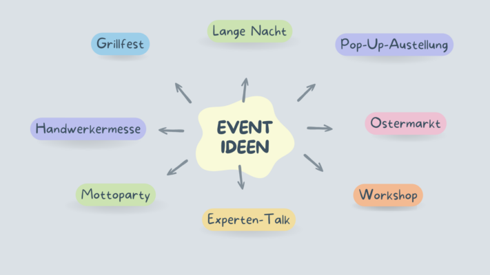
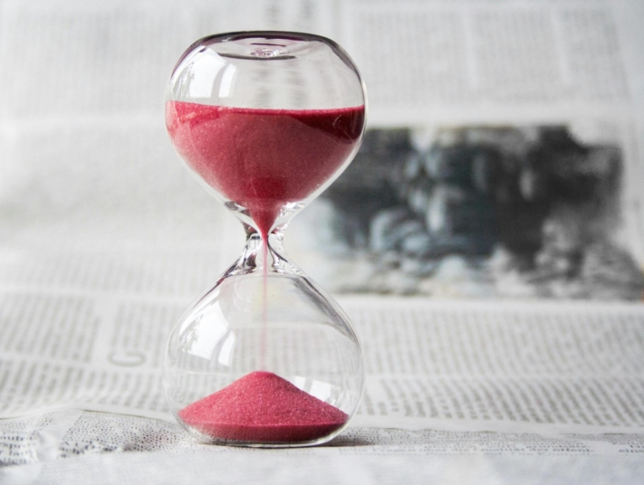
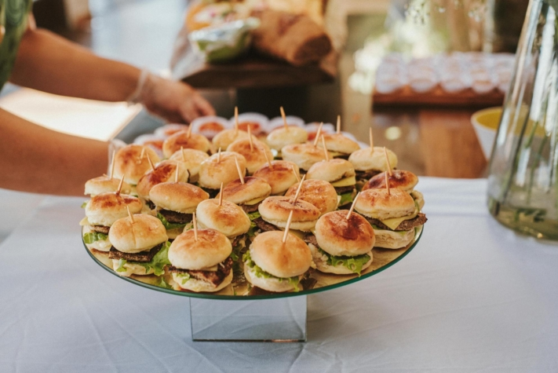
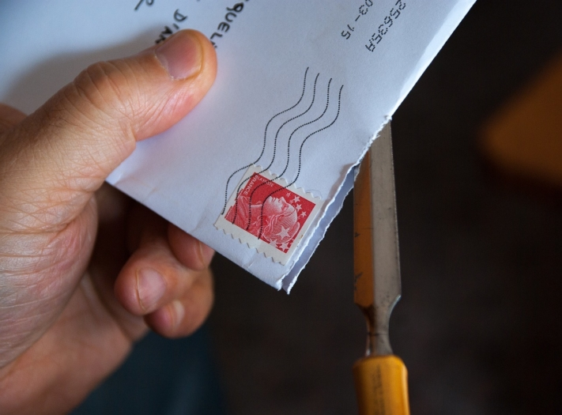

Si quiere planificar el evento perfecto, hay mucho que tener en cuenta. Pero, ¿por dónde empezar si no está familiarizado con la gestión de eventos? ¿Y cómo evitar errores de planificación, conflictos de programación y cancelaciones?

No existe un calendario universal para la multitud de acontecimientos: todos difieren en muchos pequeños detalles. No obstante, este artículo ofrece una visión general de los pasos esenciales que debes tener en cuenta a la hora de planificar.

Planificar un acto implica mucho trabajo de organización.

## 1\. definir el objetivo del acto

Lo primero que es crucial en la gestión de un acto es formular claramente el objetivo del mismo. ¿Cuál es la razón por la que planifica este acto? ¿Quiere generar **ingresos**? ¿Quiere aumentar la **notoriedad de su marca** o **la fidelidad de sus clientes**? ¿Quizá quiere lanzar un **nuevo producto** y utilizar el acto como plataforma para presentarlo a sus clientes?

También es importante determinar desde el principio qué tipo de acto está planeando. Tenga siempre presente si se trata de un acto para **empleados**, **clientes** o **público** .

Esta información le permitirá tomar decisiones con conocimiento de causa durante la fase de planificación y adaptar mejor el acto a su público objetivo.



## 2\. desarrollar el concepto

Al desarrollar su concepto, debe concentrarse en dos áreas principales: **organizativo** y **contenido**. En la parte organizativa, por ejemplo, determine **el tamaño** y la **duración** del acto. Distribuye las **responsabilidades** en tu equipo desde el principio para que no se descuide ni se pase por alto ninguna tarea.

Para el concepto de contenido, primero es importante desarrollar una **idea del evento** y, si es necesario, añadir un **tema** adecuado. El tema puede influir después en la decoración, el vestuario y el programa de entretenimiento. También hay que desarrollar el **programa** con cuidado para que los invitados estén siempre entretenidos y no se aburran. Un **tema** coherente es crucial para dar a su evento un toque profesional e impresionar a sus invitados.

Hay muchas maneras de organizar un acto.

## 3\. planificación presupuestaria

Para asegurarse de no planificar un evento que supere su presupuesto, en la organización de eventos es fundamental llevar a cabo con antelación una [planificación presupuestaria](https://seatable.io/es/budgetplanung-vorlage/) detallada. Ten en cuenta no solo los gastos obvios, sino también otros menos evidentes, como **licencias**, **gastos de viaje**, **invitaciones** y **costes de desmontaje y limpieza**.

**Los puntos de coste más importantes que debe tener en cuenta:**

- **Lugar:** costes de alquiler del local, incluidos los costes accesorios, como los servicios de limpieza o seguridad.
- **Tecnología:** Gastos de alquiler de tecnología de audio, vídeo e iluminación, así como costes laborales de técnicos o personal de apoyo.
- **Catering:** Presupuesto para comida y bebida, incluidos los gastos de servicio, propinas y cualquier gasto adicional por comidas especiales.
- **Marketing:** costes de publicidad, impresión de invitaciones o folletos, así como de publicidad en línea o promoción en las redes sociales.
- **Entretenimiento:** presupuesto para actuaciones en directo, DJ, artistas u otras formas de entretenimiento para el evento.

Si planifica y presupuesta cuidadosamente estos costes principales y los gastos adicionales de su evento, podrá asegurarse de que éste se ajuste a su presupuesto y de que no haya costes imprevistos. Si planificas un acto comercial, puedes utilizar estos datos como base para calcular **cuánto** tienes que cobrar para cubrir los costes.



## 4\. crear horario

Lo más importante en la organización de un evento es empezar a planificarlo con tiempo. Las reservas de locales o la coordinación de fechas con las empresas de catering requieren un tiempo de antelación considerable. Para evitar el estrés durante la planificación, es aconsejable elaborar un **calendario detallado**.

Un calendario de este tipo no sólo permite determinar exactamente cuándo hay que dar cada paso, sino también reconocer posibles retrasos en una fase temprana. Es importante prever un **margen** para compensar cambios imprevistos en el plan y minimizar así la presión del tiempo y el estrés.



El tiempo suele ser un recurso escaso en la gestión de eventos.

## 5\. encontrar la ubicación

Para planificar un acto con éxito, necesita un lugar adecuado. Tiene la opción de alquilar un local o utilizar sus propias salas. Es importante asegurarse de que hay **espacio suficiente** para todos los invitados, el catering, el escenario y la tecnología.

A la hora de elegir la ubicación adecuada, es fundamental tener en cuenta las **necesidades de su grupo objetivo**. Por ejemplo, compruebe si hay suficiente **espacio para aparcar** o si el local es **accesible para personas con discapacidad**. También es posible que necesite un jardín u otros requisitos específicos que sus invitados agradecerían.

## 6\. reservar el catering y el programa

Por regla general, los invitados hambrientos son invitados insatisfechos. Por eso es importante ofrecer un servicio de catering si es posible. Hay varias opciones entre las que elegir, desde **buffets** y **menús** hasta **comida para picar** o incluso **food trucks**. No obstante, asegúrate de ofrecer también alternativas vegetarianas y veganas para satisfacer las necesidades de todos los invitados.

Existen numerosas formas de hacer más interesante su programa de apoyo y garantizar que sus invitados se diviertan. Además de los **artistas del espectáculo**, las **bandas en directo** o **los DJ** pueden crear un buen ambiente. Los **conferenciantes** y **presentadores** ofrecen una forma elegante de guiar a los visitantes de su evento a través del mismo. Con el **servicio de guardería** puede asegurarse de que los invitados de todas las edades disfruten de su evento.

Los pequeños aperitivos son ideales para una recepción.

## 7\. enviar invitaciones

Si está organizando un evento, las invitaciones desempeñan un papel decisivo en su éxito. Si utiliza **invitaciones personalizadas**, podrá aumentar eficazmente el número de asistentes. Además, el envío de **notificaciones de "Reserve la fecha** " en la gestión de eventos puede ayudar a generar interés con antelación y garantizar que sus invitados mantengan la fecha libre.

No olvide incluir en las invitaciones **información importante** como la fecha, la hora, el lugar y el programa. Para facilitar el proceso de reserva a sus invitados, es una buena idea integrar un **sistema de reserva de entradas**. Con un [formulario web](https://seatable.io/es/docs/webformulare/webformulare/) en [la plantilla](https://seatable.io/es/event-planen/#Fazit) preparada [de SeaTable](https://seatable.io/es/event-planen/#Fazit), puede implementar fácilmente este paso y permitir un registro sin problemas.

Puede enviar invitaciones tanto por correo como digitalmente.

## 8\. comercialización

Para asegurarse de que al final su acto cuente con una gran asistencia y de que todo el esfuerzo de planificación haya merecido la pena, es esencial hacer una amplia publicidad del mismo. Utilice todos los canales a través de los cuales pueda llegar mejor a su público objetivo.

Para los [actos](https://seatable.io/es/weihnachtsfeier-2023/) internos de [los empleados](https://seatable.io/es/weihnachtsfeier-2023/), puede utilizar **avisos de** la empresa, anuncios en el **boletín** o **invitaciones por correo electrónico**, por ejemplo. También puede pedir a los directivos que mencionen el evento en las **reuniones de equipo** para que se **difunda**.

En el caso de eventos comerciales como festivales, tiene sentido la publicidad selectiva a través de **plataformas de medios sociales**, **anuncios** en **revistas** relevantes y una referencia en su propio **sitio web**. Si planea una [exposición de arte](https://seatable.io/es/ausstellungs-und-kunstmanagement-museum-galerie/), puede confiar en **carteles**, **folletos**, **comunicados de prensa** y la inclusión en **revistas de arte y cultura**.

Es importante iniciar las medidas publicitarias a tiempo y preparar los mensajes de forma atractiva e informativa para despertar el interés de su público objetivo y conseguir un elevado número de visitantes.



## 9\. cumplir los requisitos legales y de seguridad

Para evitar meterse en problemas, debe prestar especial atención a los aspectos legales y a un concepto adecuado de seguridad en la gestión de eventos. Compruebe de antemano si se necesitan **autorizaciones oficiales** o pólizas de **seguro** para su evento. Si ofreces comida, debes cumplir la [Ley Alimentaria](https://www.gesetze-im-internet.de/lfgb/). Si va a utilizar música, debe comprobar si se requiere una [licencia de GEMA](https://www.gema.de/de). Si utilizas sistemas de registro o venta de entradas, asegúrate de que cumplen el Reglamento [General de Protección de Datos (RGPD](https://dsgvo-gesetz.de) ).

En los grandes eventos, es importante contar con planes de **protección contra incendios** o **emergencias médicas**, además de **personal de seguridad**, para que sus invitados no corran un peligro innecesario en caso de emergencia.

Infórmese a tiempo de las autorizaciones necesarias.

## 10\. disponer de un plan de emergencia

Un plan de emergencia es de gran importancia a la hora de planificar un acontecimiento. A pesar de una cuidadosa preparación, pueden surgir obstáculos imprevistos, como **condiciones meteorológicas extremas** u **obstáculos en el tráfico**. Por eso es esencial tener un **plan B** bien pensado para poder reaccionar adecuadamente ante cancelaciones o cambios espontáneos sin estar bajo presión de tiempo o estrés.

El día del evento, es aconsejable volver a llamar a sus proveedores de servicios para comprobar que todo va según lo previsto. También es importante mantener una **comunicación** regular con todos los implicados y asegurarse de que su equipo conoce el plan. Una comunicación clara y un equipo bien coordinado son la clave para poder reaccionar con rapidez y eficacia ante situaciones imprevistas y ejecutar el evento con éxito.

## Conclusión:

Para que su evento sea todo un éxito, es esencial tener en todo momento una visión clara de su planificación hasta la fecha y de los pasos siguientes. Con la [plantilla gratuita](https://seatable.io/es/vorlage/fewxqfzbsxocskxl7hikqq/) de SeaTable, no solo podrás planificar tu evento al detalle, sino también hacer un seguimiento de los costes, los ingresos y el presupuesto en todo momento.

El **formulario web** integrado facilita la inscripción de los participantes en su evento. Puedes crear y enviar **facturas** con un solo clic, sin tener que dedicar mucho esfuerzo. Además, la plantilla ofrece la opción de utilizar el plugin de **línea de tiempo** para la programación o el **plugin de mapa** para registrar visualmente las ubicaciones del evento.

Con estas funciones, SeaTable ofrece la solución ideal para optimizar la gestión de sus eventos. Lo único que tiene que hacer para utilizar la [plantilla](https://seatable.io/es/vorlage/fewxqfzbsxocskxl7hikqq/) es [registrarse](https://seatable.io/es/registrierung/) con su dirección de correo electrónico.
