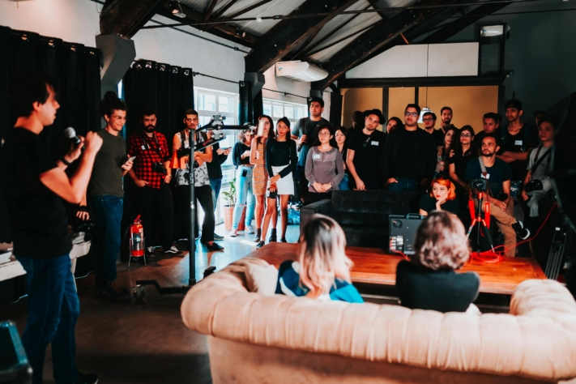
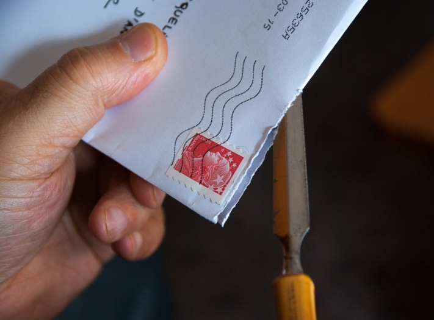

Si vous souhaitez organiser l'événement parfait, vous devez tenir compte de certaines choses. Mais par où commencer si l'on ne s'y connaît pas en gestion d'événements ? Et comment éviter les erreurs de planification, les collisions de dates et les annulations ?

Il n'existe pas de feuille de route universelle pour la multitude d'événements - ils se distinguent tous par de nombreux petits détails. Néanmoins, cet article donne un aperçu général des étapes incontournables à prendre en compte lors de la planification.

La planification d'un événement implique beaucoup d'efforts d'organisation.

## 1\. définir l'objectif de l'événement

La toute première chose à faire en matière de gestion d'événements est de formuler clairement l'objectif de l'événement. Quelle est la raison pour laquelle vous planifiez cet événement ? Visez-vous **des revenus**? Souhaitez-vous renforcer la **notoriété de votre marque** ou la **fidélisation de vos clients**? Peut-être lancez-vous un **nouveau produit** et utilisez-vous l'événement comme plate-forme pour le présenter à vos clients ?

Il est également important de définir dès le départ le type d'événement que vous prévoyez. Ayez toujours à l'esprit s'il s'agit d'un **événement pour vos collaborateurs**, pour **vos clients** ou pour **le public** .

Grâce à ces informations, vous pouvez prendre des décisions éclairées pendant la phase de planification et mieux adapter l'événement à votre public cible.



## 2\. développer le concept

Lors de l'élaboration de votre concept, vous devez vous concentrer sur deux points principaux : **sur le plan organisationnel** et **sur le plan du contenu**. Pour la partie organisationnelle, déterminez par exemple **la taille** de votre événement et sa **durée**. Répartissez dès le début les **responsabilités** au sein de votre équipe afin qu'aucune tâche ne soit négligée ou oubliée.

Pour le concept de contenu, il est d'abord important de développer une **idée d'événement** et de la compléter éventuellement par un **thème** approprié. Le thème peut ensuite avoir une influence sur la décoration, le code vestimentaire et le programme de divertissement. En outre, vous devez développer le **programme** avec soin afin de vous assurer que vos invités sont toujours divertis et ne s'ennuient pas. Un **fil rouge** constant est essentiel pour donner à votre événement une note professionnelle et convaincre vos invités.

Il existe de nombreuses façons différentes d'organiser un événement.

## 3\. planifier le budget

Pour éviter de planifier un événement qui dépasse votre budget, il est essentiel, en matière de gestion d'événements, d'effectuer une [planification budgétaire](https://seatable.io/fr/budgetplanung-vorlage/) détaillée au préalable. Prenez en compte non seulement les dépenses évidentes, mais aussi les coûts moins évidents tels que **les licences**, les **frais de déplacement**, les **invitations** ainsi que **les frais de démontage et de nettoyage**.

**Les principaux éléments de coût à prendre en compte :**

- **Lieu :** coût de la location des lieux, y compris les éventuels frais annexes tels que le nettoyage ou les services de sécurité.
- **Technique :** dépenses pour la location de matériel audio, vidéo et d'éclairage ainsi que les coûts salariaux des techniciens ou du personnel d'assistance
- **Restauration :** budget pour la nourriture et les boissons, y compris les frais de service, les pourboires et les éventuelles dépenses supplémentaires pour des demandes de repas spéciales.
- **Marketing :** frais de publicité, d'impression d'invitations ou de flyers ainsi que de publicité en ligne ou de promotion sur les réseaux sociaux.
- **Divertissement :** budget pour des prestations en direct, des DJ, des artistes ou d'autres formes de divertissement événementiel.

En planifiant et en budgétant soigneusement ces principaux postes de dépenses ainsi que les dépenses supplémentaires pour votre événement, vous pouvez vous assurer que votre événement reste dans les limites financières et qu'il n'y aura pas de coûts imprévus. Si vous prévoyez un événement commercial, vous pouvez calculer sur cette base **le montant des entrées** que vous devrez demander pour couvrir les frais.



## 4\. établir un calendrier

L'essentiel dans la gestion d'un événement est de commencer à planifier suffisamment tôt. En effet, les réservations de lieux ou les prises de rendez-vous avec les entreprises de restauration nécessitent un délai considérable. Pour éviter le stress lors de la planification, il est donc recommandé d'établir un **calendrier détaillé**.

Un tel calendrier vous permet non seulement de déterminer exactement quand telle ou telle étape doit être effectuée, mais aussi d'anticiper les retards potentiels. Il est important de prévoir une **marge** afin de pouvoir compenser les changements de plan imprévus et de minimiser ainsi les éventuelles pressions temporelles et le stress.



Dans la gestion d'événements, le temps est souvent une ressource rare.

## 5\. trouver un lieu

Pour que votre événement soit réussi, vous avez besoin d'un lieu adapté. Vous avez la possibilité de louer un lieu ou d'utiliser vos propres locaux. Il est important de s'assurer qu'il y a **suffisamment de place** pour tous les invités, le traiteur, la scène et la technique.

Lors du choix du bon lieu, il est essentiel de garder à l'esprit les **besoins de votre groupe cible**. Vérifiez par exemple s'il y a suffisamment **de places de parking** ou si le lieu est accessible **aux personnes à mobilité réduite**. Il se peut également que vous ayez besoin d'un jardin ou d'autres exigences spécifiques que vos invités apprécieraient.

## 6\. réserver le traiteur et le programme

En principe, les invités affamés sont des invités insatisfaits. C'est pourquoi il est important, dans la mesure du possible, de prévoir un service de restauration. Pour cela, vous avez le choix entre différentes options, des **buffets** aux **menus** en passant par les **fingerfoods** ou même **les food trucks**. Veillez toutefois à proposer également des alternatives végétariennes et végétaliennes afin de répondre aux besoins de tous les invités.

Pour rendre votre programme-cadre plus intéressant et faire en sorte que vos invités passent un bon moment, il existe de nombreuses possibilités. Outre **les artistes de spectacle**, **des groupes de** **musique** ou **des DJ** peuvent créer une bonne ambiance. **Les orateurs** et **les présentateurs** offrent une possibilité élégante de guider les visiteurs de votre événement. Avec une **garde d'enfants**, vous veillez à ce que les invités de tous âges puissent profiter de votre événement.

Les petites bouchées sont idéales pour une réception.

## 7\. envoyer des invitations

Lorsque vous organisez un événement, les invitations jouent un rôle crucial dans votre réussite. L'utilisation d'**invitations personnalisées** vous permet d'augmenter efficacement le nombre de participants. En outre, l'envoi de **notifications "Save the Date"** dans le cadre de la gestion d'événements peut contribuer à susciter l'intérêt à un stade précoce et à garantir que vos invités retiennent la date.

N'oubliez pas d'inclure dans les invitations des **informations importantes** telles que la date, l'heure, le lieu et le programme. Pour faciliter le processus de réservation pour vos invités, l'intégration d'un **système de réservation de billets** est une bonne solution. Grâce à un [formulaire web](https://seatable.io/fr/docs/webformulare/webformulare/) dans le [modèle](https://seatable.io/fr/event-planen/#Fazit) préétabli [de SeaTable](https://seatable.io/fr/event-planen/#Fazit), vous pouvez facilement mettre en œuvre cette étape et permettre une inscription sans problème.

Vous pouvez envoyer les invitations par voie postale ou numérique.

## 8\. faire du marketing

Pour que votre événement soit bien fréquenté et que tous les efforts de planification en valent la peine, il est essentiel de faire beaucoup de publicité pour votre événement. Utilisez tous les canaux qui vous permettront d'atteindre au mieux votre groupe cible.

Pour les [événements](https://seatable.io/fr/weihnachtsfeier-2023/) internes au [personnel](https://seatable.io/fr/weihnachtsfeier-2023/), vous pouvez par exemple utiliser **des affiches** dans l'entreprise, des annonces via la **newsletter** ou **des invitations par e-mail**. Vous pouvez également demander aux cadres d'évoquer l'événement lors des **réunions d'équipe** afin qu'il se répande dans **les couloirs**.

Pour les événements commerciaux tels que les festivals, une publicité ciblée via **les plateformes de médias sociaux**, des **annonces** dans des **magazines** pertinents et une mention sur votre propre **site web** sont utiles. Si vous prévoyez une [exposition d'art](https://seatable.io/fr/ausstellungs-und-kunstmanagement-museum-galerie/), vous pouvez miser sur **des affiches**, **des dépliants**, **des communiqués de presse** et l'intégration de **magazines d'art et de culture**.

Il est important de lancer les mesures publicitaires à temps et de préparer les messages de manière attrayante et informative afin d'éveiller l'intérêt de votre groupe cible et d'atteindre un nombre élevé de visiteurs.



## 9\. respecter la sécurité et les aspects juridiques

Afin d'éviter tout problème, vous devez accorder une attention particulière aux aspects juridiques et au concept de sécurité dans la gestion de votre événement. Vérifiez au préalable si **des autorisations administratives** ou **des assurances** sont nécessaires pour votre événement. Si vous proposez de la nourriture, vous devez respecter la [loi sur les denrées alimentaires](https://www.gesetze-im-internet.de/lfgb/). Si vous utilisez de la musique, vérifiez si une [licence GEMA](https://www.gema.de/de) est nécessaire. Si vous utilisez des systèmes d'enregistrement ou de billetterie, assurez-vous qu'ils respectent le [règlement général sur la protection des données](https://dsgvo-gesetz.de) (RGPD).

Lors de grands événements, il est important d'avoir, en plus du **personnel de sécurité**, des plans pour la **protection contre les incendies** ou **les urgences médicales**, afin de ne pas mettre inutilement vos invités en danger en cas d'urgence.

Renseignez-vous à temps sur les autorisations nécessaires.

## 10\. avoir un plan d'urgence

Un plan d'urgence est d'une importance capitale lorsque vous planifiez un événement. Malgré une préparation minutieuse, des obstacles imprévus peuvent survenir, comme par exemple des **conditions météorologiques extrêmes** ou **des problèmes de circulation**. Il est donc indispensable de disposer d'un **plan B** bien pensé pour pouvoir réagir de manière adéquate aux annulations ou aux changements spontanés, sans pour autant être pressé par le temps ou stressé.

Le jour de l'événement, il est conseillé de téléphoner à nouveau à vos prestataires de services pour vérifier que tout se déroule comme prévu. Il est également important de maintenir une **communication** régulière avec toutes les personnes concernées et de s'assurer que votre équipe est au courant du plan. Une communication claire et une équipe bien coordonnée sont essentielles pour pouvoir réagir rapidement et efficacement aux situations imprévues et réussir l'événement.

## Conclusion

Pour que votre événement soit un succès, il est essentiel d'avoir à tout moment une vue d'ensemble claire de votre planification passée et des étapes à venir. Le [modèle gratuit](https://seatable.io/fr/modele/fewxqfzbsxocskxl7hikqq/) de SeaTable vous permet non seulement de planifier votre événement en détail, mais aussi de garder une vue d'ensemble des coûts, des recettes et du budget.

L'utilisation du **formulaire web** intégré permet aux participants de s'inscrire facilement à votre événement. Vous pouvez créer et envoyer **des factures** en un seul clic, sans avoir à fournir de gros efforts. En outre, le modèle offre la possibilité d'utiliser le **plug-in Timeline** pour la planification du temps ou le **plug-in Card** pour garder une trace visuelle des lieux de l'événement.

Grâce à ces fonctions, SeaTable offre la solution idéale pour optimiser la gestion de vos événements. Tout ce que vous avez à faire pour utiliser le [modèle](https://seatable.io/fr/modele/fewxqfzbsxocskxl7hikqq/) est de vous [inscrire](https://seatable.io/fr/enregistrement/) avec votre adresse e-mail.
