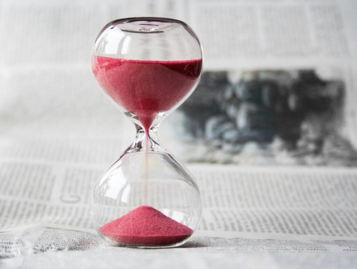

Se quiser planear o evento perfeito, há muito a considerar. Mas por onde começar se não estiver familiarizado com a gestão de eventos? E como evitar erros de planeamento, conflitos de agenda e cancelamentos?

Não existe um calendário universal para a multiplicidade de eventos - todos eles diferem em muitos pequenos pormenores. No entanto, este artigo fornece uma visão geral das etapas essenciais que devem ser consideradas no planeamento.

Planear um evento implica muito trabalho de organização.

## 1\. definir o objetivo do evento

A primeira coisa que é crucial na gestão de eventos é formular claramente o objetivo do evento. Qual é a razão pela qual está a planear este evento? O seu objetivo é gerar **receitas**? Pretende aumentar a **notoriedade da marca** ou **a fidelidade dos clientes**? Talvez esteja a lançar um **novo produto** e a utilizar o evento como plataforma para o apresentar aos seus clientes?

Também é importante decidir logo no início que tipo de evento está a planear. Tenha sempre em mente se se trata de um evento para **funcionários**, para **clientes** ou **público** .

Esta informação permite-lhe tomar decisões informadas durante a fase de planeamento e adaptar melhor o evento ao seu público-alvo.



## 2\. desenvolver o conceito

Ao desenvolver o seu conceito, deve concentrar-se em duas áreas principais: **organizacional** e **conteúdo**. No que respeita à parte organizativa, por exemplo, determine **a dimensão** do evento e a sua **duração**. Distribua as **responsabilidades** na sua equipa logo no início, para que nenhuma tarefa seja negligenciada ou esquecida.

Para o conceito de conteúdo, é importante, em primeiro lugar, desenvolver uma **ideia de evento** e, se necessário, acrescentar um **tema** adequado. O tema pode mais tarde influenciar as decorações, o código de vestuário e o programa de entretenimento. O **programa** deve ser cuidadosamente elaborado para garantir que os convidados estejam sempre entretidos e não se aborreçam. Um **tema** coerente é crucial para dar ao seu evento um toque profissional e impressionar os seus convidados.

Há muitas formas diferentes de organizar um evento.

## 3\. planeamento orçamental

Para garantir que não se planeia um evento que exceda o orçamento, é fundamental, na gestão de eventos, fazer um [planeamento orçamental](https://seatable.io/pt/budgetplanung-vorlage/) detalhado com antecedência. Ter em conta não só as despesas óbvias, mas também as menos óbvias, como as **licenças**, as **despesas de deslocação**, **os convites** e **as despesas de desmontagem e limpeza**.

**Os pontos de custo mais importantes que deve ter em conta:**

- **Local:** Custos de aluguer do local, incluindo quaisquer custos acessórios, tais como serviços de limpeza ou de segurança
- **Tecnologia:** Despesas de aluguer de tecnologia áudio, vídeo e iluminação, bem como custos de mão de obra para técnicos ou pessoal de apoio
- **Catering:** orçamento para alimentos e bebidas, incluindo taxas de serviço, gorjetas e quaisquer despesas adicionais para pedidos de refeições especiais
- **Marketing:** Custos de publicidade, impressão de convites ou folhetos, bem como de publicidade em linha ou promoção nas redes sociais.
- **Entretenimento:** Orçamento para actuações ao vivo, DJ, artistas ou outras formas de entretenimento do evento.

Se planear e orçamentar cuidadosamente estes pontos de custo principais e as despesas adicionais do seu evento, pode garantir que o seu evento não excede o orçamento e que não há custos inesperados. Se estiver a planear um evento comercial, pode utilizar isto como base para calcular **o montante** a cobrar para cobrir os custos.



## 4\. criar um calendário

O essencial na gestão de eventos é começar a planear com antecedência. As reservas de locais ou as marcações com empresas de catering requerem um período de tempo considerável. Para evitar stress durante o planeamento, é aconselhável elaborar um **calendário detalhado**.

Este calendário permite não só determinar exatamente quando é que cada passo deve ser dado, mas também reconhecer potenciais atrasos numa fase inicial. É importante planear uma **reserva** para compensar alterações imprevistas ao plano e, assim, minimizar a pressão do tempo e o stress.



O tempo é muitas vezes um recurso escasso na gestão de eventos.

## 5\. encontrar a localização

Para planear um evento com êxito, é necessário um local adequado. Tem a opção de alugar um local ou utilizar as suas próprias salas. É importante garantir que haja **espaço suficiente** para todos os convidados, para o catering, para o palco e para a tecnologia.

Ao escolher a localização correcta, é fundamental ter em conta as **necessidades do seu grupo-alvo**. Por exemplo, verifique se há **espaço de estacionamento** suficiente ou se o local é **acessível a pessoas com deficiência**. Pode também precisar de um jardim ou de outros requisitos específicos que os seus convidados apreciariam.

## 6\. reservar o catering e o programa

Regra geral, convidados com fome são convidados insatisfeitos. É por isso que é importante providenciar o catering, se possível. Existem várias opções à escolha, desde **buffets** e **menus** a **finger food** ou mesmo **food trucks**. No entanto, certifique-se de que também oferece alternativas vegetarianas e veganas para satisfazer as necessidades de todos os convidados.

Existem inúmeras formas de tornar o seu programa de apoio mais interessante e de garantir que os seus convidados se divertem. Para além dos **artistas de espectáculos**, **as bandas ao vivo** ou **os DJ** podem criar uma boa atmosfera. **Os or** adores e **apresentadores** oferecem uma forma elegante de orientar os visitantes do evento. Com o **acolhimento de crianças**, pode garantir que os convidados de todas as idades possam desfrutar do seu evento.

Os pequenos aperitivos são ideais para uma receção.

## 7\. enviar convites

Se está a planear um evento, os convites desempenham um papel decisivo no seu sucesso. Ao utilizar **convites personalizados**, pode aumentar efetivamente o número de participantes. Além disso, o envio de **notificações de "guardar a data"** na gestão de eventos pode ajudar a gerar interesse antecipadamente e garantir que os seus convidados mantêm a data livre.

Não se esqueça de incluir nos convites **informações importantes** como a data, a hora, o local e o programa. Para tornar o processo de reserva mais fácil para os seus convidados, é uma boa ideia integrar um **sistema de reserva de bilhetes**. Com um [formulário Web](https://seatable.io/pt/docs/webformulare/webformulare/) no [modelo](https://seatable.io/pt/event-planen/#Fazit) pronto a usar [da SeaTable](https://seatable.io/pt/event-planen/#Fazit), pode implementar facilmente este passo e permitir um registo sem problemas.

Os convites podem ser enviados por correio ou digitalmente.

## 8\. marketing

Para garantir que o seu evento seja bem participado e que todo o esforço de planeamento valha a pena, é essencial fazer uma ampla publicidade do seu evento. Utilize todos os canais através dos quais pode chegar ao seu grupo-alvo.

Para [eventos](https://seatable.io/pt/weihnachtsfeier-2023/) internos [dos empregados](https://seatable.io/pt/weihnachtsfeier-2023/), pode utilizar **avisos** da empresa, anúncios no **boletim informativo** ou **convites por correio eletrónico**, por exemplo. Pode também pedir aos gestores que mencionem o evento em **reuniões de equipa**, para que este se espalhe **.**

Para eventos comerciais, como festivais, faz sentido a publicidade direccionada através de **plataformas de redes sociais**, **anúncios** em **revistas** relevantes e uma referência no seu próprio sítio **Web**. Se estiver a planear uma [exposição de arte](https://seatable.io/pt/ausstellungs-und-kunstmanagement-museum-galerie/), pode contar com **cartazes**, **folhetos**, **comunicados de imprensa** e a inclusão de **revistas de arte e cultura**.

É importante iniciar as acções de publicidade atempadamente e preparar as mensagens de forma apelativa e informativa, a fim de despertar o interesse do seu grupo-alvo e obter um elevado número de visitantes.



## 9\. respeitar os requisitos legais e de segurança

Para evitar problemas, deve prestar especial atenção aos aspectos legais e a um conceito de segurança adequado na gestão de eventos. Verifique com antecedência se são necessárias **autorizações oficiais** ou apólices **de seguro** para o seu evento. Se oferecer comida, deve cumprir a [Lei da Alimentação](https://www.gesetze-im-internet.de/lfgb/). Se estiver a utilizar música, deve verificar se é necessária uma [licença GEMA](https://www.gema.de/de). Se utilizar sistemas de check-in ou de emissão de bilhetes, certifique-se de que estes cumprem o Regulamento [Geral sobre a Proteção de Dados](https://dsgvo-gesetz.de) (RGPD).

Em eventos de grande dimensão, é importante ter planos de **proteção contra incêndios** ou **emergências médicas**, para além do **pessoal de segurança**, de modo a que os convidados não fiquem desnecessariamente em perigo em caso de emergência.

Informe-se atempadamente sobre as autorizações necessárias.

## 10\. ter um plano de emergência

Um plano de emergência é de grande importância no planeamento de um evento. Apesar de uma preparação cuidadosa, podem surgir obstáculos imprevistos, como **condições climatéricas extremas** ou **obstáculos ao trânsito**. Por conseguinte, é essencial ter um **plano B** bem concebido para poder reagir adequadamente a cancelamentos ou alterações espontâneas sem estar sob pressão de tempo ou stress.

No dia do evento, é aconselhável contactar novamente os seus prestadores de serviços para verificar se tudo está a correr como planeado. É também importante manter **uma comunicação** regular com todos os envolvidos e garantir que a sua equipa está a par do plano. Uma comunicação clara e uma equipa bem coordenada são fundamentais para poder reagir rápida e eficazmente a situações imprevistas e para executar o evento com êxito.

## Conclusão

Para que o seu evento seja um sucesso total, é essencial ter sempre uma visão clara do seu planeamento até à data e dos próximos passos. Com o [modelo gratuito](https://seatable.io/pt/vorlage/fewxqfzbsxocskxl7hikqq/) da SeaTable, pode não só planear o seu evento em pormenor, mas também acompanhar os custos, os rendimentos e o orçamento em qualquer altura.

A utilização do **formulário Web** integrado facilita o registo dos participantes no seu evento. Pode criar e enviar **facturas** com apenas um clique, sem ter de fazer muito esforço. Além disso, o modelo oferece a opção de utilizar o **plugin de cronologia** para o agendamento ou o **plugin de mapa** para registar visualmente os locais do evento.

Com estas funções, o SeaTable oferece a solução ideal para otimizar a gestão dos seus eventos. Para utilizar o [modelo](https://seatable.io/pt/vorlage/fewxqfzbsxocskxl7hikqq/), basta [registar-se]() com o seu endereço eletrónico.
