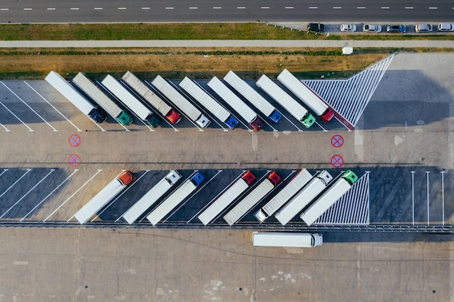

Whether trucks, buses or classic company cars: managing a fleet of vehicles is a multifaceted task for companies of all sizes and there are a number of things to consider. The following article is therefore intended to help clarify all your questions about **fleet management**.

## What is a vehicle fleet?

Your company's **vehicle** **fleet** includes all vehicles in your [inventory](https://seatable.io/en/inventarliste-vorlagen/). These are most frequently classic **company cars**. However, it can also include special vehicles: Buses and trains, trucks, construction site vehicles, forklifts, tractors or other vehicles.

There are two types of vehicles in fleet management:

- Pool vehicles that can be used by several people
- Company car driven by exactly one person

## What is fleet management?

Fleet management covers the complete organization of your [vehicle fleet](https://de.wikipedia.org/wiki/Fuhrpark), from acquisition to maintenance and disposal. Smooth fleet management also ensures the **profitability** and **maintenance of your business**. To do this, you need to look after existing vehicles, maintain them and have them repaired if necessary. To ensure that your vehicle fleet stands still as little as possible, you should manage your fleet efficiently and establish fixed fleet management processes.

Every company that owns company vehicles should have an efficient fleet management system. It doesn't matter whether you use the vehicles to **transport goods** or as **company cars** for business trips. **Commercial vehicles** such as ambulances, excavators and tractors are also among the use cases.

## Tasks in fleet management

How much effort is required for your fleet management depends entirely on **how large** your fleet is and **what** you use the vehicles **for** in your company. Freight forwarders and transport companies that coordinate hundreds of vehicles every day and depend on smooth operations for their business success will certainly organize their fleet management differently than companies that only need their fleet for their employees' business trips.

The purpose of fleet management (both public and private sector) is to make all processes involving vehicles as efficient and cost-effective as possible. This applies to **acquisition costs**, **operating costs**, but also **maintenance and repairs**. Another important task is the smooth and uncomplicated **allocation and reservation** of vehicles. You can use digital booking systems, for example, to facilitate the handover and document it seamlessly.

### What is part of fleet management?

- Needs assessment, acquisition and financing of vehicles
- Management of vehicle documents (vehicle registration documents, purchase contracts, insurance policies, etc.)
- Booking, allocation and route planning if necessary
- Returning and refueling the vehicles
- Commissioning and monitoring repairs and inspections
- Compliance with legal regulations (e.g. driver's license checks)

Let's now take a detailed look at various aspects and fleet management tips.

## Acquisition and selection of vehicles

**How many vehicles** does your company need? With fleet management, you ensure that a sufficient number of vehicles are always available in the right place when they are needed. Good indicators for this can be how many **employees** you employ **who are entitled to use company cars** or how many commercial vehicles need to be in use at the same time to fulfill certain orders.

The **image** you want to project is also important in fleet management. Luxury cars, for example for the management, may symbolize a certain status to the outside world, but can come across as arrogant to your own employees and customers. In most cases, the size of the vehicles also goes hand in hand with high **fuel consumption**: using smaller vehicles instead of gas-guzzlers in your fleet is therefore both a financial and a strategic aspect in view of the mobility transition.

**E-mobility** and **CO₂ emissions** are issues that have a certain importance in the public eye due to social and political discourse and create expectations among employees and customers. You should therefore keep the environment and sustainability in mind when managing your fleet. For short journeys, for example, you can also use smaller electric vehicles to protect the environment and conserve resources.

## Financing your vehicle fleet

When purchasing a vehicle, you should of course think about financing. There is no general answer as to whether **buying or leasing** is the better option. One advantage of leasing is that you have less capital tied up, whereas you own the vehicles yourself after purchase.

The **administrative burden** is usually lower with leasing, as many car rental companies offer tailor-made services in their contracts and take care of certain fleet management tasks that you would otherwise have to do yourself. Depending on the situation, leasing can therefore be cheaper than buying with credit financing, for example.

**Insurance** also comes with high running costs in fleet management. However, you do not have to insure each of your vehicles individually. If you have three or more company vehicles, you can benefit from group contracts for car insurance, which can reduce costs and administrative work.

## Fleet management and data protection

As you probably know, you must comply with the **General Data Protection Regulation (GDPR** ) wherever you collect and store personal data. In fleet management, data protection comes into play at many points. It is therefore advisable to obtain a **declaration of consent** from the driver before the vehicle is handed over. Make everyone aware of what data you will store about them, for what purpose and for how long.



For tax reasons in particular, you need to be able to track the specific **use of vehicles**. When did which employees use which company cars? And very importantly: were the journeys for business or private purposes? To document this information carefully and in compliance with the GDPR, a [digital logbook](https://seatable.io/en/digitales-fahrtenbuch-fuehren/) is the ideal solution.

Furthermore, you must check the driver's licenses twice a year to ensure that they are **valid**. You may not only inspect the driving licenses, but also scan or photocopy them. This also shows how much sensitive data is involved in fleet management, which you must store responsibly.

## Systems for your fleet management

You have various options to choose from for managing your vehicle fleet. The software solution should meet several requirements: Firstly, it should be **flexible** and therefore applicable to your individual scenarios. It should also be able to record different types of information (e.g. files, images and GPS data) while remaining easy **to use**.

The requirements for such software vary depending on the size of the company. Large companies such as transport companies or haulage firms can fall back on special **industry solutions**, but these are often expensive. Smaller companies with a manageable fleet, however, do not have to go to the expense of an expensive fleet management system.

The database software **SeaTable** makes free fleet management possible for small companies. The cloud-based and GDPR-compliant solution is ideal for managing small to medium-sized fleets, for example of craft businesses or other companies that have employees in the field.

## Manage your fleet with SeaTable

Keep track of your entire fleet! With our free [fleet management software](https://seatable.io/en/vorlage/qsxitf8ktcojsuivrormnq/), you can catalog your vehicles and handle all fleet management processes in no time at all. Conveniently and easily document bookings, returns, repairs and appointments for your vehicles.

SeaTable offers you clear and intuitive management of your fleet and incoming booking requests. This means you always have an overview of which vehicles are available at what time and the status of your fleet.

[Register for free](https://seatable.io/en/registrierung/) and try SeaTable and the flexibly customizable template for your fleet management today!

## FAQ



What is a vehicle fleet?|||

A vehicle fleet refers to all the vehicles owned by your company.

\--- 

What is fleet management?|||

Fleet management refers to all processes that affect your vehicle fleet.

\--- 

What does fleet management involve?|||

Fleet management begins with **an assessment of** how many vehicles your company **needs** and then clarifies the **financing, purchase or sale of** the vehicles. It must ensure the careful **management of vehicle documents** (vehicle registration documents, purchase contracts, insurance policies, etc.) and the **GDPR-compliant storage of driver data** (e.g. movement data, fuel receipts, driving licenses). Day-to-day business involves smooth **booking, handover and route planning** as well as any **repairs and inspections**.

\--- 

What does fleet management cost?|||

This depends on the size of your vehicle fleet and therefore cannot be answered in general terms. However, you should be aware that you will have to take care of the entire fleet management yourself if you **buy** vehicles. When **leasing**, car rental companies can take on extensive services such as insurance and inspections if you wish.


