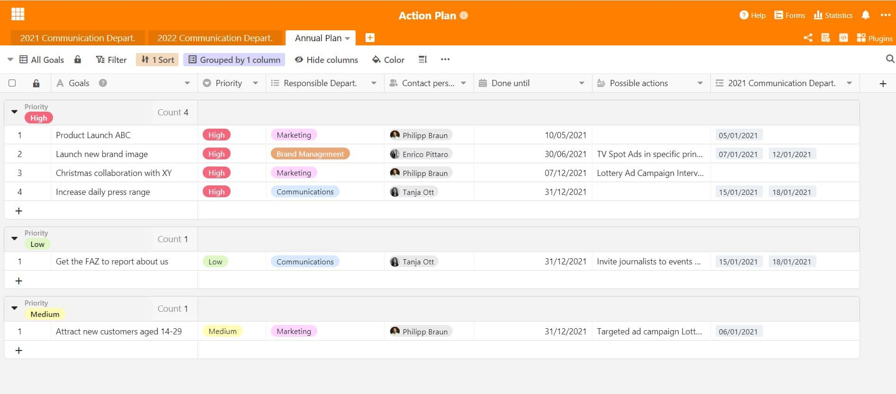

In order for companies to grow and develop, they constantly set themselves new goals and work towards them with all their resources. The action plan is a proven method for achieving these goals - for example in [project management](/en/projekt-management/), finance & controlling and [marketing](/en/marketing/).

## What is an action plan?

An action plan is a very powerful tool for achieving goals within organisations. The overview in the plan serves to structure activities and records when they are to take place, by whom, under what conditions and where exactly. It can thus be understood as a kind of [to-do list](https://seatable.io/en/to-do-liste-online/) and communication tool for the entire company. In this way, different measures can be defined for different goals, which the employees in the company can use as a guide and with which they can work concretely. In this way, goals do not remain just visions, but with the right efforts and an efficient action plan, they become reality in no time.

### And why is an action plan important for companies?

The plan helps to implement the corporate strategy on many levels and provides orientation for everyone. After all, how else are employees supposed to know what exactly needs to be done? Without a plan, pursued goals can only be achieved with great difficulty, which is why a collected plan of activities is very important. It does not always have to be about the whole company or the annual plan. Action plans can also be used departmentally, for example to increase employee satisfaction or for progress in change management. In the big picture, action plans offer these key benefits:

### Clear structure

An action plan helps employees and the company to keep track of all measures and deadlines in a structured way.

### Efficient processes and workflows

It always helps to cut the elephant into small slices. A clear action plan makes processes and workflows more efficient.

Every task and every measure needs a clear responsibility. The action plan helps to define this responsibility from employee to task and to make it transparent for everyone.

## Action plan as a versatile tool

An action plan can be applied across the company when formulating corporate goals on a large scale. But it can also be used in a variety of ways in [project management](https://seatable.io/en/projektmanagement/), and in the most diverse contexts. The action plan is useful wherever there are projects to manage: for example, in the short term, when measures for specific goals are to be developed in a workshop, for example for the next advertising campaign for a product. Or also in the long term, if a defined strategy is to be pursued, such as in [marketing](https://seatable.io/en/marketing/) or in the communications department, when it comes to strategic external communication.

Companies need to plan their external appearance very well, and preferably well in advance. It must be clear: When are special events taking place that we need to communicate? When are important dates and who is involved? This usually happens in the marketing or communications department, where external communication and marketing measures are planned and implemented. The importance of an [action plan for the company](https://www.fuer-gruender.de/wissen/unternehmen-gruenden/aussenauftritt/externe-kommunikation/) and the PR strategy cannot be underestimated.

Annual planning for activities in companies must be done in good time for the whole year. Using an action plan for annual planning can be very helpful here - not only can annual goals be formulated and set, but ideas for implementing them can also already be collected.

### Application in external communication

In the corporate communication department, communication activities often need to be planned a year in advance. To develop a good communication strategy, communication staff need a detailed plan of all the important dates in the year, which are usually recorded in tables. A communication activity can be planned for each date:

- Press releases
- Advertorials
- Social media posts
- Get together events with journalists
- Company magazine
- Advertising campaigns

In addition, the communications department is in most cases also the press office and the contact person for the public on all company-related issues. Employees in communications should therefore always know when public appointments are taking place.

An action plan can be a very good remedy for this. All these dates are noted there so that appropriate measures can be derived from them and it can be clarified what form of action will be taken in response to an event. For the clarity of the year, it is helpful to map all calendar days, because you will notice: On almost every day of the week there is something that could be important for your communication strategy.

## Action planning made easy with SeaTable

With our [SeaTable template for an activity plan](https://seatable.io/en/vorlage/hntk-vocrksmyj-9746vka/), you always have every appointment and every activity in view. Design the plan according to your wishes and activity plans. You can link your measures to your (annual) goals in the same document in no time at all - so you have all the information in one place.

Our template essentially consists of a 365-day calendar with marked weekends and holidays, in which you can easily enter everything related to your planning. This has the advantage that you can look at the days of the week and months in a holistic view. This gives a better overview of when and at what intervals a particular appointment or activity is to take place and makes annual planning easier. For detailed project planning, time, place, responsible persons and departments as well as important to-do's are integrated in the columns. In this way, the course of individual measures can be planned very precisely and important dates are always within reach with just a few clicks. You will see: With SeaTable, planning for the whole year is perfectly structured and organised.

The overview in the action plan

Not only does your schedule find space here, but also your planned projects and goals at the same time. You can create these in another spreadsheet and continuously document progress. The practical thing: The staff column allows you to hand over tasks and projects directly to the responsible persons in order to avoid chaos. This way you ensure that everything is done on time and all employees know what their tasks are. This way you ensure an ideal workflow where nothing gets lost.

Visualise and advance goals in your action plan

With the flexibility of SeaTable and the many design options, creating an action plan is child's play. Goals can be linked across the board, as can annually recurring deadlines or measures. Use it to vision your strategy and implement your plans directly and effectively.

Start directly and [download our template](https://seatable.io/en/vorlage/hntk-vocrksmyj-9746vka/) for an action plan into your cloud today! Benefit from the versatile functions of SeaTable. You will never lose sight of your goals and measures again!
