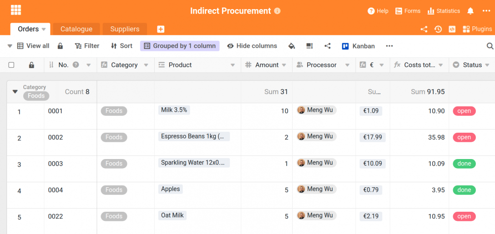
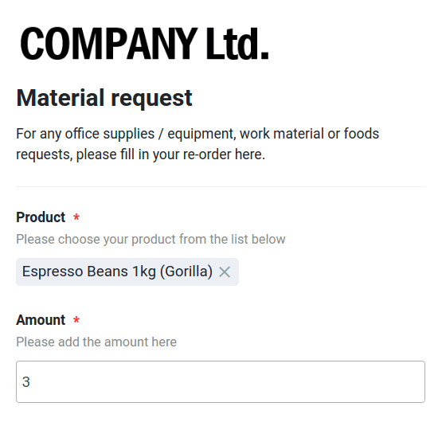
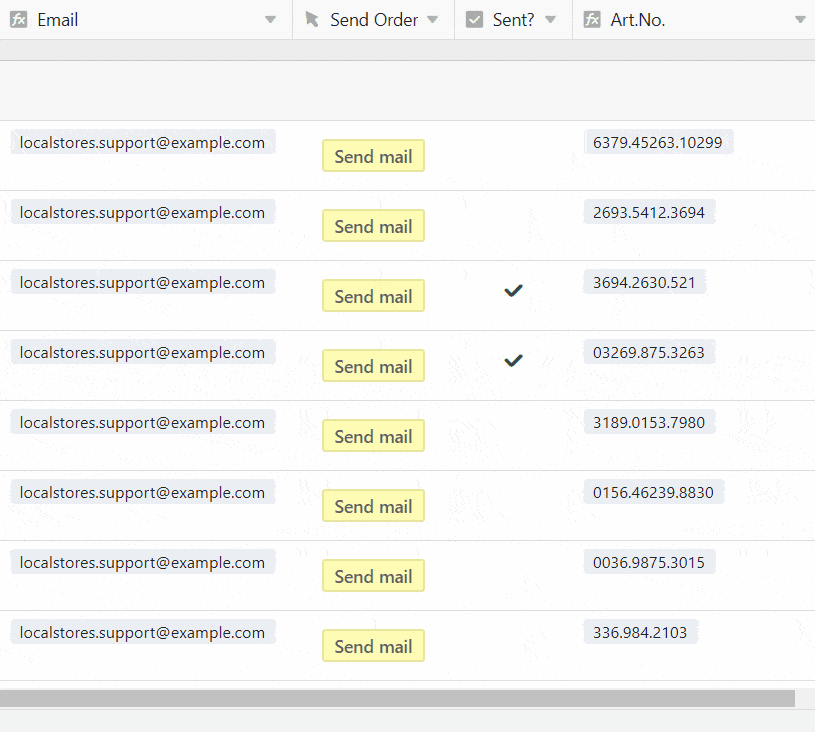
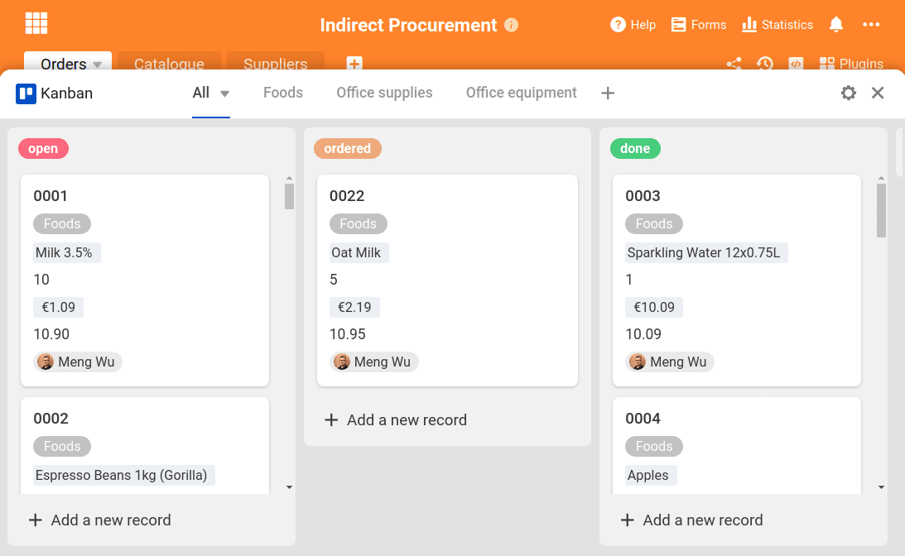
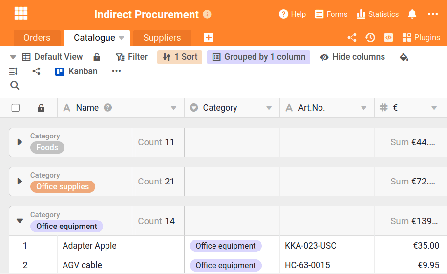

It is present in every company in one way or another: indirect purchasing. It includes the procurement, ordering and complete management of all goods and merchandise that are not resold, but remain within the company and are needed for the internal operations of the office organization. Typical examples of indirect material are:

- Work tools such as pens, pencils, notebooks
- Office equipment, e.g. printer paper or printer cartridges
- All food for the office kitchen
- Office equipment such as chairs or cabinets
- IT devices such as notebooks or computers

Research shows that indirect procurement can account for between [15 and 30% of internal spend](https://www.wlw.de/de/inside-business/praxiswissen/einkaeufer-ratgeber/indirect-procurement-verdient-viel-mehr-aufmerksamkeit).

At the same time, much less attention is usually paid to indirect purchasing, in contrast to direct purchasing, where a lot of effort is put into optimisation and cost savings.

The challenge in any business is to procure indirect materials efficiently and cost-effectively. On the one hand, consumables such as pens, coffee beans and printer paper need to be reordered in time before they are used up. These are working materials that are subject to daily demand and therefore always need a supply. On the other hand, some items have to be ordered separately and on demand, such as computers, noise-cancelling earphones or IT cables. The solution for a smooth process: A central office organisation of all internal goods orders via SeaTable!

With SeaTable you have all important information, products and orders in one place. Here you create your own product catalog for your internal purchasing, take orders via web form and execute orders with one click. You don't have to start from scratch, but can start directly with our [template](https://seatable.io/en/vorlage/cZ9GFdImRsiJRyyTD_5T9A/) from the Operations section.

## Indirect procurement: Keep the overview

Our template consists of three tables that are all interrelated and pass information to each other. The first table is the basis for the web form that your employees can use for all orders. The second table consists of a detailed product catalogue containing all the goods needed in the company for internal purposes - from pencils to computer mice. The third table contains all suppliers of the goods with the important contact details. **With these three set screws**, your office organisation will very soon become a breeze.

The fact that all tables are linked to each other is possible with the linked columns. This handy feature simplifies data organization within a base: Data that is needed in each table, such as the price of a product, can be created in one table and played out in all other tables. If the price changes in the source table, it also changes in all other tables due to the link. Thus information does not have to be entered several times, but regulates itself!

In this table a lot of information comes together: The columns "Product", "€" for the price, "Email" and "Art.No." for the article number all pull their data from the remaining two tables that are there in the original. In this way, a data entry can be used sensibly and equally in several places.

## Order goods with the integrated web form

The table with its columns also provides the basis for the integrated [web form](https://seatable.io/en/docs/handbuch/seatable-nutzen/webformulare/) for your office organization. For an order of internal material, the employees select a product from the list - this is the linked column "Products" from the product catalog (Table 2). After that, they only specify the quantity and in which department they work, so that the orders remain clear.

Each submitted form immediately ends up in Base and is created as a new row . The employees have to enter relatively little information, although a lot of information is stored in the table itself. This is where the linked columns come into play.

> **For professionals:** The linked columns can also be used to create the linked formula columns, which, for example, reflect the values of a certain row , add up or output the maximum value. With a new entry in the order list and the selection of a product, properties of this product, such as the category, the item number and the price of the product, are also automatically displayed.

Here, therefore, no manual assignment of the information must take place; it is simply taken from the other tables and reproduced here. From the table "Suppliers" the email address of the corresponding supplier of the goods is extracted. This will be needed later for the ordering process. No more tedious transfer of data - SeaTable already takes care of all this for you automatically and makes your office organization much easier.

## Automatic rules: Simplify, automate, notify

To make your office organisation even better and smarter, we have worked with our automation rules and notification rules. These rules automate processes under certain conditions and notify members in your team when appropriate events occur, which you define in the rules themselves.

With a first rule we have defined that for each newly created row in table 1 ("Orders") the option "open" is automatically set for the column "Status". This means that every order is directly marked as open and thus all processors know that it is not yet done.

The other automation rules automatically assign each order to the correct agent in our template. This works as follows:

1. As a condition, it must be selected that an action happens for each newly added row with the following condition. This is then the trigger that triggers the action.
2. In our example here on the right, the action is triggered when the category is "Foods".
3. The subsequent action is that a specific employee is then entered in the "Agent" column.

As soon as an order is received in which, for example, apples are ordered, SeaTable recognizes through the linked columns that the associated category is "Foods" and then automatically enters the correct processor with the automation rule. This is especially important for the next rule: the notification rule.

This rule automatically notifies all participants by e-mail if there are any changes. Due to the specification of the automation rule (we have created a rule for each category), only the agents receive a notification when exactly their category is claimed in the order. This way, the other colleagues are not bothered with annoying emails that do not concern their internal purchasing.

## Indirect procurement: forward orders with one click

With SeaTable you also have the possibility to send automated emails with just one click. This is not only very helpful in internal purchasing. To do this, you first need to add your email account to your Base. This can be done via the three dots at the top right -> Settings -> Third-party providers. Here you can add your email account according to the specifications of your email provider. Once this step is done, you can use the button column to create a button for sending emails.

Here's how it works:

1. Create column and select action "Send email
2. Select the integrated email account from which the mail is to be sent.
3. Select subject, email text and recipient

> **Für Profis:** Sie können dabei mit Nasenklammern direkt Spalteninhalte wiedergeben, was besonders bei der Email-Adresse sehr wichtig ist. Mit {Email} beziehen wir uns in unserer Vorlage auf die zuvor eingefügte Email-Adresse der Lieferanten, die aus Tabelle 3 gezogen wird. Die Inhalte aus Spalten können Sie auch im Betreff und dem Text der Email benutzen, wie etwa den Produktnamen und die Menge der bestellten Güter (also etwa: “Wir möchten das Produkt {Product} mit der Menge {Amount} bestellen”). Auf diese Weise vereinfachen Sie Ihre Büroorganisation ungemein, da Sie keine manuellen Emails mehr schreiben müssen, in der alle Bestellungen mühsam übertragen werden müssen.

## Individual views and Kanban provide a better overview

SeaTable would not be an optimal solution for office organization if it did not have a clear and practical function for task management as well. First, we create different [views](https://seatable.io/en/docs/handbuch/seatable-nutzen/ansichten/) for each agent, so that only the orders that are relevant for him are visible. For example, a processor for office equipment does not need to see the orders for food. This can be done by clicking on the small arrow in the upper left corner, in our example titled "View all".

With a filter, the corresponding persons for whom the view is intended are set. Thus, only those orders are displayed that also belong to oneself - this helps to maintain an overview and to keep one's own areas of responsibility in view. However, the views are also the basis for the Kanban plug-in.

With the Kanban plugin you simplify your task management and always stay in the flow. The plugin is based on the columns in the table and displays them in the usual Kanban look. In order to give each processor his own workspace here as well, we have created a separate Kanban board for each employee. For this purpose, the respective view is selected from the "Orders" table.

Individualise your board exactly as you need it. By activating columns, the respective value that applies to the order is displayed in the orders. Using drag-and-drop, you can change the information in the kanban cards according to your desired order.

## Linked columns: Use synergies

We have already explained above how valuable the linked columns in SeaTable are for data organization. In our non-resale management, it is especially handy because product data and manufacturer data can be integrated directly into the web form for orders without having to store this data again separately. **There is one central data source** - this can be exhausted endlessly through the linked columns and the "formula for links" column in other tables. The advantage of this is that changes in the source are also automatically transferred to all linked values.

The second table contains the complete product catalogue of the office organisation. Only products that are stored here can be ordered by the staff. It is therefore important that all products are in the list - as soon as new products are added, they are entered here and are then immediately available for ordering.

This table also uses information from other tables. The order numbers, for example, come from the "Orders" table, and the suppliers and their email addresses come from the third "Suppliers" table. Again, the linked columns are used to keep the organization effort as low as possible. The column "€" in this table shows the product prices according to the list and is decisive for the calculation of the prices of the orders.

## Indirect procurement: manage efficiently and cost-saving with SeaTable

Office organisation, and especially the ordering of internal goods, can quickly become a triviality, yet it is important and keeps the business running. The template shown in this blog post can be found directly in SeaTable. When creating a new base, simply select the option: _Start with template_ and you will find this template in the **Operations** area.

With SeaTable you have a powerful tool at your side that can provide you with excellent support in this and many other processes. For example, you can use it to organise your [CRM offer management](https://seatable.io/en/crm-angebotsmanagement/?lang=auto), [build](https://seatable.io/en/digitales-produktmanagement/?lang=auto) your [product management digitally](https://seatable.io/en/digitales-produktmanagement/?lang=auto) or [plan internal workshops](https://seatable.io/en/mit-internen-workshops-den-unternehmenswert-steigern/?lang=auto).

Try out our template and [register](https://seatable.io/en/registrierung/)! SeaTable is free of charge in the basic version.
