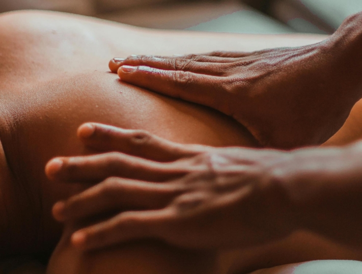
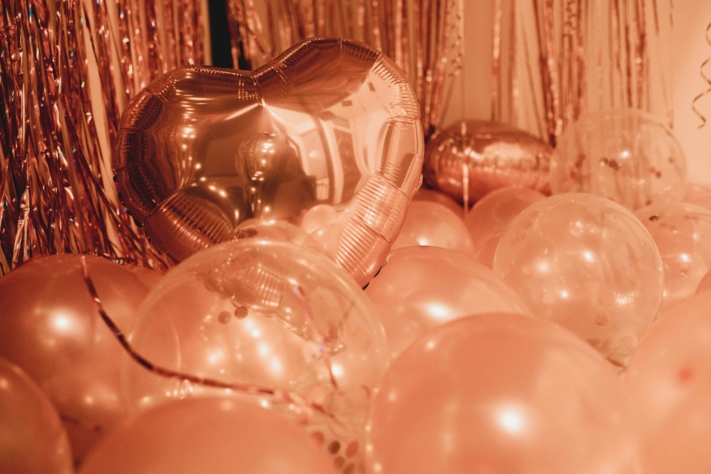

Три вещи считаются обязательными для классического мальчишника: броские **футболки**, **лоток лоточника**, наполненный всевозможными диковинками, и **оживленное место проведения**. Но почему бы не сделать что-то особенное? В конце концов, обычно вы женитесь только раз в жизни, и **мальчишник** может быть таким же уникальным и незабываемым, как и сама свадьба.

Организация этого незабываемого события требует тщательного планирования. Хотите пойти по стопам фильма _"Похмелье"_ и отправиться в Лас-Вегас? Тогда вам нужно не только заказать **билеты на самолет** и **отель**, но и спланировать **дни отдыха**.

В этой статье мы не только представим оригинальные идеи для мальчишника, но и подробно расскажем, что нужно учесть при планировании и как лучше поступить.

В некоторых культурах существуют особые традиции, связанные с мальчишниками.

## Традиции, лежащие в основе мальчишника

Празднование мальчишника имеет давние и богатые традиции, восходящие к Древней Греции. Уже тогда прощание с холостяцкой жизнью отмечалось с размахом.

Женихи и невесты часто организуют прощальные вечеринки по отдельности. Однако это отнюдь не является обязательным условием. Решение о том, проводить ли торжества вместе или раздельно, зависит только от будущих супругов и их индивидуальных предпочтений.

Некоторые пары отмечают мальчишник и девичник вместе, что называется "Вечеринка Джека и Джилл" или "Мальчишник и Девичник". Этот современный поворот дает возможность семьям и друзьям обеих сторон собраться вместе, чтобы отпраздновать встречу пары и символически поддержать начало их совместной жизни.



## Что нужно учесть перед планированием

**Ответственность** за планирование мальчишника часто лежит на **женихах и невестах**. Объявите ли вы о большой вечеринке или **сделаете сюрприз** холостякам, зависит только от вас. Но прежде чем приступать к планированию, необходимо учесть несколько важных моментов.

Прежде всего, очень важно заранее решить, кто из **друзей и родственников** должен присутствовать на церемонии. Однако в конечном итоге это решение должны принимать будущие супруги, а не только свидетели.

**Стоимость** мальчишника обычно делится на всех участников, а жених и невеста приглашаются в качестве почетных гостей. Поэтому важно тщательно спланировать и согласовать **бюджет**, чтобы никого не обидеть и не перестараться с финансами.

Для многих мальчишник - это важный ритуал перехода от холостяцкой к семейной жизни.

Еще один важный аспект - выбор **времени** проведения мальчишника. Если это всего лишь одно вечернее мероприятие, то его вполне можно провести в выходные, и сделать сюрприз для почетного гостя будет проще.

Однако если планируется короткая поездка, которая может даже потребовать **отпуска**, сделать сюрприз будет сложнее. В любом случае желательно привлечь партнера к планам, особенно если планируется сюрприз, чтобы он мог сделать необходимые приготовления в фоновом режиме.

## Самый лучший контрольный список для мальчишника

Организация мальчишника может быть увлекательной, но в то же время сложной задачей. Между **поиском даты**, **бронированием билетов** и **планированием программы дня** легко что-то забыть. Чтобы ничего не упустить и идеально спланировать каждую деталь, необходимо составить подробный контрольный список.

Это основные шаги, которые обеспечат полный успех мальчишника:

Для идеального мальчишника вам следует отметить эти пункты.

## Идеи для уникального мальчишника

Независимо от того, ищете ли вы веселое развлечение или роскошное место, следующие идеи предлагают ослепительную ночную жизнь, захватывающие дух острые ощущения или заслуженное расслабление, которые сделают ваш мальчишник или девичник абсолютно ярким событием.

### Городские поездки

Проставка

- Кельн
- Гамбург
- Берлин
- Мюнхен

Проставка

- Франкфурт
- Дюссельдорф
- Штутгарт
- Лейпциг

Городские поездки могут быстро стать дорогостоящими, ведь они включают в себя проживание, питание и развлечения.

### Короткий отпуск

Проставка

- Лас-Вегас
- Майорка
- Будапешт
- Барселона

Проставка

- Прага
- Амстердам
- Ибица
- Дублин

Все чаще мальчишники и девичники проводятся не на одну ночь, а на все выходные.

### Адреналин и приключения

Проставка

- Прыжки с тарзанки
- Экскурсия на гидроцикле или каноэ
- Парк скалолазания
- Парк развлечений

Проставка

- Лазертаг или пейнтбол
- Занимайтесь картингом или катайтесь на квадроциклах
- Симулятор полета
- Обучение выживанию

Многие тематические парки предлагают специальные скидки для групп, что делает их доступным вариантом.

### Релаксация и велнес

Проставка

- Спа
- Йога-ретрит
- Курс медитации
- Термальная ванна

Проставка

- Поход за травами
- Дегустация вин
- Флотационные резервуары
- Вихревая вечеринка

В последние годы наметилась тенденция к более здоровым мальчишникам: на первый план выходят такие мероприятия, как йога и велнес.

### Творческие курсы

Проставка

- Курс по приготовлению суши
- Гончарная мастерская
- Смешивание коктейлей
- Фотоэкскурсия

Проставка

- Мастерская уличного искусства
- Курс Голдсмита
- Курс кинцуги
- Питье и рисовать

Некоторые выбирают альтернативные занятия во время мальчишника, например, кулинарные курсы, коктейльные вечера или даже гуманитарную работу.

## Привлеките жениха и невесту

Мальчишник может выглядеть очень по-разному. Для одних праздник - это высший пилотаж, а для других он больше похож на абсолютный кошмар. Чтобы этот особенный день действительно стал прекрасным событием для жениха и невесты, лучше всего придерживаться следующих правил:

1. **Проведите личные беседы:** Проведите личные беседы с женихом или невестой, чтобы выяснить, какой мальчишник они хотели бы получить. Благодаря такому обмену мнениями можно точно зафиксировать индивидуальные идеи и пожелания.
2. **Учитывайте предпочтения и интересы**Учитывайте личные предпочтения и интересы мальчишника или девчонки, чтобы создать особенный опыт. Будь то расслабляющий спа-отдых, захватывающий день приключений или буйное празднование - главное, чтобы жених или невеста чувствовали себя комфортно.
3. **Запланируйте особые сюрпризы:** Запланируйте особые сюрпризы для жениха или невесты во время мальчишника. Это могут быть персонализированные подарки, неожиданные гости или уникальные впечатления, которые придадут дню особый оттенок и сделают его незабываемым.

Мальчишник часто планируется как сюрприз для жениха или невесты.

## Советы для успешного мальчишника

Мальчишник должен стать незабываемым днем, полным веселья и радости, который все будут вспоминать еще долгое время. Чтобы он удался, необходимо помнить о нескольких важных моментах. Вот несколько ценных советов, которые помогут вам организовать идеальный мальчишник.

- Прежде всего, необходимо быть готовым к **плохой погоде** Будьте готовы к плохой погоде. Даже если вы надеетесь на солнечный свет и голубое небо, погода может быть непредсказуемой. Поэтому рекомендуется иметь запасной план на случай непогоды в помещении или подготовить одежду и зонтики, чтобы вы могли наслаждаться днем, даже если пойдет дождь.
- Еще одним важным моментом является **составление расписания**. Убедитесь, что у жениха или невесты нет других обязательств в день мальчишника. Заблаговременное сообщение о дате и регулярные проверки позволят избежать неожиданных столкновений.
- Не забудьте сохранить **воспоминания** запечатлейте их. Особенно в современную цифровую эпоху запечатлеть особые моменты в виде фотографий и видеороликов так же просто, как и популярно. Возьмите кого-то из группы или, возможно, даже наймите профессионального фотографа, чтобы создать качественные воспоминания.

Некоторые мальчишники имеют определенную тематику или цвета.

- **Сюрпризы** являются глазурью на торте мальчишника, но их следует использовать в меру. Слишком большое количество сюрпризов может быстро стать непомерным. Убедитесь, что запланированные мероприятия хорошо скоординированы и соответствуют вкусам почетного гостя.
- В конце концов **гибкость** это главное и основное. Несмотря на тщательное планирование, могут возникнуть непредвиденные обстоятельства. Будьте готовы спонтанно адаптировать план и найти альтернативные варианты, чтобы день прошел гладко, несмотря на мелкие препятствия, и стал незабываемым для всех участников.

## Онлайн-планировщик для идеального мальчишника или девичника

Вы столкнулись с проблемой планирования лучшего мальчишника для своего лучшего друга? Не стоит беспокоиться! С помощью [бесплатного шаблона](https://seatable.io/ru/vorlage/famywjokqxwccd2zih_skq/) SeaTable вы сможете реализовать свои планы без особых усилий.

Шаблон можно легко настроить под свои нужды, удалив образцы записей и введя свои собственные данные. В SeaTable вы можете организовать и визуализировать данные настолько четко, что всегда будете иметь представление о деятельности, делах, гостях и финансах.

Но SeaTable поддерживает не только свидетелей брака: будущие супруги также могут использовать SeaTable в качестве бесплатного [свадебного планировщика](https://seatable.io/ru/vorlage/eso9hktaqnms333jjy0z9q/), чтобы сделать самый прекрасный день в своей жизни идеальным. Чтобы зарегистрироваться бесплатно, введите свой адрес электронной почты [здесь](https://seatable.io/ru/registrierung/).
