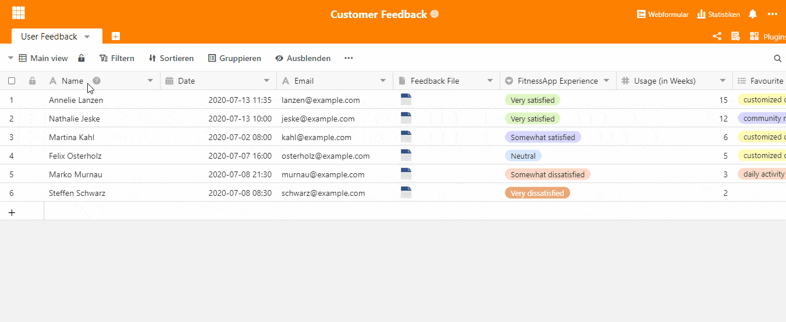

Qu'est-ce qui enthousiasme vos clients et qu'est-ce qui ne vous satisfait pas du tout ? Cherchez-vous le prix le plus bas ou une expérience d'achat passionnante ? Les commentaires des clients ne vous donnent pas seulement un aperçu des caractéristiques de votre groupe cible, ils vous permettent également de jeter un regard neuf sur votre propre produit. Une fois le feedback recueilli, il faut l'évaluer correctement.

Les commentaires des clients peuvent être recueillis de [différentes manières](https://blog.hubspot.de/service/kundenfeedback). Si vous souhaitez réaliser une enquête en ligne classique, notre [modèle SeaTable](https://seatable.io/fr/modele/ku9n1tyosmmho-8trn7rdg/) est un outil simple et efficace qui vous permettra de faire passer votre support client au niveau supérieur. Vos clients peuvent donner un feedback direct à l'aide d'un formulaire web. Les réponses sont immédiatement enregistrées dans leur tableau et sont à la disposition de votre équipe pour évaluation. Les statistiques permettent d'identifier immédiatement les aspects particulièrement positifs, mais aussi les points faibles. L'avantage principal de SeaTable est donc que la collecte et l'analyse des données se font dans le même outil. Il n'est pas nécessaire de préparer les données de manière compliquée.

Regardons de plus près le modèle de feedback des clients :

## Mise en place de notre modèle de feedback client

Dans ce modèle, le feedback des clients d'une application de fitness a été recueilli et évalué. Les informations importantes sur le client telles que le nom, l'adresse e-mail, la date du feedback et le fichier de feedback rempli trouvent leur place dans les quatre premières colonnes. Le fichier de feedback est enregistré ici de manière centrale pour chaque utilisateur du tableau et peut donc être consulté immédiatement. Vous vous épargnez ainsi la recherche fastidieuse des documents dans les dossiers de votre ordinateur.

Les prochaines colonnes sont la base de votre formulaire web, voyons comment créer un tel formulaire.

### Création du questionnaire de feedback à l'aide du formulaire web

Les colonnes de votre tableau constituent la base du formulaire web. Inscrivez dans les colonnes du tableau toutes les questions qui doivent apparaître dans le questionnaire destiné à vos clients. Prenons l'exemple de la colonne "FitnessApp Experience". Vous voulez demander quel est le niveau de satisfaction général de votre app pour le client. Vous avez créé une colonne "FitnessApp Experience" avec une sélection simple allant de "Very satisfied" à "Very dissatisfied". Vous créez maintenant le formulaire :

1. Cliquez en haut à droite sur Formulaire web
2. Cliquez sur Créer un formulaire web
3. Donnez un nom au formulaire, il sera également visible pour vos clients.
4. Le formulaire avec toutes les colonnes que vous avez créées apparaît maintenant
5. Vous pouvez maintenant préparer les différentes questions pour le client
6. Aidez le client à répondre aux questions.
7. Sélectionnez le bouton "Obligatoire" pour rendre le champ "obligatoire".
8. Choisissez la manière dont les possibilités de réponse doivent être affichées. Dans l'exemple ci-dessous, elles sont présentées sous forme de liste.
9. Les champs non pertinents pour vos clients, c'est-à-dire les champs qui ne sont utilisés que par vos collaborateurs, peuvent être facilement masqués sur le côté droit.
10. Vous avez terminé ? Ensuite, cliquez sur Partager en haut. Vous recevrez un lien et un code QR que vous pourrez utiliser sur votre site web, dans les e-mails de vos clients ou même sur des supports imprimés.

### Statistiques pour l'évaluation du feedback reçu de la part des clients

Toutes les réponses de vos clients apparaissent immédiatement dans votre tableau et sont visibles pour tous les collaborateurs concernés. [La fonction Statistiques de SeaTable](https://seatable.io/fr/docs/handbuch/seatable-nutzen/statistiken/) est un outil utile pour obtenir un aperçu de leurs réponses et les évaluer de manière générale. Cliquez sur Statistiques en haut à droite pour voir les statistiques que nous avons créées pour ce modèle. Nous avons créé ici deux tableaux qui montrent clairement quelles fonctionnalités ont été désignées comme "favorites" ou "moins favorites" par combien de clients. De plus, un diagramme circulaire montre la satisfaction générale avec l'application. En cliquant sur Créer des statistiques, vous pouvez ajouter d'autres statistiques.

### Différents points de vue sur l'évaluation des commentaires reçus des clients

SeaTable vous permet d'obtenir une vue adaptée à vos besoins grâce à différentes vues, qui vous fournissent immédiatement les informations souhaitées. La vue peut être facilement modifiée dans le menu déroulant en haut à gauche. Vous pouvez également y créer vous-même de nouvelles vues.

La vue "Ratings" vous montre le feedback de vos clients, trié selon la satisfaction générale de vos clients. Pour ce faire, l'affichage a été tout simplement regroupé selon la colonne "FitnessApp Experience". Grâce aux données de contact obtenues, vous pouvez par exemple contacter directement les clients très insatisfaits afin de réaliser des enquêtes plus approfondies et d'optimiser encore plus votre produit grâce aux connaissances acquises.

### Le feedback des clients en toute simplicité - avec SeaTable

Évitez de perdre du temps à saisir des données ou à transférer les commentaires de vos clients dans un outil d'évaluation séparé. Avec SeaTable, vous avez un [outil](https://seatable.io/fr/modele/ku9n1tyosmmho-8trn7rdg/) pour tout et vous faites passer votre support client au niveau supérieur. Tous les commentaires de vos clients en un seul endroit. Tout le monde peut le voir, partout et à tout moment.
