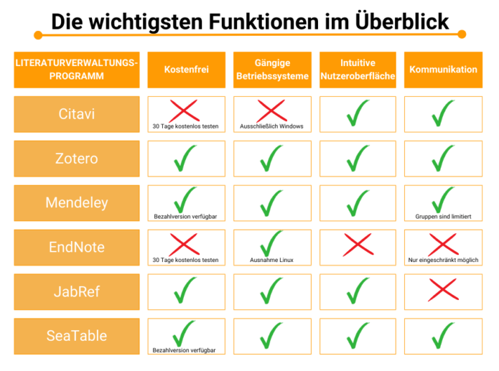

Whether it's a thesis, dissertation or research report - a **reference management program** makes it easier for you to work on scientific projects. Creating **bibliographies** takes just as much time as finding, viewing and evaluating **sources**.

With structured literature management, you can prevent errors in literature lists and keep **track of all relevant studies** on your topic. In addition, a reference management program helps you to create the references for the collected works in a uniform **citation style**.

Below you will find a comparison of various software solutions and additional tips for successful literature management.

Get your scientific literature in order! © caftor / Adobe Stock

## Why is a reference management program useful?

Collecting evidence for hypotheses, presenting the current state of research or substantiating your own approach: In scientific projects, **searching for and evaluating sources** is unavoidable - whether in books, journals or online media. Proper scientific work involves a great deal of effort, which you can minimize with clever literature management.

With a reference management program you can ...

- maintain an [overview of extensive projects](https://seatable.io/en/vorlagen-projektplanung/).
- Systematically record research literature.
- ensure a uniform citation style.
- make flexible changes to your literature lists.
- reduce the susceptibility to errors in long bibliographies.
- Organize your sources by category and project.
- Automatically back up data to the cloud or a server.

All in all, the database structure of reference management programs enables you to manage sources more effectively than would be possible manually (e.g. in a text editor or on paper).

## Comparison of reference management programs

Have you decided to use literature software to work more efficiently? Wonderful! But now, of course, the question arises as to which program is best suited for you. This mainly depends on the size of your project and the tools you want to use. We present the six best-known programs below.

First, get an overview of the features.

### Citavi - the classic

Citavi is the preferred reference management program at many universities. The main advantages of using Citavi in this area are that it can be used in **German**, **group work is possible without restrictions** and there is **good support** for questions.

Group work is child's play with Citavi.

However, unlike many of its competitors, the program is **not free and can only be used with Windows**. After 30 free days, you will have to dig deep into your pockets. The price to be paid depends on your activity and starts at 75 euros per year for students in the web version. Companies pay around 425 euros for the Windows version for two years.

### Zotero - the entry-level program

Zotero is particularly suitable for newcomers, as it is intuitive to use and designed for research in all subject areas. The program is **free**, runs on all common operating systems and can also be used on a cell phone or tablet thanks to an app. However, there are some advantages and disadvantages in terms of content that you should be aware of:

**Advantages**

- An add-on allows you to import literature data from the Internet directly into the program.
- Screenshots and PDFs are automatically transferred from the browser.
- You can set your preferred citation style.

**Disadvantages**

- You cannot easily edit the PDFs stored in the program, but there is a note function in which you can work simultaneously.
- Database searches in the program are only possible to a limited extent.
- You should check automatic references, as these may be incorrect or incomplete.

### Mendeley - the cloud software

Mendeley offers you a **free subscription** with two gigabytes of storage space in the cloud. If this is not enough for you, you can purchase a version with more storage space, additional support, more features and better data encryption for a price on request. The program runs on all operating systems.



In addition to using the desktop program or the Web Importer, you can also use Mendeley via a **Word plugin**. All your data, documents and folders are synchronized via the cloud.

Despite these advantages, the program has weaknesses in terms of content. Search histories are not saved and not all saved works can be linked together. You should also have a good understanding of English, as the program is only available in this language.

### EndNote - the all-rounder

With EndNote you get an **all-round package with many useful functions**, but you should be prepared to pay a **high price** for it. The commercial reference management program from the information service provider Thomson-Reuters also offers a free version that you can **test** for **30 days**. However, the functions are very limited.

The full version includes many useful tools.

The program specializes in scientists working on large research projects. This is particularly evident in the fact that the program requires a **long training period** to learn how to use the many features.

You must purchase a full version to be able to use it indefinitely. This starts at 252 euros for single users. As a student, you will receive a 50 percent discount after verification of your identity.

### JabRef - the language guru

JabRef is a **free open source literature management system**. The platform developers make the source code available to everyone so that many developers can contribute to the optimization of the software. This is particularly evident in the fact that the program is available **in many languages**.

If you know your way around, you can help to improve JabRef.

However, JabRef also has weaknesses. The reference management does not work optimally on mobile devices, you cannot communicate with other users and there is no full-text search, which makes it difficult to create the bibliography.

### SeaTable - the intelligent table solution

SeaTable offers you a **tabular** alternative to the literature management programs already presented. The user interface is **intuitive** to use and offers you many useful features for structuring your literature quickly and easily.

The [template](https://seatable.io/en/vorlage/h9cf82deq2ms7eizc3nwgg/) gives you an overview of how you can use the program and adapt it to your needs. SeaTable is a database where you can enter your data in tables, link it to tasks and enrich it with documents. **Team collaboration** is possible **in real time**.

SeaTable is available as a **free cloud version** or as a program for your own server. If you would like to receive additional features and work with more users, you have the option of upgrading. The Plus version costs 7 euros per user per month and the Enterprise version costs 14 euros per user per month.

## How to get the most out of your reference management program

Get the most out of the program you want to use for your literature management with the following eight tips. Here you can find out what you should pay attention to and which program functions will make your work easier.

### 1\. caution with source import

Do not rely on the source information in literature programs or other scientific works being correct. Mistakes happen, the data may be incomplete or in the wrong citation style. When importing data from other programs or via DOI, it can also happen that important information is not transferred. This is particularly annoying if you only notice the errors when you insert the bibliography into your document.

So check directly whether the references are correct and add to them if necessary. If you want to save this task until the end, it is helpful to enter it in a [to-do list](https://seatable.io/en/vorlage/bpvzkh-vrpwr4xylid6zeq/) so that you don't forget it.

Some reference management programs can record sources by DOI. © ake1150 / Adobe Stock

### 2\. enter literature data carefully

A reference management program is only as good as its user - you. Therefore, make sure you enter bibliographic data correctly. This way, your program can create the formatted references and bibliographies without errors, as it knows exactly where which information belongs.

Not all information about your sources is relevant for the subsequent transfer to the bibliography. You should know how to cite sources correctly so that you are not overwhelmed by the information automatically generated by many programs:



Authors|||

The authors should be listed with their surnames and first names and, if applicable, academic titles. In addition to the authors, the name of the editors should also be given for edited volumes.

\--- 

Year|||

In addition to the year, you must also state the day and month of publication for internet sources. If it is a source without a year, you must also indicate this.

\--- 

Title|||

The title refers to the title of the article, book or chapter if it is an anthology. Please note that the title is case-sensitive.

\--- 

Medium|||

In most cases, it is sufficient to state the journal or work in which the article was published. If it is a book, you should name the publisher.

\--- 

Edition and page number|||

You should make a note of this information as accurately as possible. Count the page numbers if they are not printed.

\---

### 3\. research new sources with the reference management program

Some reference management programs make it easier for you to search for new literature. With Citavi, for example, you have the option of receiving **search alerts**. This lets you know when new articles on one of your topics are available online. Mendeley offers a recommendation service that you can use to display similar articles.

Libraries are also a good place to research sources. Jacob Lund / Adobe Stock

### 4\. create an outline in the reference management program

In order to be able to work in a structured way, you need a **clear organization of** your literature. You can divide your sources into categories or assign them to different projects such as theses, [content analyses](https://seatable.io/en/qualitative-inhaltsanalyse/) or research projects.

Zotero offers you the option of assigning markers to sources according to which you can make selections. In SeaTable, you can sort and group the sources according to your requirements, for example by author, topic, type of source or editing status. This allows you to quickly find what you are looking for, even in larger projects.

### 5\. define citation style

Not all sources are cited in the same way. Right at the beginning of your project, you should decide which [**citation style**](https://www.scribbr.de/richtig-zitieren/uebersicht-zitierstile/) you will use. Once you have decided on a style, you should use it consistently and set it in your reference management program. You can then use the program to format all your sources in this style and copy them into your work.



### 6\. use the note function in the reference management program

Some programs have tools for **taking notes**. Use these to write down important statements while you are reading and add page numbers to make it easier to find them later.

You can also use the classic notepad.

### 7\. check results

Do not rely completely on the program. You should proofread the bibliography before submitting your work. **Check** that you have complied with the style guidelines and have placed the references correctly.

### 8\. do not delete any content

You often look at more sources than you ultimately use for your work. Once a project is completed, it's usually a case of: Out of sight, out of mind. But that doesn't have to be the case! Don't delete your sources and painstakingly made notes, even if the work seems to be finished. After all, you may need and reuse the information for future projects. Instead, build up a knowledge database in your reference management program.

## Conclusion: Try out a reference management program

Which reference management program is right for you should depend on which functions you want to use and how much money you are prepared to invest in the program. It is also advisable to test the programs free of charge.

SeaTable offers you a [template](https://seatable.io/en/vorlage/h9cf82deq2ms7eizc3nwgg/) in which you can find examples of literature and follow the process from entering the sources to outputting the bibliography. You can adapt the template to your requirements, insert your own sources and structure and visualize them with many useful tools.

If you would like to use SeaTable as a reference management program, simply [register](https://seatable.io/en/registrierung/) free of charge.
