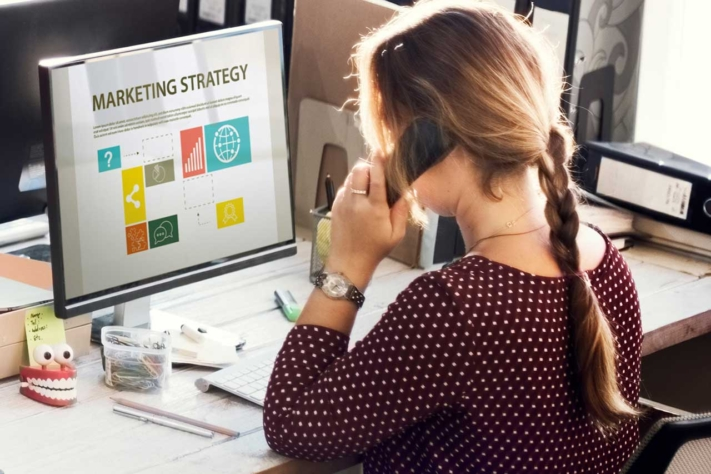

If you want to really push your company forward and clearly stand out from the competition, you need one thing above all: extremely good [marketing](https://seatable.io/en/marketing/). How good this actually is depends on the respective marketing campaign and its planning. And this raises several questions: What is a marketing campaign anyway? When is it good and when is it not? And how can the implementation and planning of the marketing campaign be optimally combined?

The answers, as well as an overview of the six best practice tips for planning your marketing campaign, are available in this article.

## Strategy vs. campaign - this is how a marketing campaign differs from strategy

A major and crucial difference between marketing strategy and marketing campaign is the time component. While the strategy is a long-term, planned approach to the implementation of marketing objectives, the campaign is a time-limited action within the framework of this same strategy. Thus, a strategy can include many different marketing or advertising campaigns over a long period of time. This means that planning and implementation of the marketing campaign always take place under the umbrella of the marketing strategy.

Marketing campaign planning © Rawpixel / adobe stock

## What does a marketing campaign help with?

Just about every successful company in the world invests a lot of time in the perfect organization and planning of its marketing campaigns. After all, marketing is the optimal "tool" to position oneself as a brand. Thus, advertising campaigns are very well suited for branding and image building, product launches or but also to promote sales around certain calendar events such as Christmas, Easter or Halloween. Classic examples of successful marketing campaigns are the TV commercials for the Lindt Easter Bunny or Edeka's Christmas advertising.

As a comprehensive, time-limited campaign, a marketing campaign helps to specifically address target groups and to successfully implement parts of the marketing strategy. The success of a campaign depends not only on the planning of the target group-specific address and preparation, but also on the channels on which it is published.

But how can the planning of a marketing campaign be realized efficiently, straightforwardly and successfully? The following six practical tips will help you on the way to your perfect offline and online marketing campaign.

## Six steps to success - how to plan your marketing campaign successfully

### 1\. clear planning of the measures of your marketing campaign

Before you jump right in and start implementing your marketing campaign, one thing is very important: planning takes up most of the time. After all, you can't do it without solid preparation and a detailed elaboration of all campaign steps. The very first step you should take is to clearly define the goals you want to achieve with your advertising campaign.

### 2\. definition of target group and buyer persona

The second step in planning your marketing campaign is to define target groups and create corresponding buyer personas. Only if you know your target groups inside out will you know how to address them correctly. The clearer the definition of your potential customers is, the more precisely you can define the measures for your marketing campaign and go into further planning.

### 3\. analyze competition and market

There are virtually no ideas that haven't been thought of before. In other words, you may not be the only company on the market offering products or services like yours. In order to stand out from the rest and catch your target audience's attention, competitive and market analysis is an absolutely critical step for your marketing campaign. Planning and implementation do not work without looking at the competition.

### 4\. define clear responsibilities and timelines

A marketing campaign and its planning work best when everyone knows what they have to do and when. Once the [project goals](https://seatable.io/en/vorlagen-projektplanung/), target group and market/competitor analysis are in place, the next step is to put together a team, assign [responsibilities and tasks](https://seatable.io/en/projektstrukturplan-vorlage/), set deadlines and milestones and - very importantly - allocate the [budget](https://seatable.io/en/budgetplanung-vorlage/).

Marketing campaign planning © REDPIXEL / adobe stock

### 5\. bring together measures and content when planning the marketing campaign.

Once all the organizational aspects have been taken care of, it's time to plan the content of your marketing campaign. This step includes deciding together with the team which [content](https://seatable.io/en/social-media-plan-vorlage/) should be played in [which format on which channels](https://seatable.io/en/social-media-plan-vorlage/) - always with the target group, competition and market in mind. Legal aspects are also important in this context. For example, for each campaign measure, you should consider which copyrights apply to photos used, when advertising guidelines must be observed, and which specifications apply to the various platforms used.

### 6\. implementation, monitoring and success control

Once all the measures for the marketing campaign have been worked out and the planning is complete, it's time for implementation. In this last step, you can now play all the trump cards of your perfect preparation and reap the rewards. Speaking of successes - a successful marketing campaign is not only about planning and implementation. Daily monitoring as well as success control and analysis after the end of the campaign are just as important. You should have already defined when the latter will take place in the fourth step (Define clear responsibilities and timelines). In this way, these important points, which can help you decisively in planning later advertising campaigns, will not be forgotten.

## Want more? These tools will help you plan your marketing campaign

Pen and paper are great, and you can certainly plan a marketing campaign with them, but it can also be easier. Whether you're planning an offline or online marketing campaign, the right digital tools can make planning and implementation even easier. Today, there are already a number of programs that facilitate [project planning](https://seatable.io/en/vorlagen-projektplanung/) and campaign implementation by means of automated e-mails, social media postings and many other features.

You can see exactly what this can look like using our [TikTok campaign](https://t3n.de/consent?redirecturl=%2Fnews%2Fseatable-tiktok-case-study-1477428%2F) as an example. With the right planning of our marketing campaign on this platform, we generate more than half a million views per week - an insane booster for brand awareness and our visibility on the web. With the right planning, anything is possible!

Image source Cover image: © tirachard/Adobe Stock
