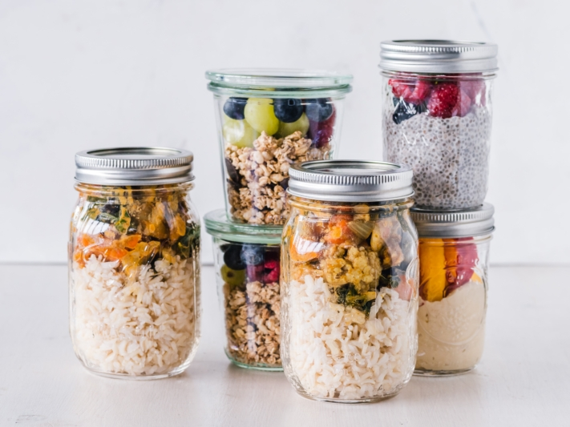
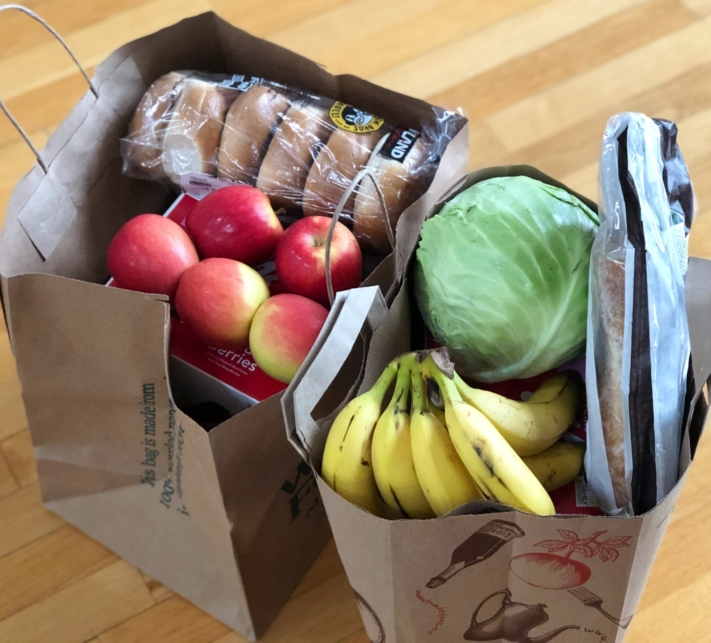
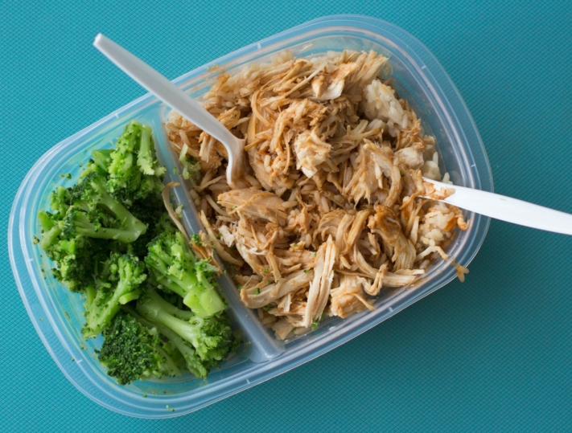
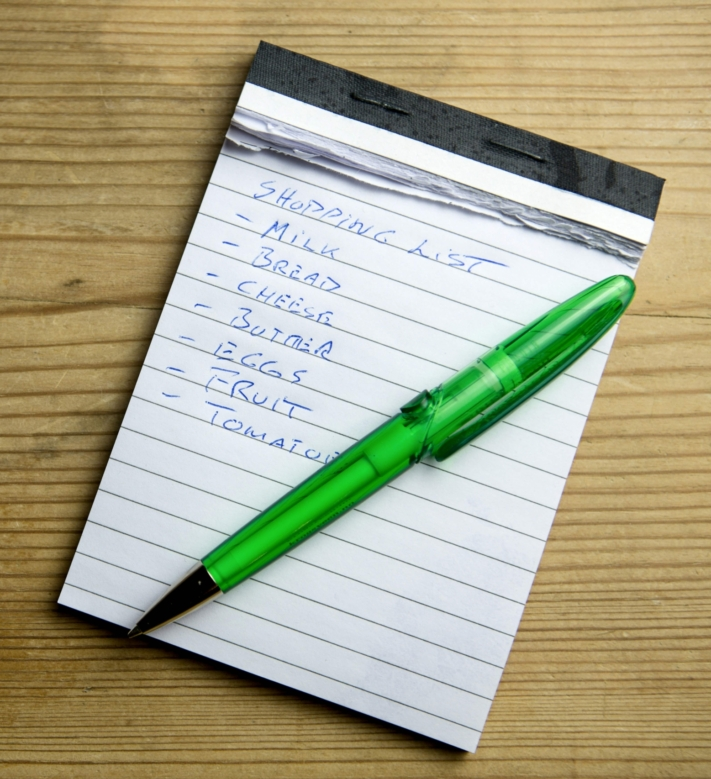
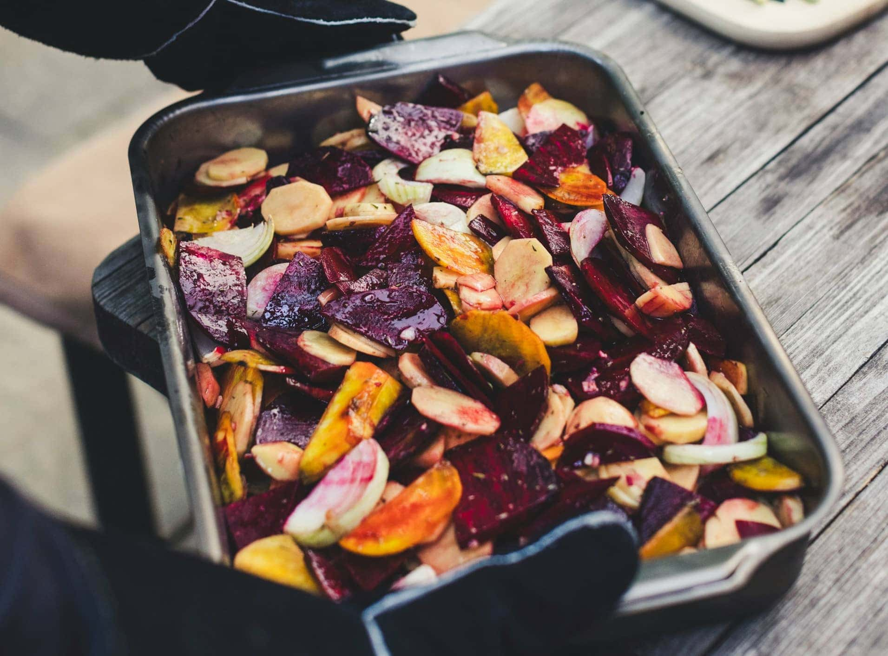

Eating as cheaply and healthily as possible with as little time as possible - a trend from the USA promises exactly that. A **balanced diet** is often neglected in stressful everyday life. Instead, we often reach for fast food or unhealthy snacks during lunch breaks, for example, to satisfy our cravings. In this article, you will find out what **meal prep** is all about, what you should look out for when meal prepping and how you can create a smart [weekly meal prep plan](https://seatable.io/en/meal-prep-gesund-und-guenstig-essen-vorkochen/#Vorlage_fuer_Ihren_Meal_Prep_Wochenplan).

## What exactly is Meal Prep?

Meal Prep is the abbreviation for **Meal Preparation**. The idea behind it is that you pre-cook your favorite dishes in large quantities so that they are ready to eat in the following days and can be reheated or finished in just a few minutes.

Various dishes are conjured up from just a few ingredients.



Like many food trends, the hype surrounding meal prepping originated in the USA. There, meal prep was primarily used by fitness enthusiasts, but quickly found its way into all areas of life.




It is particularly worth trying Meal Prep for people who cannot find the time in their everyday lives to cook their own meals. It also helps to stick to dietary resolutions and strengthen self-discipline. Of course, it takes a little effort and enough motivation to try this new way of cooking, but in the end it can make your diet more efficient, healthier and cheaper.




There are two ways in which you can meal prep. You can either cook **double the amount** so that you have enough food for the next day, or you can go one step further and take the time to **pre-cook the individual ingredients** and then combine them as you wish on the following days.


## Advantages and disadvantages of Meal Prep

Meal prep has some unbeatable advantages - both over cooking fresh meals every day and over ready meals from the supermarket or take-away restaurant.

### The advantages:

- **Saves time:** you don't have to spend hours in the kitchen every evening, but can prepare your meals for several days and combine them in different variations.
- **Saves money:** Ready meals are usually more expensive than cooking them yourself and larger quantities of food cost less than small packs.
- **Tailor-made for you:** Unlike ready meals, you can adapt home-cooked dishes to your own needs and preferences and refine them as you wish.
- **Promotes healthy eating:** Home-cooked meals often contain less sugar, fat and salt - you know what you are eating and can adapt the recipes to your nutritional goals.
- **Against food waste:** You can avoid opened packs and spoiled ingredients by buying the right amount of fresh food and using all of it straight away.

Targeted shopping saves you time and money because you only buy the food you really need.

Sounds too good to be true? Like many food trends, Meal Prep can't solve all your problems. In addition to the obvious benefits, there are also negative points that you should be aware of before you embark on meal prep.

### The disadvantages:

- **Limited shelf life:** Some foods and dishes (e.g. salads) are not suitable for long-term storage as they quickly go off, lose their consistency or taste.
- **Makes you inflexible:** A spontaneous meal in a restaurant can mess up your meal plan. In the worst case scenario, you have to throw away spoiled food or pre-cooked portions.
- **Monotony:** You don't always feel like eating your favorite dishes, even if you eat them for the third day in a row. But below you can find out how to add variety to your pre-cooked meals.
- **Storage costs:** If you are pre-cooking for several days, you need enough space in your fridge or freezer and the right storage equipment.

Be creative and make sure your dishes are as varied as possible.

## Step by step to the perfect meal prep

To make the Meal Prep mission a success, you first need a [meal plan](https://seatable.io/en/meal-prep-gesund-und-guenstig-essen-vorkochen/#Vorlage_fuer_Ihren_Meal_Prep_Wochenplan). The following **five steps** will help you with the process.

With the right planning, even inexperienced cooks can succeed with Meal Prep.

### 1\. prepare

First ask yourself how many days you would like to cook ahead for. For meal prep beginners, it is a good idea to cook for two or three days to get used to the effort and slowly develop a routine. Look for suitable Meal **Prep recipes**. These should contain foods that you like to eat. The composition of your meal is also important. For a balanced diet, your meals should contain the following:

- **Proteins:** Good sources are meat, fish and dairy products, but also tofu and pulses.
- **Vegetables:** Fresh and seasonal is best, but frozen vegetables also contain many vitamins and nutrients.
- **Carbohydrates:** Potatoes, rice and pasta are particularly suitable for this.
- **Fats:** Vegetable fats such as olive oil contain more unsaturated fatty acids and are therefore healthier than animal fats.

### 2\. shopping

The recipes have been selected, now you need the **ingredients**. List what you need and in what **quantities** so that you can keep track of everything while you're shopping. A [shopping list](https://seatable.io/en/vorlage/rw6cogmdrjyl-j0w3sjraw/) also helps you to buy only the food you really need for your meals. Make sure you only buy fresh and perishable goods if you can use them immediately.

A list helps you to keep track of your purchases.

### 3\. prepare

Now comes the most time-consuming part of meal prep. Take **enough time** to prepare all your food, preferably two to three hours on a day of your choice. Roast, boil, steam or bake the ingredients separately, as they have **different cooking points** and will otherwise turn into mushy, uniform mush. In addition to the main meals, you can also prepare **small snacks** for in between meals. These could be homemade muesli bars, for example.



### 4\. storage

To ensure that the prepared ingredients stay fresh long enough and retain their flavor, you should **store** them **separately**. Special [boxes](https://www.chefkoch.de/vergleich/meal-prep-boxen/) with partitions are suitable for meal prep, for example. The food should be stored in airtight containers made of glass or sturdy plastic. Preferably store the prepared dishes in the fridge or freeze them.



### 5\. combine

The last step of meal prep is the easiest. Take the prepared ingredients out of the fridge and put together a dish as you wish. **Different combinations** ensure a variety of flavors. Pack your creation safely for transportation or heat it up and enjoy your healthy and delicious home-cooked meal straight away!



## Example of a weekly meal prep plan

Here is an example of a **meal plan** to illustrate how Meal Prep works: You have chosen four dishes for a week, all of which contain vegetables, potatoes and/or rice. The **oven vegetables** form the basis for all the dishes and could, for example, consist of peppers, zucchinis, carrots, chickpeas, onions and mushrooms.

Oven vegetables are an excellent base for various dishes.

So on **Sunday evening**, take about two hours to wash, cut and bake the vegetables in a large casserole dish while you cook the potatoes and rice separately. Leave the ingredients to cool and put everything into clean boxes or jars. You can then combine the following dishes from the prepared ingredients:

- **Monday:** Oven vegetables with potatoes (+ tomato sauce and herbs de Provence)
- **Tuesday:** Chop suey with rice (+ Asian spices such as ginger and soy sauce)
- **Wednesday:** Ratatouille with potatoes (+ bouillon and nutmeg)
- **Thursday:** Vegetable curry with rice (+ coconut milk and curry powder)
- **Friday:** Gratinated vegetables (all leftovers + cheese)

The different spices give the vegetables a different taste every day. You can of course add meat and other ingredients to the dishes to suit your own taste.

## Template for your Meal Prep weekly plan

So that you always have your favorite recipes to hand, you can create a list of all your meal prep dishes and record on which websites you have found which dish. The [free template from SeaTable](https://seatable.io/en/vorlage/egzrna4wtbsuv7bbquzwsq/) is ideal for organizing your meal prep recipes clearly.

Simply enter the day on which you want to cook a dish next time and create new **weekly Meal Prep plans** in the calendar. Upload photos and be inspired by your gallery of possible dishes week after week. In two additional tables, you can record all ingredients in a **shopping list** and compare the **nutritional values** of your favorite dishes.

If you would like to use SeaTable for your weekly meal prep plan, simply [register](https://seatable.io/en/registrierung/) for free. You can find the corresponding template [here](https://seatable.io/en/vorlage/egzrna4wtbsuv7bbquzwsq/). Delete the sample recipes and customize the meal plan to suit your needs.
