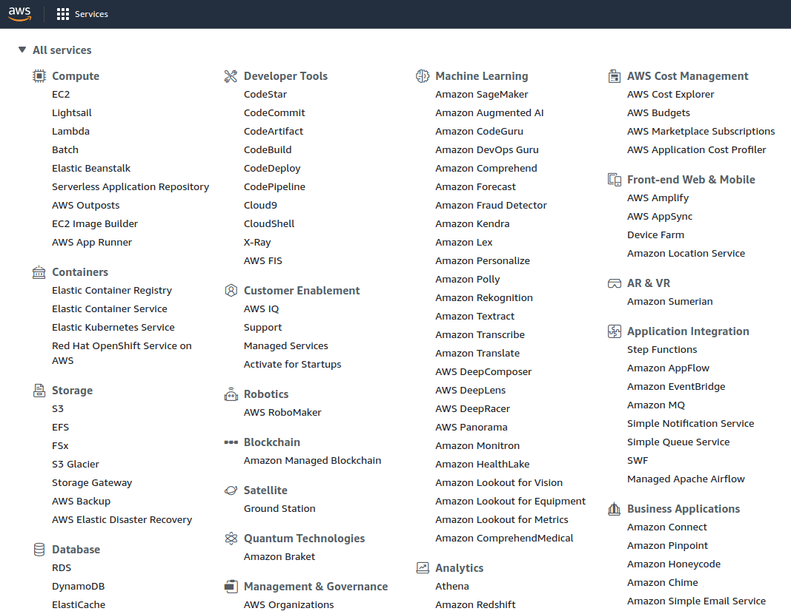

Software development is always exhausting, time-consuming, laborious and requires the skills of an experienced developer. No-Code is the promise to accelerate and simplify this laborious process of software development.

While the terms no-code and low-code initially only describe a development approach, when most people speak of no-code or low-code, they mean a concrete software solution or platform. In this case, this solution provides the necessary toolset and tools to take advantage of the no-code approach.

> **What is a no-code platform?**  
> In a fast-moving age with frequently changing requirements, a no-code platform should give people the opportunity to develop applications and processes together in a team, in the shortest possible time and without a great deal of prior knowledge, which should make their lives easier. No-code platforms thus save operational costs in the form of development time and manpower.

This article describes the history, the advantages and disadvantages of no-code, lists many solutions and gives clear recommendations on how to get the most out of no-code. Finally, many current no-code solutions are presented. A newcomer among the no-code platforms is SeaTable, which offers an easy entry into the world of no-code.

## What is low-code or no-code?

No-code and low-code are comparatively new development methods that enable people to develop their own applications or processes. As the names suggest, the core idea is that this should also be possible for people with little or no programming experience and that only a fraction of the usual time is needed for this development.

No-code thus holds the promise that software development will be easier and faster in the future. If technically interested employees can independently digitise processes without programming knowledge, this will lead to shorter development cycles and relieve the burden on the IT department. The IT department's role will change significantly in the future due to No-Code, as it will not have to worry as much about the procurement and maintenance of software and can instead take on a controlling and strategic role. Today's user would thus be tomorrow's developer with No-Code.

This idea of child's play programming that is intuitive and does not require any code has been around for a long time. You can find examples of this idea in countless films. In Iron Man, Tony Stark designs, builds and programmes his suit using only his arm movements. Tom Cruise Report also gives a foretaste of possible future interaction with the computer in the film Minority Report.

In reality, we are still some way away from this kind of interaction with the computer, but development is progressing rapidly.

## No-Code offers the right working environment

With no-code and low-code, a software or platform typically provides the necessary working environment for the technically interested user. One can work on a solution alone or in a team. This approach is quite contrary to classical software development, which is often time-consuming and cost-intensive in comparison.

No-code process in Integromat

Low-code and no-code can also be seen as the next logical step in the development of programming techniques. While a developer used to develop the interface, the logics, the database structures etc. himself using a programming language, developer frameworks such as Bootstrap or Laravel have already taken over many of these tasks. No-code / low-code goes one step further and significantly reduces the development effort by allowing the user to concentrate completely on problem solving and the processes to be developed.

Classic programming with source code

## Is No-Code better than Low-Code? / Differences between No-Code and Low-Code

Not at all. Both approaches have their raison d'être. While No-Code is about not really needing any programming knowledge, Low-Code allows you to partially programme your own components in order to get further building blocks for your own solution.

However, the transitions between the two approaches are usually fluid, and both approaches have their advantages and disadvantages. More on this in the next section of this text.

Don't let the discussion about low-code vs. no-code confuse you. Both approaches pursue the same goal, namely to accelerate and facilitate software development.

If you need to decide for yourself which approach to take, perhaps the following distinguishing features can help you.

No-Code aims to be accessible to everyone. Low-Code, on the other hand, is primarily aimed at developers and people with basic knowledge of a programming language.

No-Code works primarily with drag-and-drop and web forms to help the user create the design and program logic. Low-Code can also use handwritten code or custom functions.

No-Code specifies large parts of the design in order to simplify operation. This is restrictive on the one hand, but allows for quick familiarisation. Low-code offers greater flexibility in the design of the user interface. In some cases, you can add new elements or edit elements using your own code.  
Often a clear assignment is not possible, as the various solutions offer tools from both the low-code and no-code areas. In the following, I will therefore only speak of no-code in this text, knowing full well that low-code would also be more appropriate in some places.

Designing a web form with SeaTable

### Four important features of No-Code

There is no universally valid definition of what exactly no-code is. However, the market research institute "Forrester Research" names four important characteristics that a no-code platform must fulfil:

No-Code is a visual model-based development method for data models, business logic or user interfaces. So while with classical programming languages, for example, you equally start from scratch, with No-Code you don't have to think about it.

No-Code focuses on reusability through the use of ready-made templates, widgets, plug-ins and components. These are available in the form of building blocks and can be used directly.

No-Code covers the entire life cycle of software development. That is, from development and deployment to the subsequent expansion of the application.

The last feature is the automatic provision and management of the application via cloud or directly in the form of an [on-premises system](https://seatable.io/en/on-premises/). Instead of having to set up a new server for each application, the applications run directly on the respective platform.

### How did the term no-code come about?

Even though the term no-code only became popular in 2018, the basic approach is nothing new. The desire to abstract and simplify technical problems existed many years ago.

The first pioneers of no-code were in clearly defined areas such as web development. Web construction kits or [WYSIWYG editors](https://de.wikipedia.org/wiki/WYSIWYG) already existed several decades ago.

Wix Website Editor

Another area that has taken up and advanced the no-code idea is the area of IT infrastructure. Amazon Web Services (AWS) was the pioneer here and one of the first providers to abstract hardware and network technology and bundle them into reusable application blocks. A small but revolutionary approach that led to the fact that today you no longer have to book complete servers, but rather put together computing power, storage capacity, network zones, etc. packages. packages. AWS calls this "Infrastructure as a Service" (IaaS).

In the field of software development, no-code did not catch on so quickly. The typical development of software with its many phases seemed too complex: Planning, testing, debugging, installation and maintenance.

However, abstraction in the form of standardised processes and functions eventually prevailed in software development as well. More and more function modules were developed that could be combined with each other.

And in 2018, the term zero code first appeared, which was later replaced by no-code.  
Today, however, the term no-code has evolved to describe not only the pure development method but also the concrete software solutions.

**Summary**:  
No-code is a collective term that describes both a development approach or a specific tool. Sometimes the tools are also referred to as platforms, depending on whether the tools focus on a specific use case or whether one is to develop processes in general.

## Why is No-Code so popular?

The advantage of No-Code can be reduced to one word: Cost savings. No-Code promises to significantly reduce the operational costs of software development. For one thing, development time is shortened. What used to take days or weeks can now be done in a few hours. Also, adjustments to the process no longer require that you learn the code or that you strictly adhere to development cycles. All of this is largely eliminated with no-code.

Another advantage of No-Code is that development can no longer be done by highly qualified developers, but by technically interested employees. The developers are thus available for other tasks and can increasingly concentrate on strategic issues.

### Who should bet on no-code?

No-Code is universally applicable and is not limited to one industry. There is no research on it yet, but it can be assumed that there is a need for this kind of development and problem solving in every area of life, in every company and in every person who works with computers.

By 2024, low-code will be responsible for more than 65% of all enterprise application development.  
[Gartner](https://www.bloomberg.com/press-releases/2019-08-12/low-code-is-the-future-outsystems-named-a-leader-in-the-2019-gartner-magic-quadrant-for-enterprise-low-code-application)

This brings us to the central advantages of no-code platforms. These are:

- Quickly create and deploy applications
- Can be implemented by programming laymen or technically interested people
- cross-team collaboration
- Easy integration with other platforms through APIs
- Focus on problem solving, less on design and surfaces

## Criticism of low code

Some people sneer at No-Code as merely a short-term fad. These people predict that No-Code, just like [4GL](https://de.wikipedia.org/wiki/4GL) and [Rapid Application Development](https://de.wikipedia.org/wiki/Rapid_Application_Development) before it, will not succeed in fulfilling the great expectations of revolutionising software development. Only time will tell whether No-Code can hold its own as an independent development approach in the long term.

In addition to the accusation of being a fad, however, concerns about security and dependence on the respective provider are repeatedly mentioned.

### Security

The accusation of a lack of security is based, on the one hand, on the handling of user data and the actual security of the software developed.

If the no-code platforms store or process user data, the respective provider must be trusted. As these providers become more popular and widespread, they become worthwhile targets for hacker attacks and must implement appropriate protective measures.

At the same time, people keep talking about the skills gap. At the core of these concerns is that people without technical training have a lower awareness of data protection or software protection.

Basically, it can be said that both accusations are strongly related to the respective provider. A professional platform can protect its infrastructure much better than a small team of developers. And probably handwritten code is often a much bigger security risk than if large parts have already been validated and checked by the no-code platform.

### Dependence on the provider

As with any cloud provider that processes and stores the data of its customers, one enters into a certain dependency. In the end, the platform operator is only obliged to itself and not necessarily to individual customers.

It is the responsibility of the user of No-Code to address this justified criticism through a comprehensive evaluation of the software and/or the provider.

## SeaTable, the leading self-hosted no-code platform

SeaTable fulfils all four characteristics of Forrester Research and cannot be clearly classified as a low-code or no-code solution. Many processes and workflows can be easily configured visually via a browser, which speaks more for a no-code solution. At the same time, SeaTable allows the execution of Javascript and Python scripts, which are either time-controlled or executed manually. This approach corresponds more to a low-code solution.

In terms of its field of application, SeaTable belongs to the database-based no-code solutions. In SeaTable, you can store and organise almost any kind of information and use it as a basis for further processes. For this purpose, we provide more than 20 different column types, plug-ins such as gallery, kanban, timeline, map or calendar. In addition, the user has the possibility to build his or her views the way he or she would like using filter, sorting and grouping functions. Statistical analyses and web forms are also core functions of SeaTable.

Simply[register](/en/registrierung/) for the SeaTable Cloud and try SeaTable free of charge for an unlimited period of time.

## Other no-code solutions at a glance

Of course, there are many other no-code solutions besides SeaTable. The following list includes many well-known software solutions, but does not claim to be exhaustive. To make your search easier, we have divided all the tools into six different categories:  
Automations:  
Automation platforms help you exchange data between two or more applications. The logic of these solutions is always the same: you define a trigger, which then triggers your automations.

**Website Builder**:  
Gone are the days when you had to hire an expensive agency or programmer to create a fancy website. With these tools you can create fancy websites without any programming knowledge.

**Database**:  
Besides SeaTable, there are several other database-based no-code platforms. We introduce you to the most well-known one.

**App Builder**:  
Software solutions in this category help you to create complete applications or mobile phone apps. External data sources such as Excel lists or SQL databases are often used.

**Marketplace**:  
With the software solution from this category, you can set up an online marketplace in no time and start selling your products.

**Chatbot**:  
Do you have recurring customer enquiries and would like to have them answered automatically? Then this tool will help you to develop a corresponding chatbot.

### Zapier (automations)

Zapier Logo

Zapier is the American market leader in the field of automation platforms. With Zapier, you develop so-called ZAPs, with which you connect over 2,000 of your favourite software solutions. There is a free entry-level version of Zapier, but this is usually only enough for the first few attempts. Zapier's other packages are comparatively expensive, starting at $20. Zapier guides you through the configuration of the ZAPs and makes setting up your first ZAP a breeze.  
Graphic of the logo and the price page

### make (automations)

make Logo (formerly Integromat)

make (formerly Integromat) is Zapier's European competitor and is headquartered in Prague. The platform does not offer quite as many [integrations](https://seatable.io/en/integrationen/), but you simply get more for your money than with market leader Zapier. As with Zapier, there is a free basic version. Especially companies from Europe that depend on storing their data in a European data center should take a look at make. The interface looks modern and one has the impression of being able to intervene much more deeply in what is going on.  
Graphic of the logo and a process.

### n8n (automations)

n8n logo

n8n is still a comparatively young solution on the automation market. At the same time, as a purely open source-based solution, n8n was able to quickly make a name for itself and build up a fan community. Instead of registering, with n8n you first have to get the software running on your own server. This is a hurdle that some non-IT people will probably fail at. The operation of n8n is clearly less intuitive than with Zapier and Integromat, but can be learned well after a certain amount of training.

### Wix (Website Builder)

wix logo

Wix is currently one of the most popular website builders and is developed in Tel Aviv. The slogan of Wix is "What you see is what you get" and underlines the intended WYSIWYG principle.

With Wix, even newcomers without any HTML knowledge can quickly create appealing and at the same time complex websites by drag-and-drop. This is surprisingly easy thanks to the more than 800 different templates that Wix suggests after a few questions about the general design. In addition to the web editor, Wix offers a variety of integrations in the areas of e-commerce, [marketing](https://seatable.io/en/marketing/) or SEO analysis. The sheer abundance of included features cannot be found in any other website builder, which is why Wix offers the right combination of quality and quantity.

### Webflow (website builder)

Webflow Logo

Unlike Wix, Webflow is a mixture of homepage builder and content management system and does not even try to limit the possibilities of its website builder. On the contrary. Webflow is only something for users who already have some experience with HTML and CSS and understand the corresponding concepts behind them. This makes Webflow considerably more complex and not a beginner-friendly construction kit like Wix or Squarespace. The experienced web designer, however, will find a toolbox full of helpful tools that take care of a large part of the time-consuming coding work.

### Squarespace (website builder)

Squarespace Logo

Squarespace is another WYSIWYG website builder that allows anyone to create chic and flawless designs. The design of Squarespace's websites is so recognisable that even other building kits try to copy this unique look.  
Because of its design and ease of use, Squarespace has built up a huge following that is willing to pay a little more than the competition.

### Bubble (website builder)

Bubble Logo

Of the website construction kits listed here, Bubble is most likely to be classified as low-code. While Wix, Webflow and Squarespace offer perfectly designed templates and the focus is on the visual impression of a website and you can really do everything by drag-and-drop, with Bubble you can go much deeper into the technology. Bubble allows you to develop your own functions with the help of Javascript and offers an extensive API for your own interfaces. Of course, Bubble also saves you a lot of the usual programming work, but at the same time, beginners should not start with Bubble.

### Airtable (database)

Airtable Logo

Airtable is the American market leader in the field of database-based no-code platforms. Airtable was founded back in 2012 and has since been able to raise over 1.2 billion US dollars in debt financing. Airtable has certainly made a significant contribution to making the topic of no-code known to a broad public. Airtable and SeaTable are similar not only in name, but also in the way they work. Unlike SeaTable, however, Airtable is only available at higher prices as an American cloud version.

### Zoho Creator (App Builder)

Zoho Creator Logo

Zoho Creator is a low-code platform to create applications quickly and easily. Zoho Creator is deliberately not aimed at private customers or small teams, but is completely geared towards large companies. Zoho Creator sees itself less as a database and more as a platform where pre-built code blocks are combined via an intuitive, visual builder. Unlike most no-code platforms, Zoho Creator does not create web apps, but apps that can be used on PCs, tablets and mobile devices.

### Adalo (App Builder)

Adalo Logo

Adalo is also all about creating apps for iOS and Android. With the Adalo Editor, you can design the desired components, such as lists, forms, payment options and diagrams, by dragging and dropping and thus create your own mobile app. With a paid subscription, Adalo even takes care of publishing the finished app in the Google & Apple Store.

### Glide (App Builder)

Glide Logo

With Glide, you can build a web application from a Google Sheets spreadsheet in no time. The focus of Glide is on building a mobile shop, but there are also apps for building an employee directory or a CRM system. The interface is simple and clear, and there is a free trial version to try it out. Glide is certainly a good choice if you want to take your first steps in developing your own app and get from your own spreadsheet to a published app as quickly as possible.

### AppSheet (App Builder)

AppSheet Logo

AppSheet is one of the first no-code platforms to turn a Google Sheets spreadsheet into a mobile app. AppSheet was founded back in 2012, only to be bought by Google in 2020. So it's no surprise that AppSheet is seamlessly integrated into the Google Cloud. Currently, AppSheet is one of the largest and most trusted platforms for creating, publishing and managing your own apps, with over 3 million no-code apps published. It is not as easy to get started as with Glide, but in the long term you have significantly more options for managing the entire life cycle of your own application.

### Sharetribe (Marketplace)

Sharetribe Logo

Sharetribe occupies a special place in this list, as this no-code platform "only" fulfils one function. With Sharetribe, you can build your own online marketplace like Airbnb, Fiverr or eBay in just a few hours, where you can sell or rent things.  
You don't need any programming experience to build it, just good graphics and the motivation to get involved with Sharetribe.  
You don't have to worry about hosting the marketplace, backups or maintenance. Sharetribe takes care of all that for you. Prices start but 79 € per month.

### Chatbot (Chatbot Builder)

Chatbot Logo

Chatbot also belongs to a category with a very specific field of application. Chatbot offers companies the simple possibility to design interactive chatbots. As soon as a visitor comes to your website, the chatbot starts according to predefined routines. For example, it can pre-select potential customers, answer frequently occurring support requests or take table reservations in a restaurant. The entire planning and creation of the chatbot is easy to do and requires no programming knowledge. A well-designed chatbot has the potential to significantly improve the customer experience on your website and relieve your staff.

## Summary

No-code platforms offer exciting opportunities for businesses and teams of all sizes. With the right platform, you give your team the ability to design their own business processes quickly and easily. They help increase innovation and reduce the burden on your IT department.  
I am sure that you will immediately think of processes in your environment that could be improved, for example, with a database-based no-code platform like SeaTable. Just give it a try and see if you can't use your time more efficiently in the future.
