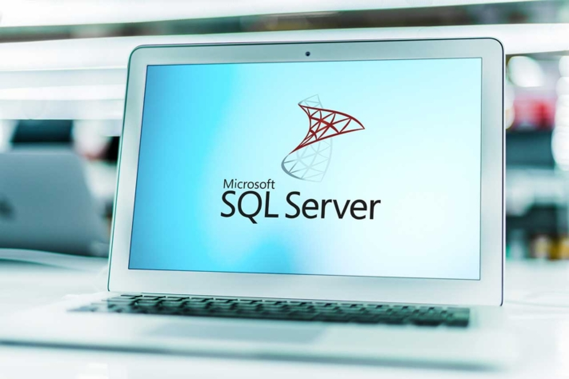

A database serves as a basis for collecting, processing and displaying data. They summarise information with common characteristics and facilitate management. You do not always need programming skills to create and work with a database. Some online databases have the advantage of being both free and easy to use. In this article we have compared the nine best free online databases.

## What types of databases are there?

Databases are needed, for example, to make a process work, as is the case with databases for websites or an app. This is about functional data.

Furthermore, there are customer databases for storing the interests, contact information and transaction data of customers. These are the so-called CRM databases, where CRM stands for "Customer Relationship Management".

## What are the advantages of online databases over traditional ones?

Online databases are either available free of charge or are paid for monthly. You only pay for what you have used in terms of storage capacity. In addition, you do not have to purchase your own hardware and [save on](https://seatable.io/en/budgetplanung-vorlage/) installation [costs](https://seatable.io/en/budgetplanung-vorlage/).

Another advantage is that you purchase a service. The providers usually have their own IT department. This relieves the burden on your own employees. No one to create and operate the database needs in-depth programming knowledge. Also the input of data can be done by import or web form.

Online database free of charge © Gorodenkoff / adobe stock

## What should be considered when choosing a free online database?

When choosing a free online database, make sure that security and compliance are guaranteed by the provider. Especially if your database is to manage sensitive (customer) data or business secrets.

## The top 9 free online databases

In the following, you will now receive an overview of nine well-known databases that are available free of charge as a test version or in a free variant. First, let's take a look at Amazon:

### Relational Database Service from Amazon

[Amazon RDS](https://aws.amazon.com/de/rds/) is an online database that is partially free. You get 720 hours per month to run the database in the "free quota". In the cloud, you install one of the following databases:

- MySQL
- MariaDB
- PostgreSQL
- Oracle BYOL
- SQL Server Express Edition

You also get 20 GB for automated data backups.

Due to the time limit, Amazon RDS is more suitable for testing applications or for familiarising yourself with Amazon's services.

### Google Cloud Platform

Besides Amazon, Google is another big player in the database market. Within Google Cloud there are online database services that are free. The free tier includes:

- Computer Engine
- Cloud storage
- BigQuery

Basically, when you sign up for Google Cloud Platform, you get a $300 credit.

If you don't reach the limit of the free tier, nothing will come out of your balance or the payment method you entered on Google.

### Microsoft SQL Server

When talking about Amazon and Google, Microsoft cannot be left out either. You have the possibility to choose between three options:

- **Microsoft SQL Server on Azure**: An online database operated in the Azure cloud.
- **Microsoft SQL Server Edge**: With this relational database, the concept of edge computing can be implemented for IoT applications.
- **Microsoft dedicated SQL Server**: Here you know where your data is stored and can fall back on a hybrid data platform.

Online database free of charge © monticellllo / adobe stock

To operate the online database free of charge, you need the Developer version of Microsoft SQL Server. This edition is licensed for use as a development database, but includes all functions.

### Oracle Database

Another popular relational database is [Oracle Database](https://www.oracle.com/de/database/). Its main functions include application development and data warehousing. If you are looking for a free online database, you have two options:

- **Oracle Autonomous Transaction Processing**: The way the data is stored makes everyday tasks with the online database easier.
- **Oracle Autonomous Data Warehouse**: This type of storage facilitates [analyses](https://seatable.io/en/swot-analyse-template/).

With both, the database storage space is limited to 20 GB.

### Knack

[Knack](https://www.knack.com/) does not require any coding at all, just like the online databases below. You can use the free trial version of Knack for fourteen days. After that, the solution costs from 39 US dollars per month. You start with simple services to import your data into the database. Sort and link them afterwards. Knack's functions allow different views on the data via filters, charts, dashboards, pivot tables and more. Other systems can be integrated via the API.

### Zoho Creator

[Zoho Creator](https://www.zoho.com/de/creator/) is also a low-code platform. Here, the goal is application development. In particular, the development of apps and web applications without programming knowledge are in demand. The whole thing takes place hosted in the Zoho Creator cloud. A free tariff for this online database exists: You get an account with 25 MB of storage and 1,000 records per account.

### ZenBase

You can also use [ZenBase](https://getzenbase.com/) to create and manage online databases for your business. In a four-part e-mail series, you will familiarise yourself with the user interface. You can then create and use the database quickly, securely and without programming knowledge. ZenBase provides functions for user management, data import and interactive reports. The online database solution is not completely free. You can sign up for a 14-day free membership.

### TeamDesk

[TeamDesk](https://www.teamdesk.net/) joins in with an easy-to-use online database that is free for the first 14 days. The tool costs from $49 per month for five users. You will be guided through the safe and quick creation of your first database with video tutorials.

### SeaTable

Lastly, you have the option of using the [SeaTable](https://seatable.io/en/) online database free of charge. Included are 2 GB of storage for files, 10,000 rows and unlimited tables. For a wider range of functions, the Plus version starts at €7 per user per month. The tool allows different views on the data, such as a calendar or a chart. It is easy to use and is operated in German data centres.

## Conclusion: There are many online databases - some free of charge, some with test version

Either you do the programming yourself or you choose a solution that can be used without programming knowledge. With programmes like SeaTable, even companies and private individuals without an IT department can store, manage and analyse their data in a relational database.

Try two to three solutions to find the right one for your [project](https://seatable.io/en/vorlagen-projektplanung/). [Start with the free subscription to SeaTable here](https://seatable.io/en/registrierung/).

Image source Cover image: © monsitj/Adobe Stock
