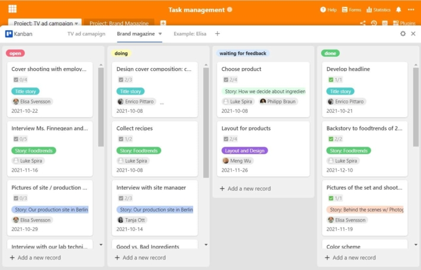
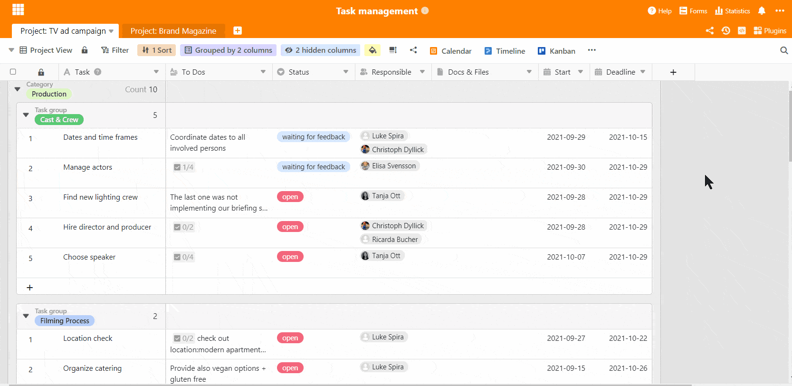
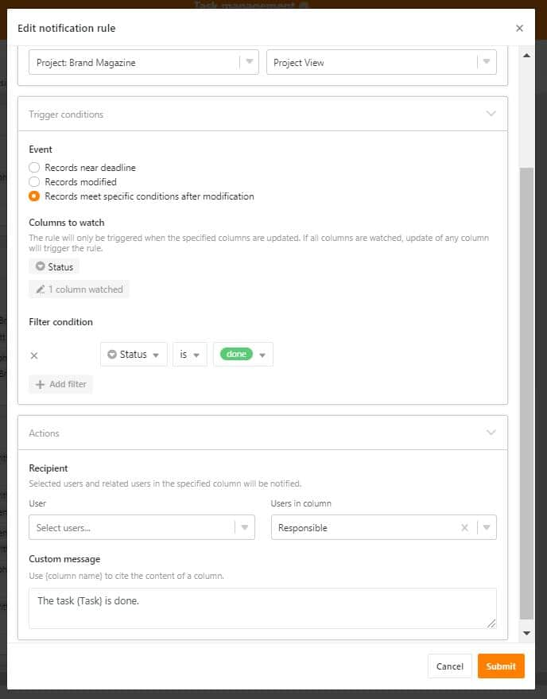

Task management and task administration are key elements of successful project management. These skills require a high degree of organizational talent and the ability to **coordinate and distribute tasks effectively**. A powerful task management tool is essential to maintain an overview, meet deadlines and ensure the success of the project. As a [project portfolio tool](https://seatable.io/en/vorlage/ajlptlawq6-nyxqwyjfujq/), SeaTable offers the possibility of implementing agile project management and successfully completing projects. With SeaTable you can optimize your task management and cover all important aspects of task management.

## Basics of task management

Task management comprises the planning, coordination, management and control of tasks within a project14. Effective task management includes

- Clear definition of project goals
- Clear definition of project goals
- Precise planning and distribution of tasks
- Resource and time management
- Risk minimization and opportunity optimization
- Quality control during project implementation
- Final project evaluation

**Structured task management is the key to project success**. It makes it possible to maintain an overview of all activities, set priorities and monitor progress.

## Methods of task management

There are various approaches to task management, which differ in terms of the structure of task management and the way they work. The choice of a suitable method depends on the specific requirements of the project, the team and the company. Agile methods such as Scrum can be very effective, but are not optimal for every project. **SeaTable offers the flexibility to implement different task management methods** and adapt them to your individual needs.

With a robust task management tool like SeaTable, you can:

- Plan and monitor tasks efficiently
- Centralize team communication
- Track project progress in real time
- Set up automated notifications
- Using data to make informed decisions

By using a powerful task management system, you can increase the efficiency of your projects and ensure their success.

**1\. work breakdown structure**  
The work breakdown structure is one of the classic methods in which the project is divided into different work packages, such as the development and design of a logo for a new brand. The advantage of this is that all tasks and responsibilities are clear from the outset. This means that structures are clear and the first step can be taken straight away.

**2\. scrum**  
The Scrum method is used for particularly complex projects in which not all tasks are defined at the beginning. In these cases, agile and flexible working methods are needed to plan and implement the progress of the project every week. Work is therefore carried out in a repetitive cycle and new results are presented each week, on the basis of which work is then continued.

**3\. kanban**  
You've probably heard of it before. This method works particularly well with the visualization of tasks and is therefore very popular in task management. In this type of task management, tasks are moved from one column to the next in the form of Kanban cards on a visual Kanban board - usually from "Open" to "Doing" to "Done".

You can see that the methods differ in their approach and that some may be better suited to your project than others. In all cases, however, you need a task management tool that supports you in all task areas to successfully complete your project. There are many different providers for this, all of which have their advantages and disadvantages. SeaTable has the decisive advantage of being a flexible software that can not only map the entire project, but also any other processes such as [time tracking](https://seatable.io/en/zeiterfassung-im-unternehmen/), [CRM](https://seatable.io/en/crm-angebotsmanagement/) or the creation of an editorial plan.

As a project management tool, SeaTable is highly flexible and can be **customized to meet all your needs**. With SeaTable, you can involve your employees in the project, simplify work and communication processes and **structure your project from start to finish** with the help of clear task assignments and descriptions.

## Holistic task management in just a few steps

As a **flexible spreadsheet solution**, SeaTable offers a completely customized design for your task management. We have set up our base with all the important information required for a project, such as to-do's, person responsible, deadline, start date and important documents. Various column types can be used to personalize and specify the entries. This allows you to create a new row for each task that arises and enter the task in detail. This process is comparable to creating a ticket, as is the case in some systems.

Almost every column type can be used for further structuring and evaluations. For a better overview and classification of the tasks, the "TV Ad Campaign" table was grouped twice by category and task area, and the "Brand Magazine" side project was grouped by task area and priority. However, the task management tables could also be grouped by employee or deadline - just as you need the data at the moment.

### Task management in real time

The base for task management can be used completely as a work base in which files can be shared with each other, as SeaTable also functions as a database. All documents and images uploaded there are stored in original quality and can be downloaded for editing by any authorised person. As an online database, all changes and work progress are also synchronised in real time so that everyone is always up to date.

### Team communication in one place

SeaTable allows direct communication within the tables, eliminating the need for email communication outside Base. When opening a row , employees can be added to the discussion in the [comment field on](https://seatable.io/en/docs/handbuch/zusammenarbeit/kommentare/) the right and comments, questions or feedback can be sent. This way, everyone knows exactly which task a question refers to and communication is transparent, synchronous and traceable.

## Task management with the Kanban board

For better visualization and easier handling of task management, the Kanban plugin is just the thing. The integrated plugin works like all common Kanban task management tools and enables tasks to be moved back and forth in the form of cards based on various classification categories, such as status. When a task is completed, the person responsible can simply move the card from "doing" to "done" and the task is marked as completed.

Other categorisations are also conceivable, such as according to superordinate task packages, for example the design of a website. This way of working is much easier for many, as the tasks are clearly structured and visualised. This also helps to be able to assess a project and the effort involved in it in real terms. Such tools are therefore very popular, especially with smaller teams or companies.

### Individual views for each employee

For individual boards for your employees, separate [views](https://seatable.io/en/docs/handbuch/seatable-nutzen/ansichten/) must be created in advance. This is easily done by setting a filter where the "Responsible" column must contain the name of a specific employee ("Responsible has any of XY"). This way all other colleagues disappear from the view and only the tasks of the one employee are displayed. This feature is included in all licenses and offers endless design possibilities. For example, if you want to create a view with only open tasks, the filter function for this is "Status is not done".

The countless filter options offer highly individual views of your task management and you can adopt a different perspective at any time. The good thing is that the different views are all completely independent of each other in their presentation. A filter in view A does not influence the display in view B. However, the change of data always runs synchronously and is immediately implemented in all views.

If the views in our task management template are really only to be seen by the respective employee, they can be shared with everyone individually - this means that only the shared person also has access to this view (this is part of the paid packages Plus and Enterprise). Other people do not see this view. However, this only works if Base is not shared in a common environment.

## Always keep an eye on the time: With the timeline and calendar

The timeline plug-in is a great help in visualising the time of your entire task management. With it, you can see at a glance whether you are still on track with your time planning or whether some tasks are already behind schedule. By setting the start date and deadline of the task, it can be perfectly displayed in the timeline. Define which other information should be displayed, such as the person responsible, the exact deadline or the to-dos.

For individual staff views, you create your own views for each staff member in advance. This way, everyone sees their own tasks in their own timeline and knows how much time is left for individual tasks. You can also see how busy your employees are when planning tasks and can reschedule if the workload is unevenly distributed.

Similar to the timeline plug-in, the calendar plug-in offers a temporal overview of the entire project and all planning stages of task management, but entirely in calendar style. The view by day, week, month, year or entirely in the agenda view enables a day-by-day view of the project steps and shows on which day how much needs to be done. Here, too, the creation of personal staff boards is possible without any problems based on the views created.

## Receive all project progress automatically

To ensure that all employees are always up to date with their tasks and task management, automatic notifications are very important. So an obligatory check of the base, if there are any news, is omitted. In our template, we have set a notification rule that is triggered when there are changes in the "Responsible" column. When a task is assigned to an employee, he gets a notification directly and automatically.  

If it is necessary to get feedback from a colleague or the supervisor, one simply assigns the task to this person - again, the rule triggers automatically and the responsible person is informed. This eliminates the need for emails with queries, feedback or work instructions. After processing, the task is then sent back to the appropriate person to continue the workflow.

Also comments within a row using the comment function trigger an automatic notification, so that mentioned persons are informed directly. If you want, you can create your own rules, for example, when tasks change to the "Done" status to keep track of project progress. We've also added a notification rule to Task Management that regularly reminds you of upcoming deadlines - so that all tasks get done on time.

## Task management easier than ever

SeaTable turns your task management into an effective and time-saving game changer in your projects. To use our template, you need to [register](https://seatable.io/en/registrierung/) with us. As spreadsheet software and database, SeaTable goes far beyond the entry of data: structuring, sorting, delegating, discussing, organizing, planning, implementing and completing - all this and more is possible with SeaTable.
