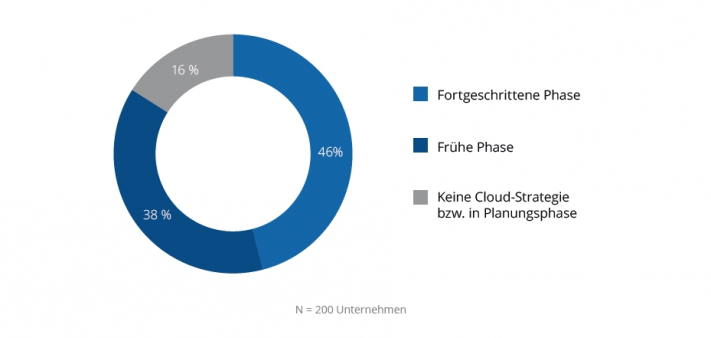

There is no one SeaTable, but you can get SeaTable in three different versions. The choice of your SeaTable system has a big impact on how quickly you can get started, how much you have to take care of yourself, the price you pay and the control you have over your own data. This article will give you a complete overview of what products are available to you and the benefits of each product. By the end of this text, you will know which SeaTable is right for you. Promised.

## Why do I even have to choose between SeaTable Cloud, Dedicated or On-Premises?

Most browser-based software solutions today are developed as cloud solutions. This approach offers many advantages, both for the user, the IT departments and also for the user. Users are happy that they can simply get started after a short registration. No administrator is needed for a cloud solution and the costs are usually cheap and clearly calculable. The provider of the cloud solution also has many advantages: instead of having to take care of many different customer systems, only one central system needs to be maintained. This makes it easy to always keep it up to date. The resources of this system can also be better utilised.

An IDC study from 2020 provides clear evidence of the new love for the public cloud. Of the 200 companies with more than 100 employees, more than 80% said they already have a multi-cloud strategy and see this as the best solution for the future.

Source: [IDC Cloud Computing 2020+ Study](https://www.idc.com/getdoc.jsp?containerId=prEUR146745720)

With SeaTable, it's different. We are firmly convinced that a cloud solution is the best solution for most users. At the same time, there are many cases where you don't want a cloud solution. That's why SeaTable was designed from the beginning to have two other products besides the cloud. These are the self-hosted on-premises systems and dedicated systems.

At SeaTable we believe that people, businesses and your requirements are different and therefore it doesn't make sense to squeeze them all into the same product.

## What is the alternative to the SeaTable cloud?

Even though cloud solutions are currently very popular, a countermovement can be observed, especially in Europe and Germany. Many people and organisations value data protection and the possibility of having more control over their own data. These people recognise the sense of a public cloud solution, but do not want to accept or at least reduce the loss of control. With any cloud solution, you entrust your data to a service provider and pay for the provision of a service and the processing of the data. In some cases, companies even prohibit the use of foreign cloud solutions because critical data, such as personal data or intellectual property, should not be transferred to foreign companies.

We offer these organisations the opportunity to gain more control over their data and, depending on their technical expertise, a self-hosted solution or a dedicated system of their own can be used.

### SeaTable On-Premises and Dedicated

With a self-hosted solution (on-premises), you only license the SeaTable software solution and can then determine where you want to install this software. For the installation, you use the [English administrator's manual](https://manual.seatable.io) and retain full control over the data and the system with this on-premises approach. Conversely, however, you have to take care of the installation, operation, maintenance and updates yourself.

Cloud or rather self-hosted?

A dedicated system is, in a way, the middle ground: you no longer share the system with many other users, but you get your own personal system, which you do not administer yourself. All administrative activities are taken over by the developer of the software. The developer installs updates and ensures that the system functions reliably. In terms of administration and functions, a dedicated SeaTable behaves like a cloud product, but in terms of use it is more like an on-premises system.

The following table shows an overview of the different aspects of the three products:

|  | Cloud | Dedicated | On-Premises |
| --- | --- | --- | --- |
| Editions | Free, Plus, Enterprise | Enterprise | Enterprise |
| Usable free of charge | (SeaTable Free) |  | (for up to 3 users) |
| Administration |  |  |  |
| Any server location |  |  |  |
| automatic updates |  |  |  |
| own administration |  |  |  |
| Access Linux command line |  |  |  |
| Own authentication |  |  |  |
| Customizing |  |  |  |
| custom logo |  |  |  |
| custom URL |  |  |  |
| custom templates |  |  |  |
| own user roles |  |  |  |
| Support |  |  |  |
| optional corporate support |  |  |  |
| Requirements | E-mail address | min. 100 users | Linux Server or VM |

## The three central questions for choosing the right product

Now you may wonder how you are supposed to know which is the right product for you? The following three questions will help you decide which product is right for you:

- Can I take over the administration of a SeaTable server myself?
- Is my data particularly worthy of protection?
- Do I need individual customisations such as a custom logo, own colours and custom templates?

If you answered "yes" to all three questions, then only an [on-premises system](/en/on-premises/) is an option for you. If you answered "no" to all three questions, then you should give the SeaTable cloud a chance. In all other cases, you should read on and look at the three products in detail.

If you are not 100% sure which version is the right one for you, try the SeaTable Cloud first. This is available immediately, offers all functions and costs little. At the same time, you can transfer your data from the cloud to a dedicated or self-hosted SeaTable server at any time.

## Product comparison: which SeaTable is suitable for you?

Read all the details about the three SeaTable products in the following section.

## The SeaTable Cloud is ready for immediate use

So far, this article has only talked about the SeaTable Cloud. In fact, there are three cloud offers called "Free", "Plus" and "Enterprise". These differ in price, the functions included and the usage limits. As the name suggests, the Free subscription is a free and at the same time functionally limited version. A maximum of 2,000 rows is available to your team with a Free subscription. With a Plus and Enterprise subscription, you pay a monthly fee and receive higher limits and more functions in return. For a full list of the exact differences between these subscription models, see the SeaTable Cloud [pricing page](/en/preise/).

The SeaTable Cloud is configured so that teams can be formed. Each team can include as many other members as desired, who can then work together, but at the same time the teams are logically separated from each other. Sharing across team boundaries is possible, but groups can only be formed within a team. The SeaTable software thus ensures that everyone can only access the information to which they should have access.

With the SeaTable Cloud, all users share the same system. You can access it at [cloud.seatable.io](https://cloud.seatable.io) and register new users on the page you are currently on. All data and user information is backed up in the same database and data storage. Specifically, the SeaTable cloud runs in the German data centres of the Swiss provider [Exoscale](https://exoscale.com). By the way, you can find more background knowledge about the decision for Exoscale in this [blog article](https://seatable.io/en/die-seatable-cloud-wird-europaeischer/).

Updates, backups and maintenance are carried out automatically and at regular intervals by the system administrators of SeaTable GmbH.

### The advantages of the SeaTable Cloud:

- The SeaTable Cloud is ready for use immediately
- For registration you only need an e-mail address
- Start with the free subscription
- Switch to a Plus or Enterprise subscription at any time
- Only pay for the users you need
- Updates and backups are carried out by SeaTable GmbH.
- Trust the data storage in Exoscale's German data centre

## Make your life easy with SeaTable Dedicated

With a dedicated system, you get your own personal cloud, which SeaTable GmbH manages for your company. Maintenance, updates and backups of the system are carried out by the same system administrators of cloud.seatable.io.  
of cloud.seatable.io. However, since it is your own system, you can determine which domain or subdomain as well as colour scheme and logo should be used. You also have a much greater degree of freedom when it comes to authenticating users. For example, you can integrate an LDAP server or single sign-on authentication via SAML.  
You can also determine the templates that are offered to your team in the system. Normally, you do not need to separate teams in a dedicated system, so that all new users can work together immediately. Nevertheless, you can of course define which roles and permissions are assigned in the system and which capabilities the system should provide.

A basic requirement for a dedicated system is at least 100 users. You only pay an annual fixed price per user. You do not have to reckon with any further costs.  
The installation takes place within a few days after the order on the servers of the provider Exoscale. As soon as you have set the corresponding DNS entry, the system is available to you.

### The advantages of a dedicated system:

- You can set the URL, colours, logo and templates
- Use existing user authentications such as LDAP or SAML
- No administrative effort
- Regular updates and maintenance
- Your system, your database, your data storage
- Hosting in the German data centre of Exoscale

## With SeaTable Enterprise On-Premises you have full control

With an on-premises system, you decide where and on what hardware your system runs. This can be either your own server or a virtual server in any data centre. You download the SeaTable Enterprise Container from Docker Hub and install and configure the system according to the [SeaTable manual](https://manual.seatable.io).

In any case, you need a licence to start the SeaTable Server. For up to three users, you receive [a free two-year licence](/en/on-premises/). Only your e-mail address is required for this. If you want to use more than three users, you have to license SeaTable Enterprise according to their user numbers. The licence file is a txt file that has to be stored on your server. The validity is validated when the SeaTable server is started. A connection to the internet to a licence server is not necessary. SeaTable Enterprise can therefore be operated completely isolated and autonomously in a local network.

With a self-hosted SeaTable Enterprise System you get all the possibilities of SeaTable and at the same time you have complete control over all components of the system. You define which roles and permissions you assign, which users are allowed to log into your system and which functions you want to activate. You also retain full control over the choice of hardware or virtualisation environment used.

SeaTable Enterprise is installed via Docker on a Linux server. The operation is not complicated if you have experience with the Linux command line and the operation of a server. Of course, with the purchase of a SeaTable licence, SeaTable support is available to you. We also offer individual packages for maintenance and support on request.

### The advantages of an on-premises system:

- Full control over hardware and data storage
- Full range of functions is available
- No internet connection required
- Individual configuration of the system possible

In addition to the Enterprise Edition, there is also the Developer Edition, which is functionally very limited and is primarily aimed at developers who want to use SeaTable as a flexible database with its own front end. Details on the two editions and the exact differences can be found in the blog article [SeaTable Enterprise and Developer Edition in comparison](/en/editionsvergleich/).
