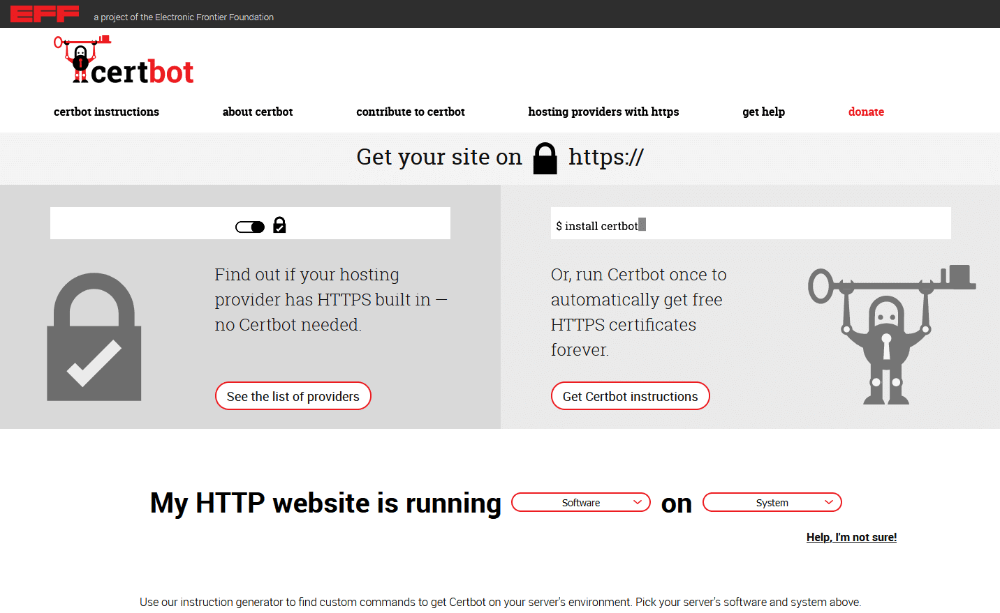

Im Beitrag [SeaTable Enterprise Edition unter Ubuntu Server 20.04 LTS installieren](/seatable-enterprise-edition-unter-ubuntu-20-04-lts-installieren/?lang=auto) haben wir die Standardinstallation von SeaTable Enterprise auf einem Server mit Ubuntu Linux erklärt. Bei der Standardinstallation erfolgt die Installation von SeaTable auf einem Server, auf dem keine weiteren Webanwendungen laufen. Was aber, wenn die Ports 80 und 443 bereits durch einen anderen Dienst wie z.B. einen nginx oder Apache Webserver belegt sind? Diese Frage beantworten wir in diesem Beitrag. Wie Sie sehen werden, ist die Antwort erfreulich einfach.  

## Voraussetzungen

Die Voraussetzungen für die Installation von SeaTable hinter einem bestehenden Webserver sind identisch mit denen der Standardinstallation:

- VServer / Dedicated Server mit mindestens 4 Kernen, 8GB RAM und 10GB Speicher
- Root Zugriff auf den Server (per SSH oder Konsole)
- Subdomain, die per A-Record (IPv4) oder AAAA-Record (IPv6) auf die IP-Adresse des Servers verweist
- Server auf Port 80 und 443 über die Subdomain erreichbar

## Vorbereitung und Download

Nicht nur die Voraussetzungen, auch die ersten Schritte sind mit denen der Standardinstallation identisch: Zunächst die Installation von docker-compose, dann der Pull des SeaTable Images von Docker Hub und schließlich die Speicherung der docker-compose Datei im YAML-Format im Verzeichnis /opt/seatable.

Mit diesen Befehlen führen Sie diese Aktionen aus:  
`apt update   apt upgrade -y   apt install docker-compose -y   docker pull seatable/seatable-ee:latest   mkdir /opt/seatable   cd /opt/seatable   wget -O "docker-compose.yml" "https://manual.seatable.io/docker/Enterprise-Edition/docker-compose.yml"`

SeaTable kann auch unter einem anderen Ort als dem Verzeichnis /opt/seatable angelegt werden. Wenn Sie das wollen, dann sollten Sie aus Gründen der Konsistenz aber auch alle anderen SeaTable Dateien an diesem anderen Ort ablegen. Da dies leicht zu Fehlern führt, raten wir davon ab.

## Individualisierung der docker-compose.yml

Die Anleitung für die Standardinstallation erklärt die Struktur und Funktionsweise der docker-compose Datei. Dies soll hier nicht wiederholt werden. Mit [diesem Link](/seatable-enterprise-edition-unter-ubuntu-20-04-lts-installieren/#Individualisierung_der_docker-composeyml?lang=auto) springen Sie direkt zum relevanten Teil im Beitrag zur Standardinstallation.

In der YAML-Datei gilt es nun ein paar Anpassungen vorzunehmen, einerseits zur Berücksichtigung der eigenen Anforderungen, andererseits um den Betrieb hinter einem Webserver zu ermöglichen.

Zu den notwendigen Anpassungen zählt insbesondere das Datenbankpasswort, das im Container db (MYSQL\_ROOT\_PASSWORD) und im Container seatable (DB\_ROOT\_PASSWD) geändert werden muss. Die URL, unter der SeaTable erreichbar sein soll, muss ebenfalls geändert werden. Dazu dient der Wert SEATABLE\_SERVER\_HOSTNAME. Geben Sie die Domain ohne http:// oder https:// ein.

Zusätzlich zu diesen Modifikationen, die so ja auch für die Standardinstallation gemacht werden müssen, muss auch der HTTP- und HTTPS-Port angepasst werden. Die Konfiguration der Ports des Containers seatable finden Sie im gleichnamigen Abschnitt. Die Standardwerte in SeaTables docker-compose.yml sind:  
 `- "80:80" #HTTP port   - "443:443" #HTTPS port`  
Der Wert vor dem Doppelpunkt ist der Container-Port auf dem Docker Host, d.h. der Port auf den der Docker-Proxy hört und der an den Container weitergeleitet wird. Der zweite Wert hinter dem Doppelpunkt ist der Port innerhalb des Docker Containers, an den die Anfragen weitergereicht werden. Diese beiden Ports müssen nicht identisch sein und diese Eigenschaft machen wir uns zunutze.

Da die Ports 80 und 443 auf dem Server schon belegt sind, müssen die Ports auf dem Docker Host geändert werden. Die Ports im Container jedoch können und sollten unverändert bleiben. Auf diese Weise kommt man um unnötige Änderungen an den Konfigurationsdateien von SeaTable herum. Eine Alternativkonfiguration der Ports könnte so aussehen:

 `- "880:80" #HTTP port   - "4443:443" #HTTPS port`

Die hier gewählten Ports 880 und 4443 sind populäre Alternativports für Port 80 und 443. An deren Stelle können auch andere Portnummern verwendet werden. Diese gilt es dann stattdessen bei der Konfiguration des Webservers auf dem Host zu berücksichtigen (siehe unten).

Den Wert SEATABLE\_SERVER\_LETSENCRYPT lassen Sie auf False stehen. Diese Funktion kann nur bei der Standardinstallation verwendet werden.

## Initialisierung der Datenbank

Mit der angepassten docker-compose.yml kann nun die Datenbank von SeaTable initialisiert werden. Die Schritte – wie könnte es anders sein – sind die der Standardinstallation:

`cd /opt/seatable   docker-compose up`

Am Bildschirm können Sie jetzt live nachverfolgen, wie Docker die Instruktionen in der YAML-Datei abarbeitet. Nach einer Zeit kommen die Aktivitäten zum Stillstand. Die letzte Meldung ist “This is an idle script (infinite loop) to keep container running.” Brechen Sie den Prozess an dieser Stelle mit der Tastenkombination CTRL + C ab.

## Einrichtung des HTTP-Zugriffs

Damit Aufrufe der SeaTable URL auch beim SeaTable Container landen, muss die Konfigurationsdatei des Webservers auf dem Host angepasst werden. Konkret müssen die Anfragen, die über die SeaTable URL und Port 80 eingehen, an den Docker Proxy weitergeleitet werden. Dieser hört – so wurde es in der docker-compose definiert – auf den Port 880.

Eine Direktive, die dies für nginx macht, sieht beispielsweise so aus:

`server {   listen 80;   listen [::]:80;   server_name seatable.example.com;`

location / {  
proxy\_pass http://127.0.0.1:880;  
}  
}

(Einen Codeblock für Apache liefern wir bei Gelegenheit noch nach.)

Nach der Anpassung des Webserverkonfiguration starten Sie den Webserver neu, um die Änderung wirksam werden zu lassen.

Da die Kommunikation innerhalb des Docker Containers seatable unverändert ist, müssen an den diversen Konfigurationsdateien im Ordner /opt/seatable/seatable-data/seatable/conf keine Anpassungen vorgenommen werden.

## Start von SeaTable

Nun ist SeaTable bereit für die Produktivnahme. Zunächst starten Sie wieder alle Docker Container durch Ausführung der docker-compose.yml, diesmal im sogenannten “detached” Modus, dann rufen Sie im Container seatable das SH-Skript zum Start von SeaTable auf und schließlich legen Sie den ersten Adminbenutzer an.

`docker-compose up -d   docker exec -d seatable /shared/seatable/scripts/seatable.sh start   docker exec -it seatable /shared/seatable/scripts/seatable.sh superuser`

Nun können Sie Seatable bereits über den Port 80 erreichen. Durch Aufruf der SeaTable Domain (hier im Beispiel seatable.example.com) kommen Sie auf die Loginseite Ihres SeaTable Servers.

Der Aufruf von https://seatable.example.com funktioniert noch nicht. Der verschlüsselte Zugriff muss nun zum Abschluss noch eingerichtet werden.

## Einrichtung des HTTPS-Zugriffs

Das Vorgehen zur Einrichtung des HTTPS-Zugriffs hängt vom verwendeten SSL/TLS-Zertifikat ab. Wenn schon ein entsprechendes Zertifikat vorliegt, dann halten Sie sich bitte an die Instruktionen der Certificate Authority, bei der Sie das SSL-Zertifikat erworben haben.

Wenn Sie zur Mehrheit gehören und Ihr HTTPS-Zertifikat mittels Let’s Encrypt verwalten wollen, dann folgen Sie einfach den Instruktionen auf der [Certbot Webseite der Electronic Frontier Foundation](https://certbot.eff.org/).

Im Falle von nginx auf Ubuntu 20.04 sind nur vier Befehle notwendig, um ein Let’s Encrypt SSL-Zertifikat zu beantragen und einzubinden:  
`sudo snap install core; sudo snap refresh core   sudo snap install --classic certbot   sudo ln -s /snap/bin/certbot /usr/bin/certbot   sudo certbot --nginx`

Nach Aufruf des letzten Befehls wird das interaktive Certbot Menü aufgerufen. Folgen Sie den Anweisungen und treffen Sie die notwendigen Entscheidungen. Wenn die Voraussetzungen für Let’s Encrypt erfüllt sind, wird das Zertifikat beantragt und eingebunden. Beim nächsten Aufruf der URL von SeaTable wird die Verbindung über Port 443 und HTTPS aufgebaut.

Wenn Sie den Certbot anweisen, die Webserver-Konfiguration automatisch zu ändern, um das beantragte SSL-Zertifikat einzubinden, dann sieht diese danach im Fall von nginx so (oder ähnlich) aus:

`server {   listen 443 ssl; # managed by Certbot   listen [::]:443 ssl; # managed by Certbot   server_name seatable.example.com;`

ssl\_certificate /etc/letsencrypt/live/seatable.example.com/fullchain.pem; # managed by Certbot  
ssl\_certificate\_key /etc/letsencrypt/live/seatable.example.com/privkey.pem; # managed by Certbot  
include /etc/letsencrypt/options-ssl-nginx.conf; # managed by Certbot  
ssl\_dhparam /etc/letsencrypt/ssl-dhparams.pem; # managed by Certbot

location / {  
proxy\_pass http://127.0.0.1:880;  
}  
}

Für den Fall, dass Sie sich gegen die Änderung der Webserver-Konfiguration durch Let’s Encrypt entschieden haben, dann müssen Sie diese Modifikation manuell nachholen. Wichtig: Den obligatorischen Webserver-Neustart im Anschluß daran nicht vergessen.

Abschließend muss die Umstellung auf HTTPS auch noch in zwei Konfigurationsdateien von SeaTable Berücksichtigung finden. Konkret geht es um diese zwei Konfigurationsdateien im Ordner /opt/seatable/seatable-data/seatable/conf:

- ccnet.conf
- dtable\_web\_settings.py

In der ccnet.conf muss die SERVICE\_URL von “http://” auf “https://” umgestellt werden.

In der dtable\_web\_settings.py müssen alle URLs angepasst werden. Ergänzen Sie bei DTABLE\_SERVER\_URL, DTABLE\_SOCKET\_URL, DTABLE\_WEB\_SERVICE\_URL und FILE\_SERVER\_ROOT hinter dem “http” noch ein “s”, so dass alle URLs mit “https” beginnen.

Starten Sie SeaTable nun noch einmal neu und haben Sie viel Spaß mit SeaTable!
