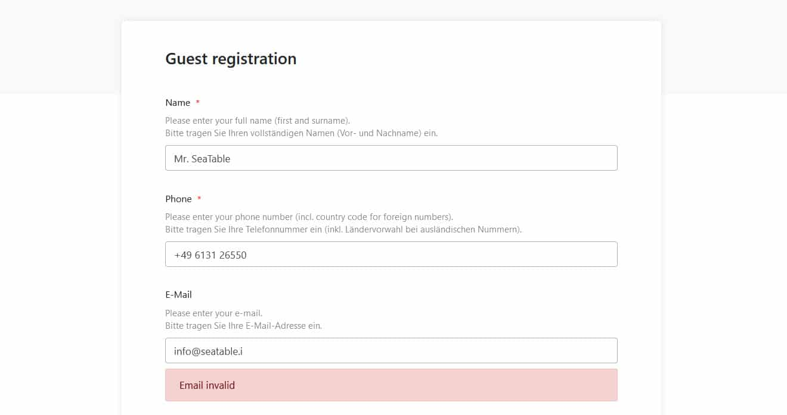

We begin the New Year with a new release of SeaTable: Version 1.6 has been deployed today on https://cloud.seatable.io and will be made available on Docker Hub shortly. The new version is packed with new features and improvements. At first glance, you will spot two new column types and a redesigned column type selector. Upon closer inspection, you are going to find a host of other user interface improvements that have found their way into this new release. A lot of effort has also gone into improving the formula wizard. New functions, design improvements, and more detailed error messages lift the wizard to a whole new level.

In this release note, we highlight the most relevant and exciting changes in the new version. For the complete list of changes, consult - as always - [SeaTable's Changelog](/en/docs/changelog/version-1-6/).

## Column type #19: duration

The duration column type is ideal for everyone that uses SeaTable for organizing and storing all sorts of time measurements such as completion times.

The duration column stores all duration inputs in seconds, but it can display the duration in either h:mm:ss or h:mm format. Additionally, if you don't want to enter the duration in the colon-separated format, you don't have to. SeaTable converts any numerical input automatically in the defined format. Integers and decimal numbers are both supported. This said, depending on the chosen format, the input is either interpreted as seconds or minutes in the case of h:mm:ss or h:mm, respectively. (Example: The input 235 yields 0:03:55 when formatted as h:mm:ss cell and 3:55 in a cell with h:mm format.)

And we didn't stop there: We have also expanded the format settings of the formula column, so that results can be displayed as a duration in either h:mm or h:mm:ss format too.

## Column type # 20: email

The new email column type stores email addresses. When clicking on a cell filled with an address, your email app opens up, the email address is copied in To: and you can start typing your mail right away. Hence, it works in a similar fashion as the URL column introduced in [SeaTable 1.4](/en/seatable-release-1-4/).

The real strength of the email column comes into play in web forms. When using an email field, the built-in validation makes sure that any respondent enters a valid email address. Accidental typos that render email addresses useless no longer exist.

## Improved formula wizard

SeaTable 1.6 introduces five new functions: date(), datedif(), eomonth(), months() and ifs(). The first four facilitate and improve the organization and handling of dates in SeaTable. The date() function computes for any given date the serial number that Microsoft Excel would use for storing the date. datedif(), short for date difference, calculates the difference between two dates. eomonth(), short for end of month, returns the last day of the month specified in the given date. Optionally, a certain number of months can be added. months() computes the number of full months between two dates. ifs() nests a combination of if functions.

In addition to the new functions, the new wizard now also support the calculation with formulas in linked tables. More specifically, the result of a formula in one table can be used in a formula in another table. Previously, only uncalculated fields in other tables could be used in formulas.

The wizard was also subjected to some graphical modifications. Most importantly, the wizard is now a pop-over window (as opposed to a modal). This entails multiple advantages above and beyond the more appealing design: While the modal froze the background, the pop-over wizard does not block the scroll bars. Additionally, the pop-over does not cover the column header. Bottom line is that you can now scroll left and right, with the formula wizard opened up, and read off the titles of the column you need in your formula.

Last but not least, we have revised the wizard's feedback. "The formula is invalid" was the standard error message in the past when the formula syntax was not followed or a non-existing column was referenced. Now the feedback is much more specific and provides pragmatic guidance for correcting the formula.

## Asset management

SeaTable is not only a great tool to capture structured tabular data, but also to organize and manage unstructured data in the form of files and formatted text. Think of the images you insert in a cell of the multiline text type, or the documents you can upload to a base. All these attachments are stored by SeaTable in its storage backend.

With SeaTable 1.6 it is now possible to access this storage backend via the web interface. You can navigate through the stored files and delete individual objects from memory. To do this, simply hover over a base in the Bases library, then click the three-dot icon for advanced options, and finally select "Attachment Management" under "Advanced". Images and files are stored in separate folders named Images and Files.

Related to asset management, user can now access the trash bin where SeaTable keeps deleted bases for 30 days before purging them from the system. If a base was deleted unintentially or a user changes has a change of mind, the base can be recovered from trash and restored including all its snapshots.

## Many other improvements

SeaTable 1.6 ships with many other improvements. Many address user interface and usability issues. This time, we also put an emphasis on SeaTable's print function.

In terms of user interface, we have converted the gallery plugin to a non-modal design. The same goes for the menu to rename a view. This follows our general effort to reduce the number of modals. We also fixed a shortcoming of the search function. Now when you press CTRL + F, the cursor focus always moves to the search line. In the form editor, we moved the hint input fields into the form. This makes it easier to write longer hints and basically makes the editor more WYSIWYG. In terms of usability, we added a handy feature to the auto-fill function: SeaTable now recognizes numeric patterns in alphanumeric strings and takes them into account when auto-filling. The new 'embedded code' feature makes it easier to integrate SeaTable bases into web pages.

Two known issues with the print preview have also been ironed out: Hiding a column in the table view did not remove the column from the row details and thus from the print view. Similarly, group labels weren't properly printed when the groups were formed by single / multiple select or link columns. With SeaTable 1.6, both are a thing of the past.
