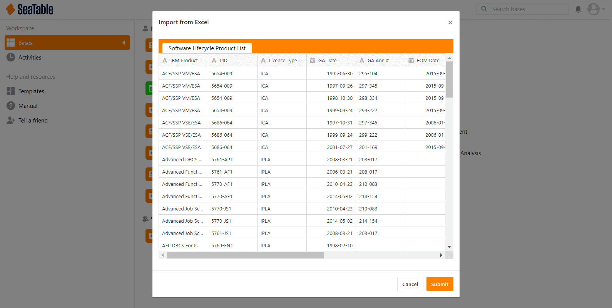

Près d'un mois s'est écoulé depuis la sortie de SeaTable 1.6 et il est donc temps de passer à autre chose. Aussitôt dit, aussitôt fait ! Nous sommes heureux de vous présenter la version 1.7 de SeaTable ! La nouvelle version a été déployée aujourd'hui sur https://cloud.seatable.io. Les utilisateurs de SeaTable Cloud ont donc déjà commencé à l'utiliser. Les utilisateurs de la version auto-hébergée pourront bientôt télécharger la dernière version depuis Docker Hub.

Pour cette nouvelle version, nous avons fait de gros efforts pour améliorer l'aspect et la convivialité de SeaTable et pour accroître la simplicité de l'interface web. Pour ce faire, nous avons abordé un grand nombre de petites questions. Nous sommes convaincus que, même s'ils ne sont pas nécessairement visibles au premier coup d'œil, ils contribuent de manière significative à une expérience utilisateur positive. Tous ceux qui espéraient un certain nombre de nouvelles fonctionnalités devront attendre un peu plus longtemps pour SeaTable 1.8. Cependant, veuillez profiter du confort accru de la version 1.7.

Dans cette note de mise à jour, nous nous concentrons sur les aspects les plus importants de la nouvelle version. La liste complète des modifications se trouve - comme toujours - dans le [journal des modifications](/fr/docs/changelog/version-1-7/).

## Interface utilisateur dynamique

Les animations sont un peu comme le sel dans la soupe. Tant qu'ils ne sont pas surutilisés, ils améliorent simplement l'expérience. Nous pensons que nous avons juste ce qu'il faut. Si vous êtes attentif, vous remarquerez les animations que nous avons ajoutées ici et là (par exemple, au menu latéral ou à certains menus de colonne). Si vous ne les remarquez pas parce qu'ils s'adaptent parfaitement ou qu'ils ont l'air naturel, alors nous nous sentons justifiés : Pas trop, pas trop peu.

En outre, nous avons également amélioré la fonction de recherche. Si la recherche trouve un résultat dans un groupe réduit, ce groupe est alors automatiquement étendu. Le résultat de la recherche s'affiche donc directement. En outre, nous avons amélioré l'éditeur pour les colonnes avec du texte formaté et corrigé deux problèmes mineurs dans la vue groupée.

## Devise personnalisée

Dans les versions précédentes, SeaTable ne supportait que trois devises : Euro, Dollar et Yuan. Cela signifie que tous les utilisateurs provenant de pays où aucune de ces devises n'est utilisée sont obligés de choisir l'une de ces trois devises lorsqu'ils utilisent une colonne de devises. Désolé pour ça ! Mais nous avons de bonnes nouvelles : Avec SeaTable 1.7, vous pouvez utiliser toutes les devises imaginables dans la colonne des devises.

La colonne des paiements dispose désormais d'une option de format supplémentaire : "Devise personnalisée". Si vous la sélectionnez, vous pouvez définir la devise de votre choix. Vous pouvez utiliser des abréviations (par ex. CHF, SEK) tout comme des symboles monétaires (par ex. £, ₺ ). Désormais, c'est entièrement votre choix. Pour être complet, il faut mentionner que la devise peut bien sûr être définie individuellement dans chaque colonne. Une colonne doit être en $ et l'autre en CHF ? Ne vous gênez pas !

## Enregistrement simple des valeurs de date

Saisir une date avec la souris est un jeu d'enfant : quelques clics et la date est sélectionnée dans le calendrier et saisie dans la cellule. SeaTable convertit automatiquement la date dans le format correct. En revanche, la saisie des dates au clavier n'était pas aussi pratique. SeaTable a insisté sur la syntaxe correcte et complète et n'a toléré aucune déviation.

Avec la nouvelle version, SeaTable devient plus tolérant en matière de syntaxe et permet ainsi une saisie plus rapide des valeurs de date au clavier. La saisie "2021-02-8" est correctement interprétée comme 2021-02-08. Une date saisie comme "2020-1-1" est enregistrée par SeaTable comme 2020-01-01 sans autre question. Il en va bien sûr de même pour les formats de date européens et américains : SeaTable convertit correctement l'entrée "1/1/2020" en 01/01/2020 et l'enregistre.

## Importation d'Excel

SeaTable 1.7 comporte quelques nouvelles fonctions, dont la fonction d'importation pour Excel. Celle-ci permet de créer de nouvelles bases sur la base de fichiers XLSX existants. Il suffit de sélectionner "Importer une base (XLSX, CSV, DTABLE)" et de naviguer jusqu'au fichier XLSX souhaité. Un aperçu montre ensuite comment SeaTable interprète les données. En cliquant sur "Enregistrer", la base est créée et les données sont enregistrées dans SeaTable.

L'importation de fichiers XLSX vient s'ajouter aux fonctions d'importation existantes pour les fichiers CSV et DTABLE. Par rapport à l'importation à partir d'un fichier CSV, l'importation Excel présente un avantage décisif : toutes les feuilles de calcul d'un classeur Excel sont importées en une seule fois. Un fichier texte, qui est un CSV, ne peut contenir que les données d'une seule et même fiche de données. Pour cette raison, chaque base créée par l'importation d'un fichier avec des valeurs séparées par des virgules ne contient toujours qu'une seule table. En outre, il y a un autre avantage : lors de l'importation d'un fichier CSV, toutes les valeurs sont importées dans des colonnes de texte. Ce n'est pas le cas avec l'importation XLSX. SeaTable interprète le contenu des fichiers importés et insère les données dans les types de colonnes appropriés. Les colonnes contenant uniquement des nombres sont importées dans des colonnes de nombres ; les valeurs d'une colonne contenant uniquement des dates se retrouvent dans une colonne de dates. À l'avenir, nous étendrons la fonction d'importation afin que les colonnes contenant des formules soient également importées automatiquement.

## Recherche et remplacement

Avez-vous manqué une fonction dans SeaTable qui vous permet de remplacer facilement des valeurs ? C'est du moins ce que nous avons ressenti et c'est pourquoi nous sommes d'autant plus heureux de pouvoir le dire : Maintenant, il y en a un ! La fonction Rechercher et remplacer recherche une chaîne - un mot, un nombre, un symbole - dans une colonne et la remplace par une autre chaîne. La recherche peut être simple ou exacte. Dans ce dernier cas, SeaTable recherche les cellules dans lesquelles la valeur de la cellule correspond exactement à la chaîne de recherche. En bref, la fonction de recherche et de remplacement de SeaTable fonctionne comme son homologue dans Excel.

Rechercher et remplacer n'est en fait pas une nouvelle fonctionnalité de SeaTable 1.7, mais est apparu avec SeaTable 1.6.3 il y a un peu plus de quinze jours. Nos développeurs l'ont terminé quelques jours après la sortie de SeaTable 1.6 et nous ne voulions pas attendre un peu moins d'un mois pour le rendre disponible aux utilisateurs de SeaTable Cloud.
