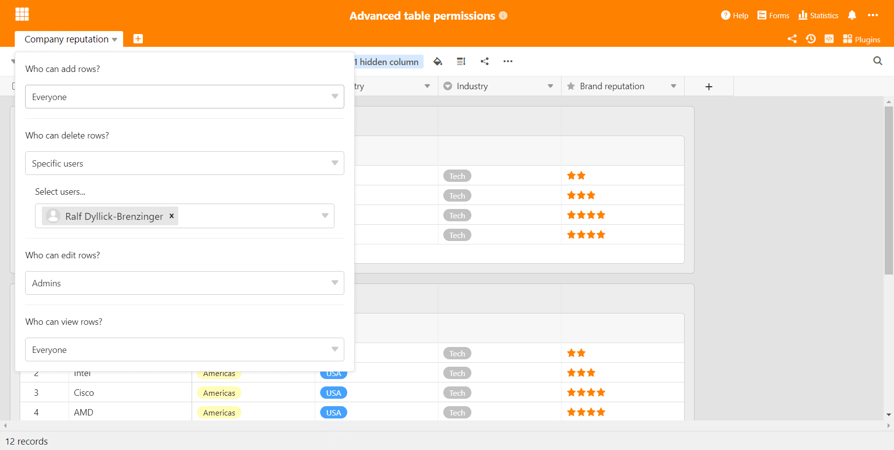

SeaTable knows no summer break! We keep our monthly release cycle and so, beginning today, all [SeaTable Cloud](https://cloud.seatable.io) users benefit from the advantages of SeaTable 2.2. Automations and external apps are two new features introduced in this version. Other highlights of the new release include nested groups, cascading single select columns, as well as improved table permissions and data processing operations. These release notes describe all these new features. The much more comprehensive, complete list of changes can be found - as always - in the SeaTable changelog. On [Docker Hub](https://hub.docker.com/u/seatable/), SeaTable 2.2 - in both editions of SeaTable Server - will be available tomorrow.

## Automations (Enterprise subscribers only)

Automations make your live easier by having the application autonomously perform certain tasks. SeaTable 2.2 significantly expands on its previous automation capabilities. And we will continue to add more and more functions in the future.

SeaTable 2.2 supports four automations: _Send notification_, _Lock row_, _Add row_, and _Modify row_. Automations to send an email and to execute a script will soon be added.

An automation can be triggered in two ways: Periodic execution performs tasks repeatedly on a daily, weekly or monthly basis, each at a specific day and time. This way you can create recurring tasks automatically, for example. Conditional execution is triggered when one or more conditions are met. For example, if all cells of a row are filled, then the row is automatically locked.

## External Apps (Enterprise subscribers only)

You have a larger data set that you don't want to share as such, but based on which you want to allow certain queries - ideally via a web page integrated into the existing information offering, a product catalog for example?

With the external apps introduced in SeaTable 2.2 you can now do exactly that. An external app is accessible via a URL and allows visitors to execute queries over a selected data set. This data set can be a table or just a view of a table. The external app executes the query and displays the results in a specific form.

Currently, SeaTable supports a tabular display of the data. In the future, more visualization options for the query results will be added (e.g., a gallery view).

## Nested Groups

SeaTable supports the grouping of data since version 1.0. The current version sees a massive improvement of this popular function: In SeaTable 2.2, data can be grouped by up to three columns. Groups on second and third level are displayed as subgroups of the parent level. Aggregated column values such as sum or average are automatically calculated and displayed for these subgroups as well. Especially in combination with filters and sorting, grouping becomes an even more powerful analysis tool.

Another minor improvement related to SeaTable's groups: SeaTable now exports grouped data when exporting to Excel. In previous versions, the export function did not respect the groups.

## Cascading Single Select Columns

You have already asked yourself in the introduction what cascading single select columns are? Here is the explanation: In cascading select columns, the value in a parent select column field determines the options available in a child select column. Here a simple example for illustration: In single select column 1, you select the continent. If you select Europe, then you can select France, Germany or Italy in single select column 2. But if you select Asia as the continent, then only China and India can be selected.

Given the advantages of cascades for data capture and analysis, it is surprising that only few applications support them directly. In Excel, for example, the use of cascading selections is very cumbersome. We are hopeful that with the simple implementation of cascading select columns in SeaTable, the notion will spread quickly.

## Two More Table Permissions

SeaTable 2.1 introduced table permissions. SeaTable 2.2 adds two more such permissions. In the new release, you can now define which users are allowed in a table to

- create rows,
- delete rows,
- modify rows, and
- view rows.

The permissions can be defined independently and each permission can be set to nobody, administrators, and specific users.

## One Extra Data Processing Operation

Data processing was also introduced in SeaTable 2.1 and it is also improved in SeaTable 2.2. The new data processing operation _Auto add link_ compares values in two tables and automatically creates a link between rows with identical values. If the tables are not yet linked, then link columns are created automatically. This data processing operation proves particularly convenient when importing tabular data from other applications. Think of two Excel spreadsheets that need to be linked. The new data processing operation makes this a minimal effort exercise.

Additionally, this is only one of two improvements: Data processing operations can now be saved for future use. Saved under a descriptive name, they can be easily modified and executed again at any time.

## More Minor Improvements

Every release confronts us with the same problem: A detailed presentation of all the new features and improvements would be overwhelming. The number of improvements is simply too enormous. However, we picked four additional minor improvements for a brief special mention:

Text columns now use the entire available row height when entering data. Text is automatically wrapped as you type, making it easy to keep track of even wordier entries.

Cells in linked columns now feature an extra button on the far right, which opens up the list of linked records. Previously, this required clicking in the white area to the right of the last linked record, which was unnecessarily complicated in cells with many entries.

An email log improves traceability and transparency of all the emails sent by SeaTable.

The code for CSV and Excel import has been optimized. The import process is now much faster and more reliable. The export of Excel files is now done via a new internal API.
